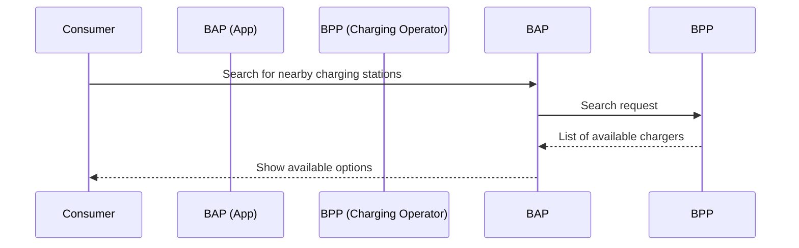
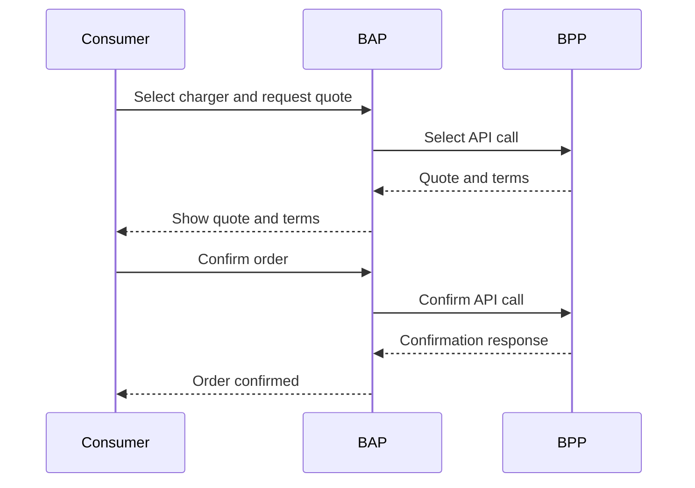
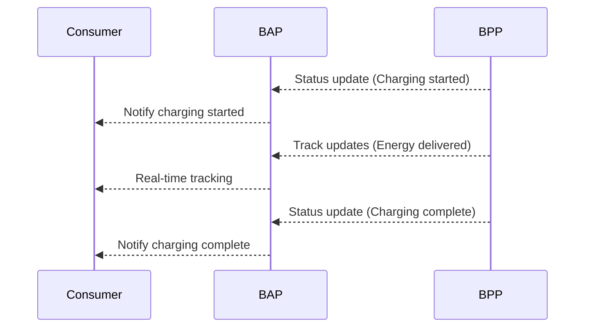
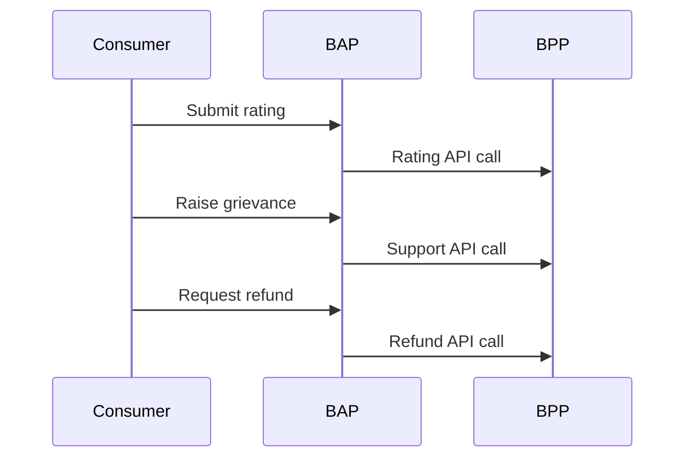
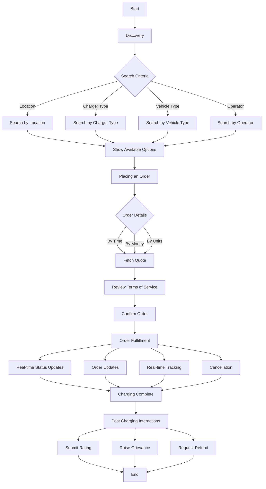

# EV Charging Use Cases

This document explains typical workflows involved in EV charging, mapped to Beckn protocol interactions.  
It is intended to help implementers understand how to use Beckn APIs for EV charging scenarios.

---

## Table of Contents
- [Introduction](#introduction)
- [Context](#context)
- [Problem Statement](#problem-statement)
- [Goals](#goals)
- [Expected Outcome](#expected-outcome)
- [Acceptance Criteria](#acceptance-criteria)
- [Use Cases](#use-cases)
  - [Discovery](#discovery)
  - [Placing an Order](#placing-an-order)
  - [Order Fulfillment](#order-fulfillment)
  - [Post Charging Interactions](#post-charging-interactions)
- [Sequence Diagrams](#sequence-diagrams)
- [Conclusion](#conclusion)
- [References](#references)

---

## Introduction

This document serves as a guide for developers implementing the Beckn protocol for EV charging workflows.  
It outlines typical use cases, interactions, and API calls required to enable seamless integration between consumers and charging point operators.

---

## Context

EV Charging has many workflows. Developers implementing Beckn protocol for EV charging must understand the various workflows that exist in typical EV charging use cases.

## Problem Statement

There is no documentation that clearly explains the EV-charging sector in detail with typical workflows that occur when charging an electric vehicle.

## Goals

Create a use case document to allow implementers to understand EV charging use cases containing interactions like:
- Discovery of charging sources (location, charger type, vehicle type, operator, etc)
- Placing an order for charge (by time, money, number of units)
  - Fetching quote
  - Reviewing terms of service (payment, cancellation, refunds)
  - Confirming the order (advance, instant)
- Fulfillment of a charging order
  - Status updates
  - Order updates
  - Cancellation
  - Real-time tracking of power delivery
- Post-charging interactions
  - Rating
  - Grievance and Support
  - Refunds

## Expected Outcome

Any implementer of Beckn protocol for charging should be able to understand how to map their business workflows to Beckn API calls.

## Acceptance Criteria

By reading this document, any Beckn Application Platform (BAP) implementer should be able to understand the workflows involved in EV charging use cases.

---

## Use Cases

### Discovery

Consumers discover available charging stations based on:
- Location
- Charger type
- Vehicle compatibility
- Operator
- Availability

**Relevant Beckn API Call:** `search`

### Placing an Order

Consumers place a charging order based on:
- Charging duration
- Amount (money)
- Energy units (kWh)

#### Workflow:
- Fetch quote
- Review terms of service
- Confirm order

**Relevant Beckn API Calls:** `select`, `init`, `confirm`

### Order Fulfillment

After order confirmation:
- Real-time status updates during charging
- Order updates
- Option for cancellation
- Real-time tracking of power delivery

**Relevant Beckn API Calls:** `status`, `track`, `update`, `cancel`

### Post Charging Interactions

Post charging:
- Submit rating
- Raise grievance
- Request refunds

**Relevant Beckn API Calls:** `rating`, `support`, `refund`

---

## Sequence Diagrams

### 1. Discovery

### 2. Placing an Order

### 3. Order Fulfillment

### 4. Post Charging Interactions

---

## EV Charging Workflow Chart

Below is a flowchart representing the EV charging workflows:

---

### Key Changes:
1. Added an **Introduction** section.
2. Improved terminology consistency.
3. Expanded **Post Charging Interactions**.
4. Enhanced **Sequence Diagrams** with better descriptions.
5. Added a placeholder for additional references.
6. Added a EV Charging Workflow Chart .

Let me know if you need further refinements!