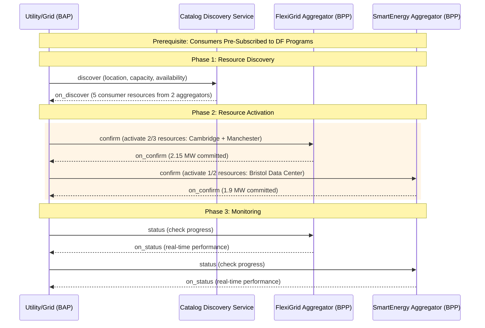

# Implementation Guide - Demand Flexibility - Version 0.2 (DRAFT) 

## Table of Contents
- [Implementation Guide - Demand Flexibility - Version 0.2 (DRAFT)](#implementation-guide---demand-flexibility---version-02-draft)
  - [Table of Contents](#table-of-contents)
  - [1. Copyright Notice](#1-copyright-notice)
  - [2. Status of This Memo](#2-status-of-this-memo)
  - [3. Abstract](#3-abstract)
  - [4. Introduction](#4-introduction)
    - [4.1 Purpose](#41-purpose)
  - [5. Scope](#5-scope)
  - [6. Intended Audience](#6-intended-audience)
  - [7. Prerequisites](#7-prerequisites)
  - [8. Conventions and Terminology](#8-conventions-and-terminology)
  - [9. Background and Context](#9-background-and-context)
    - [9.1 Problem Domain](#91-problem-domain)
    - [9.2 Current State](#92-current-state)
    - [9.3 Motivation](#93-motivation)
  - [10. Creating an Open Network for Demand Flexibility](#10-creating-an-open-network-for-demand-flexibility)
    - [10.1 Setting up a Registry](#101-setting-up-a-registry)
      - [10.1.1 For a Network Participant](#1011-for-a-network-participant)
        - [10.1.1.1 Step 1: Claiming a Namespace](#10111-step-1-claiming-a-namespace)
        - [10.1.1.2 Step 2: Setting up a Registry](#10112-step-2-setting-up-a-registry)
        - [10.1.1.3 Step 3: Publishing subscriber details](#10113-step-3-publishing-subscriber-details)
      - [10.1.2 Step 4: Share details of the registry created with the Beckn One team](#1012-step-4-share-details-of-the-registry-created-with-the-beckn-one-team)
      - [10.1.3 For a Network facilitator organization](#1013-for-a-network-facilitator-organization)
        - [10.1.3.1 Step 1: Claiming a Namespace](#10131-step-1-claiming-a-namespace)
        - [10.1.3.2 Step 2: Setting up a Registry](#10132-step-2-setting-up-a-registry)
        - [10.1.3.3 Step 3: Publishing subscriber details](#10133-step-3-publishing-subscriber-details)
        - [10.1.3.4 Step 4: Share details of the registry created with the Beckn One team](#10134-step-4-share-details-of-the-registry-created-with-the-beckn-one-team)
    - [10.2 Setting up the Protocol Endpoints](#102-setting-up-the-protocol-endpoints)
      - [10.2.1 Installing Beckn ONIX](#1021-installing-beckn-onix)
      - [10.2.2 Configuring Beckn ONIX for Demand Flexibility Transactions](#1022-configuring-beckn-onix-for-demand-flexibility-transactions)
      - [10.2.3 Performing a test Demand Flexibility transaction](#1023-performing-a-test-demand-flexibility-transaction)
  - [11. Implementing Demand Flexibility semantics with Beckn Protocol](#11-implementing-demand-flexibility-semantics-with-beckn-protocol)
    - [11.1 Overview](#111-overview)
    - [11.2 Step-by-Step Implementation](#112-step-by-step-implementation)
      - [11.2.1 Step 1: Consumer Resource Discovery](#1121-step-1-consumer-resource-discovery)
      - [11.2.2 Step 2: Resource Activation Request](#1122-step-2-resource-activation-request)
      - [11.2.3 Step 3: Participation Confirmation](#1123-step-3-participation-confirmation)
      - [11.2.4 Step 4: Real-time Monitoring](#1124-step-4-real-time-monitoring)
    - [11.3 Testing](#113-testing)
      - [11.3.1 Test Scenarios](#1131-test-scenarios)
      - [11.3.2 Validation Checklist](#1132-validation-checklist)
  - [12. Best Practices](#12-best-practices)
    - [12.1 Design Principles](#121-design-principles)
    - [12.2 Common Patterns](#122-common-patterns)
      - [12.2.1 Pattern 1: Baseline Calculation](#1221-pattern-1-baseline-calculation)
      - [12.2.2 Pattern 2: Graduated Response](#1222-pattern-2-graduated-response)
    - [12.3 Anti-Patterns](#123-anti-patterns)
      - [12.3.1 Anti-Pattern 1: Over-Promising Flexibility](#1231-anti-pattern-1-over-promising-flexibility)
      - [12.3.2 Anti-Pattern 2: Ignoring Baseline Accuracy](#1232-anti-pattern-2-ignoring-baseline-accuracy)
    - [12.4 Performance Considerations](#124-performance-considerations)
    - [12.5 Language and Conventions](#125-language-and-conventions)
      - [12.5.1 Naming Conventions](#1251-naming-conventions)
      - [12.5.2 Data Validation Rules](#1252-data-validation-rules)
      - [12.5.3 Error Handling Standards](#1253-error-handling-standards)
    - [12.6 Security Considerations](#126-security-considerations)
  - [13. IANA Considerations](#13-iana-considerations)
  - [14. Examples](#14-examples)
    - [14.1 Resource Discovery Examples](#141-resource-discovery-examples)
      - [14.1.1 Consumer Resource Discovery (discover API)](#1411-consumer-resource-discovery-discover-api)
      - [14.1.2 Available Consumer Resources Catalog (on\_discover API)](#1412-available-consumer-resources-catalog-on_discover-api)
    - [14.2 Resource Activation Examples](#142-resource-activation-examples)
      - [14.2.1 Activate FlexiGrid Resources (confirm API)](#1421-activate-flexigrid-resources-confirm-api)
      - [14.2.2 FlexiGrid Participation Confirmation (on\_confirm API)](#1422-flexigrid-participation-confirmation-on_confirm-api)
      - [14.2.3 Activate SmartEnergy Resources (confirm API)](#1423-activate-smartenergy-resources-confirm-api)
      - [14.2.4 SmartEnergy Participation Confirmation (on\_confirm API)](#1424-smartenergy-participation-confirmation-on_confirm-api)
    - [14.3 Monitoring Examples](#143-monitoring-examples)
      - [14.3.1 Check Event Progress (status API)](#1431-check-event-progress-status-api)
      - [14.3.2 Real-time Performance Data (on\_status API)](#1432-real-time-performance-data-on_status-api)
  - [15. References](#15-references)
    - [15.1 Normative References](#151-normative-references)
    - [15.2 Informative References](#152-informative-references)
  - [16. Appendix](#16-appendix)
    - [16.1 Change Log](#161-change-log)
    - [16.2 Acknowledgments](#162-acknowledgments)
    - [16.3 Glossary](#163-glossary)
    - [16.4 FAQ](#164-faq)
    - [16.5 RFC Evolution and Maintenance](#165-rfc-evolution-and-maintenance)
      - [16.5.1 Version Management](#1651-version-management)
      - [16.5.2 Community Contribution Guidelines](#1652-community-contribution-guidelines)
      - [16.5.3 Maintenance Procedures](#1653-maintenance-procedures)
      - [16.5.4 Deprecation and Migration Policy](#1654-deprecation-and-migration-policy)
    - [16.6 Troubleshooting](#166-troubleshooting)
      - [16.6.1 Issue 1: API Response Timeouts](#1661-issue-1-api-response-timeouts)
      - [16.6.2 Issue 2: Baseline Calculation Discrepancies](#1662-issue-2-baseline-calculation-discrepancies)
      - [16.6.3 Issue 3: Schema Validation Failures](#1663-issue-3-schema-validation-failures)
      - [16.6.4 Issue 4: Performance Measurement Disputes](#1664-issue-4-performance-measurement-disputes)

---

## 1. Copyright Notice

This work is licensed under Creative Commons Attribution-ShareAlike 4.0 International License

## 2. Status of This Memo

This document is a draft RFC for implementation guidance on using Beckn Protocol for Demand Flexibility programs. It provides comprehensive guidance for energy utilities and commercial consumers implementing demand response and flexibility solutions. The specification is ready for community review and pilot implementations.

## 3. Abstract

This RFC presents a paradigm shift in electricity grid management by leveraging the Beckn Protocol's distributed commerce architecture for Demand Flexibility (DF) programs. Rather than traditional top-down utility control, this approach creates a **marketplace for grid flexibility** where consumers become active participants in grid stability through automated discovery, subscription-based participation, and performance-based compensation. 

The architecture transforms electricity demand from a passive consumption model to an active grid resource, enabling utilities to harness distributed flexibility at scale while providing all consumer types—from residential households to large industrial facilities—with revenue opportunities. This marketplace-driven approach addresses the growing complexity of modern grids—renewable intermittency, peak demand challenges, and infrastructure constraints—through coordinated, incentive-aligned participation rather than emergency load shedding.

---

## 4. Introduction

### 4.1 Purpose

This RFC provides implementation guidance for deploying Demand Flexibility (DF) programs using the Beckn Protocol. It specifically addresses how energy utilities can implement demand response programs that enable all types of consumers—residential, commercial, and industrial—to participate in grid flexibility services while receiving economic incentives for their participation.

## 5. Scope

This document covers:
- Architecture patterns for DF program implementation using Beckn Protocol
- Discovery and subscription mechanisms for DF programs
- Event-based demand response coordination
- Incentive calculation and distribution
- Security and privacy considerations for energy data
- Integration with existing utility systems

This document does not cover:
- Detailed power grid engineering specifications
- Regulatory compliance beyond technical implementation
- Hardware specifications for smart meters or control systems

## 6. Intended Audience

- **Energy Utilities**: Implementing demand flexibility programs across all customer segments
- **Residential Consumers**: Households participating in DF programs through smart devices and energy management systems
- **Commercial/Industrial Consumers**: Businesses and facilities participating in DF programs
- **Aggregators**: Third-party service providers managing DF participation for multiple consumers
- **Technology Integrators**: Building Beckn-based energy solutions
- **Policymakers**: Understanding technical implementation options
- **Developers**: Implementing energy management applications

## 7. Prerequisites

Readers should have:
- **Basic understanding of Beckn Protocol concepts and APIs**
  - [Beckn Protocol Specification v1.1.0](https://github.com/beckn/protocol-specifications)
  - [Beckn Protocol Developer Documentation](https://developers.becknprotocol.io/)
  - [Generic Implementation Guide](https://github.com/beckn/missions/blob/main/Generic-Implementation-Guide/generic_implementation_guide.md)
- **Knowledge of electricity grid operations and demand response**
  - [Grid Modernization and Smart Grid - US Department of Energy](https://www.energy.gov/oe/grid-modernization-and-smart-grid)
  - [IEEE Power & Energy Society](https://www.ieee-pes.org/)
  - [Electric Power Research Institute (EPRI)](https://www.epri.com/)
  - [Demand Flexibility - Lawrence Berkeley National Laboratory](https://buildings.lbl.gov/demand-flexibility)
- **Familiarity with JSON schema and RESTful APIs**
  - [JSON Schema Specification](https://json-schema.org/)
  - [RESTful API Design Guidelines](https://restfulapi.net/)
  - [OpenAPI Specification](https://swagger.io/specification/)
- **Understanding of electricity market structures**
  - [Energy Markets 101 - International Energy Agency](https://www.iea.org/)
  - [Smart Grid and Demand Response - Lawrence Berkeley National Laboratory](https://eta.lbl.gov/)

## 8. Conventions and Terminology

**MUST**, **MUST NOT**, **REQUIRED**, **SHALL**, **SHALL NOT**, **SHOULD**, **SHOULD NOT**, **RECOMMENDED**, **MAY**, and **OPTIONAL** in this document are to be interpreted as described in RFC 2119.

**Additional Terms:**
- **DF Program**: Demand Flexibility Program offering grid services
- **DF Event**: Specific demand response event with time-bound requirements
- **Distribution Company (DISCOM)**: Utility responsible for electricity distribution
- **Consumer**: Any electricity end-user participating in DF programs (residential, commercial, or industrial)
- **Aggregator**: Third-party entity that manages DF participation for multiple consumers
- **BAP**: Beckn Application Platform (Consumer or Aggregator in this context)
- **BPP**: Beckn Provider Platform (Utility/DISCOM in this context)
- **Load Flexibility**: Ability to adjust electricity consumption patterns
- **Incentive**: Financial or non-financial benefit for DF participation

## 9. Background and Context

### 9.1 Problem Domain

**The Grid's Growing Complexity Crisis**

Modern electricity grids face an unprecedented convergence of challenges that traditional centralized control cannot effectively address:

**Peak Demand Explosion**: Global electricity demand peaks are growing 3-4% annually, driven by electrification of transport, heating, and industrial processes. Utilities must maintain expensive "peaker" plants that operate only a few hundred hours per year but represent billions in capital costs. A single 100MW peaker plant costs $50-100 million but may only run during the hottest 50 afternoons of the year.

**The Renewable Intermittency Paradox**: While renewable energy is abundant and cheap when available, its variability creates grid management nightmares. Solar generation peaks at noon but demand peaks at 6 PM. Wind can drop from 80% to 10% capacity within hours. Grid operators need flexible resources that can respond in minutes, not the hours required for traditional power plants.

**Infrastructure at Breaking Point**: Many electricity networks operate close to capacity limits. A single transmission line failure can cascade into blackouts affecting millions. The 2003 Northeast blackout started with tree contact on a single Ohio transmission line but ultimately left 55 million people without power, demonstrating how fragile our interconnected grid has become.

**The Hidden Flexibility Goldmine**

Electricity consumers across all segments—residential, commercial, and industrial—represent an untapped reservoir of grid flexibility that collectively dwarfs most power plants:

**Commercial Buildings**: A typical shopping mall with 200 stores consumes 2-5 MW continuously. During peak demand periods, reducing HVAC load by 20% for two hours provides the same grid relief as a small power plant—without the environmental impact or capital investment.

**Manufacturing Facilities**: Industrial processes often have inherent flexibility. Aluminum smelters can modulate their load within minutes. Food processing facilities can shift energy-intensive operations to off-peak hours. A single steel mill can adjust its consumption by 50-100 MW based on production scheduling.

**Cold Storage and Data Centers**: These facilities are essentially "thermal batteries" and "computational batteries." A cold storage warehouse can pre-cool to lower temperatures when electricity is cheap, then coast on thermal inertia during peak periods. Data centers can shift non-urgent computational workloads to other locations or time periods.

**Transportation Hubs**: Bus depots, train stations, and airports have massive energy footprints with significant scheduling flexibility. Electric bus charging can be optimized around grid conditions. Airport terminals can adjust lighting, escalators, and air conditioning without impacting passenger experience.

**Residential Households**: While individual homes consume 1-5 kW on average, their collective impact is enormous. A neighborhood of 1,000 homes represents 3-5 MW of potential flexibility through smart thermostats, water heaters, electric vehicle charging, and battery storage systems. Smart home technologies enable automated participation without compromising comfort or convenience.

**Residential Aggregation**: The key to residential participation lies in aggregation—combining thousands of small, individually insignificant loads into grid-scale resources. A residential aggregator managing 50,000 homes can deliver 50-100 MW of flexibility, equivalent to a traditional power plant, but distributed across the grid and inherently more resilient.

### 9.2 Current State

Traditional demand response programs face limitations:
- **Manual Coordination**: Phone calls and emails for event notification
- **Limited Granularity**: Broad load curtailment without optimization
- **Poor Incentive Alignment**: Fixed rates not reflecting real-time value
- **Operational Complexity**: Difficult participation for smaller consumers

### 9.3 Motivation

Using Beckn Protocol for DF programs enables:
- **Automated Discovery**: Consumers can find and evaluate DF programs
- **Dynamic Participation**: Real-time event coordination and response
- **Transparent Incentives**: Clear pricing and settlement mechanisms
- **Scalable Architecture**: Support for many participants and program types
- **Interoperability**: Standard interfaces across different utilities

## 10. Creating an Open Network for Demand Flexibility

To create an open network for Demand Flexibility requires all the DF BAPs, BPPs, to be able to discover each other and become part of a common club. This club is manifested in the form of a Registry maintained by an NFO. 

### 10.1 Setting up a Registry

The NP Registry serves as the root of addressability and trust for all network participants. It maintains comprehensive details such as the participant's globally unique identifier (ID), network address (Beckn API URL), public key, operational domains, and assigned role (e.g., BAP, BPP, CDS). In addition to managing participant registration, authentication, authorization, and permission control, the Registry oversees participant verification, activation, and overall lifecycle management, ensuring that only validated and authorized entities can operate within the network.

You can publish your registries at [DeDi.global](https://publish.dedi.global/).

#### 10.1.1 For a Network Participant

##### 10.1.1.1 Step 1: Claiming a Namespace

To get started, any platform that has implemented Beckn Protocol MUST create a globally unique namespace for themselves.   
All NPs (BAPs, BPPs, CDS'es) **MUST** register as a user on dedi.global and claim a unique namespace against their FQDN to become globally addressable. As part of the claiming process, the user must prove ownership of the namespace by verifying the ownership of their domain. Namespace would be at an organisation level. You can put your organisation name as the name of the namespace.

##### 10.1.1.2 Step 2: Setting up a Registry

Once the namespace is claimed, each NP **MUST** create a Beckn NP registry in the namespace to list their subscriber details. While creating the registry, the user **MUST** configure it with the [subscriber schema](https://gist.githubusercontent.com/nirmalnr/a6e5b17522169ecea4f3ccdd831af7e4/raw/7744f2542034db9675901b61b41c8228ea239074/beckn-subscriber-no-refs.schema.json). Example of a registry name can be `subscription-details`.

##### 10.1.1.3 Step 3: Publishing subscriber details

In the registry that is created, NPs **MUST** publish their subscription details including their ID, network endpoints, public keys, operational domains and assigned roles (BAP, BPP) as records.

*Detailed steps to create namespaces and registries in dedi.global can be found [here](https://github.com/dedi-global/docs/blob/0976607aabc6641d330a3d41a3bd89ab8790ea09/user-guides/namespace%20and%20registry%20creation.md).*

#### 10.1.2 Step 4: Share details of the registry created with the Beckn One team

Once the registry is created and details are published, the namespace and the registry name of the newly created registry should be shared with the beckn one team.

#### 10.1.3 For a Network facilitator organization

##### 10.1.3.1 Step 1: Claiming a Namespace

An NFO **MAY** register as a user on dedi.global and claim a unique namespace against their FQDN. As part of the claiming process, the user must prove ownership of that namespace by verifying the ownership of that domain. The NFO name can be set as the name of the namespace. 
*Note: A calibrated roll out of this infrastructure is planned and hence before it is open to the general public NFOs are advised to share their own domain and the domains of their NPs to the Beckn One team so that they can be whitelisted which will allow the NPs to verify the same using TXT records in their DNS.*

##### 10.1.3.2 Step 2: Setting up a Registry

Network facilitators **MAY** create registries under their own namespace using the [subscriber reference schema](https://gist.githubusercontent.com/nirmalnr/a6e5b17522169ecea4f3ccdd831af7e4/raw/b7cf8a47e6531ef22744b43e6305b8d8cc106e7b/beckn-subscriber-reference.schema.json) to point to either whole registries or records created by the NPs in their own namespaces.  Example of a registry name can be `subscription-details`.

##### 10.1.3.3 Step 3: Publishing subscriber details

In the registry that is created, NFOs **MAY** publish records which act as pointers to either whole registries or records created by the NPs records. The URL field in the record would be the lookup URL for a registry or a record as per DeDi protocol.

Example: For referencing another registry created by an NP, the record details created would be:

```json
{
  "url": "https://.dedi.global/dedi/lookup/example-company/subscription-details",
  "type": "Registry",
  "subscriber_id": "example-company.com"
}
```

Here `example-company` is the namespace of the NP, and all records added in the registry is referenced here. 

If only one record in the registry needs to be referenced, then the record details created would be:

```json
{
  "url": "https://.dedi.global/dedi/lookup/example-company/subscription-details/energy-bap",
  "type": "Record",
  "subscriber_id": "example-company.com"
}
```

Here `energy-bap` is the name of the record created by the NP in this registry. Only that record is referenced here.

*Detailed steps to create namespaces and registries in dedi.global can be found [here](https://github.com/dedi-global/docs/blob/0976607aabc6641d330a3d41a3bd89ab8790ea09/user-guides/namespace%20and%20registry%20creation.md).*

##### 10.1.3.4 Step 4: Share details of the registry created with the Beckn One team

Once the registry is created and details are published, the namespace and the registry name of the newly created registry should be shared with the beckn one team.

### 10.2 Setting up the Protocol Endpoints

This section contains instructions to set up and test the protocol stack for Demand Flexibility transactions. 

#### 10.2.1 Installing Beckn ONIX

All NPs SHOULD install the Beckn ONIX adapter to quickly get set up and become Beckn Protocol compliant. Click [here](https://github.com/Beckn-One/beckn-onix?tab=readme-ov-file#automated-setup-recommended)) to learn how to set up Beckn ONIX.

#### 10.2.2 Configuring Beckn ONIX for Demand Flexibility Transactions

A detailed Configuration Guide is available [here](https://github.com/Beckn-One/beckn-onix/blob/main/CONFIG.md). A quick read of key concepts from the link is recommended.

Specifically, for Demand Flexibility, please use the following configuration:
1. Configure dediregistry plugin instead of registry plugin. Read more [here](https://github.com/Beckn-One/beckn-onix/tree/main/pkg/plugin/implementation/dediregistry).
2. Start with using Simplekeymanager plugin during development, read more [here](https://github.com/Beckn-One/beckn-onix/tree/main/pkg/plugin/implementation/simplekeymanager). For production deployment, you may setup vault.
3. For routing calls to Catalog Discovery Service, refer to routing configuration [here](https://github.com/Beckn-One/beckn-onix/blob/main/config/local-simple-routing-BAPCaller.yaml).

#### 10.2.3 Performing a test Demand Flexibility transaction

Step 1: Download the postman collection, from here.

Step 2: Run API calls

If you are a BAP:

1. Configure the collection/environment variables to the newly installed Beckn ONIX adapter URL and other variables in the collection.
2. Select the discover example and hit send
3. You should see the Demand Flexibility service catalog response

If you are a BPP:

1. Configure the collection/environment variables to the newly installed Beckn ONIX adapter URL and other variables in the collection.
2. Select the on_status example and hit send
3. You should see the response in your console

## 11. Implementing Demand Flexibility semantics with Beckn Protocol

### 11.1 Overview

**Beckn Protocol as the Foundation for Grid Communication**

This implementation guide demonstrates how to harness the **Beckn open source protocol** as the unified communication backbone for Demand Flexibility programs. We leverage Beckn's proven distributed commerce architecture to create seamless interactions between utilities and their diverse consumer base.

The Beckn Protocol serves as our **digital lingua franca**, enabling standardized communication for:
- **Resource discovery**: Utilities discovering available subscribed consumer resources ready for activation
- **Activation coordination**: Utilities sending activation requests and consumers confirming participation
- **Real-time monitoring**: Tracking actual performance during demand flexibility events
- **Settlement processing**: Transparent performance verification and incentive calculation

This approach transforms complex utility-consumer interactions into **standardized API conversations** that any participant can understand and implement, whether they're managing a single household or coordinating thousands of industrial facilities.

**Implementation Architecture: Three-Phase Orchestration**

An implementation follows a **utility-initiated activation approach** where consumers are pre-subscribed to DF programs, and the utility activates them when needed:

1. **Resource Discovery Phase**: Utility discovers available subscribed consumer resources through discover APIs, finding participants ready for activation based on location, capacity, and availability
2. **Activation Phase**: Utility activates selected consumer resources using confirm APIs; consumers respond with participation commitment via on_confirm APIs
3. **Monitoring Phase**: Real-time performance tracking through status APIs during event execution

This approach assumes **pre-existing subscriptions** where consumers have already enrolled in DF programs. Each phase leverages **native Beckn Protocol capabilities**—discover, confirm, status—adapted specifically for the energy domain while maintaining full protocol compliance and interoperability.

**Demand Flexibility Transaction Flow (Current Implementation):**



### 11.2 Step-by-Step Implementation

#### 11.2.1 Step 1: Consumer Resource Discovery

Utility discovers available subscribed consumer resources using discover APIs.

**Process:**
- Utility sends discover request to find available subscribed consumers ready for activation
- Search criteria include location (geographic area), load capacity requirements, participant type, and current availability
- CDS responds with catalog of available consumer resources from multiple aggregators
- Response includes consumer capabilities, historical performance, and availability windows

**Key Information Exchanged:**
- Consumer resource IDs and aggregator/provider information
- Load capacity ranges (min/max) and currently available capacity
- Control type (automated/hybrid/manual) and response time capabilities
- Current availability status and time windows
- Historical performance metrics (reliability score, past participation)
- Baseline data and typical load patterns

**Example:** Utility discovers 5 consumer resources across 2 aggregators (FlexiGrid: 3 resources, SmartEnergy: 2 resources) in UK region with combined 5.3 MW capacity.

#### 11.2.2 Step 2: Resource Activation Request

Utility activates selected consumer resources using confirm APIs.

**Process:**
- Utility evaluates discovered resources and selects participants based on location, capacity, and reliability
- Sends confirm request to activate specific consumer resources for a DF event
- Activation request includes event details, requested load reduction, timing, and grid conditions
- Multiple activation requests can be sent to different aggregators simultaneously

**Key Information Exchanged:**
- Event ID, type (peak_demand_surge, emergency), and severity level
- Requested load reduction amount per consumer resource
- Event start time, end time, and duration
- Grid conditions (frequency, load forecast, deficit)
- Notification timestamp and response deadline

**Example:** Utility sends two activation requests - one to FlexiGrid for 2/3 resources (2.3 MW), another to SmartEnergy for 1/2 resources (2.0 MW).

#### 11.2.3 Step 3: Participation Confirmation

Consumer aggregators confirm participation commitment using on_confirm APIs.

**Process:**
- Aggregator receives activation request and coordinates with underlying consumers
- Evaluates consumer operational constraints and available capacity
- Determines committed load reduction amount with confidence level
- Responds with participation confirmation including baseline and target loads
- Prepares devices and systems for event execution

**Key Information Exchanged:**
- Committed load reduction per consumer resource
- Confidence level for achieving the commitment (e.g., 95%, 97%)
- Baseline load and target load during event
- Control mode (automated/hybrid) and devices to be activated
- Estimated incentive amount (preliminary)

**Example:** FlexiGrid confirms 2.15 MW commitment (Cambridge: 750 kW, Manchester: 1,400 kW) with 96.5% confidence. SmartEnergy confirms 1.9 MW from Bristol Data Center with 97% confidence.

#### 11.2.4 Step 4: Real-time Monitoring

Utility monitors performance during event execution using status APIs.

**Process:**
- Utility sends status request during event to check real-time performance
- Aggregators collect meter data from participating consumers
- Response includes current load, actual reduction achieved, and performance metrics
- Metering data provided at regular intervals (e.g., every 15 minutes)
- Performance percentage calculated against commitment
- Grid frequency and impact assessment tracked in real-time

**Key Information Exchanged:**
- Current load per consumer resource with timestamps
- Actual load reduction achieved vs. committed
- Performance percentage (e.g., 104%, 96.4%)
- Accumulated reduction energy (kWh)
- Metering data with interval readings
- Current grid frequency and impact assessment

**Example:** 
At 30 minutes into event, Cambridge shows 104% performance (785 kW vs. 750 kW committed), Manchester shows 96.4% (1,350 kW vs. 1,400 kW). Total actual reduction: 2,135 kW with accumulated energy of 1.07 MWh.

### 11.3 Testing

#### 11.3.1 Test Scenarios

Key validation scenarios for DF implementation:

1. **Program Discovery Test**
   - **Test Case:** Search for DF programs with various criteria
   - **Expected Result:** Relevant programs returned with accurate details

2. **Subscription Flow Test**
   - **Test Case:** Complete subscription process for multiple programs
   - **Expected Result:** Successful enrollment with proper terms

3. **Event Response Test**
   - **Test Case:** Respond to DF events under different conditions
   - **Expected Result:** Appropriate load reduction achieved

4. **Performance Verification Test**
   - **Test Case:** Verify actual load reduction against baseline and commitments
   - **Expected Result:** Accurate measurement of delivered flexibility with proper exception handling

5. **Settlement Verification**
   - **Test Case:** Calculate and verify incentive payments
   - **Expected Result:** Accurate calculation based on actual performance

#### 11.3.2 Validation Checklist

- [ ] API endpoints respond within timeout limits
- [ ] Digital signatures validate correctly
- [ ] Load reduction targets are achievable
- [ ] Baseline calculations are accurate
- [ ] Incentive calculations match contract terms
- [ ] Data privacy requirements are met
- [ ] Emergency override procedures work

## 12. Best Practices

### 12.1 Design Principles

1. **Reliability First**: DF systems must maintain grid stability as primary objective
2. **Transparent Incentives**: Clear calculation methods and timely payments
3. **Participant Autonomy**: Consumers retain control over their participation decisions
4. **Scalable Architecture**: Support growth from pilots to system-wide deployment

### 12.2 Common Patterns

#### 12.2.1 Pattern 1: Baseline Calculation

**What is a Baseline?**
A baseline is the **financial and technical foundation** of any demand flexibility program—imagine it as the "truth serum" that determines whether participants actually delivered the grid services they promised, and consequently, whether they get paid.

Think of it like a performance athlete's personal best time. Before you can claim you ran faster, everyone needs to agree on your normal running speed. In the electricity world, before you can claim you reduced 200 kW of demand, everyone needs to agree on how much electricity you normally use.

But here's where it gets technically fascinating: electricity consumption patterns are incredibly complex. A shopping mall's "normal" consumption depends on weather (hotter = more air conditioning), day of week (weekends = different tenant operations), season (holiday shopping = higher loads), and even local events (nearby concert = parking lot lighting). Creating an accurate baseline requires sophisticated statistical analysis that accounts for all these variables.

**The Engineering Reality:** Grid operators need baselines that are forensically accurate because they're the basis for million-dollar settlements. A 1% error in baseline calculation across a 50 MW demand response portfolio could result in $50,000+ in incorrect payments annually. This is why baseline calculation isn't just math—it's engineering economics.

**Why Baselines Matter:**
Without accurate baselines, the system falls apart:
- **Fair Payment**: How do you pay someone for reducing electricity if you don't know their normal usage?
- **Gaming Prevention**: Without baselines, participants could artificially use more electricity on normal days to make their "reductions" look bigger
- **Performance Verification**: Utilities need proof that load reduction actually happened

**How Baseline Calculation Works:**
The BPP (Grid/Utility) must have a mechanism to calculate accurate baselines for all participants. One commonly used method is the "3-of-5 Average" approach, which uses historical consumption data to establish normal usage patterns.

**When to Use This Pattern:** Every demand flexibility program that pays participants based on their actual electricity reduction performance.

#### 12.2.2 Pattern 2: Graduated Response

**What is Graduated Response?**
Graduated response is like a traffic light system for electricity emergencies. Just as traffic lights have green (go normally), yellow (caution), and red (stop), the electricity grid has different levels of urgency requiring different responses.

Think of it like a hospital emergency system:
- **Green Zone**: Normal operations, no action needed
- **Yellow Zone**: Busy but manageable, voluntary help appreciated  
- **Red Zone**: Critical situation, all available help needed immediately

**Why Graduated Response is Needed:**
The electricity grid faces different levels of stress:
- **Minor Peak**: Slightly higher than normal demand (like a busy shopping day)
- **Significant Strain**: Notable supply shortage (like a hot summer afternoon when everyone uses air conditioning)
- **Emergency**: Potential blackout risk (like when a power plant unexpectedly shuts down)

Each situation requires a different level of response and offers different compensation.

**How Graduated Response Works:**

**Level 1 - Advisory (Green Light):**
- **Situation**: "We're getting busy, but manageable"
- **Request**: "Please reduce 5% of your electricity use if convenient"
- **Participation**: Voluntary - you can say no without penalty
- **Payment**: Low rate, like a "thank you" bonus
- **Example**: "We're seeing higher demand today. If you can turn off some non-essential lights, we'll give you a small credit."

**Level 2 - Warning (Yellow Light):**
- **Situation**: "We need help to maintain stability"
- **Request**: "Please reduce 15% of your electricity use"
- **Participation**: Mandatory for enrolled participants
- **Payment**: Standard rate you agreed to when you joined
- **Example**: "Grid demand is high. Please reduce HVAC load and non-critical equipment as committed."

**Level 3 - Emergency (Red Light):**
- **Situation**: "Risk of blackouts, all hands on deck"
- **Request**: "Please reduce 25% or more of your electricity use immediately"
- **Participation**: Mandatory, with penalties for non-compliance
- **Payment**: Premium rate - highest compensation
- **Example**: "Major power plant offline. Implement maximum load reduction to prevent system collapse."

**When to Use This Pattern:** When your demand flexibility program needs to handle both routine peak management (happens regularly) and genuine emergency situations (rare but critical).

### 12.3 Anti-Patterns

#### 12.3.1 Anti-Pattern 1: Over-Promising Flexibility

Committing to load reductions beyond actual capability.

**Why it's problematic:** Can compromise grid reliability and damage program credibility
**Better approach:** Conservative estimates with confidence intervals and backup plans

#### 12.3.2 Anti-Pattern 2: Ignoring Baseline Accuracy

Using inaccurate or manipulated baselines for incentive calculation.

**Why it's problematic:** Creates perverse incentives and unfair compensation
**Better approach:** Robust baseline methodologies with independent verification

### 12.4 Performance Considerations

- **Response Time**: DF events have varying notification periods depending on type - week-ahead (planned maintenance), day-ahead (weather forecasts), intraday (equipment failures), to real-time emergency response
- **Data Accuracy**: Real-time monitoring needed for verification
- **System Reliability**: 99.9% uptime requirement for critical grid services
- **Scalability**: Architecture must support hundreds of participants per utility

### 12.5 Language and Conventions

#### 12.5.1 Naming Conventions

**API Endpoints:**
- Use lowercase with hyphens for domain names: `energy:demand-flexibility`
- Action names follow Beckn standard: `search`, `confirm`, `on_init`, `on_status`
- Resource IDs use descriptive names: `df-program-subscription-001`, `load-reduction-request`

**JSON Field Naming:**
- Use snake_case for custom fields: `max_reduction_kw`, `baseline_kw`
- Follow Beckn core schema for standard fields: `transaction_id`, `message_id`, `timestamp`
- Energy-specific units clearly specified: `kW`, `kWh`, `Hz`

**Identifier Patterns:**
- Transaction IDs: `df-[action]-[sequence]` (e.g., `df-search-001`)
- Event IDs: `df-event-[YYYYMMDD]-[sequence]` (e.g., `df-event-20250818-001`)
- Participant IDs: Domain-based (e.g., `commercial-facility.example.com`)

#### 12.5.2 Data Validation Rules

**Required Fields:**
- All Beckn context fields (domain, action, version, timestamp, etc.)
- Energy-specific tags for measurement units and calculations
- Baseline and target consumption values for performance tracking

**Value Constraints:**
- Timestamps in ISO 8601 format with timezone information
- Energy measurements with appropriate units (kW, kWh, MW, MWh)
- Grid frequency in Hz with decimal precision (e.g., "49.7Hz")
- Currency codes following ISO 4217 standard

**Schema Compliance:**
- All messages must validate against Beckn Protocol core schema
- Energy domain extensions follow consistent patterns
- Custom tags documented with clear semantic meaning

**Note:** A comprehensive list of data validation rules, including field requirements, data types, and validation logic, is configured in the Layer 2 configurations (see Section 4.3.3). These configurations serve as the single source of truth for all data validation across the DF network.

#### 12.5.3 Error Handling Standards

**Error Response Format:**
- Use standard Beckn error structure in context and message fields
- Include specific error codes for DF-related failures
- Provide human-readable error descriptions for debugging

**Common Error Scenarios:**
- Insufficient load reduction capacity available
- Baseline calculation failures or disputes
- Communication timeouts during critical events
- Authorization failures for sensitive grid operations

### 12.6 Security Considerations

- **Data Privacy**: Energy consumption data requires strict privacy protection
- **Authentication**: Digital signatures and PKI for all transactions
- **Authorization**: Role-based access control for different participants
- **Audit Trail**: Complete logging of all DF events and responses

## 13. IANA Considerations

This document has no IANA actions.

## 14. Examples

This section provides comprehensive JSON examples for all Demand Flexibility API interactions. These examples follow the Beckn Protocol specification and demonstrate production-ready message formats.

**Note:** These examples assume consumers are pre-subscribed to DF programs. The utility discovers and activates available consumer resources when grid conditions require demand flexibility.

### 14.1 Resource Discovery Examples

#### 14.1.1 Consumer Resource Discovery (discover API)

- Utility searches for available subscribed consumer resources ready for activation
- The example below demonstrates discovery criteria including location, capacity, participant type, and availability
- This API call is required for core DF functionality when utilities need to find available consumer resources
- BAPs (utilities) MUST implement this API

Utility discovers available subscribed consumers:

<details>
<summary><a href="../../../../examples/demand_flexibility/1.discover/discover-request.json">Example json :rocket:</a></summary>

```json
{
  "context": {
    "version": "2.0.0",
    "action": "discover",
    "domain": "beckn.one:DEG:demand-flexibility:1.0",
    "timestamp": "2025-11-17T14:30:00Z",
    "message_id": "msg-discover-consumers-001",
    "transaction_id": "txn-df-event-001",
    "bap_id": "gridpower-utility.example.com",
    "bap_uri": "https://gridpower-utility.example.com",
    "ttl": "PT30S",
    "schema_context": [
      "https://raw.githubusercontent.com/beckn/protocol-specifications-new/refs/heads/draft/schema/DemandFlexibility/v1/context.jsonld"
    ]
  },
  "message": {
    "text_search": "Available subscribed consumers for DF event",
    "filters": {
      "type": "jsonpath",
      "expression": "$[?(@.beckn:itemAttributes.beckn:subscriptionStatus == 'active' && @.beckn:itemAttributes.beckn:participantCapabilities.participantType =~ /commercial|industrial/ && @.beckn:itemAttributes.beckn:participantCapabilities.loadCapacity.min >= 200 && @.beckn:itemAttributes.beckn:participantCapabilities.controlType =~ /automated|hybrid/ && @.beckn:itemAttributes.beckn:availabilityParameters.currentAvailability == true)]"
    },
    "spatial": [
      {
        "targets": "$['beckn:availableAt'][*]['geo']",
        "geometry": {
          "type": "Polygon",
          "coordinates": [[
            [-2.5, 51.0],
            [1.0, 51.0],
            [1.0, 54.0],
            [-2.5, 54.0],
            [-2.5, 51.0]
          ]]
        }
      }
    ]
  }
}
```
</details>

#### 14.1.2 Available Consumer Resources Catalog (on_discover API)

- Aggregators respond with catalog of available subscribed consumer resources
- The example below demonstrates a catalog with 5 consumer resources from 2 aggregators (FlexiGrid: 3, SmartEnergy: 2)
- This API call is required for core DF functionality when aggregators need to provide available consumer resources
- BPPs (aggregators) MUST implement this API

Aggregators return catalog of available subscribed consumers:

<details>
<summary><a href="../../../../examples/demand_flexibility/1.discover/on_discover-response.json">Example json :rocket:</a></summary>

</details>

**Key Features of Response:**
- 5 consumer resources across 2 aggregators (FlexiGrid Aggregator: 3 resources, SmartEnergy Solutions: 2 resources)
- Combined capacity: 5.3 MW (Cambridge: 800 kW, Manchester: 1,500 kW, London: 600 kW, Bristol: 2,000 kW, Birmingham: 400 kW)
- All consumers pre-subscribed with active status
- Historical performance metrics included (reliability scores, past participation)
- Current availability windows and operational constraints
- UK locations with UTC timestamps

### 14.2 Resource Activation Examples


#### 14.2.1 Activate FlexiGrid Resources (confirm API)

- Utility sends activation request to FlexiGrid Aggregator to activate 2 out of 3 available consumer resources
- The example below demonstrates activation of Cambridge Shopping Centre and Manchester Manufacturing Plant (total 2.3 MW requested)
- This API call is required for core DF functionality when utilities need to activate consumer resources
- BAPs (utilities) MUST implement this API

Utility activates FlexiGrid consumer resources:

<details>
<summary><a href="../../../../examples/demand_flexibility/2.activation/confirm-activation-flexigrid.json">Example json :rocket:</a></summary>

```json
{
  "context": {
    "version": "2.0.0",
    "action": "confirm",
    "domain": "beckn.one:DEG:demand-flexibility:1.0",
    "timestamp": "2025-11-17T14:45:00Z",
    "message_id": "msg-confirm-activation-001",
    "transaction_id": "txn-df-event-001",
    "bap_id": "gridpower-utility.example.com",
    "bap_uri": "https://gridpower-utility.example.com",
    "bpp_id": "consumer-aggregator.example.com",
    "bpp_uri": "https://consumer-aggregator.example.com",
    "ttl": "PT30S"
  },
  "message": {
    "order": {
      "@context": "https://raw.githubusercontent.com/beckn/protocol-specifications-new/refs/heads/draft/schema/core/v2/context.jsonld",
      "@type": "beckn:Order",
      "beckn:orderStatus": "PENDING",
      "beckn:seller": "provider-consumer-agg-001",
      "beckn:buyer": "gridpower-utility",
      "beckn:orderItems": [
        {
          "@type": "beckn:OrderItem",
          "beckn:lineId": "activation-mall-001",
          "beckn:orderedItem": "consumer-resource-mall-001",
          "beckn:orderItemAttributes": {
            "@context": "https://raw.githubusercontent.com/beckn/protocol-specifications-new/refs/heads/draft/schema/DemandFlexibility/v1/context.jsonld",
            "@type": "beckn:DemandFlexibilityActivation",
            "beckn:consumerId": "consumer-mall-cambridge-001",
            "beckn:requestedReduction": 800,
            "beckn:requestedReductionUnit": "kW",
            "beckn:activationTime": "2025-11-17T18:00:00Z",
            "beckn:duration": "PT2H",
            "beckn:eventDetails": {
              "eventId": "df-event-peak-20251117-001",
              "eventType": "peak_demand_surge",
              "severity": "high",
              "gridFrequency": 49.85,
              "gridFrequencyUnit": "Hz"
            }
          }
        },
        {
          "@type": "beckn:OrderItem",
          "beckn:lineId": "activation-factory-002",
          "beckn:orderedItem": "consumer-resource-factory-002",
          "beckn:orderItemAttributes": {
            "@context": "https://raw.githubusercontent.com/beckn/protocol-specifications-new/refs/heads/draft/schema/DemandFlexibility/v1/context.jsonld",
            "@type": "beckn:DemandFlexibilityActivation",
            "beckn:consumerId": "consumer-factory-manchester-002",
            "beckn:requestedReduction": 1500,
            "beckn:requestedReductionUnit": "kW",
            "beckn:activationTime": "2025-11-17T18:00:00Z",
            "beckn:duration": "PT2H",
            "beckn:eventDetails": {
              "eventId": "df-event-peak-20251117-001",
              "eventType": "peak_demand_surge",
              "severity": "high",
              "gridFrequency": 49.85,
              "gridFrequencyUnit": "Hz"
            }
          }
        }
      ],
      "beckn:fulfillment": {
        "@context": "https://raw.githubusercontent.com/beckn/protocol-specifications-new/refs/heads/draft/schema/core/v2/context.jsonld",
        "@type": "beckn:Fulfillment",
        "beckn:id": "fulfillment-df-event-001",
        "beckn:mode": "DEMAND_RESPONSE",
        "beckn:status": "PENDING",
        "beckn:deliveryAttributes": {
          "@context": "https://raw.githubusercontent.com/beckn/protocol-specifications-new/refs/heads/draft/schema/DemandFlexibility/v1/context.jsonld",
          "@type": "beckn:DemandFlexibilityEvent",
          "beckn:eventId": "df-event-peak-20251117-001",
          "beckn:eventType": "peak_demand_surge",
          "beckn:eventSeverity": "high",
          "beckn:eventStartTime": "2025-11-17T18:00:00Z",
          "beckn:eventEndTime": "2025-11-17T20:00:00Z",
          "beckn:totalRequestedReduction": 2.3,
          "beckn:totalRequestedReductionUnit": "MW",
          "beckn:gridConditions": {
            "frequency": 49.85,
            "frequencyUnit": "Hz",
            "loadForecast": 5200,
            "loadForecastUnit": "MW",
            "availableGeneration": 4900,
            "availableGenerationUnit": "MW",
            "deficit": 300,
            "deficitUnit": "MW"
          },
          "beckn:notificationTimestamp": "2025-11-17T14:45:00Z",
          "beckn:responseDeadline": "2025-11-17T17:30:00Z"
        }
      },
      "beckn:orderAttributes": {
        "@context": "https://raw.githubusercontent.com/beckn/protocol-specifications-new/refs/heads/draft/schema/DemandFlexibility/v1/context.jsonld",
        "@type": "beckn:DemandFlexibilityOrder",
        "beckn:orderType": "resource_activation",
        "beckn:priority": "high",
        "beckn:confirmationTimestamp": "2025-11-17T14:45:00Z"
      }
    }
  }
}
```
</details>

#### 14.2.2 FlexiGrid Participation Confirmation (on_confirm API)

- FlexiGrid Aggregator confirms consumer participation with committed load reductions
- The example below demonstrates participation commitment from 2 consumer resources
- This API call is required for core DF functionality when aggregators need to confirm consumer participation
- BPPs (aggregators) MUST implement this API

FlexiGrid confirms consumer participation:

<details>
<summary><a href="../../../../examples/demand_flexibility/2.activation/on_confirm-participation-flexigrid.json">Example json :rocket:</a></summary>

```json
{
  "context": {
    "version": "2.0.0",
    "action": "on_confirm",
    "domain": "beckn.one:DEG:demand-flexibility:1.0",
    "timestamp": "2025-11-17T14:46:15Z",
    "message_id": "msg-on-confirm-participation-001",
    "transaction_id": "txn-df-event-001",
    "bap_id": "gridpower-utility.example.com",
    "bap_uri": "https://gridpower-utility.example.com",
    "bpp_id": "consumer-aggregator.example.com",
    "bpp_uri": "https://consumer-aggregator.example.com",
    "ttl": "PT30S"
  },
  "message": {
    "order": {
      "@context": "https://raw.githubusercontent.com/beckn/protocol-specifications-new/refs/heads/draft/schema/core/v2/context.jsonld",
      "@type": "beckn:Order",
      "beckn:id": "df-event-order-001",
      "beckn:orderStatus": "CONFIRMED",
      "beckn:seller": "provider-consumer-agg-001",
      "beckn:buyer": "gridpower-utility",
      "beckn:orderItems": [
        {
          "@type": "beckn:OrderItem",
          "beckn:lineId": "activation-mall-001",
          "beckn:orderedItem": "consumer-resource-mall-001",
          "beckn:orderItemStatus": "CONFIRMED",
          "beckn:orderItemAttributes": {
            "@context": "https://raw.githubusercontent.com/beckn/protocol-specifications-new/refs/heads/draft/schema/DemandFlexibility/v1/context.jsonld",
            "@type": "beckn:DemandFlexibilityParticipation",
            "beckn:consumerId": "consumer-mall-cambridge-001",
            "beckn:consumerName": "Cambridge Shopping Centre",
            "beckn:committedReduction": 750,
            "beckn:committedReductionUnit": "kW",
            "beckn:confidenceLevel": 0.95,
            "beckn:baselineLoad": 1200,
            "beckn:baselineLoadUnit": "kW",
            "beckn:targetLoad": 450,
            "beckn:targetLoadUnit": "kW",
            "beckn:baselineMethod": "10_of_10",
            "beckn:participationStatus": "confirmed",
            "beckn:devicesPrepared": ["HVAC_Zone1", "HVAC_Zone2", "HVAC_Zone3"],
            "beckn:controlMode": "automated",
            "beckn:estimatedIncentive": 4500.00,
            "beckn:estimatedIncentiveCurrency": "GBP"
          }
        },
        {
          "@type": "beckn:OrderItem",
          "beckn:lineId": "activation-factory-002",
          "beckn:orderedItem": "consumer-resource-factory-002",
          "beckn:orderItemStatus": "CONFIRMED",
          "beckn:orderItemAttributes": {
            "@context": "https://raw.githubusercontent.com/beckn/protocol-specifications-new/refs/heads/draft/schema/DemandFlexibility/v1/context.jsonld",
            "@type": "beckn:DemandFlexibilityParticipation",
            "beckn:consumerId": "consumer-factory-manchester-002",
            "beckn:consumerName": "Manchester Manufacturing Plant",
            "beckn:committedReduction": 1400,
            "beckn:committedReductionUnit": "kW",
            "beckn:confidenceLevel": 0.98,
            "beckn:baselineLoad": 2000,
            "beckn:baselineLoadUnit": "kW",
            "beckn:targetLoad": 600,
            "beckn:targetLoadUnit": "kW",
            "beckn:baselineMethod": "5_of_10",
            "beckn:participationStatus": "confirmed",
            "beckn:devicesPrepared": ["ProductionLine2_Motor1", "ProductionLine2_Motor2", "Compressor_Unit3"],
            "beckn:controlMode": "automated",
            "beckn:estimatedIncentive": 11200.00,
            "beckn:estimatedIncentiveCurrency": "GBP"
          }
        }
      ],
      "beckn:fulfillment": {
        "@context": "https://raw.githubusercontent.com/beckn/protocol-specifications-new/refs/heads/draft/schema/core/v2/context.jsonld",
        "@type": "beckn:Fulfillment",
        "beckn:id": "fulfillment-df-event-001",
        "beckn:mode": "DEMAND_RESPONSE",
        "beckn:status": "CONFIRMED",
        "beckn:deliveryAttributes": {
          "@context": "https://raw.githubusercontent.com/beckn/protocol-specifications-new/refs/heads/draft/schema/DemandFlexibility/v1/context.jsonld",
          "@type": "beckn:DemandFlexibilityEvent",
          "beckn:eventId": "df-event-peak-20251117-001",
          "beckn:totalCommittedReduction": 2.15,
          "beckn:totalCommittedReductionUnit": "MW",
          "beckn:participationSummary": {
            "totalResources": 2,
            "confirmedResources": 2,
            "partiallyConfirmedResources": 0,
            "declinedResources": 0,
            "aggregatedConfidenceLevel": 0.965
          },
          "beckn:eventStartTime": "2025-11-17T18:00:00Z",
          "beckn:eventEndTime": "2025-11-17T20:00:00Z",
          "beckn:confirmationTimestamp": "2025-11-17T14:46:15Z"
        }
      },
      "beckn:payment": {
        "@context": "https://raw.githubusercontent.com/beckn/protocol-specifications-new/refs/heads/draft/schema/core/v2/context.jsonld",
        "@type": "beckn:Payment",
        "beckn:id": "payment-df-event-001",
        "beckn:status": "PENDING",
        "beckn:paymentAttributes": {
          "@context": "https://raw.githubusercontent.com/beckn/protocol-specifications-new/refs/heads/draft/schema/DemandFlexibility/v1/context.jsonld",
          "@type": "beckn:DemandFlexibilityIncentive",
          "beckn:totalEstimatedIncentive": 15700.00,
          "beckn:currency": "GBP",
          "beckn:paymentMethod": "monthly_billing_adjustment",
          "beckn:settlementFrequency": "monthly",
          "beckn:expectedSettlementDate": "2025-12-05"
        }
      },
      "beckn:orderAttributes": {
        "@context": "https://raw.githubusercontent.com/beckn/protocol-specifications-new/refs/heads/draft/schema/DemandFlexibility/v1/context.jsonld",
        "@type": "beckn:DemandFlexibilityOrder",
        "beckn:orderType": "resource_activation",
        "beckn:priority": "high",
        "beckn:confirmationTimestamp": "2025-11-17T14:46:15Z"
      }
    }
  }
}
```
</details>

#### 14.2.3 Activate SmartEnergy Resources (confirm API)

- Utility sends activation request to SmartEnergy Aggregator to activate 1 out of 2 available consumer resources
- The example below demonstrates activation of Bristol Data Center (2.0 MW requested)
- This API call is required for core DF functionality when utilities need to activate consumer resources
- BAPs (utilities) MUST implement this API

Utility activates SmartEnergy consumer resource:

<details>
<summary><a href="../../../../examples/demand_flexibility/2.activation/confirm-activation-smartenergy.json">Example json :rocket:</a></summary>

```json
{
  "context": {
    "version": "2.0.0",
    "action": "confirm",
    "domain": "beckn.one:DEG:demand-flexibility:1.0",
    "timestamp": "2025-11-17T15:00:00Z",
    "message_id": "msg-confirm-activation-002",
    "transaction_id": "txn-df-event-002",
    "bap_id": "gridpower-utility.example.com",
    "bap_uri": "https://gridpower-utility.example.com",
    "bpp_id": "smartenergy-aggregator.example.com",
    "bpp_uri": "https://smartenergy-aggregator.example.com",
    "ttl": "PT30S"
  },
  "message": {
    "order": {
      "@context": "https://raw.githubusercontent.com/beckn/protocol-specifications-new/refs/heads/draft/schema/core/v2/context.jsonld",
      "@type": "beckn:Order",
      "beckn:orderStatus": "PENDING",
      "beckn:seller": "provider-smartenergy-001",
      "beckn:buyer": "gridpower-utility",
      "beckn:orderItems": [
        {
          "@type": "beckn:OrderItem",
          "beckn:lineId": "activation-datacenter-004",
          "beckn:orderedItem": "consumer-resource-datacenter-004",
          "beckn:orderItemAttributes": {
            "@context": "https://raw.githubusercontent.com/beckn/protocol-specifications-new/refs/heads/draft/schema/DemandFlexibility/v1/context.jsonld",
            "@type": "beckn:DemandFlexibilityActivation",
            "beckn:consumerId": "consumer-datacenter-bristol-004",
            "beckn:requestedReduction": 2000,
            "beckn:requestedReductionUnit": "kW",
            "beckn:activationTime": "2025-11-17T18:00:00Z",
            "beckn:duration": "PT2H",
            "beckn:eventDetails": {
              "eventId": "df-event-peak-20251117-001",
              "eventType": "peak_demand_surge",
              "severity": "high",
              "gridFrequency": 49.85,
              "gridFrequencyUnit": "Hz"
            }
          }
        }
      ],
      "beckn:fulfillment": {
        "@context": "https://raw.githubusercontent.com/beckn/protocol-specifications-new/refs/heads/draft/schema/core/v2/context.jsonld",
        "@type": "beckn:Fulfillment",
        "beckn:id": "fulfillment-df-event-002",
        "beckn:mode": "DEMAND_RESPONSE",
        "beckn:status": "PENDING",
        "beckn:deliveryAttributes": {
          "@context": "https://raw.githubusercontent.com/beckn/protocol-specifications-new/refs/heads/draft/schema/DemandFlexibility/v1/context.jsonld",
          "@type": "beckn:DemandFlexibilityEvent",
          "beckn:eventId": "df-event-peak-20251117-001",
          "beckn:eventType": "peak_demand_surge",
          "beckn:eventSeverity": "high",
          "beckn:eventStartTime": "2025-11-17T18:00:00Z",
          "beckn:eventEndTime": "2025-11-17T20:00:00Z",
          "beckn:totalRequestedReduction": 2.0,
          "beckn:totalRequestedReductionUnit": "MW",
          "beckn:gridConditions": {
            "frequency": 49.85,
            "frequencyUnit": "Hz",
            "loadForecast": 5200,
            "loadForecastUnit": "MW",
            "availableGeneration": 4900,
            "availableGenerationUnit": "MW",
            "deficit": 300,
            "deficitUnit": "MW"
          },
          "beckn:notificationTimestamp": "2025-11-17T15:00:00Z",
          "beckn:responseDeadline": "2025-11-17T17:30:00Z"
        }
      },
      "beckn:orderAttributes": {
        "@context": "https://raw.githubusercontent.com/beckn/protocol-specifications-new/refs/heads/draft/schema/DemandFlexibility/v1/context.jsonld",
        "@type": "beckn:DemandFlexibilityOrder",
        "beckn:orderType": "resource_activation",
        "beckn:priority": "high",
        "beckn:confirmationTimestamp": "2025-11-17T15:00:00Z"
      }
    }
  }
}
```
</details>

#### 14.2.4 SmartEnergy Participation Confirmation (on_confirm API)

- SmartEnergy Aggregator confirms consumer participation with committed load reduction
- The example below demonstrates participation commitment from Bristol Data Center
- This API call is required for core DF functionality when aggregators need to confirm consumer participation
- BPPs (aggregators) MUST implement this API

SmartEnergy confirms consumer participation:

<details>
<summary><a href="../../../../examples/demand_flexibility/2.activation/on_confirm-participation-smartenergy.json">Example json :rocket:</a></summary>

```json
{
  "context": {
    "version": "2.0.0",
    "action": "on_confirm",
    "domain": "beckn.one:DEG:demand-flexibility:1.0",
    "timestamp": "2025-11-17T15:00:15Z",
    "message_id": "msg-on-confirm-participation-002",
    "transaction_id": "txn-df-event-002",
    "bap_id": "gridpower-utility.example.com",
    "bap_uri": "https://gridpower-utility.example.com",
    "bpp_id": "smartenergy-aggregator.example.com",
    "bpp_uri": "https://smartenergy-aggregator.example.com",
    "ttl": "PT30S"
  },
  "message": {
    "order": {
      "@context": "https://raw.githubusercontent.com/beckn/protocol-specifications-new/refs/heads/draft/schema/core/v2/context.jsonld",
      "@type": "beckn:Order",
      "beckn:id": "df-event-order-002",
      "beckn:orderStatus": "CONFIRMED",
      "beckn:seller": "provider-smartenergy-001",
      "beckn:buyer": "gridpower-utility",
      "beckn:orderItems": [
        {
          "@type": "beckn:OrderItem",
          "beckn:lineId": "activation-datacenter-004",
          "beckn:orderedItem": "consumer-resource-datacenter-004",
          "beckn:orderItemStatus": "CONFIRMED",
          "beckn:orderItemAttributes": {
            "@context": "https://raw.githubusercontent.com/beckn/protocol-specifications-new/refs/heads/draft/schema/DemandFlexibility/v1/context.jsonld",
            "@type": "beckn:DemandFlexibilityParticipation",
            "beckn:consumerId": "consumer-datacenter-bristol-004",
            "beckn:consumerName": "Bristol Data Center",
            "beckn:committedReduction": 1900,
            "beckn:committedReductionUnit": "kW",
            "beckn:confidenceLevel": 0.97,
            "beckn:baselineLoad": 2500,
            "beckn:baselineLoadUnit": "kW",
            "beckn:targetLoad": 600,
            "beckn:targetLoadUnit": "kW",
            "beckn:baselineMethod": "5_of_10",
            "beckn:participationStatus": "confirmed",
            "beckn:devicesPrepared": ["Cooling_System_A", "Cooling_System_B", "HVAC_Unit_1", "HVAC_Unit_2"],
            "beckn:controlMode": "automated",
            "beckn:estimatedIncentive": 15200.00,
            "beckn:estimatedIncentiveCurrency": "GBP"
          }
        }
      ],
      "beckn:fulfillment": {
        "@context": "https://raw.githubusercontent.com/beckn/protocol-specifications-new/refs/heads/draft/schema/core/v2/context.jsonld",
        "@type": "beckn:Fulfillment",
        "beckn:id": "fulfillment-df-event-002",
        "beckn:mode": "DEMAND_RESPONSE",
        "beckn:status": "CONFIRMED",
        "beckn:deliveryAttributes": {
          "@context": "https://raw.githubusercontent.com/beckn/protocol-specifications-new/refs/heads/draft/schema/DemandFlexibility/v1/context.jsonld",
          "@type": "beckn:DemandFlexibilityEvent",
          "beckn:eventId": "df-event-peak-20251117-001",
          "beckn:totalCommittedReduction": 1.9,
          "beckn:totalCommittedReductionUnit": "MW",
          "beckn:participationSummary": {
            "totalResources": 1,
            "confirmedResources": 1,
            "partiallyConfirmedResources": 0,
            "declinedResources": 0,
            "aggregatedConfidenceLevel": 0.97
          },
          "beckn:eventStartTime": "2025-11-17T18:00:00Z",
          "beckn:eventEndTime": "2025-11-17T20:00:00Z",
          "beckn:confirmationTimestamp": "2025-11-17T15:00:15Z"
        }
      },
      "beckn:payment": {
        "@context": "https://raw.githubusercontent.com/beckn/protocol-specifications-new/refs/heads/draft/schema/core/v2/context.jsonld",
        "@type": "beckn:Payment",
        "beckn:id": "payment-df-event-002",
        "beckn:status": "PENDING",
        "beckn:paymentAttributes": {
          "@context": "https://raw.githubusercontent.com/beckn/protocol-specifications-new/refs/heads/draft/schema/DemandFlexibility/v1/context.jsonld",
          "@type": "beckn:DemandFlexibilityIncentive",
          "beckn:totalEstimatedIncentive": 15200.00,
          "beckn:currency": "GBP",
          "beckn:paymentMethod": "monthly_billing_adjustment",
          "beckn:settlementFrequency": "monthly",
          "beckn:expectedSettlementDate": "2025-12-05"
        }
      },
      "beckn:orderAttributes": {
        "@context": "https://raw.githubusercontent.com/beckn/protocol-specifications-new/refs/heads/draft/schema/DemandFlexibility/v1/context.jsonld",
        "@type": "beckn:DemandFlexibilityOrder",
        "beckn:orderType": "resource_activation",
        "beckn:priority": "high",
        "beckn:confirmationTimestamp": "2025-11-17T15:00:15Z"
      }
    }
  }
}
```
</details>

**Combined Activation Summary:**
- Total resources activated: 3 (from 5 available)
- Total committed capacity: 4.05 MW (2.15 MW from FlexiGrid + 1.9 MW from SmartEnergy)
- Total estimated incentives: £30,900
- 2 aggregators coordinating different consumer portfolios

### 14.3 Monitoring Examples


#### 14.3.1 Check Event Progress (status API)

- Utility sends status request to check real-time performance during DF event execution
- The example below demonstrates a status request for monitoring consumer resource performance
- This API call is required for core DF functionality when utilities need to monitor event progress
- BAPs (utilities) MUST implement this API

Utility checks event progress:

<details>
<summary><a href="../../../../examples/demand_flexibility/3.monitoring/status-request.json">Example json :rocket:</a></summary>

```json
{
  "context": {
    "version": "2.0.0",
    "action": "status",
    "domain": "beckn.one:DEG:demand-flexibility:1.0",
    "timestamp": "2025-11-17T18:30:00Z",
    "message_id": "msg-status-monitoring-001",
    "transaction_id": "txn-df-event-001",
    "bap_id": "gridpower-utility.example.com",
    "bap_uri": "https://gridpower-utility.example.com",
    "bpp_id": "consumer-aggregator.example.com",
    "bpp_uri": "https://consumer-aggregator.example.com",
    "ttl": "PT30S"
  },
  "message": {
    "order_id": "df-event-order-001"
  }
}
```
</details>

#### 14.3.2 Real-time Performance Data (on_status API)

- Aggregators respond with real-time performance metrics during DF event execution
- The example below demonstrates performance data from 2 active consumer resources
- This API call is required for core DF functionality when aggregators need to provide performance updates
- BPPs (aggregators) MUST implement this API

Aggregator provides real-time performance data:

<details>
<summary><a href="../../../../examples/demand_flexibility/3.monitoring/on_status-progress-response.json">Example json :rocket:</a></summary>

```json
{
  "context": {
    "version": "2.0.0",
    "action": "on_status",
    "domain": "beckn.one:DEG:demand-flexibility:1.0",
    "timestamp": "2025-11-17T18:30:05Z",
    "message_id": "msg-on-status-progress-001",
    "transaction_id": "txn-df-event-001",
    "bap_id": "gridpower-utility.example.com",
    "bap_uri": "https://gridpower-utility.example.com",
    "bpp_id": "consumer-aggregator.example.com",
    "bpp_uri": "https://consumer-aggregator.example.com",
    "ttl": "PT30S"
  },
  "message": {
    "order": {
      "@context": "https://raw.githubusercontent.com/beckn/protocol-specifications-new/refs/heads/draft/schema/core/v2/context.jsonld",
      "@type": "beckn:Order",
      "beckn:id": "df-event-order-001",
      "beckn:orderStatus": "IN_PROGRESS",
      "beckn:seller": "provider-consumer-agg-001",
      "beckn:buyer": "gridpower-utility",
      "beckn:orderItems": [
        {
          "@type": "beckn:OrderItem",
          "beckn:lineId": "activation-mall-001",
          "beckn:orderedItem": "consumer-resource-mall-001",
          "beckn:orderItemStatus": "IN_PROGRESS",
          "beckn:orderItemAttributes": {
            "@context": "https://raw.githubusercontent.com/beckn/protocol-specifications-new/refs/heads/draft/schema/DemandFlexibility/v1/context.jsonld",
            "@type": "beckn:DemandFlexibilityPerformance",
            "beckn:consumerId": "consumer-mall-cambridge-001",
            "beckn:consumerName": "Cambridge Shopping Centre",
            "beckn:committedReduction": 750,
            "beckn:committedReductionUnit": "kW",
            "beckn:actualReduction": 780,
            "beckn:actualReductionUnit": "kW",
            "beckn:performancePercentage": 104.0,
            "beckn:currentLoad": 420,
            "beckn:currentLoadUnit": "kW",
            "beckn:baselineLoad": 1200,
            "beckn:baselineLoadUnit": "kW",
            "beckn:meteringData": {
              "meterReadingTimestamp": "2025-11-17T18:30:00Z",
              "intervalData": [
                {"timestamp": "2025-11-17T18:00:00Z", "load": 1180},
                {"timestamp": "2025-11-17T18:15:00Z", "load": 520},
                {"timestamp": "2025-11-17T18:30:00Z", "load": 420}
              ],
              "intervalUnit": "kW"
            },
            "beckn:performanceStatus": "exceeding_commitment",
            "beckn:accumulatedReduction": 0.39,
            "beckn:accumulatedReductionUnit": "MWh"
          }
        },
        {
          "@type": "beckn:OrderItem",
          "beckn:lineId": "activation-factory-002",
          "beckn:orderedItem": "consumer-resource-factory-002",
          "beckn:orderItemStatus": "IN_PROGRESS",
          "beckn:orderItemAttributes": {
            "@context": "https://raw.githubusercontent.com/beckn/protocol-specifications-new/refs/heads/draft/schema/DemandFlexibility/v1/context.jsonld",
            "@type": "beckn:DemandFlexibilityPerformance",
            "beckn:consumerId": "consumer-factory-manchester-002",
            "beckn:consumerName": "Manchester Manufacturing Plant",
            "beckn:committedReduction": 1400,
            "beckn:committedReductionUnit": "kW",
            "beckn:actualReduction": 1350,
            "beckn:actualReductionUnit": "kW",
            "beckn:performancePercentage": 96.4,
            "beckn:currentLoad": 650,
            "beckn:currentLoadUnit": "kW",
            "beckn:baselineLoad": 2000,
            "beckn:baselineLoadUnit": "kW",
            "beckn:meteringData": {
              "meterReadingTimestamp": "2025-11-17T18:30:00Z",
              "intervalData": [
                {"timestamp": "2025-11-17T18:00:00Z", "load": 1950},
                {"timestamp": "2025-11-17T18:15:00Z", "load": 700},
                {"timestamp": "2025-11-17T18:30:00Z", "load": 650}
              ],
              "intervalUnit": "kW"
            },
            "beckn:performanceStatus": "meeting_commitment",
            "beckn:accumulatedReduction": 0.675,
            "beckn:accumulatedReductionUnit": "MWh"
          }
        }
      ],
      "beckn:fulfillment": {
        "@context": "https://raw.githubusercontent.com/beckn/protocol-specifications-new/refs/heads/draft/schema/core/v2/context.jsonld",
        "@type": "beckn:Fulfillment",
        "beckn:id": "fulfillment-df-event-001",
        "beckn:mode": "DEMAND_RESPONSE",
        "beckn:status": "IN_PROGRESS",
        "beckn:deliveryAttributes": {
          "@context": "https://raw.githubusercontent.com/beckn/protocol-specifications-new/refs/heads/draft/schema/DemandFlexibility/v1/context.jsonld",
          "@type": "beckn:DemandFlexibilityEvent",
          "beckn:eventId": "df-event-peak-20251117-001",
          "beckn:eventStatus": "active",
          "beckn:totalCommittedReduction": 2.15,
          "beckn:totalCommittedReductionUnit": "MW",
          "beckn:totalActualReduction": 2.13,
          "beckn:totalActualReductionUnit": "MW",
          "beckn:aggregatedPerformance": 99.1,
          "beckn:totalAccumulatedReduction": 1.065,
          "beckn:totalAccumulatedReductionUnit": "MWh",
          "beckn:eventStartTime": "2025-11-17T18:00:00Z",
          "beckn:eventEndTime": "2025-11-17T20:00:00Z",
          "beckn:elapsedTime": "PT30M",
          "beckn:remainingTime": "PT90M",
          "beckn:gridImpact": {
            "frequencyImprovement": 0.10,
            "frequencyImprovementUnit": "Hz",
            "currentFrequency": 49.95,
            "loadReductionVerified": true
          }
        }
      },
      "beckn:orderAttributes": {
        "@context": "https://raw.githubusercontent.com/beckn/protocol-specifications-new/refs/heads/draft/schema/DemandFlexibility/v1/context.jsonld",
        "@type": "beckn:DemandFlexibilityOrder",
        "beckn:orderType": "resource_activation",
        "beckn:priority": "high",
        "beckn:statusTimestamp": "2025-11-17T18:30:05Z"
      }
    }
  }
}
```
</details>

## 15. References

### 15.1 Normative References

- [RFC 2119] Bradner, S., "Key words for use in RFCs to Indicate Requirement Levels", BCP 14, RFC 2119, March 1997
- [RFC 8174] Leiba, B., "Ambiguity of Uppercase vs Lowercase in RFC 2119 Key Words", BCP 14, RFC 8174, May 2017
- [BECKN-CORE] Beckn Protocol Core Specification v1.1.0
- [BECKN-ENERGY] Beckn Protocol Energy Domain Specification (Draft)

### 15.2 Informative References

- [DF-GLOBAL] "Demand Flexibility: A Global Perspective", International Energy Agency, 2024
- [GRID-CODES] "Electricity Grid Codes and Standards", International Electrotechnical Commission, 2023
- [IEEE-2030] IEEE Standard 2030-2011, "Guide for Smart Grid Interoperability"
- [LBL-DF] "Demand Flexibility: A Key Enabler of Electricity System Resilience", Lawrence Berkeley National Laboratory, 2024
- [DR-STANDARDS] "Demand Response Standards and Best Practices", Global Energy Council, 2023

## 16. Appendix

### 16.1 Change Log

| Version | Date | Description |
|---------|------|-------------|
| 0.1.0 | 2025-08-18 | Initial draft with complete implementation guide |

### 16.2 Acknowledgments

- Beckn Foundation for protocol specifications and community support
- Energy industry experts who provided domain knowledge and insights
- Commercial facility operators for operational requirements input
- Technology partners for implementation feedback

### 16.3 Glossary

- **Baseline**: Historical electricity consumption pattern used to measure load reductions
- **Demand Flexibility**: Ability to adjust electricity consumption in response to grid conditions
- **Load Curtailment**: Temporary reduction in electricity consumption during specific periods
- **Peak Shaving**: Reducing electricity demand during highest consumption periods
- **Grid Frequency**: Measure of electrical supply-demand balance (typically 50 Hz or 60 Hz depending on region)
- **Distribution Company (DISCOM)**: Utility responsible for electricity distribution to end consumers

### 16.4 FAQ

**Q: How does this approach differ from traditional demand response programs?**
A: Traditional programs rely on manual coordination and phone/email communication. This Beckn-based approach enables automated discovery, subscription, and real-time event coordination with transparent incentive calculations.

**Q: What are the minimum technical requirements for participation?**
A: Participants need smart metering infrastructure, controllable loads, internet connectivity, and the ability to implement Beckn Protocol APIs or use compatible platforms.

**Q: How are baseline calculations handled to ensure fairness?**
A: The system uses standardized baseline methodologies (such as 3-of-5 average) with weather adjustments and operational corrections to ensure accurate measurement of load reductions.

**Q: What happens if a participant cannot fulfill their commitment?**
A: The system includes penalty structures for non-performance, but also recognizes that some factors (equipment failures, operational emergencies) are beyond participant control.

### 16.5 RFC Evolution and Maintenance

#### 16.5.1 Version Management

**Version Numbering:**
- **Major versions (X.0.0)**: Breaking changes to API structure or fundamental concepts
- **Minor versions (X.Y.0)**: New features, additional use cases, backward-compatible enhancements
- **Patch versions (X.Y.Z)**: Bug fixes, clarifications, documentation improvements

**Release Process:**
- Draft versions for community review and feedback
- Public comment period of minimum 30 days for major changes
- Implementation testing with reference platforms
- Final approval by maintainers and domain experts

#### 16.5.2 Community Contribution Guidelines

**How to Contribute:**
- Submit issues via GitHub for bugs, clarifications, or enhancement requests
- Propose changes through pull requests with detailed explanations
- Participate in community discussions and working group meetings
- Provide feedback from real-world implementations

**Contribution Requirements:**
- All proposals must include implementation considerations
- Changes should maintain backward compatibility when possible
- Include updated examples and test cases
- Document migration paths for breaking changes

**Review Process:**
- Technical review by energy domain experts
- Beckn Protocol compliance validation
- Community feedback integration
- Implementation feasibility assessment

#### 16.5.3 Maintenance Procedures

**Regular Maintenance:**
- Quarterly review of open issues and community feedback
- Annual alignment with Beckn Protocol core specification updates
- Bi-annual review of examples and reference implementations
- Continuous monitoring of real-world deployment experiences

**Maintenance Responsibilities:**
- **Core Authors**: Major architectural decisions and breaking changes
- **Domain Experts**: Energy industry best practices and regulatory compliance
- **Community Maintainers**: Documentation updates, example maintenance, issue triage
- **Implementation Partners**: Real-world validation and feedback

#### 16.5.4 Deprecation and Migration Policy

**Deprecation Process:**
- Minimum 12-month notice for breaking changes
- Clear migration paths and tools provided
- Support for legacy versions during transition period
- Documentation of deprecated features and alternatives

**Migration Support:**
- Step-by-step migration guides for each major version
- Automated migration tools where possible
- Community support channels for implementation questions
- Reference implementations for new versions

### 16.6 Troubleshooting

#### 16.6.1 Issue 1: API Response Timeouts

**Symptoms:** DF event notifications not received within expected timeframe
**Cause:** Network connectivity issues or overloaded servers during peak events
**Solution:** Implement retry mechanisms with exponential backoff and backup communication channels

#### 16.6.2 Issue 2: Baseline Calculation Discrepancies

**Symptoms:** Disputed incentive payments due to baseline disagreements
**Cause:** Different calculation methods or data sources between utility and participant
**Solution:** Use standardized calculation APIs with shared data sources and transparent audit logs

#### 16.6.3 Issue 3: Schema Validation Failures

**Symptoms:** Messages rejected due to schema validation errors
**Cause:** Incorrect field names, missing required fields, or invalid data formats
**Solution:** Implement comprehensive validation testing, use schema validation tools, maintain updated field documentation

#### 16.6.4 Issue 4: Performance Measurement Disputes

**Symptoms:** Disagreements about actual load reduction achieved during events
**Cause:** Different measurement methodologies, data synchronization issues, or equipment failures
**Solution:** Establish standardized measurement protocols, implement real-time data reconciliation, maintain audit trails for all measurements

---

**Note:** This RFC provides comprehensive guidance for implementing Demand Flexibility programs using Beckn Protocol. Implementations should be carefully adapted to specific regulatory and operational requirements in different jurisdictions. Feedback from initial implementations will help evolve this specification. 