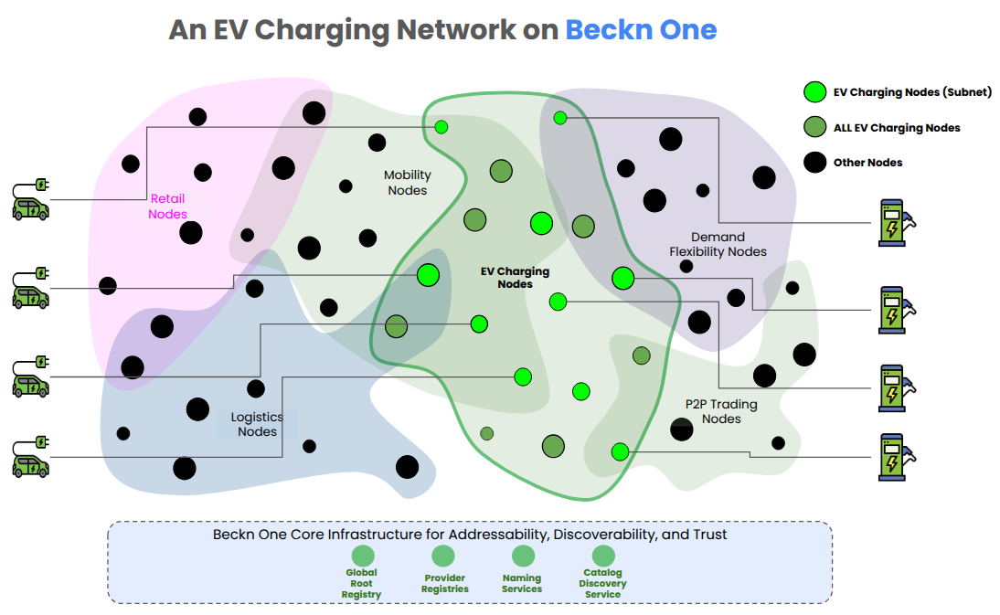
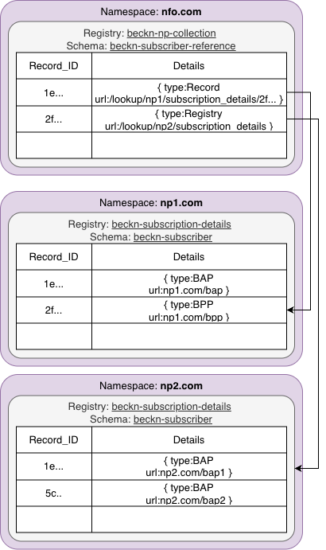

# Implementation Guide \- EV Charging \- Version 0.8 (DRAFT)

## Request for Comments

# 1\. Copyright Notice

#### **License: [CC-BY-NC-SA 4.0](https://becknprotocol.io/license/) becknprotocol.io**

# 2\. Status of This Memo

#### **This is a draft RFC for implementing EV charging use cases using the Beckn Protocol. It provides implementation guidance for anyone to build interoperable EV charging applications that integrate with each other on a decentralized network while maintaining compatibility with OCPI standards for CPO communication.**

# 3\. Abstract

This document proposes a practical way to make EV charging services easier to find and use by applying the Beckn Protocol’s distributed commerce model. Instead of juggling multiple apps and accounts for different charging networks, EV users on any Beckn protocol-enabled consumer platform (a.k.a BAPs) – can discover and book charging services from Beckn protocol-enabled provider platforms (a.k.a BPPs) that have onboarded one or more Charge Point Operators (CPOs).

EV users can discover, compare options, view transparent pricing, and reserve a slot at any eligible charging station owned or operated by CPOs. By standardizing discovery, pricing, and booking, the approach tackles three persistent barriers to EV adoption: charging anxiety, network fragmentation, and payment complexity.

Built on Beckn’s commerce capabilities and aligned with OCPI for technical interoperability, the implementation lets e-Mobility Service Providers (eMSPs) aggregate services from multiple CPOs while delivering a consistent, app-agnostic experience to consumers. 

# 4\. Introduction

This document provides an implementation guidance for deploying EV charging services using the Beckn Protocol ecosystem. It specifically addresses how consumer applications can provide unified access to charging infrastructure across multiple Charge Point Operators while maintaining technical compatibility with existing OCPI-based systems.

# 5\. Scope

This document covers:

* Architecture patterns for EV charging marketplace implementation using Beckn Protocol  
* Discovery and charging mechanisms for charging EVs across multiple CPOs  
* Some recommendations for BAPs, BPPs and NFOs on how to map protocol API calls to internal systems (or vice-versa).  
* Real-time availability and pricing integration with OCPI-based systems  
* Session management and billing coordination between Beckn and OCPI protocols

This document does NOT cover:

* Detailed OCPI protocol specifications (refer to OCPI 2.2.1 documentation)  
* Physical charging infrastructure requirements and standards  
* Regulatory compliance beyond technical implementation (varies by jurisdiction)  
* Smart grid integration and load management systems

# 6\. Intended Audience

* Consumer Application Developers (BAPs): Building EV driver-facing charging applications with unified cross-network access  
* e-Mobility Service Providers (eMSPs/BPPs): Implementing charging service aggregation platforms across multiple CPO networks  
* Charge Point Operators (CPOs): Understanding integration requirements for Beckn-enabled marketplace participation  
* Technology Integrators: Building bridges between existing OCPI infrastructure and new Beckn-based marketplaces  
* System Architects: Designing scalable, interoperable EV charging ecosystems  
* Business Stakeholders: Understanding technical capabilities and implementation requirements for EV charging marketplace strategies  
* Standards Organizations: Evaluating interoperability approaches for future EV charging standards development

# 7\. Conventions and Terminology

The key words "MUST", "MUST NOT", "REQUIRED", "SHALL", "SHALL NOT", "SHOULD", "SHOULD NOT", "RECOMMENDED", "MAY", and "OPTIONAL" in this document are to be interpreted as described [here](https://github.com/beckn/protocol-specifications/blob/draft/docs/BECKN-010-Keyword-Definitions-for-Technical-Specifications.md).

# 8\. Terminology

| Acronym | Full Form/Description | Description |
| ----- | ----- | ----- |
| BAP | Beckn Application Platform | Consumer-facing application that initiates transactions. Mapped to EV users and eMSPs. |
| BPP | Beckn Provider Platform | Service provider platform that responds to BAP requests. Mapped to CPOs.  |
| NFO | Network Facilitator Organization | Organization responsible for the adoption and growth of the network. Usually the custodian of the network’s registry. |
| CDS | Catalog Discovery Service | Enables discovery of charging services from BPPs in the network. |
| eMSP | e-Mobility Service Provider | Service provider that aggregates multiple CPOs. Generally onboarded by BAPs.  |
| CPO | Charge Point Operator | Entity that owns and operates charging infrastructure. Generally onboarded by BPPs.  |
| EVSE | Electric Vehicle Supply Equipment | Individual charging station unit. Owned and operated by CPOs |
| OCPI | Open Charge Point Interface | Protocol for communication between eMSPs and CPOs. |

> Note:
> This document does not detail the mapping between Beckn Protocol and OCPI. Please refer to [this](https://github.com/Beckn-One/DEG/blob/draft/docs/implementation-guides/v1-EOS/DEG00x_Mapping-OCPI-and-Beckn-Protocol-for-EV-Charging-Interoperability.md) document for the same.
> BPPs are NOT aggregators. Any CPO that has implemented a Beckn Protocol endpoint is a BPP. 
> For all sense and purposes, CPOs are essentially BPPs and eMSPs are essentially BAPs.

# 9\. Reference Architecture

The section defines the reference ecosystem architecture that is used for building this implementation guide. 

## 9.1. Architecture Diagram



Source: [https://docs.google.com/presentation/d/1zpJEJ5Fz7Ql3MQOmvcUwonwoB7cfEcFyWdoGJtNUjNQ/edit?slide=id.p\#slide=id.p](https://docs.google.com/presentation/d/1zpJEJ5Fz7Ql3MQOmvcUwonwoB7cfEcFyWdoGJtNUjNQ/edit?slide=id.p#slide=id.p)

## 9.2. Actors

1. Beckn One Global Root Registry  
2. Beckn One Catalog Discovery Service  
3. Beckn Application Platforms  
4. Beckn Provider Platforms  
5. EV Charging Registry

# 10\. Creating an Open Network for EV Charging

To create an open network for EV charging requires all the EV charging BAPs, BPPs, to be able to discover each other and become part of a common club. This club is manifested in the form of a Registry maintained by an NFO. 

## 10.1 Setting up a Registry

The NP Registry serves as the root of addressability and trust for all network participants. It maintains comprehensive details such as the participant’s globally unique identifier (ID), network address (Beckn API URL), public key, operational domains, and assigned role (e.g., BAP, BPP, CDS). In addition to managing participant registration, authentication, authorization, and permission control, the Registry oversees participant verification, activation, and overall lifecycle management, ensuring that only validated and authorized entities can operate within the network.



The Beckn One registry uses [**Decentralized Directory** protocol](https://github.com/LF-Decentralized-Trust-labs/DeDi) for publishing and looking up details of network participants.

### 10.1.1 For NPs

#### 10.1.1.1 Step 1 :  Claiming a Namespace

To get started, any platform that has implemented Beckn Protocol MUST create a globally unique namespace for themselves.   
All NPs (BAPs, BPPs, CDS’es) **MUST** register as a user on dedi.global and claim a unique namespace against their FQDN to become globally addressable. As part of the claiming process, the user must prove ownership of that namespace by verifying the ownership of that domain.

#### 10.1.1.2 Step 2 :  Setting up a Registry

Once the namespace is claimed, each NP **MUST** create a Beckn NP registry in the namespace to list their subscriber details. While creating the registry, the user **MUST** configure it with the [subscriber schema](https://gist.githubusercontent.com/nirmalnr/a6e5b17522169ecea4f3ccdd831af7e4/raw/b7cf8a47e6531ef22744b43e6305b8d8cc106e7b/beckn-subscriber-no-refs.schema.json). 

#### 10.1.1.3 Step 3 :  Publishing subscriber details

In the registry that is created, NPs **MUST** publish their subscription details including their ID, network endpoints, public keys, operational domains and assigned roles (BAP, BPP) as records.

*Detailed steps to create namespaces and registries in dedi.global can be found [here](https://github.com/dedi-global/docs/blob/0976607aabc6641d330a3d41a3bd89ab8790ea09/user-guides/namespace%20and%20registry%20creation.md).*

#### 10.1.1.4 Step 4 :  Share details of the registry created with the Beckn One team

Once the registry is created and details are published, the namespace and the registry name of the newly created registry should be shared with the beckn one team.

### 10.1.2 For NFOs

#### 10.1.2.1 Step 1 :  Claiming a Namespace

An NFO **MAY** register as a user on dedi.global and claim a unique namespace against their FQDN. As part of the claiming process, the user must prove ownership of that namespace by verifying the ownership of that domain.  
*Note: A calibrated roll out of this infrastructure is planned and hence before it is open to the general public NFOs are advised to share their own domain and the domains of their NPs to the Beckn One team so that they can be whitelisted which will allow the NPs to verify the same using TXT records in their DNS.*

#### 10.1.2.2 Step 2 :  Setting up a Registry

Network facilitators **MAY** create registries under their own namespace using the [subscriber reference schema](https://gist.githubusercontent.com/nirmalnr/a6e5b17522169ecea4f3ccdd831af7e4/raw/b7cf8a47e6531ef22744b43e6305b8d8cc106e7b/beckn-subscriber-reference.schema.json) to point to either whole registries or records created by the NPs in their own namespaces. 

#### 10.1.2.3 Step 3 :  Publishing subscriber details

In the registry that is created, NFOs **MAY** publish records which act as pointers to either whole registries or records created by the NPs records. The URL field in the record would be the lookup URL for a registry or a record as per DeDi protocol.

Example: For referencing another registry created by an NP, the record details created would be:

```json
{
  "url": "https://.dedi.global/dedi/lookup/example-company/subscription-details",
  "type": "Registry",
  "subscriber_id": "example-company.com"
}
```

Here `example-company` is the namespace of the NP, and all records added in the registry is referenced here. 

If only one record in the registry needs to be referenced, then the record details created would be:

```json
{
  "url": "https://.dedi.global/dedi/lookup/example-company/subscription-details/energy-bap",
  "type": "Record",
  "subscriber_id": "example-company.com"
}
```

Here `energy-bap` is the name of the record created by the NP in this registry. Only that record is referenced here.

*Detailed steps to create namespaces and registries in dedi.global can be found [here](https://github.com/dedi-global/docs/blob/0976607aabc6641d330a3d41a3bd89ab8790ea09/user-guides/namespace%20and%20registry%20creation.md).*

#### 10.1.2.4 Step 4 :  Share details of the registry created with the Beckn One team

Once the registry is created and details are published, the namespace and the registry name of the newly created registry should be shared with the beckn one team.

## 10.2 Setting up the Protocol Endpoints

This section contains instructions to set up and test the protocol stack for EV charging transactions. 

### 10.2.1 Installing Beckn ONIX

All NPs SHOULD install the Beckn ONIX adapter to quickly get set up and become Beckn Protocol compliant. Click [here](https://github.com/Beckn-One/beckn-onix?tab=readme-ov-file#automated-setup-recommended)) to learn how to set up Beckn ONIX.

### 10.2.2 Configuring Beckn ONIX for EV Charging Transactions

A detailed Configuration Guide is available [here](https://github.com/Beckn-One/beckn-onix/blob/main/CONFIG.md). A quick read of key concepts from the link is recommended.

Specifically, for EV Charging, please use the following configuration:
1. Configure dediregistry plugin instead of registry plugin. Read more [here](https://github.com/Beckn-One/beckn-onix/tree/main/pkg/plugin/implementation/dediregistry).
2. Start with using Simplekeymanager plugin during development, read more [here](https://github.com/Beckn-One/beckn-onix/tree/main/pkg/plugin/implementation/simplekeymanager). For production deployment, you may setup vault.
3. For routing calls to Catalog Discovery Service, refer to routing configuration [here](https://github.com/Beckn-One/beckn-onix/blob/main/config/local-simple-routing-BAPCaller.yaml).

### 10.2.3 Performing a test EV charging transaction

Step 1 : Download the postman collection

If you are a BAP

1. Configure the environment variable API URL to the newly installed Beckn ONIX client-facing URL  
2. Select the search example and hit send  
3. You should see the EV charging service catalog response

If you are a BPP

1. Configure your application URL into Beckn ONIX to receive catalog inputs. Log the request in your console.   
2. In the default postman collection, update the context.url with your API URL in the context header  
3. Select the search example and hit send  
4. You should see the EV charging service request in your console


# 11\. Network Access

## 11.1 Discovering EV charging networks via Global Root

EV charging networks can be discovered and accessed by looking up the global root registry of Beckn One. 

To look up EV charging networks, any client can call the /lookup endpoint of the Beckn One registry service

An example lookup request is shown below

Example Request

```json
TBD
```

Example Response

```json
TBD
```

## 11.2 Looking up NPs inside a specific EV charging registry

[Click to view this request in Postman - TBD](#)

# 12\. Implementing EV Charging Semantics on Beckn Protocol

This section contains recommendations and guidelines on how to implement EV Charging Services on Beckn Protocol enabled networks. To ensure global interoperability between actors of the EV charging network, the semantics of the EV charging industry need to be mapped to the core schema of Beckn Protocol. The below table summarizes key semantic mappings between the EV Charging Domain and Beckn Protocol domain.

## 12.1. Key Assumptions

- **Assumption 1 :** EV charging is treated as a service, not as a physical object.  
- **Assumption 2:** All CPOs have implemented OCPI interfaces 

Each entity in the charging lifecycle — the service, the commercial terms, and the usage instance — maps to a well-defined semantic concept, enabling platforms to exchange information in a standardized, machine-readable way.

## 12.2 Semantic Model

| EV Charging Domain Entity | Charging Example | Semantically maps to |
| ----- | ----- | :---: |
| Charging Service Listing | “DC Fast-Charging (60 kW CCS2)” | Item  |
| Charging service | “₹18 per kWh”, “₹150 per hour”, “₹999 monthly pass”, “Off-peak discount 2 AM–5 AM” | Offer |
| Charging Session | A specific booking or usage instance created when the user plugs in or reserves a slot | Order |

## Example Category Codes

The following section contains example category codes that can be 

Charger types

| Code | What it means | Source |
| ----- | ----- | ----- |
| AC\_SLOW | AC charge points in the “slow” band (≈ 3–7 kW). | ([Zapmap](https://www.zap-map.com/ev-stats/how-many-charging-points?utm_source=chatgpt.com)) |
| AC\_FAST | AC “fast” public charging (≈ 7–22 kW; UK fast band 8–49 kW covers AC up to \~22 kW). | ([Zapmap](https://www.zap-map.com/ev-stats/how-many-charging-points?utm_source=chatgpt.com)) |
| DC\_FAST | DC “rapid/fast” typically \~50–149 kW. | ([Zapmap](https://www.zap-map.com/ev-stats/how-many-charging-points?utm_source=chatgpt.com)) |
| DC\_ULTRA | DC “ultra-rapid/ultra-fast”, ≥ 150 kW (also aligns with AFIR focus on ≥ 150 kW corridors). | ([Zapmap](https://www.zap-map.com/ev-stats/how-many-charging-points?utm_source=chatgpt.com)) |

Connector types

| Code | What it means | Source |
| ----- | ----- | ----- |
| TYPE1 | Type 1 (SAE J1772) AC connector (North America/JP usage). | ([Wikipedia](https://en.wikipedia.org/wiki/Combined_Charging_System?utm_source=chatgpt.com)) |
| TYPE2 | Type 2 (IEC 62196-2) AC connector; EU standard. | ([Wikipedia](https://en.wikipedia.org/wiki/Type_2_connector?utm_source=chatgpt.com)) |
| CCS2 | Combined Charging System “Combo 2” (IEC 62196 based) enabling high-power DC on Type 2\. | ([Wikipedia](https://en.wikipedia.org/wiki/Combined_Charging_System?utm_source=chatgpt.com)) |
| CHADEMO | CHAdeMO DC fast-charging standard. | ([chademo.com](https://www.chademo.com/about-us/what-is-chademo?utm_source=chatgpt.com)) |
| GB\_T | China’s GB/T charging standard (AC & DC). | ([Wikipedia](https://en.wikipedia.org/wiki/GB/T_charging_standard?utm_source=chatgpt.com)) |

Service types

| Code | What it means | Source |
| ----- | ----- | ----- |
| GREEN\_ENERGY\_CERTIFIED | Flag that the site/session is supplied by verified green energy per catalog metadata (e.g., OCPI EnergyMix.is\_green\_energy). | ([evroaming.org](https://evroaming.org/wp-content/uploads/2024/11/OCPI-2.2.1-d2.pdf?utm_source=chatgpt.com)) |
| GO\_EU | Energy backed by EU Guarantees of Origin (GOs). | ([aib-net.org](https://www.aib-net.org/certification/certificates-supported/renewable-energy-guarantees-origin?utm_source=chatgpt.com)) |
| REGO\_UK | Energy backed by the UK Renewable Energy Guarantees of Origin (REGO) scheme. | ([Ofgem](https://www.ofgem.gov.uk/guidance/renewable-energy-guarantees-origin-guidance-generators-agents-and-suppliers?utm_source=chatgpt.com)) |
| I\_REC | Energy backed by I-REC certificates (international EACs). | ([I-TRACK](https://www.trackingstandard.org/product-code/electricity/?utm_source=chatgpt.com)) |
| V2G\_ENABLED | Charger/site supports bidirectional power transfer (V2G), e.g., per ISO 15118-20 implementations. | ([charin.global](https://www.charin.global/media/pages/technology/knowledge-base/04e4f443ae-1731074296/charin_interop_guide_2.0_dc_bpt_iso_15118-20_v1.0_publication.pdf?utm_source=chatgpt.com)) |
| REMOTE\_START\_STOP | Remote start/stop of sessions exposed via roaming interface (OCPI Commands module). | ([evroaming.org](https://evroaming.org/wp-content/uploads/2024/11/OCPI-2.2.1-d2.pdf?utm_source=chatgpt.com)) |


# Example Workflows (EV User’s Perspective)

## Example 1 \- Walk-In to a charging station without reservation.

This section covers a walk-in case where users discover the charger using third-party apps, word of mouth, or Beckn API, and then drive to the location, plug in their EV and charge their vehicle. 

### Consumer User Journey

A 34-year-old sales manager who drives an EV to client meetings. He’s time-bound, cost-conscious, and prefers simple, scan-and-go experiences. Raghav arrives at a large dine-in restaurant for a one-hour client meeting. He notices a charging bay in the parking lot and decides to top up while he’s inside.

**Discovery**: Raghav opens his EV app, taps sScan & Charge, and scans the QR on the charger. The app pulls the charger’s details (connector, power rating, live status, tariff, any active time-bound offer).

**Order**: Raghav selects a 60-minute top-up, reviews session terms (rate, idle fee window, cancellation rules), and confirms. He chooses UPI and authorizes payment (or an authorization hold, as supported). The app returns a booking/transaction ID.

**Fulfilment**: He plugs in and starts the session from the app. Live progress (kWh, ₹ consumed, ETA) is shown while he’s in the meeting. If the bay has a lunch-hour promo, the discounted rate is applied automatically.

**Post-Fulfilment**: At \~60 minutes, the session stops (or notifies him to unplug). He receives a digital invoice and session summary in-app. If anything went wrong (e.g., session interrupted, SOC reaches 100%, etc.), the app reconciles to bill only for energy delivered and issues any adjustment or refund automatically.

Important points of consideration:

1. From a technical standpoint, the walk-in scenario is comparable to booking an instant slot *after* reaching the location. While it may appear different from a user experience perspective, the underlying API calls and system processes remain largely the same as the advance reservation use case, with key differences in timing and availability checks.  
2. The order flow happens while the user is physically present at the charging station. This creates a more compressed transaction timeline where all booking steps occur on-site, making it essential for the system to handle real-time availability updates and quick response times to ensure a smooth user experience.  
3. Real-time availability: The system checks for immediate slot availability instead of future time slots  
4. Instant booking: The entire discovery → select → init → confirm flow happens within minutes at the physical location  
5. Same API endpoints: Uses identical Beckn protocol calls but with compressed timeframes  
6. Immediate fulfillment: The charging session can start immediately after confirmation, rather than waiting for a scheduled time

## **API Calls and Schema**

Note: The API calls and schema for walk-in charging are identical to the advance reservation use case (Use Case 2\) with minor differences in timing and availability. Where sections reference Use Case 2, the same API structure, field definitions, and examples apply unless specifically noted otherwise.

### **discover**

### **Method**

POST 

### **Use Case**

Raghav scans QR code on charger using his BAP user app

#### Request

```json
{
 "context": {
    "action": "discover",
    "bap_id": "app.example.com",
    "bap_uri": "https://app.example.com/bap",
    "transaction_id": "2b4d69aa-22e4-4c78-9f56-5a7b9e2b2002",
    "message_id": "a1eabf26-29f5-4a01-9d4e-4c5c9d1a3d02",
    "timestamp": "2025-10-14T07:31:00Z",
    "ttl": "PT30S",
    "schema_context": [
     "https://raw.githubusercontent.com/beckn/protocol-specifications-new/refs/heads/main/schemas/charging_service/v1/context.jsonld"
    ]
 },
"message": {
    "filters":    "$[?(@['beckn:itemAttributes']['evseId']=='IN*ECO*01*CCS2*A')]"
 }
}
``` 
Fetching details of a specific charger (EVSE) after reaching site (using its identifier): [Example](https://github.com/Beckn-One/DEG/blob/draft/examples/v2/01_discover/discovery-by-EVSE.json)

#### Successful Response

```json
{
    "ack_status": "ACK",
    "timestamp": "2025-10-14T07:31:05Z"
}
```

Note: Users can discover the charging station through off-network channels (such as physical signage, word-of-mouth, or third-party apps not integrated with Beckn) and arrive directly at the location to initiate charging. In this scenario:

* The discovery phase is skipped entirely  
* Users proceed directly to the Select API call by scanning QR codes or using location-based identification  
* The charging station must be able to handle direct selection requests without prior search/discovery  
* This represents a more streamlined flow for walk-in customers who have already identified their preferred charging location

### **on\_discover**

### **Method**

POST 

### **Use Case**

The app receives the charger’s details (connector, power rating, live status, tariff, any active time-bound offer).

#### Request

```json
{
  "context": {
    "version": "2.0.0",
    "action": "on_discover",
    "timestamp": "2024-01-15T10:30:05Z",
    "message_id": "a1b2c3d4-e5f6-4789-90ab-cdef12345678",
    "transaction_id": "f9d1e7f3-5f1a-4d23-9f10-31b72c0b0c01",
    "bpp_id": "bpp.example.com",
    "bpp_uri": "https://bpp.example.com",
    "ttl": "PT30S"
  },
  "message": {
    "catalogs": [
      {
        "@context": "https://becknprotocol.io/schemas/core/v1/Catalog/schema-context.jsonld",
        "@type": "beckn:Catalog",
        "beckn:descriptor": {
          "@type": "beckn:Descriptor",
          "schema:name": "EV Charging Services Network",
          "beckn:shortDesc": "Comprehensive network of fast charging stations across Bengaluru"
        },
        "beckn:validity": {
          "@type": "beckn:TimePeriod",
          "schema:startDate": "2024-10-01T00:00:00Z",
          "schema:endDate": "2025-01-15T23:59:59Z"
        },
        "beckn:items": [
          {
            "@context": "https://becknprotocol.io/schemas/core/v1/Item/schema-context.jsonld",
            "@type": "beckn:Item",
            "beckn:id": "ev-charger-ccs2-001",
            "beckn:descriptor": {
              "@type": "beckn:Descriptor",
              "schema:name": "DC Fast Charger - CCS2 (60kW)",
              "beckn:shortDesc": "High-speed DC charging station with CCS2 connector",
              "beckn:longDesc": "Ultra-fast DC charging station supporting CCS2 connector type with 60kW maximum power output. Features advanced thermal management and smart charging capabilities."
            },
            "beckn:category": {
              "@type": "schema:CategoryCode",
              "schema:codeValue": "ev-charging",
              "schema:name": "EV Charging"
            },
            "beckn:availableAt": [
              {
                "geo": {
                  "type": "Point",
                  "coordinates": [77.5946, 12.9716]
                },
                "address": {
                  "streetAddress": "EcoPower BTM Hub, 100 Ft Rd",
                  "addressLocality": "Bengaluru",
                  "addressRegion": "Karnataka",
                  "postalCode": "560076",
                  "addressCountry": "IN"
                }
              }
            ],
            "beckn:availabilityWindow": {
              "@type": "beckn:TimePeriod",
              "schema:startTime": "06:00:00",
              "schema:endTime": "22:00:00"
            },
            "beckn:rateable": true,
            "beckn:rating": {
              "@type": "beckn:Rating",
              "beckn:ratingValue": 4.5,
              "beckn:ratingCount": 128
            },
            "beckn:isActive": true,
            "beckn:networkId": ["bap.net/ev-charging"],
            "beckn:provider": {
              "beckn:id": "ecopower-charging",
              "beckn:descriptor": {
                "@type": "beckn:Descriptor",
                "schema:name": "EcoPower Charging Pvt Ltd"
              }
            },
            "beckn:itemAttributes": {
              "@context": "https://raw.githubusercontent.com/beckn/protocol-specifications-new/refs/heads/draft/schema/EvChargingService/v1/context.jsonld",
              "@type": "ChargingService",
              "connectorType": "CCS2",
              "maxPowerKW": 60,
              "minPowerKW": 5,
              "socketCount": 2,
              "reservationSupported": true,
              "acceptedPaymentMethod": ["schema:UPI", "schema:CreditCard", "schema:Wallet"],
              "serviceLocation": {
                "geo": {
                  "type": "Point",
                  "coordinates": [77.5946, 12.9716]
                },
                "address": {
                  "streetAddress": "EcoPower BTM Hub, 100 Ft Rd",
                  "addressLocality": "Bengaluru",
                  "addressRegion": "Karnataka",
                  "postalCode": "560076",
                  "addressCountry": "IN"
                }
              },
              "amenityFeature": ["Restaurant", "Restroom", "Wi-Fi"],
              "ocppId": "IN-ECO-BTM-01",
              "evseId": "IN*ECO*BTM*01*CCS2*A",
              "roamingNetwork": "GreenRoam",
              "parkingType": "Mall",
              "connectorId": "CCS2-A",
              "powerType": "DC",
              "connectorFormat": "CABLE",
              "chargingSpeed": "FAST",
              "stationStatus": "Available"
            },
            "beckn:offers": [
              {
                "@context": "https://becknprotocol.io/schemas/core/v1/Offer/schema-context.jsonld",
                "@type": "beckn:Offer",
                "beckn:id": "eco-charge-offer-ccs2-60kw-kwh",
                "beckn:descriptor": {
                  "@type": "beckn:Descriptor",
                  "schema:name": "Per-kWh Tariff - CCS2 60kW"
                },
                "beckn:items": ["ev-charger-ccs2-001"],
            "beckn:price": {
              "currency": "INR",
              "value": 18.0,
                  "applicableQuantity": {
                    "unitText": "Kilowatt Hour",
                    "unitCode": "KWH",
                    "unitQuantity": 1
                  }
                },
                "beckn:validity": {
                  "@type": "beckn:TimePeriod",
                  "schema:startDate": "2024-10-01T00:00:00Z",
                  "schema:endDate": "2025-01-15T23:59:59Z"
                },
                "beckn:acceptedPaymentMethod": ["UPI", "Card", "Wallet"],
                "beckn:offerAttributes": {
                  "@context": "https://raw.githubusercontent.com/beckn/protocol-specifications-new/refs/heads/draft/schema/EvChargingService/v1/context.jsonld",
                  "@type": "ChargingOffer",
                  "buyerFinderFee": {
                    "feeType": "PERCENTAGE",
                    "feeValue": 2.5
                  },
                  "idleFeePolicy": "₹2/min after 10 min post-charge"
                }
              }
            ]
          },
          {
            "@context": "https://becknprotocol.io/schemas/core/v1/Item/schema-context.jsonld",
            "@type": "beckn:Item",
            "beckn:id": "ev-charger-ccs2-001",
            "beckn:descriptor": {
              "@type": "beckn:Descriptor",
              "schema:name": "DC Fast Charger - CCS2 (60kW)",
              "beckn:shortDesc": "High-speed DC charging station with CCS2 connector",
              "beckn:longDesc": "Ultra-fast DC charging station supporting CCS2 connector type with 60kW maximum power output. Features advanced thermal management and smart charging capabilities."
            },
            "beckn:category": {
              "@type": "schema:CategoryCode",
              "schema:codeValue": "ev-charging",
              "schema:name": "EV Charging"
            },
            "beckn:availableAt": [
              {
                "geo": {
                  "type": "Point",
                  "coordinates": [77.5946, 12.9716]
                },
                "address": {
                  "streetAddress": "EcoPower BTM Hub, 100 Ft Rd",
                  "addressLocality": "Bengaluru",
                  "addressRegion": "Karnataka",
                  "postalCode": "560076",
                  "addressCountry": "IN"
                }
              }
            ],
            "beckn:availabilityWindow": {
              "@type": "beckn:TimePeriod",
              "schema:startTime": "06:00:00",
              "schema:endTime": "22:00:00"
            },
            "beckn:rateable": true,
            "beckn:rating": {
              "@type": "beckn:Rating",
              "beckn:ratingValue": 4.5,
              "beckn:ratingCount": 128
            },
            "beckn:isActive": true,
            "beckn:networkId": ["bap.net/ev-charging"],
            "beckn:provider": {
              "beckn:id": "GoGreen-charging",
              "beckn:descriptor": {
                "@type": "beckn:Descriptor",
                "schema:name": "GoGreen Charging Pvt Ltd"
              }
            },
            "beckn:itemAttributes": {
              "@context": "https://raw.githubusercontent.com/beckn/protocol-specifications-new/refs/heads/draft/schema/EvChargingService/v1/context.jsonld",
              "@type": "ChargingService",
              "connectorType": "CCS2",
              "maxPowerKW": 60,
              "minPowerKW": 5,
              "socketCount": 2,
              "reservationSupported": true,
              "acceptedPaymentMethod": ["schema:UPI", "schema:CreditCard", "schema:Wallet"],
              "serviceLocation": {
                "geo": {
                  "type": "Point",
                  "coordinates": [77.5946, 12.9716]
                },
                "address": {
                  "streetAddress": "EcoPower BTM Hub, 100 Ft Rd",
                  "addressLocality": "Bengaluru",
                  "addressRegion": "Karnataka",
                  "postalCode": "560076",
                  "addressCountry": "IN"
                }
              },
              "amenityFeature": ["Restaurant", "Restroom", "Wi-Fi"],
              "ocppId": "IN-ECO-BTM-01",
              "evseId": "IN*ECO*BTM*01*CCS2*A",
              "roamingNetwork": "GreenRoam",
              "parkingType": "Mall",
              "connectorId": "CCS2-A",
              "powerType": "DC",
              "connectorFormat": "CABLE",
              "chargingSpeed": "FAST",
              "stationStatus": "Available"
            },
            "beckn:offers": [
              {
                "@context": "https://becknprotocol.io/schemas/core/v1/Offer/schema-context.jsonld",
                "@type": "beckn:Offer",
                "beckn:id": "go-green-offer-ccs2-60kw-kwh",
                "beckn:descriptor": {
                  "@type": "beckn:Descriptor",
                  "schema:name": "Per-kWh Tariff - CCS2 60kW"
                },
                "beckn:items": ["ev-charger-ccs2-001"],
            "beckn:price": {
              "currency": "INR",
              "value": 18.5,
                  "applicableQuantity": {
                    "unitText": "Kilowatt Hour",
                    "unitCode": "KWH",
                    "unitQuantity": 1
                  }
                },
                "beckn:validity": {
                  "@type": "beckn:TimePeriod",
                  "schema:startDate": "2024-10-01T00:00:00Z",
                  "schema:endDate": "2025-01-15T23:59:59Z"
                },
                "beckn:acceptedPaymentMethod": ["UPI", "Card"],
                "beckn:offerAttributes": {
                  "@context": "https://raw.githubusercontent.com/beckn/protocol-specifications-new/refs/heads/draft/schema/EvChargingService/v1/context.jsonld",
                  "@type": "ChargingOffer",
                  "buyerFinderFee": {
                    "feeType": "PERCENTAGE",
                    "feeValue": 2.2
                  },
                  "idleFeePolicy": "₹2/min after 10 min post-charge"
                }
              }
            ]
          }
        ]
      }
    ]
  }
}

```

CPO returns details of a specific charger: [Example](https://github.com/Beckn-One/DEG/tree/draft/examples/v2/02_on_discover/specific-evse-catalog.json)

#### Successful Response

```json
{
    "ack_status": "ACK",
    "timestamp": "2025-10-14T07:32:05Z"
}
```

### **select**

### **Method**

POST 

### **Use Case**

Raghav selects a service offering from the options he gets. He chooses a 100 INR top-up.

#### Request 

```json
{
  "context": {
    "version": "2.0.0",
    "action": "select",
    "timestamp": "2024-01-15T10:30:00Z",
    "message_id": "bb9f86db-9a3d-4e9c-8c11-81c8f1a7b901",
    "transaction_id": "f9d1e7f3-5f1a-4d23-9f10-31b72c0b0c01",
    "bap_id": "bap.example.com",
    "bap_uri": "https://bap.example.com",
    "bpp_id": "bpp.example.com",
    "bpp_uri": "https://bpp.example.com",
    "ttl": "PT30S"
  },
  "message": {
    "order": {
      "@context": "https://becknprotocol.io/schemas/core/v1/Order/schema-context.jsonld",
      "@type": "beckn:Order",
      "beckn:id": "order-ev-charging-001",
      "beckn:orderStatus": "QUOTE_REQUESTED",
      "beckn:seller": "ecopower-charging",
      "beckn:orderValue": {
        "currency": "INR",
        "value": 100.0
      },
      "beckn:orderItems": [
        {
          "beckn:lineId": "line-001",
          "beckn:orderedItem": "ev-charger-ccs2-001",
          "beckn:quantity": 2.5,
          "beckn:acceptedOffer": {
            "@context": "https://becknprotocol.io/schemas/core/v1/Offer/schema-context.jsonld",
            "@type": "beckn:Offer",
            "beckn:id": "eco-chareg-offer-ccs2-60kw-kwh",
            "beckn:descriptor": {
              "@type": "beckn:Descriptor",
              "schema:name": "Per-kWh Tariff - CCS2 60kW"
            },
            "beckn:items": ["ev-charger-ccs2-001"],
            "beckn:price": {
              "currency": "INR",
              "value": 18.0,
              "applicableQuantity": {
                "unitText": "Kilowatt Hour",
                "unitCode": "KWH",
                "unitQuantity": 1
              }
            },
            "beckn:validity": {
              "@type": "beckn:TimePeriod",
              "schema:startDate": "2024-10-01T00:00:00Z",
              "schema:endDate": "2025-01-15T23:59:59Z"
            },
            "beckn:acceptedPaymentMethod": ["UPI", "Card", "Wallet"],
            "beckn:offerAttributes": {
              "@context": "https://raw.githubusercontent.com/beckn/protocol-specifications-new/refs/heads/draft/schema/EvChargingService/v1/context.jsonld",
              "@type": "ChargingOffer",
              "buyerFinderFee": {
                "feeType": "PERCENTAGE",
                "feeValue": 2.5
              },
              "idleFeePolicy": "₹2/min after 10 min post-charge"
            }
          }
        }
      ],
      "beckn:fulfillment": {
        "@context": "https://becknprotocol.io/schemas/core/v1/Fulfillment/schema-context.jsonld",
        "@type": "beckn:Fulfillment",
        "beckn:id": "fulfillment-charging-001",
        "beckn:mode": "RESERVATION",
        "beckn:deliveryAttributes": {
          "@context": "https://raw.githubusercontent.com/beckn/protocol-specifications-new/refs/heads/draft/schema/EvChargingService/v1/context.jsonld",
          "@type": "ChargingSession",
          "sessionStatus": "PENDING",
          "authorizationMode": "APP_QR",
          "connectorType": "CCS2",
          "maxPowerKW": 60,
          "reservationId": "RESV-984532",
          "gracePeriodMinutes": 10
        }
      },
      "beckn:orderAttributes": {
        "@context": "https://raw.githubusercontent.com/beckn/protocol-specifications-new/refs/heads/draft/schema/EvChargingService/v1/context.jsonld",
        "@type": "ChargingSession",
        "buyerFinderFee": {
          "feeType": "PERCENTAGE",
          "feeValue": 2.5
        }
      }
    }
  }
}

```

EV user requests charge worth specific amount in currency: [Example](https://github.com/Beckn-One/DEG/blob/draft/examples/v2/03_select/time-based-ev-charging-slot-select.json)

#### Successful Response

```json
{
    "ack_status": "ACK",
    "timestamp": "2025-10-14T07:33:05Z"
}
```

### **on\_select**

### **Method**

POST 

### **Use Case**

Raghav receives estimated quotations for the selected service.

#### Request

```json
{
  "context": {
    "version": "2.0.0",
    "action": "on_select",
    "timestamp": "2024-01-15T10:30:05Z",
    "message_id": "a1b2c3d4-e5f6-4789-90ab-cdef12345678",
    "transaction_id": "f9d1e7f3-5f1a-4d23-9f10-31b72c0b0c01",
    "bap_id": "bap.example.com",
    "bap_uri": "https://bap.example.com",
    "bpp_id": "bpp.example.com",
    "bpp_uri": "https://bpp.example.com",
    "ttl": "PT30S"
  },
  "message": {
    "order": {
      "@context": "https://becknprotocol.io/schemas/core/v1/Order/schema-context.jsonld",
      "@type": "beckn:Order",
      "beckn:id": "order-ev-charging-001",
      "beckn:orderStatus": "QUOTE_RECEIVED",
      "beckn:orderNumber": "ORD-2024-001",
      "beckn:seller": "ecopower-charging",
      "beckn:buyer": "user-12345",
      "beckn:orderItems": [
        {
          "beckn:lineId": "line-001",
          "beckn:orderedItem": "ev-charger-ccs2-001",
          "beckn:quantity": 2.5,
          "beckn:acceptedOffer": {
            "@context": "https://becknprotocol.io/schemas/core/v1/Offer/schema-context.jsonld",
            "@type": "beckn:Offer",
            "beckn:id": "offer-ccs2-60kw-kwh",
            "beckn:descriptor": {
              "@type": "beckn:Descriptor",
              "schema:name": "Per-kWh Tariff - CCS2 60kW"
            },
            "beckn:items": ["ev-charger-ccs2-001"],
            "beckn:price": {
              "currency": "INR",
              "value": 18.0,
              "applicableQuantity": {
                "unitText": "Kilowatt Hour",
                "unitCode": "KWH",
                "unitQuantity": 1
              }
            },
            "beckn:validity": {
              "@type": "beckn:TimePeriod",
              "schema:startDate": "2024-10-01T00:00:00Z",
              "schema:endDate": "2025-01-15T23:59:59Z"
            },
            "beckn:acceptedPaymentMethod": ["UPI", "Card", "Wallet"],
            "beckn:offerAttributes": {
              "@context": "https://raw.githubusercontent.com/beckn/protocol-specifications-new/refs/heads/draft/schema/EvChargingService/v1/context.jsonld",
              "@type": "ChargingOffer",
              "buyerFinderFee": {
                "feeType": "PERCENTAGE",
                "feeValue": 2.5
              },
              "idleFeePolicy": "₹2/min after 10 min post-charge"
            }
          },
          "beckn:price": {
            "currency": "INR",
            "value": 45.0,
            "applicableQuantity": {
              "unitText": "Kilowatt Hour",
              "unitCode": "KWH",
              "unitQuantity": 1
            }
          }
        }
      ],
      "beckn:orderValue": {
        "currency": "INR",
        "value": 100.0,
        "components": [
          {
            "type": "UNIT",
            "value": 72.73,
            "currency": "INR",
            "description": "Charging session cost (4.04 kWh @ ₹18.00/kWh)"
          },
          {
            "type": "FEE",
            "value": 10.0,
            "currency": "INR",
            "description": "Service fee"
          },
          {
            "type": "FEE",
            "value": 13.64,
            "currency": "INR",
            "description": "Overcharge estimation"
          },
          {
            "type": "SURCHARGE",
            "value": 14.55,
            "currency": "INR",
            "description": "Surge price (20%)"
          },
          {
            "type": "DISCOUNT",
            "value": -10.92,
            "currency": "INR",
            "description": "Offer discount (20%)"
          }
        ]
      },
      "beckn:fulfillment": {
        "@context": "https://becknprotocol.io/schemas/core/v1/Fulfillment/schema-context.jsonld",
        "@type": "beckn:Fulfillment",
        "beckn:id": "fulfillment-charging-001",
        "beckn:mode": "RESERVATION",
        "beckn:status": "QUOTED",
        "beckn:deliveryAttributes": {
          "@context": "https://raw.githubusercontent.com/beckn/protocol-specifications-new/refs/heads/draft/schema/EvChargingService/v1/context.jsonld",
          "@type": "ChargingSession",
          "sessionStatus": "PENDING",
          "authorizationMode": "APP_QR",
          "authorizationOtpHint": "Scan QR code at charging station",
          "connectorType": "CCS2",
          "maxPowerKW": 60,
          "reservationId": "RESV-984532",
          "gracePeriodMinutes": 10,
          "trackingId": "TRK-984532",
          "trackingUrl": "https://cpo.example.org/session/RESV-984532",
          "trackingStatus": "ACTIVE"
        }
      }
    }
  }
}

```

CPO responds with dynamically calculated quote: [Example](https://github.com/Beckn-One/DEG/blob/draft/examples/v2/04_on_select/time-based-ev-charging-slot-on-select.json)

#### 

#### Successful response

```json
{
    "ack_status": "ACK",
    "timestamp": "2025-10-14T07:33:05Z"
}
```

### **init**

### **Method**

POST 

### **Use Case**

Raghav provides his billing information.

#### Request

```json
{
  "context": {
    "domain": "deg:ev-charging",
    "action": "init",
    "location": {
      "country": {
        "code": "IND"
      },
      "city": {
        "code": "std:080"
      }
    },
    "version": "2.0.0",
    "bap_id": "example-bap.com",
    "bap_uri": "https://api.example-bap.com/pilot/bap/energy/v2",
    "bpp_id": "example-bpp.com",
    "bpp_uri": "https://example-bpp.com/pilot/bap/energy/v2",
    "transaction_id": "6743e9e2-4fb5-487c-92b7-13ba8018f176",
    "message_id": "6743e9e2-4fb5-487c-92b7-13ba8018f176",
    "timestamp": "2025-01-27T10:00:00Z",
    "ttl": "15S"
  },
  "message": {
    "order": {
      "@context": "https://becknprotocol.io/schemas/core/v2/Order/schema-context.jsonld",
      "@type": "beckn:Order",
      "beckn:id": "order-123456",
      "beckn:orderStatus": "PENDING",
      "beckn:orderNumber": "ORD-2025-001",
      "beckn:seller": "cpo1.com",
      "beckn:buyer": {
        "@context": "https://becknprotocol.io/schemas/core/v2/Party/schema-context.jsonld",
        "@type": "beckn:Party",
        "beckn:id": "user-123",
        "beckn:role": "BUYER",
        "beckn:name": "Ravi Kumar",
        "beckn:organization": {
          "descriptor": {
            "name": "GreenCharge Pvt Ltd"
          }
        },
        "beckn:address": "Apartment 123, MG Road, Bengaluru, Karnataka, 560001, India",
        "beckn:email": "ravi.kumar@greencharge.com",
        "beckn:phone": "+918765432100",
        "beckn:taxId": "GSTIN29ABCDE1234F1Z5"
      },
      "beckn:orderItems": [
        {
          "beckn:lineId": "line-001",
          "beckn:orderedItem": "pe-charging-01",
          "beckn:acceptedOffer": {
            "@context": "https://becknprotocol.io/schemas/core/v2/Offer/schema-context.jsonld",
            "@type": "beckn:Offer",
            "beckn:id": "offer-001",
            "beckn:descriptor": {
              "name": "EV Charging Session Offer",
              "short_desc": "Fast charging session with CCS2 connector"
            },
            "beckn:price": {
              "currency": "INR",
              "value": 18.0,
              "applicableQuantity": {
                "unitText": "Kilowatt Hour",
                "unitCode": "KWH",
                "unitQuantity": 1
              }
            },
            "beckn:validity": {
              "@type": "beckn:TimePeriod",
              "schema:startDate": "2025-01-27T00:00:00Z",
              "schema:endDate": "2025-04-27T23:59:59Z"
            },
            "beckn:offerAttributes": {
              "@type": "ChargingOffer",
              "offerType": "CHARGING_SESSION",
              "buyerFinderFee": {
                "feeType": "PERCENTAGE",
                "feeValue": 2.0
              },
              "discountPercentage": 20.0
            }
          },
          "beckn:quantity": 5,
          "beckn:price": {
            "currency": "INR",
            "value": 90.0,
            "applicableQuantity": {
              "unitText": "Kilowatt Hour",
              "unitCode": "KWH",
              "unitQuantity": 5
            }
          }
        }
      ],
      "beckn:orderValue": {
        "currency": "INR",
        "value": 100.0,
        "components": [
          {
            "type": "UNIT",
            "value": 72.73,
            "currency": "INR",
            "description": "Charging session cost (4.04 kWh @ ₹18.00/kWh)"
          },
          {
            "type": "FEE",
            "value": 10.0,
            "currency": "INR",
            "description": "Service fee"
          },
          {
            "type": "FEE",
            "value": 13.64,
            "currency": "INR",
            "description": "Overcharge estimation"
          },
          {
            "type": "SURCHARGE",
            "value": 14.55,
            "currency": "INR",
            "description": "Surge price (20%)"
          },
          {
            "type": "DISCOUNT",
            "value": -10.92,
            "currency": "INR",
            "description": "Offer discount (20%)"
          }
        ]
      },
      "beckn:fulfillment": {
        "@context": "https://becknprotocol.io/schemas/core/v2/Fulfillment/schema-context.jsonld",
        "@type": "beckn:Fulfillment",
        "beckn:id": "fulfillment-001",
        "beckn:status": "PENDING",
        "beckn:deliveryAttributes": {
          "@type": "ChargingSession",
          "sessionId": "session-001",
          "sessionType": "CHARGING",
          "startTime": "2025-01-27T10:00:00Z",
          "endTime": "2025-01-27T11:30:00Z",
          "customer": {
            "name": "Ravi Kumar",
            "phone": "+91-9887766554"
          },
          "vehicle": {
            "make": "Tata",
            "model": "Nexon EV"
          },
          "location": {
            "gps": "28.345345,77.389754",
            "address": "Connaught Place, New Delhi"
          },
          "connectorType": "CCS2",
          "maxPowerKW": 50,
          "stationStatus": "Available"
        }
      },
      "beckn:orderAttributes": {
        "@type": "ChargingSession",
        "sessionPreferences": {
          "preferredStartTime": "2025-01-27T10:00:00Z",
          "preferredEndTime": "2025-01-27T11:30:00Z",
          "notificationPreferences": {
            "email": true,
            "sms": true,
            "push": false
          }
        }
      }
    }
  }
}

```


EV user requests final quote with payment terms by providing billing details: [Example](https://github.com/Beckn-One/DEG/blob/draft/examples/v2/05_init/time-based-ev-charging-slot-init.json)

#### Successful response

```json
{
    "ack_status": "ACK",
    "timestamp": "2025-10-14T07:33:05Z"
}
```

### **on\_init**

### **Method**

POST 

### **Use Case**

Raghav receives the charging session terms(rate, idle fee window, cancellation rules, payment terms etc). He reviews the terms.

He chooses UPI and authorizes payment (or an authorization hold, as supported)

#### Request

```json
{
  "context": {
    "domain": "deg:ev-charging",
    "action": "on_init",
    "location": {
      "country": {
        "code": "IND"
      },
      "city": {
        "code": "std:080"
      }
    },
    "version": "2.0.0",
    "bap_id": "example-bap.com",
    "bap_uri": "https://api.example-bap.com/pilot/bap/energy/v2",
    "bpp_id": "example-bpp.com",
    "bpp_uri": "https://example-bpp.com/pilot/bap/energy/v2",
    "transaction_id": "6743e9e2-4fb5-487c-92b7-13ba8018f176",
    "message_id": "6743e9e2-4fb5-487c-92b7-13ba8018f176",
    "timestamp": "2025-01-27T10:00:00Z",
    "ttl": "15S"
  },
  "message": {
    "order": {
      "@context": "https://becknprotocol.io/schemas/core/v2/Order/schema-context.jsonld",
      "@type": "beckn:Order",
      "beckn:id": "order-123456",
      "beckn:orderStatus": "PENDING",
      "beckn:orderNumber": "ORD-2025-001",
      "beckn:seller": "cpo1.com",
      "beckn:buyer": {
        "@context": "https://becknprotocol.io/schemas/core/v2/Party/schema-context.jsonld",
        "@type": "beckn:Party",
        "beckn:id": "user-123",
        "beckn:role": "BUYER",
        "beckn:name": "Ravi Kumar",
        "beckn:organization": {
          "descriptor": {
            "name": "GreenCharge Pvt Ltd"
          }
        },
        "beckn:address": "Apartment 123, MG Road, Bengaluru, Karnataka, 560001, India",
        "beckn:email": "ravi.kumar@greencharge.com",
        "beckn:phone": "+918765432100",
        "beckn:taxId": "GSTIN29ABCDE1234F1Z5"
      },
      "beckn:orderItems": [
        {
          "beckn:lineId": "line-001",
          "beckn:orderedItem": "pe-charging-01",
          "beckn:acceptedOffer": {
            "@context": "https://becknprotocol.io/schemas/core/v2/Offer/schema-context.jsonld",
            "@type": "beckn:Offer",
            "beckn:id": "offer-001",
            "beckn:descriptor": {
              "name": "EV Charging Session Offer",
              "short_desc": "Fast charging session with CCS2 connector"
            },
            "beckn:price": {
              "currency": "INR",
              "value": 18.0,
              "applicableQuantity": {
                "unitText": "Kilowatt Hour",
                "unitCode": "KWH",
                "unitQuantity": 1
              }
            },
            "beckn:validity": {
              "@type": "beckn:TimePeriod",
              "schema:startDate": "2025-01-27T00:00:00Z",
              "schema:endDate": "2025-04-27T23:59:59Z"
            },
            "beckn:offerAttributes": {
              "@type": "ChargingOffer",
              "offerType": "CHARGING_SESSION",
              "buyerFinderFee": {
                "feeType": "PERCENTAGE",
                "feeValue": 2.0
              },
              "discountPercentage": 20.0
            }
          },
          "beckn:quantity": 5,
          "beckn:price": {
            "currency": "INR",
            "value": 90.0,
            "applicableQuantity": {
              "unitText": "Kilowatt Hour",
              "unitCode": "KWH",
              "unitQuantity": 5
            }
          }
        }
      ],
      "beckn:orderValue": {
        "currency": "INR",
        "value": 100.0,
        "components": [
          {
            "type": "UNIT",
            "value": 72.73,
            "currency": "INR",
            "description": "Charging session cost (4.04 kWh @ ₹18.00/kWh)"
          },
          {
            "type": "FEE",
            "value": 10.0,
            "currency": "INR",
            "description": "Service fee"
          },
          {
            "type": "FEE",
            "value": 13.64,
            "currency": "INR",
            "description": "Overcharge estimation"
          },
          {
            "type": "SURCHARGE",
            "value": 14.55,
            "currency": "INR",
            "description": "Surge price (20%)"
          },
          {
            "type": "DISCOUNT",
            "value": -10.92,
            "currency": "INR",
            "description": "Offer discount (20%)"
          }
        ]
      },
      "beckn:fulfillment": {
        "@context": "https://becknprotocol.io/schemas/core/v2/Fulfillment/schema-context.jsonld",
        "@type": "beckn:Fulfillment",
        "beckn:id": "fulfillment-001",
        "beckn:status": "PENDING",
        "beckn:deliveryAttributes": {
          "@type": "ChargingSession",
          "sessionId": "session-001",
          "sessionType": "CHARGING",
          "startTime": "2025-01-27T10:00:00Z",
          "endTime": "2025-01-27T11:30:00Z",
          "customer": {
            "name": "Ravi Kumar",
            "phone": "+91-9887766554"
          },
          "vehicle": {
            "make": "Tata",
            "model": "Nexon EV"
          },
          "location": {
            "gps": "28.345345,77.389754",
            "address": "Connaught Place, New Delhi",
            "descriptor": {
              "name": "BlueCharge Connaught Place Station"
            }
          },
          "connectorType": "CCS2",
          "maxPowerKW": 50,
          "stationStatus": "Available",
          "instructions": {
            "short_desc": "OTP will be shared to the user's registered number to confirm order"
          },
          "authorization": {
            "type": "OTP"
          }
        }
      },
      "beckn:payment": {
        "@context": "https://becknprotocol.io/schemas/core/v2/Payment/schema-context.jsonld",
        "@type": "beckn:Payment",
        "beckn:id": "payment-123e4567-e89b-12d3-a456-426614174000",
        "beckn:status": "PENDING",
        "beckn:amount": {
          "currency": "INR",
          "value": 100.0
        },
        "beckn:paymentURL": "https://payments.bluechargenet-aggregator.io/pay?transaction_id=$transaction_id&amount=$amount",
        "beckn:txnRef": "TXN-123456789",
        "beckn:acceptedPaymentMethods": [
          "schema:BankTransfer",
          "schema:UPI",
          "schema:Wallet"
        ],
        "beckn:beneficiary": "BPP"
      },
      "beckn:orderAttributes": {
        "@type": "ChargingSession",
        "sessionPreferences": {
          "preferredStartTime": "2025-01-27T10:00:00Z",
          "preferredEndTime": "2025-01-27T11:30:00Z",
          "notificationPreferences": {
            "email": true,
            "sms": true,
            "push": false
          }
        }
      }
    }
  }
}

```

CPO responds with final quote with payment terms: [Example](https://github.com/Beckn-One/DEG/blob/draft/examples/v2/06_on_init/time-based-ev-charging-slot-on-init.json)

#### 

#### Successful response

```json
{
    "ack_status": "ACK",
    "timestamp": "2025-10-14T07:33:05Z"
}
```

### **confirm**

### **Method**

POST 

### **Use Case**

Raghav confirms the order.

#### Request

```json
{
  "context": {
    "domain": "deg:ev-charging",
    "action": "confirm",
    "location": {
      "country": {
        "code": "IND"
      },
      "city": {
        "code": "std:080"
      }
    },
    "version": "2.0.0",
    "bap_id": "example-bap.com",
    "bap_uri": "https://api.example-bap.com/pilot/bap/energy/v2",
    "bpp_id": "example-bpp.com",
    "bpp_uri": "https://example-bpp.com/pilot/bap/energy/v2",
    "transaction_id": "6743e9e2-4fb5-487c-92b7-13ba8018f176",
    "message_id": "6743e9e2-4fb5-487c-92b7-13ba8018f176",
    "timestamp": "2025-01-27T10:05:00Z",
    "ttl": "15S"
  },
  "message": {
    "order": {
      "@context": "https://becknprotocol.io/schemas/core/v2/Order/schema-context.jsonld",
      "@type": "beckn:Order",
      "beckn:id": "order-123456",
      "beckn:orderStatus": "PENDING",
      "beckn:orderNumber": "ORD-2025-001",
      "beckn:seller": "cpo1.com",
      "beckn:buyer": {
        "@context": "https://becknprotocol.io/schemas/core/v2/Party/schema-context.jsonld",
        "@type": "beckn:Party",
        "beckn:id": "user-123",
        "beckn:role": "BUYER",
        "beckn:name": "Ravi Kumar",
        "beckn:organization": {
          "descriptor": {
            "name": "GreenCharge Pvt Ltd"
          }
        },
        "beckn:address": "Apartment 123, MG Road, Bengaluru, Karnataka, 560001, India",
        "beckn:email": "ravi.kumar@greencharge.com",
        "beckn:phone": "+918765432100",
        "beckn:taxId": "GSTIN29ABCDE1234F1Z5"
      },
      "beckn:orderItems": [
        {
          "beckn:lineId": "line-001",
          "beckn:orderedItem": "pe-charging-01",
          "beckn:acceptedOffer": {
            "@context": "https://becknprotocol.io/schemas/core/v2/Offer/schema-context.jsonld",
            "@type": "beckn:Offer",
            "beckn:id": "offer-001",
            "beckn:descriptor": {
              "name": "EV Charging Session Offer",
              "short_desc": "Fast charging session with CCS2 connector"
            },
            "beckn:price": {
              "currency": "INR",
              "value": 18.0,
              "applicableQuantity": {
                "unitText": "Kilowatt Hour",
                "unitCode": "KWH",
                "unitQuantity": 1
              }
            },
            "beckn:validity": {
              "@type": "beckn:TimePeriod",
              "schema:startDate": "2025-01-27T00:00:00Z",
              "schema:endDate": "2025-04-27T23:59:59Z"
            },
            "beckn:offerAttributes": {
              "@type": "ChargingOffer",
              "offerType": "CHARGING_SESSION",
              "buyerFinderFee": {
                "feeType": "PERCENTAGE",
                "feeValue": 2.0
              },
              "discountPercentage": 20.0
            }
          },
          "beckn:quantity": 5,
          "beckn:price": {
            "currency": "INR",
            "value": 90.0,
            "applicableQuantity": {
              "unitText": "Kilowatt Hour",
              "unitCode": "KWH",
              "unitQuantity": 5
            }
          }
        }
      ],
      "beckn:orderValue": {
        "currency": "INR",
        "value": 100.0,
        "components": [
          {
            "type": "UNIT",
            "value": 72.73,
            "currency": "INR",
            "description": "Charging session cost (4.04 kWh @ ₹18.00/kWh)"
          },
          {
            "type": "FEE",
            "value": 10.0,
            "currency": "INR",
            "description": "Service fee"
          },
          {
            "type": "FEE",
            "value": 13.64,
            "currency": "INR",
            "description": "Overcharge estimation"
          },
          {
            "type": "SURCHARGE",
            "value": 14.55,
            "currency": "INR",
            "description": "Surge price (20%)"
          },
          {
            "type": "DISCOUNT",
            "value": -10.92,
            "currency": "INR",
            "description": "Offer discount (20%)"
          }
        ]
      },
      "beckn:fulfillment": {
        "@context": "https://becknprotocol.io/schemas/core/v2/Fulfillment/schema-context.jsonld",
        "@type": "beckn:Fulfillment",
        "beckn:id": "fulfillment-001",
        "beckn:status": "PENDING",
        "beckn:deliveryAttributes": {
          "@type": "ChargingSession",
          "sessionId": "session-001",
          "sessionType": "CHARGING",
          "startTime": "2025-01-27T10:00:00Z",
          "endTime": "2025-01-27T11:30:00Z",
          "customer": {
            "name": "Ravi Kumar",
            "phone": "+91-9887766554"
          },
          "vehicle": {
            "make": "Tata",
            "model": "Nexon EV"
          },
          "location": {
            "gps": "28.345345,77.389754",
            "address": "Connaught Place, New Delhi",
            "descriptor": {
              "name": "BlueCharge Connaught Place Station"
            }
          },
          "connectorType": "CCS2",
          "maxPowerKW": 50,
          "stationStatus": "Available"
        }
      },
      "beckn:payment": {
        "@context": "https://becknprotocol.io/schemas/core/v2/Payment/schema-context.jsonld",
        "@type": "beckn:Payment",
        "beckn:id": "payment-123e4567-e89b-12d3-a456-426614174000",
        "beckn:status": "PENDING",
        "beckn:amount": {
          "currency": "INR",
          "value": 100.0
        },
        "beckn:paymentURL": "https://payments.bluechargenet-aggregator.io/pay?transaction_id=$transaction_id&amount=$amount",
        "beckn:txnRef": "TXN-123456789",
        "beckn:acceptedPaymentMethods": [
          "schema:BankTransfer",
          "schema:UPI",
          "schema:Wallet"
        ],
        "beckn:beneficiary": "BPP"
      },
      "beckn:orderAttributes": {
        "@type": "ChargingSession",
        "sessionPreferences": {
          "preferredStartTime": "2025-01-27T10:00:00Z",
          "preferredEndTime": "2025-01-27T11:30:00Z",
          "notificationPreferences": {
            "email": true,
            "sms": true,
            "push": false
          }
        },
        "authorizationMode": "OTP",
        "authorizationOtpHint": "OTP will be shared to the user's registered number to confirm order"
      }
    }
  }
}

```

EV user confirms reservation of a slot at a particular charging station at a particular time: [Example](https://github.com/Beckn-One/DEG/blob/draft/examples/v2/07_confirm/time-based-ev-charging-slot-confirm.json)

#### 

#### Successful response

```json
{
    "ack_status": "ACK",
    "timestamp": "2025-10-14T07:33:05Z"
}
```

### **on\_confirm**

### **Method**

POST 

### **Use Case**

The app returns a booking/transaction ID along with the other charging session details.

#### Request

```json
{
  "context": {
    "domain": "deg:ev-charging",
    "action": "on_confirm",
    "location": {
      "country": {
        "code": "IND"
      },
      "city": {
        "code": "std:080"
      }
    },
    "version": "2.0.0",
    "bap_id": "example-bap.com",
    "bap_uri": "https://api.example-bap.com/pilot/bap/energy/v2",
    "bpp_id": "example-bpp.com",
    "bpp_uri": "https://example-bpp.com/pilot/bap/energy/v2",
    "transaction_id": "6743e9e2-4fb5-487c-92b7-13ba8018f176",
    "message_id": "6743e9e2-4fb5-487c-92b7-13ba8018f176",
    "timestamp": "2025-01-27T10:05:00Z",
    "ttl": "15S"
  },
  "message": {
    "order": {
      "@context": "https://becknprotocol.io/schemas/core/v2/Order/schema-context.jsonld",
      "@type": "beckn:Order",
      "beckn:id": "order-bpp-789012",
      "beckn:orderStatus": "CONFIRMED",
      "beckn:orderNumber": "ORD-2025-001",
      "beckn:seller": "cpo1.com",
      "beckn:buyer": {
        "@context": "https://becknprotocol.io/schemas/core/v2/Party/schema-context.jsonld",
        "@type": "beckn:Party",
        "beckn:id": "user-123",
        "beckn:role": "BUYER",
        "beckn:name": "Ravi Kumar",
        "beckn:organization": {
          "descriptor": {
            "name": "GreenCharge Pvt Ltd"
          }
        },
        "beckn:address": "Apartment 123, MG Road, Bengaluru, Karnataka, 560001, India",
        "beckn:email": "ravi.kumar@greencharge.com",
        "beckn:phone": "+918765432100",
        "beckn:taxId": "GSTIN29ABCDE1234F1Z5"
      },
      "beckn:orderItems": [
        {
          "beckn:lineId": "line-001",
          "beckn:orderedItem": "pe-charging-01",
          "beckn:acceptedOffer": {
            "@context": "https://becknprotocol.io/schemas/core/v2/Offer/schema-context.jsonld",
            "@type": "beckn:Offer",
            "beckn:id": "offer-001",
            "beckn:descriptor": {
              "name": "EV Charging Session Offer",
              "short_desc": "Fast charging session with CCS2 connector"
            },
            "beckn:price": {
              "currency": "INR",
              "value": 18.0,
              "applicableQuantity": {
                "unitText": "Kilowatt Hour",
                "unitCode": "KWH",
                "unitQuantity": 1
              }
            },
            "beckn:validity": {
              "@type": "beckn:TimePeriod",
              "schema:startDate": "2025-01-27T00:00:00Z",
              "schema:endDate": "2025-04-27T23:59:59Z"
            },
            "beckn:offerAttributes": {
              "@type": "ChargingOffer",
              "offerType": "CHARGING_SESSION",
              "buyerFinderFee": {
                "feeType": "PERCENTAGE",
                "feeValue": 2.0
              },
              "discountPercentage": 20.0
            }
          },
          "beckn:quantity": 5,
          "beckn:price": {
            "currency": "INR",
            "value": 90.0,
            "applicableQuantity": {
              "unitText": "Kilowatt Hour",
              "unitCode": "KWH",
              "unitQuantity": 5
            }
          }
        }
      ],
      "beckn:orderValue": {
        "currency": "INR",
        "value": 100.0,
        "components": [
          {
            "type": "UNIT",
            "value": 72.73,
            "currency": "INR",
            "description": "Charging session cost (4.04 kWh @ ₹18.00/kWh)"
          },
          {
            "type": "FEE",
            "value": 10.0,
            "currency": "INR",
            "description": "Service fee"
          },
          {
            "type": "FEE",
            "value": 13.64,
            "currency": "INR",
            "description": "Overcharge estimation"
          },
          {
            "type": "SURCHARGE",
            "value": 14.55,
            "currency": "INR",
            "description": "Surge price (20%)"
          },
          {
            "type": "DISCOUNT",
            "value": -10.92,
            "currency": "INR",
            "description": "Offer discount (20%)"
          }
        ]
      },
      "beckn:fulfillment": {
        "@context": "https://becknprotocol.io/schemas/core/v2/Fulfillment/schema-context.jsonld",
        "@type": "beckn:Fulfillment",
        "beckn:id": "fulfillment-001",
        "beckn:status": "CONFIRMED",
        "beckn:deliveryAttributes": {
          "@type": "ChargingSession",
          "sessionId": "session-001",
          "sessionType": "CHARGING",
          "startTime": "2025-01-27T10:00:00Z",
          "endTime": "2025-01-27T11:30:00Z",
          "customer": {
            "name": "Ravi Kumar",
            "phone": "+91-9887766554"
          },
          "vehicle": {
            "make": "Tata",
            "model": "Nexon EV"
          },
          "location": {
            "gps": "28.345345,77.389754",
            "address": "Connaught Place, New Delhi",
            "descriptor": {
              "name": "BlueCharge Connaught Place Station"
            }
          },
          "connectorType": "CCS2",
          "maxPowerKW": 50,
          "stationStatus": "Available"
        }
      },
      "beckn:payment": {
        "@context": "https://becknprotocol.io/schemas/core/v2/Payment/schema-context.jsonld",
        "@type": "beckn:Payment",
        "beckn:id": "payment-123e4567-e89b-12d3-a456-426614174000",
        "beckn:status": "PAID",
        "beckn:amount": {
          "currency": "INR",
          "value": 100.0
        },
        "beckn:paymentURL": "https://payments.bluechargenet-aggregator.io/pay?transaction_id=$transaction_id&amount=$amount",
        "beckn:txnRef": "TXN-123456789",
        "beckn:paidAt": "2025-01-27T10:05:00Z",
        "beckn:acceptedPaymentMethods": [
          "schema:BankTransfer",
          "schema:UPI",
          "schema:Wallet"
        ],
        "beckn:beneficiary": "BPP"
      },
      "beckn:orderAttributes": {
        "@type": "ChargingSession",
        "sessionPreferences": {
          "preferredStartTime": "2025-01-27T10:00:00Z",
          "preferredEndTime": "2025-01-27T11:30:00Z",
          "notificationPreferences": {
            "email": true,
            "sms": true,
            "push": false
          }
        },
        "authorizationMode": "OTP",
        "authorizationOtpHint": "OTP will be shared to the user's registered number to confirm order"
      }
    }
  }
}

```

CPO responds with confirmed slot: [Example](https://github.com/Beckn-One/DEG/blob/draft/examples/v2/08_on_confirm/time-based-ev-charging-slot-on-confirm.json)

#### 

#### Successful response

```json
{
    "ack_status": "ACK",
    "timestamp": "2025-10-14T07:33:05Z"
}
```

### **Update(start-charging)**

### **Method**

POST 

### **Use Case**

Raghav plugs in and starts the session from the app.

#### Request

```json
{
  "context": {
    "domain": "deg:ev-charging",
    "action": "update",
    "location": {
      "country": {
        "code": "IND"
      },
      "city": {
        "code": "std:080"
      }
    },
    "version": "2.0.0",
    "bap_id": "example-bap.com",
    "bap_uri": "https://api.example-bap.com/pilot/bap/energy/v2",
    "bpp_id": "example-bpp.com",
    "bpp_uri": "https://example-bpp.com/pilot/bap/energy/v2",
    "transaction_id": "6743e9e2-4fb5-487c-92b7-13ba8018f176",
    "message_id": "6743e9e2-4fb5-487c-92b7-13ba8018f176",
    "timestamp": "2025-01-27T10:15:00Z",
    "ttl": "15S"
  },
  "message": {
    "order": {
      "@context": "https://becknprotocol.io/schemas/core/v2/Order/schema-context.jsonld",
      "@type": "beckn:Order",
      "beckn:id": "order-bpp-789012",
      "beckn:orderStatus": "ACTIVE",
      "beckn:orderNumber": "ORD-2025-001",
      "beckn:seller": "cpo1.com",
      "beckn:buyer": {
        "@context": "https://becknprotocol.io/schemas/core/v2/Party/schema-context.jsonld",
        "@type": "beckn:Party",
        "beckn:id": "user-123",
        "beckn:role": "BUYER",
        "beckn:name": "Ravi Kumar",
        "beckn:organization": {
          "descriptor": {
            "name": "GreenCharge Pvt Ltd"
          }
        },
        "beckn:address": "Apartment 123, MG Road, Bengaluru, Karnataka, 560001, India",
        "beckn:email": "ravi.kumar@greencharge.com",
        "beckn:phone": "+918765432100",
        "beckn:taxId": "GSTIN29ABCDE1234F1Z5"
      },
      "beckn:orderItems": [
        {
          "beckn:lineId": "line-001",
          "beckn:orderedItem": "pe-charging-01",
          "beckn:acceptedOffer": {
            "@context": "https://becknprotocol.io/schemas/core/v2/Offer/schema-context.jsonld",
            "@type": "beckn:Offer",
            "beckn:id": "offer-001",
            "beckn:descriptor": {
              "name": "EV Charging Session Offer",
              "short_desc": "Fast charging session with CCS2 connector"
            },
            "beckn:price": {
              "currency": "INR",
              "value": 18.0,
              "applicableQuantity": {
                "unitText": "Kilowatt Hour",
                "unitCode": "KWH",
                "unitQuantity": 1
              }
            },
            "beckn:validity": {
              "@type": "beckn:TimePeriod",
              "schema:startDate": "2025-01-27T00:00:00Z",
              "schema:endDate": "2025-04-27T23:59:59Z"
            },
            "beckn:offerAttributes": {
              "@type": "ChargingOffer",
              "offerType": "CHARGING_SESSION",
              "buyerFinderFee": {
                "feeType": "PERCENTAGE",
                "feeValue": 2.0
              },
              "discountPercentage": 20.0
            }
          },
          "beckn:quantity": 5,
          "beckn:price": {
            "currency": "INR",
            "value": 90.0,
            "applicableQuantity": {
              "unitText": "Kilowatt Hour",
              "unitCode": "KWH",
              "unitQuantity": 5
            }
          }
        }
      ],
      "beckn:orderValue": {
        "currency": "INR",
        "value": 100.0,
        "components": [
          {
            "type": "UNIT",
            "value": 72.73,
            "currency": "INR",
            "description": "Charging session cost (4.04 kWh @ ₹18.00/kWh)"
          },
          {
            "type": "FEE",
            "value": 10.0,
            "currency": "INR",
            "description": "Service fee"
          },
          {
            "type": "FEE",
            "value": 13.64,
            "currency": "INR",
            "description": "Overcharge estimation"
          },
          {
            "type": "SURCHARGE",
            "value": 14.55,
            "currency": "INR",
            "description": "Surge price (20%)"
          },
          {
            "type": "DISCOUNT",
            "value": -10.92,
            "currency": "INR",
            "description": "Offer discount (20%)"
          }
        ]
      },
      "beckn:fulfillment": {
        "@context": "https://becknprotocol.io/schemas/core/v2/Fulfillment/schema-context.jsonld",
        "@type": "beckn:Fulfillment",
        "beckn:id": "fulfillment-001",
        "beckn:status": "ACTIVE",
        "beckn:deliveryAttributes": {
          "@type": "ChargingSession",
          "sessionId": "session-001",
          "sessionStatus": "ACTIVE",
          "sessionType": "CHARGING",
          "startTime": "2025-01-27T10:00:00Z",
          "endTime": "2025-01-27T11:30:00Z",
          "customer": {
            "name": "Ravi Kumar",
            "phone": "+91-9887766554"
          },
          "vehicle": {
            "make": "Tata",
            "model": "Nexon EV"
          },
          "location": {
            "gps": "28.345345,77.389754",
            "address": "Connaught Place, New Delhi",
            "descriptor": {
              "name": "BlueCharge Connaught Place Station"
            }
          },
          "connectorType": "CCS2",
          "maxPowerKW": 50,
          "stationStatus": "Available",
          "authorizationMode": "OTP",
          "authorizationToken": "7484"
        }
      },
      "beckn:payment": {
        "@context": "https://becknprotocol.io/schemas/core/v2/Payment/schema-context.jsonld",
        "@type": "beckn:Payment",
        "beckn:id": "payment-123e4567-e89b-12d3-a456-426614174000",
        "beckn:status": "PAID",
        "beckn:amount": {
          "currency": "INR",
          "value": 100.0
        },
        "beckn:paymentURL": "https://payments.bluechargenet-aggregator.io/pay?transaction_id=$transaction_id&amount=$amount",
        "beckn:txnRef": "TXN-123456789",
        "beckn:paidAt": "2025-01-27T10:05:00Z",
        "beckn:acceptedPaymentMethods": [
          "schema:BankTransfer",
          "schema:UPI",
          "schema:Wallet"
        ],
        "beckn:beneficiary": "BPP"
      },
      "beckn:orderAttributes": {
        "@type": "ChargingSession",
        "sessionPreferences": {
          "preferredStartTime": "2025-01-27T10:00:00Z",
          "preferredEndTime": "2025-01-27T11:30:00Z",
          "notificationPreferences": {
            "email": true,
            "sms": true,
            "push": false
          }
        },
        "authorizationMode": "OTP",
        "authorizationOtpHint": "OTP will be shared to the user's registered number to confirm order"
      }
    }
  }
}

```

EV user starts a charging session: [Example](https://github.com/Beckn-One/DEG/blob/draft/examples/v2/09_update/time-based-ev-charging-slot-update.json)

#### Successful Response

```json
{
    "ack_status": "ACK",
    "timestamp": "2025-10-14T07:33:05Z"
}
```

### **on\_update(start-charging)**

### **Method**

POST 

### **Use Case**

Response for the charging session initiation.

#### Request

```json
{
  "context": {
    "domain": "deg:ev-charging",
    "action": "on_update",
    "location": {
      "country": {
        "code": "IND"
      },
      "city": {
        "code": "std:080"
      }
    },
    "version": "2.0.0",
    "bap_id": "example-bap.com",
    "bap_uri": "https://api.example-bap.com/pilot/bap/energy/v2",
    "bpp_id": "example-bpp.com",
    "bpp_uri": "https://example-bpp.com/pilot/bap/energy/v2",
    "transaction_id": "6743e9e2-4fb5-487c-92b7-13ba8018f176",
    "message_id": "6743e9e2-4fb5-487c-92b7-13ba8018f176",
    "timestamp": "2025-01-27T10:15:30Z",
    "ttl": "15S"
  },
  "message": {
    "order": {
      "@context": "https://becknprotocol.io/schemas/core/v2/Order/schema-context.jsonld",
      "@type": "beckn:Order",
      "beckn:id": "order-bpp-789012",
      "beckn:orderStatus": "ACTIVE",
      "beckn:orderNumber": "ORD-2025-001",
      "beckn:seller": "cpo1.com",
      "beckn:buyer": {
        "@context": "https://becknprotocol.io/schemas/core/v2/Party/schema-context.jsonld",
        "@type": "beckn:Party",
        "beckn:id": "user-123",
        "beckn:role": "BUYER",
        "beckn:name": "Ravi Kumar",
        "beckn:organization": {
          "descriptor": {
            "name": "GreenCharge Pvt Ltd"
          }
        },
        "beckn:address": "Apartment 123, MG Road, Bengaluru, Karnataka, 560001, India",
        "beckn:email": "ravi.kumar@greencharge.com",
        "beckn:phone": "+918765432100",
        "beckn:taxId": "GSTIN29ABCDE1234F1Z5"
      },
      "beckn:orderItems": [
        {
          "beckn:lineId": "line-001",
          "beckn:orderedItem": "pe-charging-01",
          "beckn:acceptedOffer": {
            "@context": "https://becknprotocol.io/schemas/core/v2/Offer/schema-context.jsonld",
            "@type": "beckn:Offer",
            "beckn:id": "offer-001",
            "beckn:descriptor": {
              "name": "EV Charging Session Offer",
              "short_desc": "Fast charging session with CCS2 connector"
            },
            "beckn:price": {
              "currency": "INR",
              "value": 18.0,
              "applicableQuantity": {
                "unitText": "Kilowatt Hour",
                "unitCode": "KWH",
                "unitQuantity": 1
              }
            },
            "beckn:validity": {
              "@type": "beckn:TimePeriod",
              "schema:startDate": "2025-01-27T00:00:00Z",
              "schema:endDate": "2025-04-27T23:59:59Z"
            },
            "beckn:offerAttributes": {
              "@type": "ChargingOffer",
              "offerType": "CHARGING_SESSION",
              "buyerFinderFee": {
                "feeType": "PERCENTAGE",
                "feeValue": 2.0
              },
              "discountPercentage": 20.0
            }
          },
          "beckn:quantity": 5,
          "beckn:price": {
            "currency": "INR",
            "value": 90.0,
            "applicableQuantity": {
              "unitText": "Kilowatt Hour",
              "unitCode": "KWH",
              "unitQuantity": 5
            }
          }
        }
      ],
      "beckn:orderValue": {
        "currency": "INR",
        "value": 100.0,
        "components": [
          {
            "type": "UNIT",
            "value": 72.73,
            "currency": "INR",
            "description": "Charging session cost (4.04 kWh @ ₹18.00/kWh)"
          },
          {
            "type": "FEE",
            "value": 10.0,
            "currency": "INR",
            "description": "Service fee"
          },
          {
            "type": "FEE",
            "value": 13.64,
            "currency": "INR",
            "description": "Overcharge estimation"
          },
          {
            "type": "SURCHARGE",
            "value": 14.55,
            "currency": "INR",
            "description": "Surge price (20%)"
          },
          {
            "type": "DISCOUNT",
            "value": -10.92,
            "currency": "INR",
            "description": "Offer discount (20%)"
          }
        ]
      },
      "beckn:fulfillment": {
        "@context": "https://becknprotocol.io/schemas/core/v2/Fulfillment/schema-context.jsonld",
        "@type": "beckn:Fulfillment",
        "beckn:id": "fulfillment-001",
        "beckn:status": "ACTIVE",
        "beckn:deliveryAttributes": {
          "@type": "ChargingSession",
          "sessionId": "session-001",
          "sessionStatus": "ACTIVE",
          "sessionType": "CHARGING",
          "startTime": "2025-01-27T10:15:00Z",
          "endTime": "2025-01-27T11:45:00Z",
          "customer": {
            "name": "Ravi Kumar",
            "phone": "+91-9887766554"
          },
          "vehicle": {
            "make": "Tata",
            "model": "Nexon EV"
          },
          "location": {
            "gps": "28.345345,77.389754",
            "address": "Connaught Place, New Delhi",
            "descriptor": {
              "name": "BlueCharge Connaught Place Station"
            }
          },
          "connectorType": "CCS2",
          "maxPowerKW": 50,
          "stationStatus": "Charging",
          "authorizationMode": "OTP",
          "authorizationToken": "7484",
          "sessionDetails": {
            "currentPowerKW": 45.2,
            "energyDeliveredKWH": 0.0,
            "estimatedTimeToComplete": "PT1H30M",
            "chargingProgress": 0.0
          },
          "instructions": [
            "Please ensure your vehicle is properly connected to the charging station",
            "Do not disconnect the charging cable during the session",
            "In case of emergency, press the emergency stop button on the station"
          ]
        }
      },
      "beckn:payment": {
        "@context": "https://becknprotocol.io/schemas/core/v2/Payment/schema-context.jsonld",
        "@type": "beckn:Payment",
        "beckn:id": "payment-123e4567-e89b-12d3-a456-426614174000",
        "beckn:status": "PAID",
        "beckn:amount": {
          "currency": "INR",
          "value": 100.0
        },
        "beckn:paymentURL": "https://payments.bluechargenet-aggregator.io/pay?transaction_id=$transaction_id&amount=$amount",
        "beckn:txnRef": "TXN-123456789",
        "beckn:paidAt": "2025-01-27T10:05:00Z",
        "beckn:acceptedPaymentMethods": [
          "schema:BankTransfer",
          "schema:UPI",
          "schema:Wallet"
        ],
        "beckn:beneficiary": "BPP"
      },
      "beckn:orderAttributes": {
        "@type": "ChargingSession",
        "sessionPreferences": {
          "preferredStartTime": "2025-01-27T10:00:00Z",
          "preferredEndTime": "2025-01-27T11:30:00Z",
          "notificationPreferences": {
            "email": true,
            "sms": true,
            "push": false
          }
        },
        "authorizationMode": "OTP",
        "authorizationOtpHint": "OTP will be shared to the user's registered number to confirm order"
      }
    }
  }
}

```

CPO responds with confirmed start of charging session: [Example](https://github.com/Beckn-One/DEG/blob/draft/examples/v2/10_on_update/time-based-ev-charging-slot-on-update.json)

#### Successful Response

```json
{
    "ack_status": "ACK",
    "timestamp": "2025-10-14T07:33:05Z"
}
```

### **track(charging-session progress)**

### **Method**

POST 

### **Use Case**

Raghav requests to track the live status of the charging session. state of charge(how much charging has been done).

#### Request

```json
{
  "context": {
    "domain": "deg:ev-charging",
    "action": "track",
    "location": {
      "country": {
        "code": "IND"
      },
      "city": {
        "code": "std:080"
      }
    },
    "version": "2.0.0",
    "bap_id": "example-bap.com",
    "bap_uri": "https://api.example-bap.com/pilot/bap/energy/v2",
    "bpp_id": "example-bpp.com",
    "bpp_uri": "https://example-bpp.com/pilot/bap/energy/v2",
    "transaction_id": "e0a38442-69b7-4698-aa94-a1b6b5d244c2",
    "message_id": "6ace310b-6440-4421-a2ed-b484c7548bd5",
    "timestamp": "2025-01-27T17:00:40.065Z",
    "ttl": "PT10M"
  },
  "message": {
    "order": {
      "@context": "https://becknprotocol.io/schemas/core/v2/Order/schema-context.jsonld",
      "@type": "beckn:Order",
      "beckn:id": "order-bpp-789012"
    }
  }
}

```

EV User tracks a live charging session in real-time: [Example](https://github.com/Beckn-One/DEG/blob/draft/examples/v2/11_track/time-based-ev-charging-slot-track.json)

#### Successful Response

```json
{
    "ack_status": "ACK",
    "timestamp": "2025-10-14T07:33:05Z"
}
```

### **on\_track**

### **Method**

POST 

### **Use Case**

Raghav receives the state of charge(how much charging has been done) of the vehicle.

#### Request

```json
{
  "context": {
    "domain": "deg:ev-charging",
    "action": "on_track",
    "location": {
      "country": {
        "code": "IND"
      },
      "city": {
        "code": "std:080"
      }
    },
    "version": "2.0.0",
    "bap_id": "example-bap.com",
    "bap_uri": "https://api.example-bap.com/pilot/bap/energy/v2",
    "bpp_id": "example-bpp.com",
    "bpp_uri": "https://example-bpp.com/pilot/bap/energy/v2",
    "transaction_id": "e0a38442-69b7-4698-aa94-a1b6b5d244c2",
    "message_id": "6ace310b-6440-4421-a2ed-b484c7548bd5",
    "timestamp": "2025-01-27T17:00:40.065Z",
    "ttl": "PT10M"
  },
  "message": {
    "order": {
      "@context": "https://becknprotocol.io/schemas/core/v2/Order/schema-context.jsonld",
      "@type": "beckn:Order",
      "beckn:id": "order-bpp-789012",
      "beckn:orderStatus": "ACTIVE",
      "beckn:orderItems": [
        {
          "beckn:lineId": "line-001",
          "beckn:orderedItem": "pe-charging-01"
        }
      ],
      "beckn:fulfillment": {
        "@context": "https://becknprotocol.io/schemas/core/v2/Fulfillment/schema-context.jsonld",
        "@type": "beckn:Fulfillment",
        "beckn:id": "fulfillment-001",
        "beckn:status": "ACTIVE",
        "trackingAction": {
          "@type": "schema:TrackAction",
          "target": {
            "@type": "schema:EntryPoint",
            "url": "https://track.bluechargenet-aggregator.io/session/SESSION-9876543210"
          },
          "deliveryMethod": "RESERVATION",
          "reservationId": "TRACK-SESSION-9876543210"
        }
      }
    }
  }
}

```

EV User receives a live charging session in real-time: [Example]
(https://github.com/Beckn-One/DEG/blob/draft/examples/v2/12_on_track/time-based-ev-charging-slot-on-track.json)

#### Successful Response

```json
{
    "ack_status": "ACK",
    "timestamp": "2025-10-14T07:33:05Z"
}
```

### **Async on\_status**

### **Method**

POST 

### **Use Case**

Raghav receives a notification if there is any error during the charging session.

#### Request

```json
{
  "context": {
    "domain": "deg:ev-charging",
    "action": "on_status",
    "location": {
      "country": {
        "code": "IND"
      },
      "city": {
        "code": "std:080"
      }
    },
    "version": "2.0.0",
    "bap_id": "example-bap.com",
    "bap_uri": "https://api.example-bap.com/pilot/bap/energy/v2",
    "bpp_id": "example-bpp.com",
    "bpp_uri": "https://example-bpp.com/pilot/bap/energy/v2",
    "transaction_id": "6743e9e2-4fb5-487c-92b7-13ba8018f176",
    "message_id": "6743e9e2-4fb5-487c-92b7-13ba8018f176",
    "timestamp": "2025-01-27T13:07:02Z",
    "ttl": "15S"
  },
  "message": {
    "order": {
      "@context": "https://becknprotocol.io/schemas/core/v2/Order/schema-context.jsonld",
      "@type": "beckn:Order",
      "beckn:id": "order-bpp-789012",
      "beckn:orderStatus": "ACTIVE",
      "beckn:orderNumber": "ORD-2025-001",
      "beckn:seller": "cpo1.com",
      "beckn:buyer": {
        "@context": "https://becknprotocol.io/schemas/core/v2/Party/schema-context.jsonld",
        "@type": "beckn:Party",
        "beckn:id": "user-123",
        "beckn:role": "BUYER",
        "beckn:name": "Ravi Kumar",
        "beckn:organization": {
          "descriptor": {
            "name": "GreenCharge Pvt Ltd"
          }
        },
        "beckn:address": "Apartment 123, MG Road, Bengaluru, Karnataka, 560001, India",
        "beckn:email": "ravi.kumar@greencharge.com",
        "beckn:phone": "+918765432100",
        "beckn:taxId": "GSTIN29ABCDE1234F1Z5"
      },
      "beckn:orderItems": [
        {
          "beckn:lineId": "line-001",
          "beckn:orderedItem": "pe-charging-01",
          "beckn:acceptedOffer": {
            "@context": "https://becknprotocol.io/schemas/core/v2/Offer/schema-context.jsonld",
            "@type": "beckn:Offer",
            "beckn:id": "offer-001",
            "beckn:descriptor": {
              "name": "EV Charging Session Offer",
              "short_desc": "Fast charging session with CCS2 connector"
            },
            "beckn:price": {
              "currency": "INR",
              "value": 18.0,
              "applicableQuantity": {
                "unitText": "Kilowatt Hour",
                "unitCode": "KWH",
                "unitQuantity": 1
              }
            },
            "beckn:validity": {
              "@type": "beckn:TimePeriod",
              "schema:startDate": "2025-01-27T00:00:00Z",
              "schema:endDate": "2025-04-27T23:59:59Z"
            },
            "beckn:offerAttributes": {
              "@type": "ChargingOffer",
              "offerType": "CHARGING_SESSION",
              "buyerFinderFee": {
                "feeType": "PERCENTAGE",
                "feeValue": 2.0
              },
              "discountPercentage": 20.0
            }
          },
          "beckn:quantity": 5,
          "beckn:price": {
            "currency": "INR",
            "value": 90.0,
            "applicableQuantity": {
              "unitText": "Kilowatt Hour",
              "unitCode": "KWH",
              "unitQuantity": 5
            }
          }
        }
      ],
      "beckn:orderValue": {
        "currency": "INR",
        "value": 100.0,
        "components": [
          {
            "type": "UNIT",
            "value": 72.73,
            "currency": "INR",
            "description": "Charging session cost (4.04 kWh @ ₹18.00/kWh)"
          },
          {
            "type": "FEE",
            "value": 10.0,
            "currency": "INR",
            "description": "Service fee"
          },
          {
            "type": "FEE",
            "value": 13.64,
            "currency": "INR",
            "description": "Overcharge estimation"
          },
          {
            "type": "SURCHARGE",
            "value": 14.55,
            "currency": "INR",
            "description": "Surge price (20%)"
          },
          {
            "type": "DISCOUNT",
            "value": -10.92,
            "currency": "INR",
            "description": "Offer discount (20%)"
          }
        ]
      },
      "beckn:fulfillment": {
        "@context": "https://becknprotocol.io/schemas/core/v2/Fulfillment/schema-context.jsonld",
        "@type": "beckn:Fulfillment",
        "beckn:id": "fulfillment-001",
        "beckn:status": "INTERRUPTED",
        "trackingAction": {
          "@type": "schema:TrackAction",
          "target": {
            "@type": "schema:EntryPoint",
            "url": "https://track.bluechargenet-aggregator.io/session/SESSION-9876543210"
          },
          "deliveryMethod": "RESERVATION",
          "reservationId": "TRACK-SESSION-9876543210"
        },
        "beckn:deliveryAttributes": {
          "@type": "ChargingSession",
          "sessionId": "session-001",
          "sessionStatus": "INTERRUPTED",
          "sessionType": "CHARGING",
          "startTime": "2025-01-27T10:15:00Z",
          "endTime": "2025-01-27T11:45:00Z",
          "customer": {
            "name": "Ravi Kumar",
            "phone": "+91-9887766554"
          },
          "vehicle": {
            "make": "Tata",
            "model": "Nexon EV"
          },
          "location": {
            "gps": "28.345345,77.389754",
            "address": "Connaught Place, New Delhi",
            "descriptor": {
              "name": "BlueCharge Connaught Place Station"
            }
          },
          "connectorType": "CCS2",
          "maxPowerKW": 50,
          "stationStatus": "Connection Lost",
          "authorizationMode": "OTP",
          "authorizationToken": "7484",
          "sessionDetails": {
            "currentPowerKW": 0.0,
            "energyDeliveredKWH": 4.2,
            "estimatedTimeToComplete": "PT0M",
            "chargingProgress": 84.0
          },
          "interruptionReason": "CONNECTION-INTERRUPTED",
          "interruptionTime": "2025-01-27T13:07:02Z",
          "interruptionMessage": "Charging connection lost. Retrying automatically. If this continues, please check your cable",
          "retryAttempts": 2,
          "maxRetryAttempts": 5
        }
      },
      "beckn:payment": {
        "@context": "https://becknprotocol.io/schemas/core/v2/Payment/schema-context.jsonld",
        "@type": "beckn:Payment",
        "beckn:id": "payment-123e4567-e89b-12d3-a456-426614174000",
        "beckn:status": "PAID",
        "beckn:amount": {
          "currency": "INR",
          "value": 100.0
        },
        "beckn:paymentURL": "https://payments.bluechargenet-aggregator.io/pay?transaction_id=$transaction_id&amount=$amount",
        "beckn:txnRef": "TXN-123456789",
        "beckn:paidAt": "2025-01-27T10:05:00Z",
        "beckn:acceptedPaymentMethods": [
          "schema:BankTransfer",
          "schema:UPI",
          "schema:Wallet"
        ],
        "beckn:beneficiary": "BPP"
      },
      "beckn:orderAttributes": {
        "@type": "ChargingSession",
        "sessionPreferences": {
          "preferredStartTime": "2025-01-27T10:00:00Z",
          "preferredEndTime": "2025-01-27T11:30:00Z",
          "notificationPreferences": {
            "email": true,
            "sms": true,
            "push": false
          }
        },
        "authorizationMode": "OTP",
        "authorizationOtpHint": "OTP will be shared to the user's registered number to confirm order"
      }
    }
  }
}

```

EV user reveives a notification in case of any error occuring during charging session: [Example](https://github.com/Beckn-One/DEG/blob/draft/examples/v2/13_on_status/time-based-ev-charging-slot-on-status.json)

#### Successful Response

```json
{
    "ack_status": "ACK",
    "timestamp": "2025-10-14T07:33:05Z"
}
```

### **Update(stop-charging)**

### **Method**

POST 

### **Use Case**

Raghav initiates a stop chargig request when his requirement is met.
Note: In practive it is not necessary that an EV user initiates a charging session stop. Based on actual scenario, a charging session can be stopped by the CPO as well.

#### Request

```json
{
  "context": {
    "domain": "deg:ev-charging",
    "action": "update",
    "location": {
      "country": {
        "code": "IND"
      },
      "city": {
        "code": "std:080"
      }
    },
    "version": "2.0.0",
    "bap_id": "example-bap.com",
    "bap_uri": "https://api.example-bap.com/pilot/bap/energy/v2",
    "bpp_id": "example-bpp.com",
    "bpp_uri": "https://example-bpp.com/pilot/bap/energy/v2",
    "transaction_id": "6743e9e2-4fb5-487c-92b7-13ba8018f176",
    "message_id": "6743e9e2-4fb5-487c-92b7-13ba8018f176",
    "timestamp": "2025-01-27T10:15:00Z",
    "ttl": "15S"
  },
  "message": {
    "order": {
      "@context": "https://becknprotocol.io/schemas/core/v2/Order/schema-context.jsonld",
      "@type": "beckn:Order",
      "beckn:id": "order-bpp-789012",
      "beckn:orderStatus": "ACTIVE",
      "beckn:orderNumber": "ORD-2025-001",
      "beckn:seller": "cpo1.com",
      "beckn:buyer": {
        "@context": "https://becknprotocol.io/schemas/core/v2/Party/schema-context.jsonld",
        "@type": "beckn:Party",
        "beckn:id": "user-123",
        "beckn:role": "BUYER",
        "beckn:name": "Ravi Kumar",
        "beckn:organization": {
          "descriptor": {
            "name": "GreenCharge Pvt Ltd"
          }
        },
        "beckn:address": "Apartment 123, MG Road, Bengaluru, Karnataka, 560001, India",
        "beckn:email": "ravi.kumar@greencharge.com",
        "beckn:phone": "+918765432100",
        "beckn:taxId": "GSTIN29ABCDE1234F1Z5"
      },
      "beckn:orderItems": [
        {
          "beckn:lineId": "line-001",
          "beckn:orderedItem": "pe-charging-01",
          "beckn:acceptedOffer": {
            "@context": "https://becknprotocol.io/schemas/core/v2/Offer/schema-context.jsonld",
            "@type": "beckn:Offer",
            "beckn:id": "offer-001",
            "beckn:descriptor": {
              "name": "EV Charging Session Offer",
              "short_desc": "Fast charging session with CCS2 connector"
            },
            "beckn:price": {
              "currency": "INR",
              "value": 18.0,
              "applicableQuantity": {
                "unitText": "Kilowatt Hour",
                "unitCode": "KWH",
                "unitQuantity": 1
              }
            },
            "beckn:validity": {
              "@type": "beckn:TimePeriod",
              "schema:startDate": "2025-01-27T00:00:00Z",
              "schema:endDate": "2025-04-27T23:59:59Z"
            },
            "beckn:offerAttributes": {
              "@type": "ChargingOffer",
              "offerType": "CHARGING_SESSION",
              "buyerFinderFee": {
                "feeType": "PERCENTAGE",
                "feeValue": 2.0
              },
              "discountPercentage": 20.0
            }
          },
          "beckn:quantity": 5,
          "beckn:price": {
            "currency": "INR",
            "value": 90.0,
            "applicableQuantity": {
              "unitText": "Kilowatt Hour",
              "unitCode": "KWH",
              "unitQuantity": 5
            }
          }
        }
      ],
      "beckn:orderValue": {
        "currency": "INR",
        "value": 100.0,
        "components": [
          {
            "type": "UNIT",
            "value": 72.73,
            "currency": "INR",
            "description": "Charging session cost (4.04 kWh @ ₹18.00/kWh)"
          },
          {
            "type": "FEE",
            "value": 10.0,
            "currency": "INR",
            "description": "Service fee"
          },
          {
            "type": "FEE",
            "value": 13.64,
            "currency": "INR",
            "description": "Overcharge estimation"
          },
          {
            "type": "SURCHARGE",
            "value": 14.55,
            "currency": "INR",
            "description": "Surge price (20%)"
          },
          {
            "type": "DISCOUNT",
            "value": -10.92,
            "currency": "INR",
            "description": "Offer discount (20%)"
          }
        ]
      },
      "beckn:fulfillment": {
        "@context": "https://becknprotocol.io/schemas/core/v2/Fulfillment/schema-context.jsonld",
        "@type": "beckn:Fulfillment",
        "beckn:id": "fulfillment-001",
        "beckn:status": "ACTIVE",
        "beckn:deliveryAttributes": {
          "@type": "ChargingSession",
          "sessionId": "session-001",
          "sessionStatus": "END",
          "sessionType": "CHARGING",
          "startTime": "2025-01-27T10:00:00Z",
          "endTime": "2025-01-27T11:30:00Z",
          "customer": {
            "name": "Ravi Kumar",
            "phone": "+91-9887766554"
          },
          "vehicle": {
            "make": "Tata",
            "model": "Nexon EV"
          },
          "location": {
            "gps": "28.345345,77.389754",
            "address": "Connaught Place, New Delhi",
            "descriptor": {
              "name": "BlueCharge Connaught Place Station"
            }
          },
          "connectorType": "CCS2",
          "maxPowerKW": 50,
          "stationStatus": "Available",
          "authorizationMode": "OTP",
          "authorizationToken": "7484"
        }
      },
      "beckn:payment": {
        "@context": "https://becknprotocol.io/schemas/core/v2/Payment/schema-context.jsonld",
        "@type": "beckn:Payment",
        "beckn:id": "payment-123e4567-e89b-12d3-a456-426614174000",
        "beckn:status": "PAID",
        "beckn:amount": {
          "currency": "INR",
          "value": 100.0
        },
        "beckn:paymentURL": "https://payments.bluechargenet-aggregator.io/pay?transaction_id=$transaction_id&amount=$amount",
        "beckn:txnRef": "TXN-123456789",
        "beckn:paidAt": "2025-01-27T10:05:00Z",
        "beckn:acceptedPaymentMethods": [
          "schema:BankTransfer",
          "schema:UPI",
          "schema:Wallet"
        ],
        "beckn:beneficiary": "BPP"
      },
      "beckn:orderAttributes": {
        "@type": "ChargingSession",
        "sessionPreferences": {
          "preferredStartTime": "2025-01-27T10:00:00Z",
          "preferredEndTime": "2025-01-27T11:30:00Z",
          "notificationPreferences": {
            "email": true,
            "sms": true,
            "push": false
          }
        },
        "authorizationMode": "OTP",
        "authorizationOtpHint": "OTP will be shared to the user's registered number to confirm order"
      }
    }
  }
}

```

### **Async on\_update(stop-charging)**

### **Method**

POST 

### **Use Case**

At \~60 minutes(or upon the EV user request), the session stops (or notifies hthe EV user to unplug). He receives a digital invoice and session summary in-app. If anything went wrong (e.g., session interrupted, SOC reaches 100%, etc.), the app reconciles to bill only for energy delivered and issues any adjustment or refund automatically.

#### Request

```json
{
  "context": {
    "domain": "deg:ev-charging",
    "action": "on_update",
    "location": {
      "country": {
        "code": "IND"
      },
      "city": {
        "code": "std:080"
      }
    },
    "version": "2.0.0",
    "bap_id": "example-bap.com",
    "bap_uri": "https://api.example-bap.com/pilot/bap/energy/v2",
    "bpp_id": "example-bpp.com",
    "bpp_uri": "https://example-bpp.com/pilot/bap/energy/v2",
    "transaction_id": "6743e9e2-4fb5-487c-92b7-13ba8018f176",
    "message_id": "6743e9e2-4fb5-487c-92b7-13ba8018f176",
    "timestamp": "2025-01-27T11:45:00Z",
    "ttl": "15S"
  },
  "message": {
    "order": {
      "@context": "https://becknprotocol.io/schemas/core/v2/Order/schema-context.jsonld",
      "@type": "beckn:Order",
      "beckn:id": "order-bpp-789012",
      "beckn:orderStatus": "COMPLETED",
      "beckn:orderNumber": "ORD-2025-001",
      "beckn:seller": "cpo1.com",
      "beckn:buyer": {
        "@context": "https://becknprotocol.io/schemas/core/v2/Party/schema-context.jsonld",
        "@type": "beckn:Party",
        "beckn:id": "user-123",
        "beckn:role": "BUYER",
        "beckn:name": "Ravi Kumar",
        "beckn:organization": {
          "descriptor": {
            "name": "GreenCharge Pvt Ltd"
          }
        },
        "beckn:address": "Apartment 123, MG Road, Bengaluru, Karnataka, 560001, India",
        "beckn:email": "ravi.kumar@greencharge.com",
        "beckn:phone": "+918765432100",
        "beckn:taxId": "GSTIN29ABCDE1234F1Z5"
      },
      "beckn:orderItems": [
        {
          "beckn:lineId": "line-001",
          "beckn:orderedItem": "pe-charging-01",
          "beckn:acceptedOffer": {
            "@context": "https://becknprotocol.io/schemas/core/v2/Offer/schema-context.jsonld",
            "@type": "beckn:Offer",
            "beckn:id": "offer-001",
            "beckn:descriptor": {
              "name": "EV Charging Session Offer",
              "short_desc": "Fast charging session with CCS2 connector"
            },
            "beckn:price": {
              "currency": "INR",
              "value": 18.0,
              "applicableQuantity": {
                "unitText": "Kilowatt Hour",
                "unitCode": "KWH",
                "unitQuantity": 1
              }
            },
            "beckn:validity": {
              "@type": "beckn:TimePeriod",
              "schema:startDate": "2025-01-27T00:00:00Z",
              "schema:endDate": "2025-04-27T23:59:59Z"
            },
            "beckn:offerAttributes": {
              "@type": "ChargingOffer",
              "offerType": "CHARGING_SESSION",
              "buyerFinderFee": {
                "feeType": "PERCENTAGE",
                "feeValue": 2.0
              },
              "discountPercentage": 20.0
            }
          },
          "beckn:quantity": 5,
          "beckn:price": {
            "currency": "INR",
            "value": 90.0,
            "applicableQuantity": {
              "unitText": "Kilowatt Hour",
              "unitCode": "KWH",
              "unitQuantity": 5
            }
          }
        }
      ],
      "beckn:orderValue": {
        "currency": "INR",
        "value": 100.0,
        "components": [
          {
            "type": "UNIT",
            "value": 72.73,
            "currency": "INR",
            "description": "Charging session cost (4.04 kWh @ ₹18.00/kWh)"
          },
          {
            "type": "FEE",
            "value": 10.0,
            "currency": "INR",
            "description": "Service fee"
          },
          {
            "type": "FEE",
            "value": 13.64,
            "currency": "INR",
            "description": "Overcharge estimation"
          },
          {
            "type": "SURCHARGE",
            "value": 14.55,
            "currency": "INR",
            "description": "Surge price (20%)"
          },
          {
            "type": "DISCOUNT",
            "value": -10.92,
            "currency": "INR",
            "description": "Offer discount (20%)"
          }
        ]
      },
      "beckn:fulfillment": {
        "@context": "https://becknprotocol.io/schemas/core/v2/Fulfillment/schema-context.jsonld",
        "@type": "beckn:Fulfillment",
        "beckn:id": "fulfillment-001",
        "beckn:status": "COMPLETED",
        "trackingAction": {
          "@type": "schema:TrackAction",
          "target": {
            "@type": "schema:EntryPoint",
            "url": "https://track.bluechargenet-aggregator.io/session/SESSION-9876543210"
          },
          "deliveryMethod": "RESERVATION",
          "reservationId": "TRACK-SESSION-9876543210"
        },
        "beckn:deliveryAttributes": {
          "@type": "ChargingSession",
          "sessionId": "session-001",
          "sessionStatus": "COMPLETED",
          "sessionType": "CHARGING",
          "startTime": "2025-01-27T10:15:00Z",
          "endTime": "2025-01-27T11:45:00Z",
          "customer": {
            "name": "Ravi Kumar",
            "phone": "+91-9887766554"
          },
          "vehicle": {
            "make": "Tata",
            "model": "Nexon EV"
          },
          "location": {
            "gps": "28.345345,77.389754",
            "address": "Connaught Place, New Delhi",
            "descriptor": {
              "name": "BlueCharge Connaught Place Station"
            }
          },
          "connectorType": "CCS2",
          "maxPowerKW": 50,
          "stationStatus": "Available",
          "authorizationMode": "OTP",
          "authorizationToken": "7484",
          "sessionDetails": {
            "currentPowerKW": 0.0,
            "energyDeliveredKWH": 5.0,
            "estimatedTimeToComplete": "PT0M",
            "chargingProgress": 100.0
          },
          "finalBilling": {
            "currency": "INR",
            "value": 108.0,
            "energyConsumedKWH": 5.0,
            "sessionDuration": "PT1H30M",
            "averagePowerKW": 3.33
          },
          "sessionSummary": {
            "totalEnergyDelivered": "5.0 kWh",
            "sessionDuration": "1 hour 30 minutes",
            "averageChargingPower": "3.33 kW",
            "peakChargingPower": "45.2 kW",
            "chargingEfficiency": "95%"
          }
        }
      },
      "beckn:payment": {
        "@context": "https://becknprotocol.io/schemas/core/v2/Payment/schema-context.jsonld",
        "@type": "beckn:Payment",
        "beckn:id": "payment-123e4567-e89b-12d3-a456-426614174000",
        "beckn:status": "PAID",
        "beckn:amount": {
          "currency": "INR",
          "value": 100.0
        },
        "beckn:paymentURL": "https://payments.bluechargenet-aggregator.io/pay?transaction_id=$transaction_id&amount=$amount",
        "beckn:txnRef": "TXN-123456789",
        "beckn:paidAt": "2025-01-27T10:05:00Z",
        "beckn:acceptedPaymentMethods": [
          "schema:BankTransfer",
          "schema:UPI",
          "schema:Wallet"
        ],
        "beckn:beneficiary": "BPP"
      },
      "beckn:orderAttributes": {
        "@type": "ChargingSession",
        "sessionPreferences": {
          "preferredStartTime": "2025-01-27T10:00:00Z",
          "preferredEndTime": "2025-01-27T11:30:00Z",
          "notificationPreferences": {
            "email": true,
            "sms": true,
            "push": false
          }
        },
        "authorizationMode": "OTP",
        "authorizationOtpHint": "OTP will be shared to the user's registered number to confirm order"
      }
    }
  }
}

```

EV user receives the session details upon chargign session end: [Example](https://github.com/Beckn-One/DEG/blob/draft/examples/v2/14_on_update/time-based-ev-charging-slot-on-update.json)

#### Successful Response

```json
{
    "ack_status": "ACK",
    "timestamp": "2025-10-14T07:33:05Z"
}
```

### **rating**

### **Method**

POST 

### **Use Case**

Raghav provides rating for the charging session.

#### Request

```json
{
  "context": {
    "domain": "deg:ev-charging",
    "action": "rating",
    "location": {
      "country": {
        "code": "IND"
      },
      "city": {
        "code": "std:080"
      }
    },
    "version": "2.0.0",
    "bap_id": "example-bap.com",
    "bap_uri": "https://api.example-bap.com/pilot/bap/energy/v2",
    "bpp_id": "example-bpp.com",
    "bpp_uri": "https://example-bpp.com/pilot/bap/energy/v2",
    "transaction_id": "6743e9e2-4fb5-487c-92b7-13ba8018f176",
    "message_id": "6743e9e2-4fb5-487c-92b7-13ba8018f176",
    "timestamp": "2025-01-27T12:00:00Z",
    "ttl": "15S"
  },
  "message": {
    "id": "fulfillment-001",
    "value": 5,
    "best": 5,
    "worst": 1,
    "category": "fulfillment",
    "feedback": {
      "comments": "Excellent charging experience! The station was clean, easy to find, and the charging was fast and reliable. The staff was helpful and the payment process was smooth.",
      "tags": ["fast-charging", "easy-to-use", "clean-station", "helpful-staff", "smooth-payment"]
    }
  }
}

```

EV user rates charging service experience: [Example](https://github.com/Beckn-One/DEG/blob/draft/examples/v2/15_rating/time-based-ev-charging-slot-rating.json)

#### Successful Response

```json
{
    "ack_status": "ACK",
    "timestamp": "2025-10-14T07:33:05Z"
}
```

### **on\_rating**

### **Method**

POST 

### **Use Case**

Raghav receives an achievement after providing a rating.

#### Request

```json
{
  "context": {
    "domain": "deg:ev-charging",
    "action": "on_rating",
    "location": {
      "country": {
        "code": "IND"
      },
      "city": {
        "code": "std:080"
      }
    },
    "version": "2.0.0",
    "bap_id": "example-bap.com",
    "bap_uri": "https://api.example-bap.com/pilot/bap/energy/v2",
    "bpp_id": "example-bpp.com",
    "bpp_uri": "https://example-bpp.com/pilot/bap/energy/v2",
    "transaction_id": "6743e9e2-4fb5-487c-92b7-13ba8018f176",
    "message_id": "6743e9e2-4fb5-487c-92b7-13ba8018f176",
    "timestamp": "2025-01-27T12:00:30Z",
    "ttl": "15S"
  },
  "message": {
    "received": true,
    "aggregate": {
      "count": 127,
      "value": 4.6,
      "best": 5,
      "worst": 1
    },
    "feedbackForm": {
      "url": "https://example-bpp.com/feedback/portal",
      "mime_type": "application/xml",
      "submission_id": "feedback-123e4567-e89b-12d3-a456-426614174000"
    }
  }
}

```

CPO accepts rating: [Example](https://github.com/Beckn-One/DEG/blob/draft/examples/v2/16_on_rating/time-based-ev-charging-slot-on-rating.json)

#### Successful Response

```json
{
    "ack_status": "ACK",
    "timestamp": "2025-10-14T07:33:05Z"
}
```

### **support**

### **Method**

POST 

### **Use Case**

Raghav reaches out for support.

#### Request

EV user contacts support: [Example](https://github.com/Beckn-One/DEG/blob/draft/examples/v2/17_support/time-based-ev-charging-slot-support.json)

```json
{
  "context": {
    "domain": "deg:ev-charging",
    "action": "support",
    "location": {
      "country": {
        "code": "IND"
      },
      "city": {
        "code": "std:080"
      }
    },
    "version": "2.0.0",
    "bap_id": "example-bap.com",
    "bap_uri": "https://api.example-bap.com/pilot/bap/energy/v2",
    "bpp_id": "example-bpp.com",
    "bpp_uri": "https://example-bpp.com/pilot/bap/energy/v2",
    "transaction_id": "6743e9e2-4fb5-487c-92b7-13ba8018f176",
    "message_id": "6743e9e2-4fb5-487c-92b7-13ba8018f176",
    "timestamp": "2025-01-27T12:15:00Z",
    "ttl": "15S"
  },
  "message": {
    "ref_id": "order-bpp-789012",
    "ref_type": "order"
  }
}

```

#### Successful Response

```json
{
    "ack_status": "ACK",
    "timestamp": "2025-10-14T07:33:05Z"
}
```

### **on\_support**

### **Method**

POST 

### **Use Case**

Raghav receives a response to his support request.

#### Request

```json
{
  "context": {
    "domain": "deg:ev-charging",
    "action": "on_support",
    "location": {
      "country": {
        "code": "IND"
      },
      "city": {
        "code": "std:080"
      }
    },
    "version": "2.0.0",
    "bap_id": "example-bap.com",
    "bap_uri": "https://api.example-bap.com/pilot/bap/energy/v2",
    "bpp_id": "example-bpp.com",
    "bpp_uri": "https://example-bpp.com/pilot/bap/energy/v2",
    "transaction_id": "6743e9e2-4fb5-487c-92b7-13ba8018f176",
    "message_id": "6743e9e2-4fb5-487c-92b7-13ba8018f176",
    "timestamp": "2025-01-27T12:15:30Z",
    "ttl": "15S"
  },
  "message": {
    "support": {
      "name": "BlueCharge Support Team",
      "phone": "18001080",
      "email": "support@bluechargenet-aggregator.io",
      "url": "https://support.bluechargenet-aggregator.io/ticket/SUP-20250730-001",
      "hours": "Mon–Sun 24/7 IST",
      "channels": ["phone", "email", "web", "chat"]
    }
  }
}

```

CPO returns support information: [Example](https://github.com/Beckn-One/DEG/blob/draft/examples/v2/18_on_support/time-based-ev-charging-slot-on-support.json)

#### Successful Response

```json
{
    "ack_status": "ACK",
    "timestamp": "2025-10-14T07:33:05Z"
}
```

## Use case 2- Reservation of an EV charging time slot.

This section covers advance reservation of a charging slot where users discover and book a charger before driving to the location.

#### Context:

Adam is driving his electric vehicle along the highway when he notices that his battery level is getting low. Using an EV Charging BAP, Adam discovers nearby charging stations that are compatible with his vehicle. The BAP retrieves available slots and charger specifications from the available provider’s BPPs. Adam selects a preferred charger and books a slot through beckn APIs to avoid waiting on arrival.

![][image1]

#### 1\. Discovery

##### **1.1 Adam discovers nearby charging services**

About **30 minutes before lunch**, Adam opens his EV Charging BAP (powered by a Beckn-enabled discovery network).

He filters for:

1. **DC Fast chargers** within 5 km of her location,  
2. **Connector Type:** CCS2,  
3. **Amenities:** restaurants or cafes,  
4. **Tariff Model:** per kWh.

The app queries multiple charging providers and returns options showing:

1. **ETA** from current location,  
2. **Real-time availability**,  
3. **Tariff per kWh**,  
4. **Active offers** (e.g., lunch-hour discounts).

She compares them and selects **“EcoPower Highway Hub – Mandya Food Court”**.

### **2\. Order (Reservation)**

Adam taps **Reserve Slot → 12:45–13:15 PM**.

The app displays the **session terms**:

| Term | Example |
| ----- | ----- |
| Tariff | ₹18 / kWh |
| Grace period | 10 min post-session |
| Idle fee policy | ₹2/min after grace |
| Cancellation rules | Free up to 15 min before |
| Payment options | Hold, Pre-pay, Post-pay |

They confirm.

The provider returns a **reservation ID and QR code**, plus a **navigation link** to the site.

### **3\. Fulfilment (Session Start & Tracking)**

On arrival, Adam scans the charger’s **QR code**.

The backend matches it to her **reservation ID**, verifies her **OTP authorization**, and starts charging.

In-app, he view live telemetry:

1. Energy dispensed (kWh)  
2. Elapsed time (min)  
3. Running cost (₹)  
4. Estimated completion time

He enjoys lunch while the system manages the session.

If she arrives a few minutes late, the charger holds the slot until the **grace period** expires.

### **4\. Post-Fulfilment**

Charging auto-stops at her **target energy level (80 %)** or when she manually ends the session.

The system issues a **digital invoice**, updates her **wallet balance**, and prompts for quick feedback:

1. Amenity rating (1–5)  
2. Overall experience (1–5)  
3. Optional text comments.

Satisfied, Adam resumes his trip—arriving in Mysuru with time to spare.

## **API Calls and Schema**

### **Discover**

Consumers can search for EV charging stations with specific criteria including location, connector type, time window, finder fee etc.

### **Method**

POST 

### **Use Case**

Adam opens his EV Charging BAP (powered by a Beckn-enabled discovery network). He filters for chargers within 5 km of his location.

#### Request

#### Discovery of EV charging services within a circular boundary

```json

{
 "context": {
   "version": "2.0.0",
   "action": "discover",
   "timestamp": "2024-01-15T10:30:00Z",
   "message_id": "bb9f86db-9a3d-4e9c-8c11-81c8f1a7b901",
   "transaction_id": "f9d1e7f3-5f1a-4d23-9f10-31b72c0b0c01",
   "bap_id": "bap.example.com",
   "bap_uri": "https://bap.example.com",
   "ttl": "PT30S",
   "schema_context": [
     "https://raw.githubusercontent.com/beckn/protocol-specifications-new/refs/heads/draft/schema/EvChargingService/v1/context.jsonld"
   ]
 },
"message": {
    "spatial": [
      {
        "op": "s_dwithin",
        "targets": "$['beckn:availableAt'][*]['geo']",
        "geometry": { "type": "Point", "coordinates": [77.5900, 12.9400] },
        "distanceMeters": 10000
      }
    ]
  }

}

```

Discovery of EV charging services within a circular boundary: [Example](https://github.com/Beckn-One/DEG/blob/draft/examples/v2/01_discover/discovery-within-a-circular-boundary.json)

#### Discovery of EV charging stations along a route

```json
{
  "context": {
    "action": "discover",
    "bap_id": "app.example.com",
    "bap_uri": "https://app.example.com/bap",
    "transaction_id": "2b4d69aa-22e4-4c78-9f56-5a7b9e2b2002",
    "message_id": "a1eabf26-29f5-4a01-9d4e-4c5c9d1a3d02",
    "timestamp": "2025-10-14T07:31:00Z",
    "ttl": "PT30S",
    "schema_context": [
"https://raw.githubusercontent.com/beckn/protocol-specifications-new/refs/heads/main/schemas/charging_service/v1/context.jsonld"
    ]
  },
  "message": {
    "spatial": [
      {
        "op": "s_dwithin",
        "targets": "$['beckn:availableAt'][*]['geo']",
        "geometry": {
          "type": "LineString",
          "coordinates": [
            [77.5946, 12.9716],  // Bengaluru (start)
            [76.6394, 12.2958]   // Mysuru (end)
          ]
        },
        "distanceMeters": 5000
      }
    ]
  }
}

```

Discovery of EV charging stations along a route: [Example](https://github.com/Beckn-One/DEG/blob/draft/examples/v2/01_discover/discovery-along-route.json)

#### Discovery within circle \+ connector specs as filters

```json
{
 "context": {
	....
 },
"message": {
    "filters": "$[?(
  	@['beckn:itemAttributes']['connectorType'] == 'CCS2' &&
  	@['beckn:itemAttributes']['maxPowerKW'] >= 50
     )]",
    "spatial": [
      {
        "op": "s_dwithin",
        "targets": "$['beckn:availableAt'][*]['geo']",
        "geometry": { "type": "Point", "coordinates": [77.5900, 12.9400] },
        "distanceMeters": 10000
      }
    ]
  }
}

```

Discovery of EV Charging stations within a circular boundary using connector specs as filters: [Example](https://github.com/Beckn-One/DEG/blob/draft/examples/v2/01_discover/discovery-within-boundary-with-connection-spec.json)

#### Discovery within circle \+ vehicle specifications as filters

```json
{
 "context": {
	....
 },
"message": {
    "filters": "$[?(
  @['beckn:itemAttributes']['connectorType'] == 'CCS2' &&
  @['beckn:itemAttributes']['maxPowerKW'] >= 60 &&
  @['beckn:itemAttributes']['parkingType'] != 'Basement'
)]",
    "spatial": [
      {
        "op": "s_dwithin",
        "targets": "$['beckn:availableAt'][*]['geo']",
        "geometry": { "type": "Point", "coordinates": [77.6000, 12.9500] },
        "distanceMeters": 8000
      }
    ]
  }

}

```

Discovery of EV Charging stations within circular boundary using vehicle specifications as filters: [Example](https://github.com/Beckn-One/DEG/blob/draft/examples/v2/01_discover/discovery-within-boundary-with-vehicle-spec.json)

#### Discovery of services offered by a specific CPO

```json
{
 "context": {
	....
 },
 "message": {
    "filters": "$[?(@['beckn:provider']['beckn:id'] == 'PROV-ECOPWR')]"
  }
}

```

Discovery of EV charging services offered by a specific CPO: [Example](https://github.com/Beckn-One/DEG/blob/draft/examples/v2/01_discover/discovery-services-by-a-cpo.json)

#### Viewing details of a single charging station (by its Item Identifier)

```json
{
 "context": {
	....
 },
"message": {
    "filters": "$[?(@['beckn:id']=='ITEM-BTM-DC60')]"
  }
}
```

Viewing details of a single charging station (using its Identifier): [Example](https://github.com/Beckn-One/DEG/blob/draft/examples/v2/01_discover/discovery-services-by-a-station.json)

#### Fetching details of a specific charger (EVSE) on-site (by its EVSE identifier)

```json
{
 "context": {
	....
 },
"message": {
    "filters":    "$[?(@['beckn:itemAttributes']['evseId']=='IN*ECO*01*CCS2*A')]"
 }
}
```

Fetching details of a specific charger (EVSE) after reaching site (using its identifier): [Example](https://github.com/Beckn-One/DEG/blob/draft/examples/v2/01_discover/discovery-by-EVSE.json)

#### Discovering chargers in a specific circular area, a specific connector type and availability time range

```json
{
 "context": {
	....
 },
 "message": {
   "spatial": [
     {
	....
     }
   ],
   "filters": {
     "type": "jsonpath",
     {
  "expression": "$[?(
    @['beckn:itemAttributes']['connectorType'] == 'CCS2' &&
    @['beckn:availabilityWindow']['schema:startTime'] <= '12:30:00' &&
    @['beckn:availabilityWindow']['schema:endTime'] >= '14:30:00'
  )]"
}
   }
 }
}

```

Discovering chargers in a specific circular area, a specific connector type and availability time range: [Example](https://github.com/Beckn-One/DEG/blob/draft/examples/v2/01_discover/discovery-within-a-timerange.json)

1. **filters**  
   1. **String:** A boolean predicate over items (JSONPath/JMESPath-style) to enforce strict constraints.  
   2. Use bracket notation for hyphenated keys (e.g., @.itemAttributes\['connector-type'\] \== 'CCS2').  
   3. Supports comparisons (==, \>=, etc.) and logical operations (&&, ||).  
   4. Example: "$\[?(@.itemAttributes\['connector-type'\]=='CCS2' && @.availableAt\[*\].gps.latitude\>=12 && @.availableAt\[*\].gps.latitude\<=13)\]"  
   5. Items missing referenced fields generally won’t match.

#### Successful Response

```json
{
    "ack_status": "ACK",
    "timestamp": "2025-10-14T07:33:05Z"
}
```

### **On\_discover**

### **Method**

POST 

### **Use Case**

Adam receives a comprehensive catalog of available charging stations from multiple CPOs with detailed specifications, pricing, and location information.

1. Multiple providers (CPOs) with their charging networks  
2. Detailed location information with GPS coordinates  
3. Individual charging station specifications and pricing  
4. Connector types, power ratings, and availability status

#### Request

```json

{
 "context": {
   "version": "2.0.0",
   "action": "on_discover",
   "timestamp": "2024-01-15T10:30:05Z",
   "message_id": "a1b2c3d4-e5f6-4789-90ab-cdef12345678",
   "transaction_id": "f9d1e7f3-5f1a-4d23-9f10-31b72c0b0c01",
   "bpp_id": "bpp.example.com",
   "bpp_uri": "https://bpp.example.com",
   "ttl": "PT30S"
 },
 "message": {
   "catalogs": [
     {
       "@context": "https://becknprotocol.io/schemas/core/v1/Catalog/schema-context.jsonld",
       "@type": "beckn:Catalog",
       "beckn:id": "catalog-ev-charging-001",
       "beckn:descriptor": {
         "@type": "beckn:Descriptor",
         "schema:name": "EV Charging Services Network",
         "beckn:shortDesc": "Comprehensive network of fast charging stations across Bengaluru"
       },
       "beckn:validity": {
         "@type": "beckn:TimePeriod",
         "schema:startDate": "2024-10-01T00:00:00Z",
         "schema:endDate": "2025-01-15T23:59:59Z"
       },
       "beckn:items": [
         {
           "@context": "https://becknprotocol.io/schemas/core/v1/Item/schema-context.jsonld",
           "@type": "beckn:Item",
           "beckn:id": "ev-charger-ccs2-001",
           "beckn:descriptor": {
             "@type": "beckn:Descriptor",
             "schema:name": "DC Fast Charger - CCS2 (60kW)",
             "beckn:shortDesc": "High-speed DC charging station with CCS2 connector",
             "beckn:longDesc": "Ultra-fast DC charging station supporting CCS2 connector type with 60kW maximum power output. Features advanced thermal management and smart charging capabilities."
           },
           "beckn:category": {
             "@type": "schema:CategoryCode",
             "schema:codeValue": "ev-charging",
             "schema:name": "EV Charging"
           },
           "beckn:availableAt": [
             {
               "geo": {
                 "type": "Point",
                 "coordinates": [77.5946, 12.9716]
               },
               "address": {
                 "streetAddress": "EcoPower BTM Hub, 100 Ft Rd",
                 "addressLocality": "Bengaluru",
                 "addressRegion": "Karnataka",
                 "postalCode": "560076",
                 "addressCountry": "IN"
               }
             }
           ],
           "beckn:availabilityWindow": {
             "@type": "beckn:TimePeriod",
             "schema:startTime": "06:00:00",
             "schema:endTime": "22:00:00"
           },
           "beckn:rateable": true,
           "beckn:rating": {
             "@type": "beckn:Rating",
             "beckn:ratingValue": 4.5,
             "beckn:ratingCount": 128
           },
           "beckn:isActive": true,
           "beckn:networkId": ["bap.net/ev-charging"],
           "beckn:provider": {
             "beckn:id": "ecopower-charging",
             "beckn:descriptor": {
               "@type": "beckn:Descriptor",
               "schema:name": "EcoPower Charging Pvt Ltd"
             }
           },
           "beckn:itemAttributes": {
             "@context": "https://raw.githubusercontent.com/beckn/protocol-specifications-new/refs/heads/draft/schema/EvChargingService/v1/context.jsonld",
             "@type": "ChargingService",
             "connectorType": "CCS2",
             "maxPowerKW": 60,
             "minPowerKW": 5,
             "socketCount": 2,
             "reservationSupported": true,
             "acceptedPaymentMethod": ["schema:UPI", "schema:CreditCard", "schema:Wallet"],
             "serviceLocation": {
               "geo": {
                 "type": "Point",
                 "coordinates": [77.5946, 12.9716]
               },
               "address": {
                 "streetAddress": "EcoPower BTM Hub, 100 Ft Rd",
                 "addressLocality": "Bengaluru",
                 "addressRegion": "Karnataka",
                 "postalCode": "560076",
                 "addressCountry": "IN"
               }
             },
             "amenityFeature": ["Restaurant", "Restroom", "Wi-Fi"],
             "ocppId": "IN-ECO-BTM-01",
             "evseId": "IN*ECO*BTM*01*CCS2*A",
             "roamingNetwork": "GreenRoam",
             "parkingType": "Mall",
             "connectorId": "CCS2-A",
             "powerType": "DC",
             "connectorFormat": "CABLE",
             "chargingSpeed": "FAST",
             "stationStatus": "Available"
           },
           "beckn:offers": [
             {
               "@context": "https://becknprotocol.io/schemas/core/v1/Offer/schema-context.jsonld",
               "@type": "beckn:Offer",
               "beckn:id": "offer-ccs2-60kw-kwh",
               "beckn:descriptor": {
                 "@type": "beckn:Descriptor",
                 "schema:name": "Per-kWh Tariff - CCS2 60kW"
               },
               "beckn:items": ["ev-charger-ccs2-001"],
           "beckn:price": {
             "currency": "INR",
             "value": 18.0,
                 "applicableQuantity": {
                   "unitText": "Kilowatt Hour",
                   "unitCode": "KWH",
                   "unitQuantity": 1
                 }
               },
               "beckn:validity": {
                 "@type": "beckn:TimePeriod",
                 "schema:startDate": "2024-10-01T00:00:00Z",
                 "schema:endDate": "2025-01-15T23:59:59Z"
               },
               "beckn:acceptedPaymentMethod": ["UPI", "Card", "Wallet"],
               "beckn:offerAttributes": {
                 "@context": "https://raw.githubusercontent.com/beckn/protocol-specifications-new/refs/heads/draft/schema/EvChargingService/v1/context.jsonld",
                 "@type": "ChargingOffer",
                 "buyerFinderFee": {
                   "feeType": "PERCENTAGE",
                   "feeValue": 2.5
                 },
                 "idleFeePolicy": "₹2/min after 10 min post-charge"
               }
             }
           ]
         },
         {
           "@context": "https://becknprotocol.io/schemas/core/v1/Item/schema-context.jsonld",
           "@type": "beckn:Item",
           "beckn:id": "ev-charger-ccs2-002",
           "beckn:descriptor": {
             "@type": "beckn:Descriptor",
             "schema:name": "DC Fast Charger - CCS2 (120kW)",
             "beckn:shortDesc": "Ultra-fast DC charging station with CCS2 connector",
             "beckn:longDesc": "Ultra-fast DC charging station supporting CCS2 connector type with 120kW maximum power output. Features liquid cooling and advanced power management."
           },
           "beckn:category": {
             "@type": "schema:CategoryCode",
             "schema:codeValue": "ev-charging",
             "schema:name": "EV Charging"
           },
           "beckn:availableAt": [
             {
               "geo": {
                 "type": "Point",
                 "coordinates": [77.6104, 12.9153]
               },
               "address": {
                 "streetAddress": "GreenCharge Koramangala, 80 Ft Rd",
                 "addressLocality": "Bengaluru",
                 "addressRegion": "Karnataka",
                 "postalCode": "560034",
                 "addressCountry": "IN"
               }
             }
           ],
           "beckn:availabilityWindow": {
             "@type": "beckn:TimePeriod",
             "schema:startTime": "00:00:00",
             "schema:endTime": "23:59:59"
           },
           "beckn:rateable": true,
           "beckn:rating": {
             "@type": "beckn:Rating",
             "beckn:ratingValue": 4.7,
             "beckn:ratingCount": 89
           },
           "beckn:isActive": true,
           "beckn:networkId": ["bap.net/ev-charging"],
           "beckn:provider": {
             "beckn:id": "greencharge-koramangala",
             "beckn:descriptor": {
               "@type": "beckn:Descriptor",
               "schema:name": "GreenCharge Energy Solutions"
             }
           },
           "beckn:itemAttributes": {
             "@context": "https://raw.githubusercontent.com/beckn/protocol-specifications-new/refs/heads/draft/schema/EvChargingService/v1/context.jsonld",
             "@type": "ChargingService",
             "connectorType": "CCS2",
             "maxPowerKW": 120,
             "minPowerKW": 10,
             "socketCount": 1,
             "reservationSupported": true,
             "acceptedPaymentMethod": ["schema:UPI", "schema:CreditCard", "schema:Wallet", "schema:BankTransfer"],
             "serviceLocation": {
               "geo": {
                 "type": "Point",
                 "coordinates": [77.6104, 12.9153]
               },
               "address": {
                 "streetAddress": "GreenCharge Koramangala, 80 Ft Rd",
                 "addressLocality": "Bengaluru",
                 "addressRegion": "Karnataka",
                 "postalCode": "560034",
                 "addressCountry": "IN"
               }
             },
             "amenityFeature": ["Restaurant", "Restroom", "Wi-Fi", "Parking"],
             "ocppId": "IN-GC-KOR-01",
             "evseId": "IN*GC*KOR*01*CCS2*A",
             "roamingNetwork": "GreenRoam",
             "parkingType": "OffStreet",
             "connectorId": "CCS2-B",
             "powerType": "DC",
             "connectorFormat": "CABLE",
             "chargingSpeed": "ULTRAFAST",
             "stationStatus": "Available"
           },
           "beckn:offers": [
             {
               "@context": "https://becknprotocol.io/schemas/core/v1/Offer/schema-context.jsonld",
               "@type": "beckn:Offer",
               "beckn:id": "offer-ccs2-120kw-kwh",
               "beckn:descriptor": {
                 "@type": "beckn:Descriptor",
                 "schema:name": "Per-kWh Tariff - CCS2 120kW"
               },
               "beckn:items": ["ev-charger-ccs2-002"],
               "beckn:price": {
                 "currency": "INR",
                 "value": 22.0,
                 "applicableQuantity": {
                   "unitText": "Kilowatt Hour",
                   "unitCode": "KWH",
                   "unitQuantity": 1
                 }
               },
               "beckn:validity": {
                 "@type": "beckn:TimePeriod",
                 "schema:startDate": "2024-10-01T00:00:00Z",
                 "schema:endDate": "2025-01-15T23:59:59Z"
               },
               "beckn:acceptedPaymentMethod": ["UPI", "Card", "Wallet", "NetBanking"],
               "beckn:offerAttributes": {
                 "@context": "https://raw.githubusercontent.com/beckn/protocol-specifications-new/refs/heads/draft/schema/EvChargingService/v1/context.jsonld",
                 "@type": "ChargingOffer",
                 "buyerFinderFee": {
                   "feeType": "PERCENTAGE",
                   "feeValue": 2.0
                 },
                 "idleFeePolicy": "₹3/min after 15 min post-charge"
               }
             }
           ]
         },
         {
           "@context": "https://becknprotocol.io/schemas/core/v1/Item/schema-context.jsonld",
           "@type": "beckn:Item",
           "beckn:id": "ev-charger-type2-001",
           "beckn:descriptor": {
             "@type": "beckn:Descriptor",
             "schema:name": "AC Fast Charger - Type 2 (22kW)",
             "beckn:shortDesc": "AC fast charging station with Type 2 connector",
             "beckn:longDesc": "AC fast charging station supporting Type 2 connector type with 22kW maximum power output. Ideal for overnight charging and workplace charging."
           },
           "beckn:category": {
             "@type": "schema:CategoryCode",
             "schema:codeValue": "ev-charging",
             "schema:name": "EV Charging"
           },
           "beckn:availableAt": [
             {
               "geo": {
                 "type": "Point",
                 "coordinates": [77.6254, 12.9716]
               },
               "address": {
                 "streetAddress": "PowerGrid Indiranagar, 100 Ft Rd",
                 "addressLocality": "Bengaluru",
                 "addressRegion": "Karnataka",
                 "postalCode": "560008",
                 "addressCountry": "IN"
               }
             }
           ],
           "beckn:availabilityWindow": {
             "@type": "beckn:TimePeriod",
             "schema:startTime": "08:00:00",
             "schema:endTime": "20:00:00"
           },
           "beckn:rateable": true,
           "beckn:rating": {
             "@type": "beckn:Rating",
             "beckn:ratingValue": 4.3,
             "beckn:ratingCount": 156
           },
           "beckn:isActive": true,
           "beckn:networkId": ["bap.net/ev-charging"],
           "beckn:provider": {
             "beckn:id": "powergrid-indiranagar",
             "beckn:descriptor": {
               "@type": "beckn:Descriptor",
               "schema:name": "PowerGrid Charging Solutions"
             }
           },
           "beckn:itemAttributes": {
             "@context": "https://raw.githubusercontent.com/beckn/protocol-specifications-new/refs/heads/draft/schema/EvChargingService/v1/context.jsonld",
             "@type": "ChargingService",
             "connectorType": "Type2",
             "maxPowerKW": 22,
             "minPowerKW": 3,
             "socketCount": 4,
             "reservationSupported": true,
             "acceptedPaymentMethod": ["schema:UPI", "schema:CreditCard", "schema:Wallet"],
             "serviceLocation": {
               "geo": {
                 "type": "Point",
                 "coordinates": [77.6254, 12.9716]
               },
               "address": {
                 "streetAddress": "PowerGrid Indiranagar, 100 Ft Rd",
                 "addressLocality": "Bengaluru",
                 "addressRegion": "Karnataka",
                 "postalCode": "560008",
                 "addressCountry": "IN"
               }
             },
             "amenityFeature": ["Restroom", "Wi-Fi", "Parking"],
             "ocppId": "IN-PG-IND-01",
             "evseId": "IN*PG*IND*01*TYPE2*A",
             "roamingNetwork": "GreenRoam",
             "parkingType": "Office",
             "connectorId": "TYPE2-A",
             "powerType": "AC_3_PHASE",
             "connectorFormat": "SOCKET",
             "chargingSpeed": "NORMAL",
             "stationStatus": "Available"
           },
           "beckn:offers": [
             {
               "@context": "https://becknprotocol.io/schemas/core/v1/Offer/schema-context.jsonld",
               "@type": "beckn:Offer",
               "beckn:id": "offer-type2-22kw-kwh",
               "beckn:descriptor": {
                 "@type": "beckn:Descriptor",
                 "schema:name": "Per-kWh Tariff - Type 2 22kW"
               },
               "beckn:items": ["ev-charger-type2-001"],
               "beckn:price": {
                 "currency": "INR",
                 "value": 15.0,
                 "applicableQuantity": {
                   "unitText": "Kilowatt Hour",
                   "unitCode": "KWH",
                   "unitQuantity": 1
                 }
               },
               "beckn:validity": {
                 "@type": "beckn:TimePeriod",
                 "schema:startDate": "2024-10-01T00:00:00Z",
                 "schema:endDate": "2025-01-15T23:59:59Z"
               },
               "beckn:acceptedPaymentMethod": ["UPI", "Card", "Wallet"],
               "beckn:offerAttributes": {
                 "@context": "https://raw.githubusercontent.com/beckn/protocol-specifications-new/refs/heads/draft/schema/EvChargingService/v1/context.jsonld",
                 "@type": "ChargingOffer",
                 "buyerFinderFee": {
                   "feeType": "PERCENTAGE",
                   "feeValue": 1.5
                 },
                 "idleFeePolicy": "₹1/min after 30 min post-charge"
               }
             }
           ]
         }
       ]
     }
   ]
 }
}

```

CPO returns EV Charging Service Catalog Listing: [Example](https://github.com/Beckn-One/DEG/blob/draft/examples/v2/02_on_discover/time-based-ev-charging-slot-catalog.json)

Used together, these bring **true semantic meaning** to the payload, allowing any system to interpret the data consistently based on shared schema definitions.

Note: This is just an example catalog. CPOs are encouraged to innovate on various catalog offerings that involve charging services \+ add\_ons, green charging, etc. More such examples will be added to this document in future releases.

This section outlines the catalogs array, returned in on\_discover, containing provider catalogs. Each catalog includes:

1. **@context / @type**: JSON-LD schema references for Catalog.  
2. **beckn:id**: Catalog identifier.  
3. **beckn:descriptor**: Human-readable description (schema:name, beckn:shortDesc, schema:image).  
4. **beckn:providerId**: CPO identifier.  
5. **beckn:items**: List of charge point items, each with:  
   * **@context / @type**: JSON-LD schema references for Item.  
   * **beckn:id**: Charger identifier.  
   * **beckn:descriptor**: Display data (schema:name, optional beckn:shortDesc).  
   * **beckn:category**: Classification (schema:codeValue, schema:name).  
   * **beckn:availableAt**: Site/location (beckn:gps.schema:latitude / schema:longitude, beckn:address).  
   * **beckn:rateable**: Whether ratings apply.  
   * **beckn:rating**: Aggregate rating (beckn:ratingValue, beckn:ratingCount).  
   * **beckn:networkId**: Network tags.  
   * **beckn:provider**: Nested provider summary (beckn:id, beckn:descriptor.schema:name, beckn:shortDesc).  
   * **beckn:itemAttributes**: EV-charging specifics:  
     * **@context / @type**: Schema refs for attributes.  
     * **ev:connectorType** (e.g., CCS2).  
     * **ev:currentType** (AC/DC).  
     * **ev:maxPowerKW** (number).  
     * **ev:availability** (e.g., AVAILABLE).  
     * **ev:providerTags** (e.g., SPOT).  
     * **ev:tariff**: pricing block (schema:price, schema:priceCurrency, ev:pricingUnit).

#### Successful Response

```json
{
    "ack_status": "ACK",
    "timestamp": "2025-10-14T07:33:05Z"
}
```

### Offers as part of the Catalog

While browsing the charging app for a session, Srilekha notices a banner:  
“Limited Time Offer: ₹20 off when you charge above 5 kWh – Valid till Sunday\!”  
User Journey:  
Discovery  
Srilekha searches for a charger.  
The app shows eligible stations with a badge or label indicating the reward:

* “Offer: ₹20 off above 5 kWh”  
* Visible next to charger name or on charger details screen  
* Optional “Know More” link to view:  
  * Offer conditions  
  * Validity window  
  * Eligible locations

Charging session initiation  
Srilekha selects a charger that displays the reward.  
Before starting, she sees a preview:

* Estimated cost based on kWh  
* Reward condition reminder: “Charge ≥5 kWh to get ₹20 off”  
* Final price estimate with and without reward

Charging  
While charging:

* The app shows real-time updates (optional):  
  * Energy delivered  
  * How close he is to hitting the reward threshold  
  * “You will unlock ₹20 off\!” once 5 kWh is crossed

If the session ends before meeting the threshold, app shows:

* “You used 3.2 kWh \- reward not applied”

**Post-charging**  
Aarav receives a receipt or invoice with a clear breakdown:

* Base charge (e.g., ₹60)  
* Reward discount (e.g., – ₹20)  
* Final amount paid (e.g., ₹40)  
* Message: “Thanks for charging with us. You saved ₹20 with this week’s offer\!”

**beckn:offers**: Commercial offers tied to items, each with:

1. **@context / @type**: JSON-LD schema references for Offer.  
2. **beckn:id**: Offer identifier.  
3. **beckn:descriptor.schema:name**: Offer title.  
4. **beckn:provider**: Provider ID of the offer.  
5. **beckn:items**: Item IDs covered by the offer.  
6. **beckn:price**: Price object (currency, value).

Offer schema in the catalog:

1. This object uses **JSON-LD** to express an Offer with semantic meaning, not just structure.  
2. The @context defines the **namespace mappings** (beckn: → Beckn schema) to give each term a globally unique interpretation.  
3. The @type associates this object with the **class definition** beckn:Offer, enabling consistent validation across systems.  
4. Nested entities (like beckn:Descriptor and beckn:Price) maintain **linked relationships**, preserving meaning across the semantic graph.

### **Select**

### **Method**

POST 

### **Use Case**

Adam selects a charging session slot. 

#### Request

```json

{
 "context": {
   "version": "2.0.0",
   "action": "select",
   "timestamp": "2024-01-15T10:30:00Z",
   "message_id": "bb9f86db-9a3d-4e9c-8c11-81c8f1a7b901",
   "transaction_id": "f9d1e7f3-5f1a-4d23-9f10-31b72c0b0c01",
   "bap_id": "bap.example.com",
   "bap_uri": "https://bap.example.com",
   "bpp_id": "bpp.example.com",
   "bpp_uri": "https://bpp.example.com",
   "ttl": "PT30S"
 },
 "message": {
   "order": {
     "@context": "https://becknprotocol.io/schemas/core/v1/Order/schema-context.jsonld",
     "@type": "beckn:Order",
     "beckn:id": "order-ev-charging-001",
     "beckn:orderStatus": "QUOTE_REQUESTED",
     "beckn:seller": "ecopower-charging",
     "beckn:buyer": "user-12345",
     "beckn:orderItems": [
       {
         "beckn:lineId": "line-001",
         "beckn:orderedItem": "ev-charger-ccs2-001",
         "beckn:quantity": 2.5,
         "beckn:acceptedOffer": {
           "@context": "https://becknprotocol.io/schemas/core/v1/Offer/schema-context.jsonld",
           "@type": "beckn:Offer",
           "beckn:id": "offer-ccs2-60kw-kwh",
           "beckn:descriptor": {
             "@type": "beckn:Descriptor",
             "schema:name": "Per-kWh Tariff - CCS2 60kW"
           },
           "beckn:items": ["ev-charger-ccs2-001"],
         "beckn:price": {
           "currency": "INR",
           "value": 18.0,
             "applicableQuantity": {
               "unitText": "Kilowatt Hour",
               "unitCode": "KWH",
               "unitQuantity": 1
             }
           },
           "beckn:validity": {
             "@type": "beckn:TimePeriod",
             "schema:startDate": "2024-10-01T00:00:00Z",
             "schema:endDate": "2025-01-15T23:59:59Z"
           },
           "beckn:acceptedPaymentMethod": ["UPI", "Card", "Wallet"],
           "beckn:offerAttributes": {
             "@context": "https://raw.githubusercontent.com/beckn/protocol-specifications-new/refs/heads/draft/schema/EvChargingService/v1/context.jsonld",
             "@type": "ChargingOffer",
             "buyerFinderFee": {
               "feeType": "PERCENTAGE",
               "feeValue": 2.5
             },
             "idleFeePolicy": "₹2/min after 10 min post-charge"
           }
         }
       }
     ],
     "beckn:fulfillment": {
       "@context": "https://becknprotocol.io/schemas/core/v1/Fulfillment/schema-context.jsonld",
       "@type": "beckn:Fulfillment",
       "beckn:id": "fulfillment-charging-001",
       "beckn:mode": "RESERVATION",
       "beckn:deliveryAttributes": {
         "@context": "https://raw.githubusercontent.com/beckn/protocol-specifications-new/refs/heads/draft/schema/EvChargingService/v1/context.jsonld",
         "@type": "ChargingSession",
         "sessionStatus": "PENDING",
         "authorizationMode": "APP_QR",
         "connectorType": "CCS2",
         "maxPowerKW": 60,
         "reservationId": "RESV-984532",
         "gracePeriodMinutes": 10
       }
     },
     "beckn:orderAttributes": {
       "@context": "https://raw.githubusercontent.com/beckn/protocol-specifications-new/refs/heads/draft/schema/EvChargingService/v1/context.jsonld",
       "@type": "ChargingSession",
       "buyerFinderFee": {
         "feeType": "PERCENTAGE",
         "feeValue": 2.5
       }
     }
   }
 }
}

```

EV user requests charge worth specific amount in currency: [Example](https://github.com/Beckn-One/DEG/blob/draft/examples/v2/03_select/time-based-ev-charging-slot-select.json)

1. **beckn:orderItems:**  
   1. Defines what the buyer has chosen to purchase or book — in this case, the EV charging service.  
   2. Each entry captures the specific charger (pe-charging-01) and quantity requested (5 kWh), representing the intended energy consumption for that session.  
2. **Beckn:fulfillment:**  
   1. Describes the *intended charging session details* for scheduling and compatibility checks.  
3. **ev:starttime / ev:endtime:** Proposed charging window chosen by the user or system.  
4. **ev:vehicle:** Includes the buyer’s EV details (make/model) to help the provider validate connector compatibility and charging capability.

#### Successful Response

```json
{
    "ack_status": "ACK",
    "timestamp": "2025-10-14T07:33:05Z"
}
```

### **on\_select** 

### **Method**

POST 

### **Use Case**

Adam receives an estimated quotation for the selected slot. 

#### Request

```json

{
 "context": {
   "version": "2.0.0",
   "action": "on_select",
   "timestamp": "2024-01-15T10:30:05Z",
   "message_id": "a1b2c3d4-e5f6-4789-90ab-cdef12345678",
   "transaction_id": "f9d1e7f3-5f1a-4d23-9f10-31b72c0b0c01",
   "bap_id": "bap.example.com",
   "bap_uri": "https://bap.example.com",
   "bpp_id": "bpp.example.com",
   "bpp_uri": "https://bpp.example.com",
   "ttl": "PT30S"
 },
 "message": {
   "order": {
     "@context": "https://becknprotocol.io/schemas/core/v1/Order/schema-context.jsonld",
     "@type": "beckn:Order",
     "beckn:id": "order-ev-charging-001",
     "beckn:orderStatus": "QUOTE_RECEIVED",
     "beckn:orderNumber": "ORD-2024-001",
     "beckn:seller": "ecopower-charging",
     "beckn:buyer": "user-12345",
     "beckn:orderItems": [
       {
         "beckn:lineId": "line-001",
         "beckn:orderedItem": "ev-charger-ccs2-001",
         "beckn:quantity": 2.5,
         "beckn:acceptedOffer": {
           "@context": "https://becknprotocol.io/schemas/core/v1/Offer/schema-context.jsonld",
           "@type": "beckn:Offer",
           "beckn:id": "offer-ccs2-60kw-kwh",
           "beckn:descriptor": {
             "@type": "beckn:Descriptor",
             "schema:name": "Per-kWh Tariff - CCS2 60kW"
           },
           "beckn:items": ["ev-charger-ccs2-001"],
           "beckn:price": {
             "currency": "INR",
             "value": 18.0,
             "applicableQuantity": {
               "unitText": "Kilowatt Hour",
               "unitCode": "KWH",
               "unitQuantity": 1
             }
           },
           "beckn:validity": {
             "@type": "beckn:TimePeriod",
             "schema:startDate": "2024-10-01T00:00:00Z",
             "schema:endDate": "2025-01-15T23:59:59Z"
           },
           "beckn:acceptedPaymentMethod": ["UPI", "Card", "Wallet"],
           "beckn:offerAttributes": {
             "@context": "https://raw.githubusercontent.com/beckn/protocol-specifications-new/refs/heads/draft/schema/EvChargingService/v1/context.jsonld",
             "@type": "ChargingOffer",
             "buyerFinderFee": {
               "feeType": "PERCENTAGE",
               "feeValue": 2.5
             },
             "idleFeePolicy": "₹2/min after 10 min post-charge"
           }
         },
         "beckn:price": {
           "currency": "INR",
           "value": 45.0,
           "applicableQuantity": {
             "unitText": "Kilowatt Hour",
             "unitCode": "KWH",
             "unitQuantity": 1
           }
         }
       }
     ],
     "beckn:orderValue": {
       "currency": "INR",
       "value": 118.0,
       "components": [
         {
           "type": "UNIT",
           "value": 90.0,
           "currency": "INR",
           "description": "Charging session cost (5 kWh @ ₹18.00/kWh)"
         },
         {
           "type": "FEE",
           "value": 10.0,
           "currency": "INR",
           "description": "Service fee"
         },
         {
           "type": "FEE",
           "value": 18.0,
           "currency": "INR",
           "description": "Overcharge estimation"
         },
         {
           "type": "SURCHARGE",
           "value": 18.0,
           "currency": "INR",
           "description": "Surge price (20%)"
         },
         {
           "type": "DISCOUNT",
           "value": -18.0,
           "currency": "INR",
           "description": "Offer discount (20%)"
         }
       ]
     },
     "beckn:fulfillment": {
       "@context": "https://becknprotocol.io/schemas/core/v1/Fulfillment/schema-context.jsonld",
       "@type": "beckn:Fulfillment",
       "beckn:id": "fulfillment-charging-001",
       "beckn:mode": "RESERVATION",
       "beckn:status": "QUOTED",
       "beckn:deliveryAttributes": {
         "@context": "https://raw.githubusercontent.com/beckn/protocol-specifications-new/refs/heads/draft/schema/EvChargingService/v1/context.jsonld",
         "@type": "ChargingSession",
         "sessionStatus": "PENDING",
         "authorizationMode": "APP_QR",
         "authorizationOtpHint": "Scan QR code at charging station",
         "connectorType": "CCS2",
         "maxPowerKW": 60,
         "reservationId": "RESV-984532",
         "gracePeriodMinutes": 10,
         "trackingId": "TRK-984532",
         "trackingUrl": "https://cpo.example.org/session/RESV-984532",
         "trackingStatus": "ACTIVE"
       }
     }
   }
 }
}

```

CPO responds with dynamically calculated quote: [Example](https://github.com/Beckn-One/DEG/blob/draft/examples/v2/04_on_select/time-based-ev-charging-slot-on-select.json)

1. **beckn:orderItemAttributes:**  
   1. Returned by the BPP to confirm item-specific technical and commercial details.  
   2. It validates that the selected charger (pe-charging-01) supports the requested specifications —connector type (CCS2), power (30 kW), current type (AC), and tariff (₹18 / kWh).  
   3. This ensures that the buyer and provider are aligned before moving to booking.  
2. **Beckn:totals:**  
   1. Contains the computed **estimated price summary** based on the selection.  
   2. It includes total cost and detailed **breakup** of charges such as session cost and service fee.  
   3. This is a **pre-confirmation cost estimate**, enabling the buyer to review pricing before proceeding to init.  
3. **Beckn:fulfillment:**  
   1. Reaffirms the session slot (start and end time) and vehicle details, confirming charger compatibility and availability window as validated by the provider.

Recommendations for BPP:

1. on\_select payload MUST have a quotation with detailed breakup for the selected time slot based on the parameters provided by the user in the select request.

#### Successful Response

```json
{
    "ack_status": "ACK",
    "timestamp": "2025-10-14T07:33:05Z"
}
```

### Surge Pricing

A surge price is an additional fee applied on top of the base charging tariff under specific conditions-such as time of use or location.  
User Journey:  
Discovery  
While searching for a charger around 6:15 PM, Srilekha sees a warning icon and note:  
“Congestion Fee: ₹1/kWh between 6 PM – 9 PM”  
The app highlights this surcharge in:

* The station list view (via badge or icon)  
* The charger details page  
* A “Know More” section that explains:  
  * What the surcharge is  
  * When and where it applies  
  * How it’s calculated

Session preview  
Before starting, the app shows the full estimated cost:

* Base rate: ₹16/kWh  
* Congestion fee: ₹1/kWh  
* Estimated total for 5 kWh: ₹85

Charging  
Srilekha starts the session at 6:25 PM.  
Mid-session:

* She sees kWh delivered  
* Total cost is incrementally calculated including the surcharge  
  (e.g., 3.4 kWh → ₹58.00 \= ₹54.4 base \+ ₹3.4 congestion fee)

Post-charging  
Once the session ends, Srilekha receives an itemized receipt:  
Session Summary:

* Energy Delivered: 5.2 kWh  
* Base Energy Cost: ₹83.20  
* Congestion Fee (₹1 x 5.2): ₹5.20  
* Total Payable: ₹88.40

Quote Information:

* message.order.quote.price.value: Total estimated price for the service (e.g., "118" INR after applying offer discount)  
* message.order.quote.currency: Currency of the total estimated price (e.g., "INR")  
* message.order.quote.breakup: Itemized breakdown of the total estimated price including:  
  * title: Description of the charge (e.g., "Charging session cost", "overcharge", "surge price(20%)", "offer discount(20%)")  
  * item.id: Identifier of the item the charge applies to (if applicable)  
  * price.value: Value of the individual charge in the breakup (positive for charges, negative for discounts)  
  * price.currency: Currency of the individual charge in the breakup  
  * Breakup includes base charges, additional fees, surge pricing, and promotional discounts from applied offers

### **init**

Loyalty Program and Authorization Process:

The system handles two different scenarios for loyalty programs and authorization:

Example Individual Customer Approach:

* User provides their mobile number in the billing details  
* The BPP may check the user's registered mobile number to identify any active loyalty programs attached to it  
* If loyalty programs are found, the BPP can automatically adjust discounts in the quote based on the customer's loyalty status  
* This approach provides seamless discount application without requiring additional user input

Example B2B Fleet Approach:

* B2B deals typically happen offline, where fleet operators and CPOs (Charge Point Operators) establish commercial agreements outside of the Beckn protocol  
* Fleet drivers may choose an option indicating they have a B2B loyalty program  
* The fleet driver could provide an OTP received from the BPP on their registered mobile number  
* The BPP validates the OTP and adjusts the final quote based on the B2B loyalty program benefits  
* This approach ensures fleet-specific pricing and discounts are applied correctly

Note: These are example implementation approaches. Different networks may choose alternative methods for loyalty program integration, such as QR code scanning, app-based authentication, RFID cards, or other identification mechanisms depending on their technical infrastructure and business requirements.

### **Method**

POST 

### **Use Case**

Adam provides his billing details.

#### Request

```json

{
 "context": {
   "domain": "deg:ev-charging",
   "action": "init",
   "location": {
     "country": {
       "code": "IND"
     },
     "city": {
       "code": "std:080"
     }
   },
   "version": "2.0.0",
   "bap_id": "example-bap.com",
   "bap_uri": "https://api.example-bap.com/pilot/bap/energy/v2",
   "bpp_id": "example-bpp.com",
   "bpp_uri": "https://example-bpp.com/pilot/bap/energy/v2",
   "transaction_id": "6743e9e2-4fb5-487c-92b7-13ba8018f176",
   "message_id": "6743e9e2-4fb5-487c-92b7-13ba8018f176",
   "timestamp": "2025-01-27T10:00:00Z",
   "ttl": "15S"
 },
 "message": {
   "order": {
     "@context": "https://becknprotocol.io/schemas/core/v2/Order/schema-context.jsonld",
     "@type": "beckn:Order",
     "beckn:id": "order-123456",
     "beckn:orderStatus": "PENDING",
     "beckn:orderNumber": "ORD-2025-001",
     "beckn:seller": "cpo1.com",
     "beckn:buyer": {
       "@context": "https://becknprotocol.io/schemas/core/v2/Party/schema-context.jsonld",
       "@type": "beckn:Party",
       "beckn:id": "user-123",
       "beckn:role": "BUYER",
       "beckn:name": "Ravi Kumar",
       "beckn:organization": {
         "descriptor": {
           "name": "GreenCharge Pvt Ltd"
         }
       },
       "beckn:address": "Apartment 123, MG Road, Bengaluru, Karnataka, 560001, India",
       "beckn:email": "ravi.kumar@greencharge.com",
       "beckn:phone": "+918765432100",
       "beckn:taxId": "GSTIN29ABCDE1234F1Z5"
     },
     "beckn:orderItems": [
       {
         "beckn:lineId": "line-001",
         "beckn:orderedItem": "pe-charging-01",
         "beckn:acceptedOffer": {
           "@context": "https://becknprotocol.io/schemas/core/v2/Offer/schema-context.jsonld",
           "@type": "beckn:Offer",
           "beckn:id": "offer-001",
           "beckn:descriptor": {
             "name": "EV Charging Session Offer",
             "short_desc": "Fast charging session with CCS2 connector"
           },
           "beckn:price": {
             "currency": "INR",
             "value": 18.0,
             "applicableQuantity": {
               "unitText": "Kilowatt Hour",
               "unitCode": "KWH",
               "unitQuantity": 1
             }
           },
           "beckn:validity": {
             "@type": "beckn:TimePeriod",
             "schema:startDate": "2025-01-27T00:00:00Z",
             "schema:endDate": "2025-04-27T23:59:59Z"
           },
           "beckn:offerAttributes": {
             "@type": "ChargingOffer",
             "offerType": "CHARGING_SESSION",
             "buyerFinderFee": {
               "feeType": "PERCENTAGE",
               "feeValue": 2.0
             },
             "discountPercentage": 20.0
           }
         },
         "beckn:quantity": 5,
         "beckn:price": {
           "currency": "INR",
           "value": 90.0,
           "applicableQuantity": {
             "unitText": "Kilowatt Hour",
             "unitCode": "KWH",
             "unitQuantity": 5
           }
         }
       }
     ],
     "beckn:orderValue": {
       "currency": "INR",
       "value": 118.0,
       "components": [
         {
           "type": "UNIT",
           "value": 90.0,
           "currency": "INR",
           "description": "Charging session cost (5 kWh @ ₹18.00/kWh)"
         },
         {
           "type": "FEE",
           "value": 10.0,
           "currency": "INR",
           "description": "Service fee"
         },
         {
           "type": "FEE",
           "value": 18.0,
           "currency": "INR",
           "description": "Overcharge estimation"
         },
         {
           "type": "SURCHARGE",
           "value": 18.0,
           "currency": "INR",
           "description": "Surge price (20%)"
         },
         {
           "type": "DISCOUNT",
           "value": -18.0,
           "currency": "INR",
           "description": "Offer discount (20%)"
         }
       ]
     },
     "beckn:fulfillment": {
       "@context": "https://becknprotocol.io/schemas/core/v2/Fulfillment/schema-context.jsonld",
       "@type": "beckn:Fulfillment",
       "beckn:id": "fulfillment-001",
       "beckn:status": "PENDING",
       "beckn:deliveryAttributes": {
         "@type": "ChargingSession",
         "sessionId": "session-001",
         "sessionType": "CHARGING",
         "startTime": "2025-01-27T10:00:00Z",
         "endTime": "2025-01-27T11:30:00Z",
         "customer": {
           "name": "Ravi Kumar",
           "phone": "+91-9887766554"
         },
         "vehicle": {
           "make": "Tata",
           "model": "Nexon EV"
         },
         "location": {
           "gps": "28.345345,77.389754",
           "address": "Connaught Place, New Delhi"
         },
         "connectorType": "CCS2",
         "maxPowerKW": 50,
         "stationStatus": "Available"
       }
     },
     "beckn:orderAttributes": {
       "@type": "ChargingSession",
       "sessionPreferences": {
         "preferredStartTime": "2025-01-27T10:00:00Z",
         "preferredEndTime": "2025-01-27T11:30:00Z",
         "notificationPreferences": {
           "email": true,
           "sms": true,
           "push": false
         }
       }
     }
   }
 }
}

```

EV user requests final quote with payment terms by providing billing details: [Example](https://github.com/Beckn-One/DEG/blob/draft/examples/v2/05_init/time-based-ev-charging-slot-init.json)

1. **beckn:orderItemAttributes:**  
   Echoes back the confirmed item specifications from the provider, ensuring both BAP and BPP have an agreed reference for pricing, connector type, and charger characteristics at the time of selection.  
2. **beckn:fulfillment:**  
   Confirms the actual fulfillment context — this binds the selected item to a specific charging slot and the vehicle details, making it ready for booking or scheduling.  
3. **beckn:totals:**  
   Represents a computed price summary returned by the BPP after selection, consolidating all applicable charges.  
   1. The **breakup** array itemizes each cost component (e.g., session cost, service fee) to enable transparency in pricing and later reconciliation.

Recommendations for BAP:

1. init payload MUST contain the billing details of the user in addition to the details which were part of the select request.

#### Successful Response

```json
{
    "ack_status": "ACK",
    "timestamp": "2025-10-14T07:33:05Z"
}
```

### **on\_init**

### **Method**

POST 

### **Use Case**

Adam receives the terms of the order(payment, cancellation, overcharge etc) and available payment methods.

#### Request

```json

{
 "context": {
   "domain": "deg:ev-charging",
   "action": "on_init",
   "location": {
     "country": {
       "code": "IND"
     },
     "city": {
       "code": "std:080"
     }
   },
   "version": "2.0.0",
   "bap_id": "example-bap.com",
   "bap_uri": "https://api.example-bap.com/pilot/bap/energy/v2",
   "bpp_id": "example-bpp.com",
   "bpp_uri": "https://example-bpp.com/pilot/bap/energy/v2",
   "transaction_id": "6743e9e2-4fb5-487c-92b7-13ba8018f176",
   "message_id": "6743e9e2-4fb5-487c-92b7-13ba8018f176",
   "timestamp": "2025-01-27T10:00:00Z",
   "ttl": "15S"
 },
 "message": {
   "order": {
     "@context": "https://becknprotocol.io/schemas/core/v2/Order/schema-context.jsonld",
     "@type": "beckn:Order",
     "beckn:id": "order-123456",
     "beckn:orderStatus": "PENDING",
     "beckn:orderNumber": "ORD-2025-001",
     "beckn:seller": "cpo1.com",
     "beckn:buyer": {
       "@context": "https://becknprotocol.io/schemas/core/v2/Party/schema-context.jsonld",
       "@type": "beckn:Party",
       "beckn:id": "user-123",
       "beckn:role": "BUYER",
       "beckn:name": "Ravi Kumar",
       "beckn:organization": {
         "descriptor": {
           "name": "GreenCharge Pvt Ltd"
         }
       },
       "beckn:address": "Apartment 123, MG Road, Bengaluru, Karnataka, 560001, India",
       "beckn:email": "ravi.kumar@greencharge.com",
       "beckn:phone": "+918765432100",
       "beckn:taxId": "GSTIN29ABCDE1234F1Z5"
     },
     "beckn:orderItems": [
       {
         "beckn:lineId": "line-001",
         "beckn:orderedItem": "pe-charging-01",
         "beckn:acceptedOffer": {
           "@context": "https://becknprotocol.io/schemas/core/v2/Offer/schema-context.jsonld",
           "@type": "beckn:Offer",
           "beckn:id": "offer-001",
           "beckn:descriptor": {
             "name": "EV Charging Session Offer",
             "short_desc": "Fast charging session with CCS2 connector"
           },
           "beckn:price": {
             "currency": "INR",
             "value": 18.0,
             "applicableQuantity": {
               "unitText": "Kilowatt Hour",
               "unitCode": "KWH",
               "unitQuantity": 1
             }
           },
           "beckn:validity": {
             "@type": "beckn:TimePeriod",
             "schema:startDate": "2025-01-27T00:00:00Z",
             "schema:endDate": "2025-04-27T23:59:59Z"
           },
           "beckn:offerAttributes": {
             "@type": "ChargingOffer",
             "offerType": "CHARGING_SESSION",
             "buyerFinderFee": {
               "feeType": "PERCENTAGE",
               "feeValue": 2.0
             },
             "discountPercentage": 20.0
           }
         },
         "beckn:quantity": 5,
         "beckn:price": {
           "currency": "INR",
           "value": 90.0,
           "applicableQuantity": {
             "unitText": "Kilowatt Hour",
             "unitCode": "KWH",
             "unitQuantity": 5
           }
         }
       }
     ],
     "beckn:orderValue": {
       "currency": "INR",
       "value": 118.0,
       "components": [
         {
           "type": "UNIT",
           "value": 90.0,
           "currency": "INR",
           "description": "Charging session cost (5 kWh @ ₹18.00/kWh)"
         },
         {
           "type": "FEE",
           "value": 10.0,
           "currency": "INR",
           "description": "Service fee"
         },
         {
           "type": "FEE",
           "value": 18.0,
           "currency": "INR",
           "description": "Overcharge estimation"
         },
         {
           "type": "SURCHARGE",
           "value": 18.0,
           "currency": "INR",
           "description": "Surge price (20%)"
         },
         {
           "type": "DISCOUNT",
           "value": -18.0,
           "currency": "INR",
           "description": "Offer discount (20%)"
         }
       ]
     },
     "beckn:fulfillment": {
       "@context": "https://becknprotocol.io/schemas/core/v2/Fulfillment/schema-context.jsonld",
       "@type": "beckn:Fulfillment",
       "beckn:id": "fulfillment-001",
       "beckn:status": "PENDING",
       "beckn:deliveryAttributes": {
         "@type": "ChargingSession",
         "sessionId": "session-001",
         "sessionType": "CHARGING",
         "startTime": "2025-01-27T10:00:00Z",
         "endTime": "2025-01-27T11:30:00Z",
         "customer": {
           "name": "Ravi Kumar",
           "phone": "+91-9887766554"
         },
         "vehicle": {
           "make": "Tata",
           "model": "Nexon EV"
         },
         "location": {
           "gps": "28.345345,77.389754",
           "address": "Connaught Place, New Delhi",
           "descriptor": {
             "name": "BlueCharge Connaught Place Station"
           }
         },
         "connectorType": "CCS2",
         "maxPowerKW": 50,
         "stationStatus": "Available",
         "instructions": {
           "short_desc": "OTP will be shared to the user's registered number to confirm order"
         },
         "authorization": {
           "type": "OTP"
         }
       }
     },
     "beckn:payment": {
       "@context": "https://becknprotocol.io/schemas/core/v2/Payment/schema-context.jsonld",
       "@type": "beckn:Payment",
       "beckn:id": "payment-123e4567-e89b-12d3-a456-426614174000",
       "beckn:status": "PENDING",
       "beckn:amount": {
         "currency": "INR",
         "value": 118.0
       },
       "beckn:paymentURL": "https://payments.bluechargenet-aggregator.io/pay?transaction_id=$transaction_id&amount=$amount",
       "beckn:txnRef": "TXN-123456789",
       "beckn:acceptedPaymentMethods": [
         "schema:BankTransfer",
         "schema:UPI",
         "schema:Wallet"
       ],
       "beckn:beneficiary": "BPP"
     },
     "beckn:orderAttributes": {
       "@type": "ChargingSession",
       "sessionPreferences": {
         "preferredStartTime": "2025-01-27T10:00:00Z",
         "preferredEndTime": "2025-01-27T11:30:00Z",
         "notificationPreferences": {
           "email": true,
           "sms": true,
           "push": false
         }
       }
     }
   }
 }
}

```

CPO responds with final quote with payment terms: [Example](https://github.com/Beckn-One/DEG/blob/draft/examples/v2/06_on_init/time-based-ev-charging-slot-on-init.json)

1. **beckn:payment:**  
    Represents the finalized payment details returned by the BPP after the init stage — this confirms how the user can complete payment before order confirmation.  
2. **beckn:status:**  
    Indicates the current payment state (e.g., Pending, Paid, or Failed). In this stage, Pending means payment is yet to be completed by the buyer.  
3. **schema:totalPaymentDue:**  
    Reiterates the payable amount in a normalized schema format (MonetaryAmount) for downstream financial or billing systems that rely on schema.org structures.  
4. **schema:referencesInvoice:**  
    Provides a direct link to the digital invoice generated for the session, useful for record-keeping and regulatory compliance.  
5. **schema:paymentOptions:**  
    Lists multiple supported payment methods (UPI, Credit Card, Net Banking), each including identifiers or URLs that the buyer can use to complete the transaction.  
    This serves as the buyer-facing set of actionable payment channels.

Recommendations for BPP:

1. on\_init payload MUST have the payment details as well as the available payment methods in addition to the details which were part of the on\_select payload.

If authorization is required for confirming the order, the BPP will share it inside the **beckn:fulfillment.beckn:authorisation**. This can be defined in the EV domain specific fulfilment schema. The BAP will get the authorization data from the user and transmit the same in the confirm API.

#### Successful Response

```json
{
    "ack_status": "ACK",
    "timestamp": "2025-10-14T07:33:05Z"
}
```

In cases where BPP is collecting payment directly using a payment link and the payment terms dictate that the payment needs to be completed PRE-ORDER, once the payment completion event happens at the BPP’s payment gateway, the BPP may send an unsolicited on\_status call to the BAP with payment.status changed to PAID. Once the BAP receives the same they can trigger the confirm API with payment.status as PAID.

on\_status payment

### **Method**

POST 

### **Use Case**

Adam receives a payment confirmation from BPP.

#### Request

```json
{
  "context": {
    ....
    "action": "on_status",
  },
  "message": {
    "order": {
	....
      "beckn:payment": {
        "beckn:id": "payment-123e4567-e89b-12d3-a456-426614174000",
        "beckn:status": "Captured",
        "beckn:amount": {
          "currency": "INR",
          "value": 100.0
        },
	 ....
        "schema:totalPaymentReceived": {
          "@type": "MonetaryAmount",
          "schema:value": 100.00,
          "schema:currency": "INR"
        },
        "schema:paymentDate": "2025-07-30T12:05:00Z",
        "schema:paymentMethod": "UPI",
        "schema:paymentMethodId": "TXN-UPI-20250730-98321",
        "schema:confirmationNumber": "RCPT-78912",
        "schema:referencesInvoice": "https://greencharge.com/invoices/INV-2025-0730"
      }
    }
  }
}
```


In case the BAP is not receiving on\_status from the BPP, it may also allow the user to declare they have completed payment and confirm the order using a user input at the BAP.

#### Successful Response

```json
{
    "ack_status": "ACK",
    "timestamp": "2025-10-14T07:33:05Z"
}
```

### **confirm**

### **Method**

POST 

### **Use Case**

Adam accepts the terms of the order and confirms the order.

#### Request

```json

{
 "context": {
   "domain": "deg:ev-charging",
   "action": "confirm",
   "location": {
     "country": {
       "code": "IND"
     },
     "city": {
       "code": "std:080"
     }
   },
   "version": "2.0.0",
   "bap_id": "example-bap.com",
   "bap_uri": "https://api.example-bap.com/pilot/bap/energy/v2",
   "bpp_id": "example-bpp.com",
   "bpp_uri": "https://example-bpp.com/pilot/bap/energy/v2",
   "transaction_id": "6743e9e2-4fb5-487c-92b7-13ba8018f176",
   "message_id": "6743e9e2-4fb5-487c-92b7-13ba8018f176",
   "timestamp": "2025-01-27T10:05:00Z",
   "ttl": "15S"
 },
 "message": {
   "order": {
     "@context": "https://becknprotocol.io/schemas/core/v2/Order/schema-context.jsonld",
     "@type": "beckn:Order",
     "beckn:id": "order-123456",
     "beckn:orderStatus": "PENDING",
     "beckn:orderNumber": "ORD-2025-001",
     "beckn:seller": "cpo1.com",
     "beckn:buyer": {
       "@context": "https://becknprotocol.io/schemas/core/v2/Party/schema-context.jsonld",
       "@type": "beckn:Party",
       "beckn:id": "user-123",
       "beckn:role": "BUYER",
       "beckn:name": "Ravi Kumar",
       "beckn:organization": {
         "descriptor": {
           "name": "GreenCharge Pvt Ltd"
         }
       },
       "beckn:address": "Apartment 123, MG Road, Bengaluru, Karnataka, 560001, India",
       "beckn:email": "ravi.kumar@greencharge.com",
       "beckn:phone": "+918765432100",
       "beckn:taxId": "GSTIN29ABCDE1234F1Z5"
     },
     "beckn:orderItems": [
       {
         "beckn:lineId": "line-001",
         "beckn:orderedItem": "pe-charging-01",
         "beckn:acceptedOffer": {
           "@context": "https://becknprotocol.io/schemas/core/v2/Offer/schema-context.jsonld",
           "@type": "beckn:Offer",
           "beckn:id": "offer-001",
           "beckn:descriptor": {
             "name": "EV Charging Session Offer",
             "short_desc": "Fast charging session with CCS2 connector"
           },
           "beckn:price": {
             "currency": "INR",
             "value": 18.0,
             "applicableQuantity": {
               "unitText": "Kilowatt Hour",
               "unitCode": "KWH",
               "unitQuantity": 1
             }
           },
           "beckn:validity": {
             "@type": "beckn:TimePeriod",
             "schema:startDate": "2025-01-27T00:00:00Z",
             "schema:endDate": "2025-04-27T23:59:59Z"
           },
           "beckn:offerAttributes": {
             "@type": "ChargingOffer",
             "offerType": "CHARGING_SESSION",
             "buyerFinderFee": {
               "feeType": "PERCENTAGE",
               "feeValue": 2.0
             },
             "discountPercentage": 20.0
           }
         },
         "beckn:quantity": 5,
         "beckn:price": {
           "currency": "INR",
           "value": 90.0,
           "applicableQuantity": {
             "unitText": "Kilowatt Hour",
             "unitCode": "KWH",
             "unitQuantity": 5
           }
         }
       }
     ],
     "beckn:orderValue": {
       "currency": "INR",
       "value": 118.0,
       "components": [
         {
           "type": "UNIT",
           "value": 90.0,
           "currency": "INR",
           "description": "Charging session cost (5 kWh @ ₹18.00/kWh)"
         },
         {
           "type": "FEE",
           "value": 10.0,
           "currency": "INR",
           "description": "Service fee"
         },
         {
           "type": "FEE",
           "value": 18.0,
           "currency": "INR",
           "description": "Overcharge estimation"
         },
         {
           "type": "SURCHARGE",
           "value": 18.0,
           "currency": "INR",
           "description": "Surge price (20%)"
         },
         {
           "type": "DISCOUNT",
           "value": -18.0,
           "currency": "INR",
           "description": "Offer discount (20%)"
         }
       ]
     },
     "beckn:fulfillment": {
       "@context": "https://becknprotocol.io/schemas/core/v2/Fulfillment/schema-context.jsonld",
       "@type": "beckn:Fulfillment",
       "beckn:id": "fulfillment-001",
       "beckn:status": "PENDING",
       "beckn:deliveryAttributes": {
         "@type": "ChargingSession",
         "sessionId": "session-001",
         "sessionType": "CHARGING",
         "startTime": "2025-01-27T10:00:00Z",
         "endTime": "2025-01-27T11:30:00Z",
         "customer": {
           "name": "Ravi Kumar",
           "phone": "+91-9887766554"
         },
         "vehicle": {
           "make": "Tata",
           "model": "Nexon EV"
         },
         "location": {
           "gps": "28.345345,77.389754",
           "address": "Connaught Place, New Delhi",
           "descriptor": {
             "name": "BlueCharge Connaught Place Station"
           }
         },
         "connectorType": "CCS2",
         "maxPowerKW": 50,
         "stationStatus": "Available",
       }
     },
     "beckn:payment": {
       "@context": "https://becknprotocol.io/schemas/core/v2/Payment/schema-context.jsonld",
       "@type": "beckn:Payment",
       "beckn:id": "payment-123e4567-e89b-12d3-a456-426614174000",
       "beckn:status": "PENDING",
       "beckn:amount": {
         "currency": "INR",
         "value": 118.0
       },
       "beckn:paymentURL": "https://payments.bluechargenet-aggregator.io/pay?transaction_id=$transaction_id&amount=$amount",
       "beckn:txnRef": "TXN-123456789",
       "beckn:acceptedPaymentMethods": [
         "schema:BankTransfer",
         "schema:UPI",
         "schema:Wallet"
       ],
       "beckn:beneficiary": "BPP"
     },
     "beckn:orderAttributes": {
       "@type": "ChargingSession",
       "sessionPreferences": {
         "preferredStartTime": "2025-01-27T10:00:00Z",
         "preferredEndTime": "2025-01-27T11:30:00Z",
         "notificationPreferences": {
           "email": true,
           "sms": true,
           "push": false
         }
       },
       "authorizationMode": "OTP",
       "authorizationOtpHint": "OTP will be shared to the user's registered number to confirm order"
     }
   }
 }
}

```

EV user confirms reservation of a slot at a particular charging station at a particular time: [Example](https://github.com/Beckn-One/DEG/blob/draft/examples/v2/07_confirm/time-based-ev-charging-slot-confirm.json)

1. **beckn:payment:**  
    Captures the *final* payment record returned after successful transaction confirmation — this confirms the completion of the payment flow.  
2. **beckn:status:**  
    Set to "Captured", indicating the payment has been successfully received and verified by the provider (i.e., no longer pending or provisional).  
3. **schema:provider:**  
    Identifies the payment gateway or processor that handled the transaction (e.g., PayTM UPI Gateway). Used for reconciliation and audits.  
4. **schema:totalPaymentReceived:**  
    Represents the *actual* amount confirmed as received, mirroring the captured transaction amount for accounting consistency.  
5. **schema:paymentMethod / schema:paymentMethodId:**  
    Specifies the channel (e.g., UPI, card, net banking) and the gateway-side transaction reference for traceability in settlements.  
6. **schema:confirmationNumber:**  
    A receipt or reference number generated post-payment — shared with both buyer and seller for proof of payment.  
7. **schema:referencesInvoice:**  
    Links the transaction to its original invoice, ensuring traceability between billing and payment records.

Recommendations for BAP:

1. confirm payload MUST have a proof of payment as part of the payment object if the payment is collected by BPP in addition to the details which were part of the init request.

#### Successful Response

```json
{
    "ack_status": "ACK",
    "timestamp": "2025-10-14T07:33:05Z"
}
```

### **on\_confirm**

### **Method**

POST 

### **Use Case**

Adam receives a reservation ID and QR code, plus a navigation link to the charging site.

#### Request

```json

{
 "context": {
   "domain": "deg:ev-charging",
   "action": "on_confirm",
   "location": {
     "country": {
       "code": "IND"
     },
     "city": {
       "code": "std:080"
     }
   },
   "version": "2.0.0",
   "bap_id": "example-bap.com",
   "bap_uri": "https://api.example-bap.com/pilot/bap/energy/v2",
   "bpp_id": "example-bpp.com",
   "bpp_uri": "https://example-bpp.com/pilot/bap/energy/v2",
   "transaction_id": "6743e9e2-4fb5-487c-92b7-13ba8018f176",
   "message_id": "6743e9e2-4fb5-487c-92b7-13ba8018f176",
   "timestamp": "2025-01-27T10:05:00Z",
   "ttl": "15S"
 },
 "message": {
   "order": {
     "@context": "https://becknprotocol.io/schemas/core/v2/Order/schema-context.jsonld",
     "@type": "beckn:Order",
     "beckn:id": "order-bpp-789012",
     "beckn:orderStatus": "CONFIRMED",
     "beckn:orderNumber": "ORD-2025-001",
     "beckn:seller": "cpo1.com",
     "beckn:buyer": {
       "@context": "https://becknprotocol.io/schemas/core/v2/Party/schema-context.jsonld",
       "@type": "beckn:Party",
       "beckn:id": "user-123",
       "beckn:role": "BUYER",
       "beckn:name": "Ravi Kumar",
       "beckn:organization": {
         "descriptor": {
           "name": "GreenCharge Pvt Ltd"
         }
       },
       "beckn:address": "Apartment 123, MG Road, Bengaluru, Karnataka, 560001, India",
       "beckn:email": "ravi.kumar@greencharge.com",
       "beckn:phone": "+918765432100",
       "beckn:taxId": "GSTIN29ABCDE1234F1Z5"
     },
     "beckn:orderItems": [
       {
         "beckn:lineId": "line-001",
         "beckn:orderedItem": "pe-charging-01",
         "beckn:acceptedOffer": {
           "@context": "https://becknprotocol.io/schemas/core/v2/Offer/schema-context.jsonld",
           "@type": "beckn:Offer",
           "beckn:id": "offer-001",
           "beckn:descriptor": {
             "name": "EV Charging Session Offer",
             "short_desc": "Fast charging session with CCS2 connector"
           },
           "beckn:price": {
             "currency": "INR",
             "value": 18.0,
             "applicableQuantity": {
               "unitText": "Kilowatt Hour",
               "unitCode": "KWH",
               "unitQuantity": 1
             }
           },
           "beckn:validity": {
             "@type": "beckn:TimePeriod",
             "schema:startDate": "2025-01-27T00:00:00Z",
             "schema:endDate": "2025-04-27T23:59:59Z"
           },
           "beckn:offerAttributes": {
             "@type": "ChargingOffer",
             "offerType": "CHARGING_SESSION",
             "buyerFinderFee": {
               "feeType": "PERCENTAGE",
               "feeValue": 2.0
             },
             "discountPercentage": 20.0
           }
         },
         "beckn:quantity": 5,
         "beckn:price": {
           "currency": "INR",
           "value": 90.0,
           "applicableQuantity": {
             "unitText": "Kilowatt Hour",
             "unitCode": "KWH",
             "unitQuantity": 5
           }
         }
       }
     ],
     "beckn:orderValue": {
       "currency": "INR",
       "value": 118.0,
       "components": [
         {
           "type": "UNIT",
           "value": 90.0,
           "currency": "INR",
           "description": "Charging session cost (5 kWh @ ₹18.00/kWh)"
         },
         {
           "type": "FEE",
           "value": 10.0,
           "currency": "INR",
           "description": "Service fee"
         },
         {
           "type": "FEE",
           "value": 18.0,
           "currency": "INR",
           "description": "Overcharge estimation"
         },
         {
           "type": "SURCHARGE",
           "value": 18.0,
           "currency": "INR",
           "description": "Surge price (20%)"
         },
         {
           "type": "DISCOUNT",
           "value": -18.0,
           "currency": "INR",
           "description": "Offer discount (20%)"
         }
       ]
     },
     "beckn:fulfillment": {
       "@context": "https://becknprotocol.io/schemas/core/v2/Fulfillment/schema-context.jsonld",
       "@type": "beckn:Fulfillment",
       "beckn:id": "fulfillment-001",
       "beckn:status": "CONFIRMED",
       "beckn:deliveryAttributes": {
         "@type": "ChargingSession",
         "sessionId": "session-001",
         "sessionType": "CHARGING",
         "startTime": "2025-01-27T10:00:00Z",
         "endTime": "2025-01-27T11:30:00Z",
         "customer": {
           "name": "Ravi Kumar",
           "phone": "+91-9887766554"
         },
         "vehicle": {
           "make": "Tata",
           "model": "Nexon EV"
         },
         "location": {
           "gps": "28.345345,77.389754",
           "address": "Connaught Place, New Delhi",
           "descriptor": {
             "name": "BlueCharge Connaught Place Station"
           }
         },
         "connectorType": "CCS2",
         "maxPowerKW": 50,
         "stationStatus": "Available"
       }
     },
     "beckn:payment": {
       "@context": "https://becknprotocol.io/schemas/core/v2/Payment/schema-context.jsonld",
       "@type": "beckn:Payment",
       "beckn:id": "payment-123e4567-e89b-12d3-a456-426614174000",
       "beckn:status": "PAID",
       "beckn:amount": {
         "currency": "INR",
         "value": 118.0
       },
       "beckn:paymentURL": "https://payments.bluechargenet-aggregator.io/pay?transaction_id=$transaction_id&amount=$amount",
       "beckn:txnRef": "TXN-123456789",
       "beckn:paidAt": "2025-01-27T10:05:00Z",
       "beckn:acceptedPaymentMethods": [
         "schema:BankTransfer",
         "schema:UPI",
         "schema:Wallet"
       ],
       "beckn:beneficiary": "BPP"
     },
     "beckn:orderAttributes": {
       "@type": "ChargingSession",
       "sessionPreferences": {
         "preferredStartTime": "2025-01-27T10:00:00Z",
         "preferredEndTime": "2025-01-27T11:30:00Z",
         "notificationPreferences": {
           "email": true,
           "sms": true,
           "push": false
         }
       },
       "authorizationMode": "OTP",
       "authorizationOtpHint": "OTP will be shared to the user's registered number to confirm order"
     }
   }
 }
}
```

CPO responds with confirmed slot: [Example](https://github.com/Beckn-One/DEG/blob/draft/examples/v2/08_on_confirm/time-based-ev-charging-slot-on-confirm.json)

**ev:fulfillmentstate:**  
 Represents the *real-time operational state* of the charging session.

* **ev:name:** Descriptive label for the state (e.g., "Slot booked").  
* **ev:code:** Machine-readable status (e.g., "BOOKED") used for workflow automation by BAPs/BPPs.

Recommendations for BPP:

1. on\_confirm payload MUST have the order id assigned to this order. Payload MUST also have the current fulfilment state of the order.  
2. These details are in addition to the details which were part of the on\_init payload.

#### Successful Response

```json
{
    "ack_status": "ACK",
    "timestamp": "2025-10-14T07:33:05Z"
}
```

### **update (start charging)**

Physical Charging Process:

Before initiating the charging session through the API, the EV driver must complete the following physical steps at the charging station:

1. Drive to the charging point: The user arrives at the reserved charging location at the scheduled time  
2. Plug the vehicle: Connect the charging cable from the EVSE (Electric Vehicle Supply Equipment) to their vehicle's charging port  
3. Provide the OTP: Enter or scan the OTP received during the init process to authenticate and authorize the start of the charging session

Once these physical steps are completed, the charging session can be initiated through the update API call.

### **Method**

POST 

### **Use Case**

On arrival, Adam scans the charger’s **QR code**.

The backend matches it to her **reservation ID**, verifies her **OTP authorization**, and starts charging..

#### Request

```json
{
  "context": {
    "domain": "deg:ev-charging",
    "action": "update",
    "location": {
      "country": {
        "code": "IND"
      },
      "city": {
        "code": "std:080"
      }
    },
    "version": "2.0.0",
    "bap_id": "example-bap.com",
    "bap_uri": "https://api.example-bap.com/pilot/bap/energy/v2",
    "bpp_id": "example-bpp.com",
    "bpp_uri": "https://example-bpp.com/pilot/bap/energy/v2",
    "transaction_id": "6743e9e2-4fb5-487c-92b7-13ba8018f176",
    "message_id": "6743e9e2-4fb5-487c-92b7-13ba8018f176",
    "timestamp": "2025-01-27T10:15:00Z",
    "ttl": "15S"
  },
  "message": {
    "order": {
      "@context": "https://becknprotocol.io/schemas/core/v2/Order/schema-context.jsonld",
      "@type": "beckn:Order",
      "beckn:id": "order-bpp-789012",
      "beckn:orderStatus": "ACTIVE",
      "beckn:orderNumber": "ORD-2025-001",
      "beckn:seller": "cpo1.com",
      "beckn:buyer": {
        "@context": "https://becknprotocol.io/schemas/core/v2/Party/schema-context.jsonld",
        "@type": "beckn:Party",
        "beckn:id": "user-123",
        "beckn:role": "BUYER",
        "beckn:name": "Ravi Kumar",
        "beckn:organization": {
          "descriptor": {
            "name": "GreenCharge Pvt Ltd"
          }
        },
        "beckn:address": "Apartment 123, MG Road, Bengaluru, Karnataka, 560001, India",
        "beckn:email": "ravi.kumar@greencharge.com",
        "beckn:phone": "+918765432100",
        "beckn:taxId": "GSTIN29ABCDE1234F1Z5"
      },
      "beckn:orderItems": [
        {
          "beckn:lineId": "line-001",
          "beckn:orderedItem": "pe-charging-01",
          "beckn:acceptedOffer": {
            "@context": "https://becknprotocol.io/schemas/core/v2/Offer/schema-context.jsonld",
            "@type": "beckn:Offer",
            "beckn:id": "offer-001",
            "beckn:descriptor": {
              "name": "EV Charging Session Offer",
              "short_desc": "Fast charging session with CCS2 connector"
            },
            "beckn:price": {
              "currency": "INR",
              "value": 18.0,
              "applicableQuantity": {
                "unitText": "Kilowatt Hour",
                "unitCode": "KWH",
                "unitQuantity": 1
              }
            },
            "beckn:validity": {
              "@type": "beckn:TimePeriod",
              "schema:startDate": "2025-01-27T00:00:00Z",
              "schema:endDate": "2025-04-27T23:59:59Z"
            },
            "beckn:offerAttributes": {
              "@type": "ChargingOffer",
              "offerType": "CHARGING_SESSION",
              "buyerFinderFee": {
                "feeType": "PERCENTAGE",
                "feeValue": 2.0
              },
              "discountPercentage": 20.0
            }
          },
          "beckn:quantity": 5,
          "beckn:price": {
            "currency": "INR",
            "value": 90.0,
            "applicableQuantity": {
              "unitText": "Kilowatt Hour",
              "unitCode": "KWH",
              "unitQuantity": 5
            }
          }
        }
      ],
      "beckn:orderValue": {
        "currency": "INR",
        "value": 100.0,
        "components": [
          {
            "type": "UNIT",
            "value": 72.73,
            "currency": "INR",
            "description": "Charging session cost (4.04 kWh @ ₹18.00/kWh)"
          },
          {
            "type": "FEE",
            "value": 10.0,
            "currency": "INR",
            "description": "Service fee"
          },
          {
            "type": "FEE",
            "value": 13.64,
            "currency": "INR",
            "description": "Overcharge estimation"
          },
          {
            "type": "SURCHARGE",
            "value": 14.55,
            "currency": "INR",
            "description": "Surge price (20%)"
          },
          {
            "type": "DISCOUNT",
            "value": -10.92,
            "currency": "INR",
            "description": "Offer discount (20%)"
          }
        ]
      },
      "beckn:fulfillment": {
        "@context": "https://becknprotocol.io/schemas/core/v2/Fulfillment/schema-context.jsonld",
        "@type": "beckn:Fulfillment",
        "beckn:id": "fulfillment-001",
        "beckn:status": "ACTIVE",
        "beckn:deliveryAttributes": {
          "@type": "ChargingSession",
          "sessionId": "session-001",
          "sessionStatus": "ACTIVE",
          "sessionType": "CHARGING",
          "startTime": "2025-01-27T10:00:00Z",
          "endTime": "2025-01-27T11:30:00Z",
          "customer": {
            "name": "Ravi Kumar",
            "phone": "+91-9887766554"
          },
          "vehicle": {
            "make": "Tata",
            "model": "Nexon EV"
          },
          "location": {
            "gps": "28.345345,77.389754",
            "address": "Connaught Place, New Delhi",
            "descriptor": {
              "name": "BlueCharge Connaught Place Station"
            }
          },
          "connectorType": "CCS2",
          "maxPowerKW": 50,
          "stationStatus": "Available",
          "authorizationMode": "OTP",
          "authorizationToken": "7484"
        }
      },
      "beckn:payment": {
        "@context": "https://becknprotocol.io/schemas/core/v2/Payment/schema-context.jsonld",
        "@type": "beckn:Payment",
        "beckn:id": "payment-123e4567-e89b-12d3-a456-426614174000",
        "beckn:status": "PAID",
        "beckn:amount": {
          "currency": "INR",
          "value": 100.0
        },
        "beckn:paymentURL": "https://payments.bluechargenet-aggregator.io/pay?transaction_id=$transaction_id&amount=$amount",
        "beckn:txnRef": "TXN-123456789",
        "beckn:paidAt": "2025-01-27T10:05:00Z",
        "beckn:acceptedPaymentMethods": [
          "schema:BankTransfer",
          "schema:UPI",
          "schema:Wallet"
        ],
        "beckn:beneficiary": "BPP"
      },
      "beckn:orderAttributes": {
        "@type": "ChargingSession",
        "sessionPreferences": {
          "preferredStartTime": "2025-01-27T10:00:00Z",
          "preferredEndTime": "2025-01-27T11:30:00Z",
          "notificationPreferences": {
            "email": true,
            "sms": true,
            "push": false
          }
        },
        "authorizationMode": "OTP",
        "authorizationOtpHint": "OTP will be shared to the user's registered number to confirm order"
      }
    }
  }
}

```

EV user starts a charging session: [Example](https://github.com/Beckn-One/DEG/blob/draft/examples/v2/09_update/time-based-ev-charging-slot-update.json)

**beckn:[fulfillment.ev](http://fulfillment.ev):fulfillmentstate:** Communicates the *real-time operational status* of the charging session.

* "Charging Active" / code "CHARGING-ACTIVE" indicates that the EV charging session has started and energy delivery is in progress.  
* This state can evolve (e.g., to "CHARGING-COMPLETED", "STOPPED", etc.) as updates continue from the BPP.

**Beckn:authorization:** Captures authentication details required before or during session start.

* **beckn:type:** Specifies the verification method — here "OTP" (One-Time Password).  
* **beckn:value:** The OTP code generated for session authentication.  
* **beckn:validUntil:** Expiry time of the OTP; ensures time-bound security at the charging point.  
* **beckn:verified:** Boolean flag indicating whether the OTP has been validated yet (false means pending verification).  
* **beckn:purpose:** Human-readable explanation of why this authorization is needed — in this case, to verify the user at the EV station before starting the session.

#### Successful Response

```json
{
    "ack_status": "ACK",
    "timestamp": "2025-10-14T07:33:05Z"
}
```

### **on\_update (start charging)**

### **Method**

POST 

### **Use Case**

Adam receives an acknowledgement on charging initialisation.

#### Request

```json

{
 "context": {
   "domain": "deg:ev-charging",
   "action": "on_update",
   "location": {
     "country": {
       "code": "IND"
     },
     "city": {
       "code": "std:080"
     }
   },
   "version": "2.0.0",
   "bap_id": "example-bap.com",
   "bap_uri": "https://api.example-bap.com/pilot/bap/energy/v2",
   "bpp_id": "example-bpp.com",
   "bpp_uri": "https://example-bpp.com/pilot/bap/energy/v2",
   "transaction_id": "6743e9e2-4fb5-487c-92b7-13ba8018f176",
   "message_id": "6743e9e2-4fb5-487c-92b7-13ba8018f176",
   "timestamp": "2025-01-27T10:15:30Z",
   "ttl": "15S"
 },
 "message": {
   "order": {
     "@context": "https://becknprotocol.io/schemas/core/v2/Order/schema-context.jsonld",
     "@type": "beckn:Order",
     "beckn:id": "order-bpp-789012",
     "beckn:orderStatus": "ACTIVE",
     "beckn:orderNumber": "ORD-2025-001",
     "beckn:seller": "cpo1.com",
     "beckn:buyer": {
       "@context": "https://becknprotocol.io/schemas/core/v2/Party/schema-context.jsonld",
       "@type": "beckn:Party",
       "beckn:id": "user-123",
       "beckn:role": "BUYER",
       "beckn:name": "Ravi Kumar",
       "beckn:organization": {
         "descriptor": {
           "name": "GreenCharge Pvt Ltd"
         }
       },
       "beckn:address": "Apartment 123, MG Road, Bengaluru, Karnataka, 560001, India",
       "beckn:email": "ravi.kumar@greencharge.com",
       "beckn:phone": "+918765432100",
       "beckn:taxId": "GSTIN29ABCDE1234F1Z5"
     },
     "beckn:orderItems": [
       {
         "beckn:lineId": "line-001",
         "beckn:orderedItem": "pe-charging-01",
         "beckn:acceptedOffer": {
           "@context": "https://becknprotocol.io/schemas/core/v2/Offer/schema-context.jsonld",
           "@type": "beckn:Offer",
           "beckn:id": "offer-001",
           "beckn:descriptor": {
             "name": "EV Charging Session Offer",
             "short_desc": "Fast charging session with CCS2 connector"
           },
           "beckn:price": {
             "currency": "INR",
             "value": 18.0,
             "applicableQuantity": {
               "unitText": "Kilowatt Hour",
               "unitCode": "KWH",
               "unitQuantity": 1
             }
           },
           "beckn:validity": {
             "@type": "beckn:TimePeriod",
             "schema:startDate": "2025-01-27T00:00:00Z",
             "schema:endDate": "2025-04-27T23:59:59Z"
           },
           "beckn:offerAttributes": {
             "@type": "ChargingOffer",
             "offerType": "CHARGING_SESSION",
             "buyerFinderFee": {
               "feeType": "PERCENTAGE",
               "feeValue": 2.0
             },
             "discountPercentage": 20.0
           }
         },
         "beckn:quantity": 5,
         "beckn:price": {
           "currency": "INR",
           "value": 90.0,
           "applicableQuantity": {
             "unitText": "Kilowatt Hour",
             "unitCode": "KWH",
             "unitQuantity": 5
           }
         }
       }
     ],
     "beckn:orderValue": {
       "currency": "INR",
       "value": 118.0,
       "components": [
         {
           "type": "UNIT",
           "value": 90.0,
           "currency": "INR",
           "description": "Charging session cost (5 kWh @ ₹18.00/kWh)"
         },
         {
           "type": "FEE",
           "value": 10.0,
           "currency": "INR",
           "description": "Service fee"
         },
         {
           "type": "FEE",
           "value": 18.0,
           "currency": "INR",
           "description": "Overcharge estimation"
         },
         {
           "type": "SURCHARGE",
           "value": 18.0,
           "currency": "INR",
           "description": "Surge price (20%)"
         },
         {
           "type": "DISCOUNT",
           "value": -18.0,
           "currency": "INR",
           "description": "Offer discount (20%)"
         }
       ]
     },
     "beckn:fulfillment": {
       "@context": "https://becknprotocol.io/schemas/core/v2/Fulfillment/schema-context.jsonld",
       "@type": "beckn:Fulfillment",
       "beckn:id": "fulfillment-001",
       "beckn:status": "ACTIVE",
       "beckn:deliveryAttributes": {
         "@type": "ChargingSession",
         "sessionId": "session-001",
         "sessionStatus": "ACTIVE",
         "sessionType": "CHARGING",
         "startTime": "2025-01-27T10:15:00Z",
         "endTime": "2025-01-27T11:45:00Z",
         "customer": {
           "name": "Ravi Kumar",
           "phone": "+91-9887766554"
         },
         "vehicle": {
           "make": "Tata",
           "model": "Nexon EV"
         },
         "location": {
           "gps": "28.345345,77.389754",
           "address": "Connaught Place, New Delhi",
           "descriptor": {
             "name": "BlueCharge Connaught Place Station"
           }
         },
         "connectorType": "CCS2",
         "maxPowerKW": 50,
         "stationStatus": "Charging",
         "authorizationMode": "OTP",
         "authorizationToken": "7484",
         "sessionDetails": {
           "currentPowerKW": 45.2,
           "energyDeliveredKWH": 0.0,
           "estimatedTimeToComplete": "PT1H30M",
           "chargingProgress": 0.0
         },
         "instructions": [
           "Please ensure your vehicle is properly connected to the charging station",
           "Do not disconnect the charging cable during the session",
           "In case of emergency, press the emergency stop button on the station"
         ]
       }
     },
     "beckn:payment": {
       "@context": "https://becknprotocol.io/schemas/core/v2/Payment/schema-context.jsonld",
       "@type": "beckn:Payment",
       "beckn:id": "payment-123e4567-e89b-12d3-a456-426614174000",
       "beckn:status": "PAID",
       "beckn:amount": {
         "currency": "INR",
         "value": 118.0
       },
       "beckn:paymentURL": "https://payments.bluechargenet-aggregator.io/pay?transaction_id=$transaction_id&amount=$amount",
       "beckn:txnRef": "TXN-123456789",
       "beckn:paidAt": "2025-01-27T10:05:00Z",
       "beckn:acceptedPaymentMethods": [
         "schema:BankTransfer",
         "schema:UPI",
         "schema:Wallet"
       ],
       "beckn:beneficiary": "BPP"
     },
     "beckn:orderAttributes": {
       "@type": "ChargingSession",
       "sessionPreferences": {
         "preferredStartTime": "2025-01-27T10:00:00Z",
         "preferredEndTime": "2025-01-27T11:30:00Z",
         "notificationPreferences": {
           "email": true,
           "sms": true,
           "push": false
         }
       },
       "authorizationMode": "OTP",
       "authorizationOtpHint": "OTP will be shared to the user's registered number to confirm order"
     }
   }
 }
}

```

CPO starts a charging session: [Example](https://github.com/Beckn-One/DEG/blob/draft/examples/v2/10_on_update/time-based-ev-charging-slot-on-update.json)

**Ev:fulfillmentstate:** Communicates the *real-time charging session state* as sent back by the BPP.

1. **ev:name:** "Charging Active" — confirms that the EV charging session has officially started at the station.  
2. **ev:code:** "CHARGING-ACTIVE" — a standardized machine-readable code that BAPs can use to update the user interface, start timers, or calculate live charging duration.

#### Successful Response

```json
{
    "ack_status": "ACK",
    "timestamp": "2025-10-14T07:33:05Z"
}
```

### **track**

### **Method**

POST 

### **Use Case**

Adam initiates a request to track the charging progress of the active charging session.

#### Request

```json

 "context": {
   "domain": "deg:ev-charging",
   "action": "track",
   "location": {
     "country": {
       "code": "IND"
     },
     "city": {
       "code": "std:080"
     }
   },
   "version": "2.0.0",
   "bap_id": "example-bap.com",
   "bap_uri": "https://api.example-bap.com/pilot/bap/energy/v2",
   "bpp_id": "example-bpp.com",
   "bpp_uri": "https://example-bpp.com/pilot/bap/energy/v2",
   "transaction_id": "e0a38442-69b7-4698-aa94-a1b6b5d244c2",
   "message_id": "6ace310b-6440-4421-a2ed-b484c7548bd5",
   "timestamp": "2025-01-27T17:00:40.065Z",
   "ttl": "PT10M"
 },
 "message": {
   "order": {
     "@context": "https://becknprotocol.io/schemas/core/v2/Order/schema-context.jsonld",
     "@type": "beckn:Order",
     "beckn:id": "order-bpp-789012"
   }
 }
}

```

EV User tracks a live charging session in real-time: [Example](https://github.com/Beckn-One/DEG/blob/draft/examples/v2/11_track/time-based-ev-charging-slot-track.json)

**beckn:orderAttributes:**  
Holds parameters that instruct how the tracking process should operate during an ongoing session.

1. **beckn:callback-url:** Specifies the endpoint on the BAP side (https://example-bap-url.com/SESSION/5e4f) where the BPP should continuously push live updates — such as charging progress, duration, or status changes — during the tracking session.  
2. **beckn:track-fulfillment:** Boolean flag indicating whether live fulfillment tracking is enabled (true means the BPP should send periodic state updates to the callback URL).

#### Successful Response

```json
{
    "ack_status": "ACK",
    "timestamp": "2025-10-14T07:33:05Z"
}
```

### **on\_track**

### **Method**

POST 

### **Use Case**

Adam receives the current charging progress.

#### Request

```json

{
 "context": {
   "domain": "deg:ev-charging",
   "action": "on_track",
   "location": {
     "country": {
       "code": "IND"
     },
     "city": {
       "code": "std:080"
     }
   },
   "version": "2.0.0",
   "bap_id": "example-bap.com",
   "bap_uri": "https://api.example-bap.com/pilot/bap/energy/v2",
   "bpp_id": "example-bpp.com",
   "bpp_uri": "https://example-bpp.com/pilot/bap/energy/v2",
   "transaction_id": "e0a38442-69b7-4698-aa94-a1b6b5d244c2",
   "message_id": "6ace310b-6440-4421-a2ed-b484c7548bd5",
   "timestamp": "2025-01-27T17:00:40.065Z",
   "ttl": "PT10M"
 },
 "message": {
   "order": {
     "@context": "https://becknprotocol.io/schemas/core/v2/Order/schema-context.jsonld",
     "@type": "beckn:Order",
     "beckn:id": "order-bpp-789012",
     "beckn:orderStatus": "ACTIVE",
     "beckn:orderItems": [
       {
         "beckn:lineId": "line-001",
         "beckn:orderedItem": "pe-charging-01"
       }
     ],
     "beckn:fulfillment": {
       "@context": "https://becknprotocol.io/schemas/core/v2/Fulfillment/schema-context.jsonld",
       "@type": "beckn:Fulfillment",
       "beckn:id": "fulfillment-001",
       "beckn:status": "ACTIVE",
       "trackingAction": {
         "@type": "schema:TrackAction",
         "target": {
           "@type": "schema:EntryPoint",
           "url": "https://track.bluechargenet-aggregator.io/session/SESSION-9876543210"
         },
         "deliveryMethod": "RESERVATION",
         "reservationId": "TRACK-SESSION-9876543210"
       }
     }
   }
 }
}
```

EV User receives live charging session details in real-time: [Example](https://github.com/Beckn-One/DEG/blob/draft/examples/v2/12_on_track/time-based-ev-charging-slot-on-track.json)

**ev:charging\_periods:**  
Represents the *current charging interval* and real-time measurements captured during that period.

1. **ev:dimensions:** Contains multiple *live telemetry readings*, including:  
   1. **ENERGY:** Incremental energy added in the current interval (0.25 kWh).  
   2. **POWER:** Current charging power rate (7.2 kW).  
   3. **CURRENT:** Electrical current being drawn (16.0 A).  
   4. **VOLTAGE:** Supply voltage level (230 V).  
   5. **STATE\_OF\_CHARGE:** Vehicle’s current battery level (63%).

**ev:total\_cost:**  
Summarizes session cost at the current stage.

1. **ev:excl\_vat:** Cost before tax (₹78.50).  
2. **ev:incl\_vat:** Cost including tax (₹92.63).

**ev:last\_updated:**  
Timestamp showing when these readings were last recorded or pushed — helps synchronize live dashboards or notifications on the BAP side.

#### Successful Response

```json
{
    "ack_status": "ACK",
    "timestamp": "2025-10-14T07:33:05Z"
}
```

### **Asynchronous on\_status (temporary connection interruption)**

1. This is used in case of a connection interruption during a charging session.  
2. Applicable only in case of temporary connection interruptions, BPPs expect to recover from these connection interruptions in the short term.  
3. BPP notifies the BAP about this interruption using an unsolicited on\_status callback.  
4. NOTE: if the issue remains unresolved and BPP expects it to be a long term issue, BPP must send an unsolicited on\_update to the BAP with relevant details.

#### **Under and Overcharge Scenarios**

##### **A) Undercharge (Power Cut Mid-Session)**

Scenario: The user reserves a 12:45–13:30 slot and prepays ₹500 in the app to the BPP platform. Charging starts on time; the app shows ETA and live ₹/kWh. At 13:05 a power cut stops the charger. The charger loses connectivity and can’t push meter data. The app immediately shows: “Session interrupted—only actual energy will be billed. You may unplug or wait for power to resume.”

Handling & experience:

* User side: Clear banner \+ push notification; live session switches to “Paused (site offline)”. If the user leaves, the session is treated as completed-so-far.  
* CPO/BPP side: When power/comms return, the CMS syncs the actual kWh delivered and stop timestamp.  
* Settlement logic:  
  * If prepaid: compute final ₹ from synced kWh; auto-refund the unused balance to the original instrument; issue invoice.  
  * If auth-hold/UPI mandate (preferred): capture only the final ₹; release remainder instantly.

Contract/UI terms to bake in: “Power/interruption protection: you are charged only for energy delivered; any excess prepayment is automatically refunded on sync.” Show an estimated refund immediately, and a final confirmation after sync.

##### **B) Overcharge (Charger Offline to CMS; Keeps Dispensing)**

Scenario: The user reserves a slot with ₹500 budget. Charging begins; mid-session the charger loses connectivity to its CMS (e.g., basement, patchy network). Hardware keeps dispensing; when connectivity returns, the log shows ₹520 worth of energy delivered.

Handling & experience:

* User side: The app shows “Connectivity issue at site—session continues locally. The final bill will be reconciled in sync.” On sync, the app shows: “Final: ₹520 for X kWh; ₹30 auto-settled.”  
* CPO/BPP side: Charger syncs start/stop/kWh; CMS reconciles vs. contract.

Settlement logic (three safe patterns):

* Buffer in quote (prepaid with overage provision):  
  * Quote line items include: “Energy (₹500) \+ Overage Provision (₹50) — unused portion auto-refunded.”  
  * BPP collects ₹550; captures actual ₹520; refunds ₹30 immediately on sync.  
* Authorization hold / UPI one-time mandate (preferred):  
  * Place a hold/mandate for ₹550; capture ₹520, release ₹30. No debit-then-refund friction.  
* Top-up debit fallback:  
  * If only ₹500 was captured and no mandate exists, the app auto-initiates a ₹20 top-up request (same instrument), with clear messaging and a single-tap confirmation.

Contract/UI terms to bake in: “Offline continuity & overage: sessions may continue locally during short connectivity loss; final billing reflects meter data. We place a buffer hold to avoid delays; unused amounts are released automatically.”

API Implementation: The above under and overcharge scenarios are supported through Beckn protocol callbacks:

* Interruption notification: BPP informs BAP about any session interruption using unsolicited on\_status callback  
* Final billing adjustment: The adjusted bill reflecting overcharge or undercharge reconciliation is conveyed through the on\_update API quote  
* Real-time status updates: Continuous session monitoring and status communication ensure transparent billing for actual energy delivered

### **Method**

POST 

### **Use Case**

Adam receives notification when there is any error during an ongoing charging session.

#### Request

```json

{
 "context": {
   "domain": "deg:ev-charging",
   "action": "on_status",
   "location": {
     "country": {
       "code": "IND"
     },
     "city": {
       "code": "std:080"
     }
   },
   "version": "2.0.0",
   "bap_id": "example-bap.com",
   "bap_uri": "https://api.example-bap.com/pilot/bap/energy/v2",
   "bpp_id": "example-bpp.com",
   "bpp_uri": "https://example-bpp.com/pilot/bap/energy/v2",
   "transaction_id": "6743e9e2-4fb5-487c-92b7-13ba8018f176",
   "message_id": "6743e9e2-4fb5-487c-92b7-13ba8018f176",
   "timestamp": "2025-01-27T13:07:02Z",
   "ttl": "15S"
 },
 "message": {
   "order": {
     "@context": "https://becknprotocol.io/schemas/core/v2/Order/schema-context.jsonld",
     "@type": "beckn:Order",
     "beckn:id": "order-bpp-789012",
     "beckn:orderStatus": "ACTIVE",
     "beckn:orderNumber": "ORD-2025-001",
     "beckn:seller": "cpo1.com",
     "beckn:buyer": {
       "@context": "https://becknprotocol.io/schemas/core/v2/Party/schema-context.jsonld",
       "@type": "beckn:Party",
       "beckn:id": "user-123",
       "beckn:role": "BUYER",
       "beckn:name": "Ravi Kumar",
       "beckn:organization": {
         "descriptor": {
           "name": "GreenCharge Pvt Ltd"
         }
       },
       "beckn:address": "Apartment 123, MG Road, Bengaluru, Karnataka, 560001, India",
       "beckn:email": "ravi.kumar@greencharge.com",
       "beckn:phone": "+918765432100",
       "beckn:taxId": "GSTIN29ABCDE1234F1Z5"
     },
     "beckn:orderItems": [
       {
         "beckn:lineId": "line-001",
         "beckn:orderedItem": "pe-charging-01",
         "beckn:acceptedOffer": {
           "@context": "https://becknprotocol.io/schemas/core/v2/Offer/schema-context.jsonld",
           "@type": "beckn:Offer",
           "beckn:id": "offer-001",
           "beckn:descriptor": {
             "name": "EV Charging Session Offer",
             "short_desc": "Fast charging session with CCS2 connector"
           },
           "beckn:price": {
             "currency": "INR",
             "value": 18.0,
             "applicableQuantity": {
               "unitText": "Kilowatt Hour",
               "unitCode": "KWH",
               "unitQuantity": 1
             }
           },
           "beckn:validity": {
             "@type": "beckn:TimePeriod",
             "schema:startDate": "2025-01-27T00:00:00Z",
             "schema:endDate": "2025-04-27T23:59:59Z"
           },
           "beckn:offerAttributes": {
             "@type": "ChargingOffer",
             "offerType": "CHARGING_SESSION",
             "buyerFinderFee": {
               "feeType": "PERCENTAGE",
               "feeValue": 2.0
             },
             "discountPercentage": 20.0
           }
         },
         "beckn:quantity": 5,
         "beckn:price": {
           "currency": "INR",
           "value": 90.0,
           "applicableQuantity": {
             "unitText": "Kilowatt Hour",
             "unitCode": "KWH",
             "unitQuantity": 5
           }
         }
       }
     ],
     "beckn:orderValue": {
       "currency": "INR",
       "value": 85.0,
       "components": [
         {
           "type": "UNIT",
           "value": 75.0,
           "currency": "INR",
           "description": "Charging session cost (4.2 kWh @ ₹18.00/kWh)"
         },
         {
           "type": "FEE",
           "value": 10.0,
           "currency": "INR",
           "description": "Service fee"
         },
         {
           "type": "SURCHARGE",
           "value": 18.0,
           "currency": "INR",
           "description": "Surge price (20%)"
         },
         {
           "type": "DISCOUNT",
           "value": -18.0,
           "currency": "INR",
           "description": "Offer discount (20%)"
         }
       ]
     },
     "beckn:fulfillment": {
       "@context": "https://becknprotocol.io/schemas/core/v2/Fulfillment/schema-context.jsonld",
       "@type": "beckn:Fulfillment",
       "beckn:id": "fulfillment-001",
       "beckn:status": "INTERRUPTED",
       "trackingAction": {
         "@type": "schema:TrackAction",
         "target": {
           "@type": "schema:EntryPoint",
           "url": "https://track.bluechargenet-aggregator.io/session/SESSION-9876543210"
         },
         "deliveryMethod": "RESERVATION",
         "reservationId": "TRACK-SESSION-9876543210"
       },
       "beckn:deliveryAttributes": {
         "@type": "ChargingSession",
         "sessionId": "session-001",
         "sessionStatus": "INTERRUPTED",
         "sessionType": "CHARGING",
         "startTime": "2025-01-27T10:15:00Z",
         "endTime": "2025-01-27T11:45:00Z",
         "customer": {
           "name": "Ravi Kumar",
           "phone": "+91-9887766554"
         },
         "vehicle": {
           "make": "Tata",
           "model": "Nexon EV"
         },
         "location": {
           "gps": "28.345345,77.389754",
           "address": "Connaught Place, New Delhi",
           "descriptor": {
             "name": "BlueCharge Connaught Place Station"
           }
         },
         "connectorType": "CCS2",
         "maxPowerKW": 50,
         "stationStatus": "Connection Lost",
         "authorizationMode": "OTP",
         "authorizationToken": "7484",
         "sessionDetails": {
           "currentPowerKW": 0.0,
           "energyDeliveredKWH": 4.2,
           "estimatedTimeToComplete": "PT0M",
           "chargingProgress": 84.0
         },
         "interruptionReason": "CONNECTION-INTERRUPTED",
         "interruptionTime": "2025-01-27T13:07:02Z",
         "interruptionMessage": "Charging connection lost. Retrying automatically. If this continues, please check your cable",
         "retryAttempts": 2,
         "maxRetryAttempts": 5
       }
     },
     "beckn:payment": {
       "@context": "https://becknprotocol.io/schemas/core/v2/Payment/schema-context.jsonld",
       "@type": "beckn:Payment",
       "beckn:id": "payment-123e4567-e89b-12d3-a456-426614174000",
       "beckn:status": "PAID",
       "beckn:amount": {
         "currency": "INR",
         "value": 85.0
       },
       "beckn:paymentURL": "https://payments.bluechargenet-aggregator.io/pay?transaction_id=$transaction_id&amount=$amount",
       "beckn:txnRef": "TXN-123456789",
       "beckn:paidAt": "2025-01-27T10:05:00Z",
       "beckn:acceptedPaymentMethods": [
         "schema:BankTransfer",
         "schema:UPI",
         "schema:Wallet"
       ],
       "beckn:beneficiary": "BPP"
     },
     "beckn:orderAttributes": {
       "@type": "ChargingSession",
       "sessionPreferences": {
         "preferredStartTime": "2025-01-27T10:00:00Z",
         "preferredEndTime": "2025-01-27T11:30:00Z",
         "notificationPreferences": {
           "email": true,
           "sms": true,
           "push": false
         }
       },
       "authorizationMode": "OTP",
       "authorizationOtpHint": "OTP will be shared to the user's registered number to confirm order"
     }
   }
 }
}

```

EV user reveives details in case of any error during a charging session: [Example](https://github.com/Beckn-One/DEG/blob/draft/examples/v2/13_on_status/time-based-ev-charging-slot-on-status.json)

#### Successful Response

```json
{
    "ack_status": "ACK",
    "timestamp": "2025-10-14T07:33:05Z"
}
```

### **Update(stop-charging)**

### **Method**

POST 

### **Use Case**

Raghav initiates a stop chargig request when his requirement is met.
Note: In practive it is not necessary that an EV user initiates a charging session stop. Based on actual scenario, a charging session can be stopped by the CPO as well.

#### Request

```json
{
  "context": {
    "domain": "deg:ev-charging",
    "action": "update",
    "location": {
      "country": {
        "code": "IND"
      },
      "city": {
        "code": "std:080"
      }
    },
    "version": "2.0.0",
    "bap_id": "example-bap.com",
    "bap_uri": "https://api.example-bap.com/pilot/bap/energy/v2",
    "bpp_id": "example-bpp.com",
    "bpp_uri": "https://example-bpp.com/pilot/bap/energy/v2",
    "transaction_id": "6743e9e2-4fb5-487c-92b7-13ba8018f176",
    "message_id": "6743e9e2-4fb5-487c-92b7-13ba8018f176",
    "timestamp": "2025-01-27T10:15:00Z",
    "ttl": "15S"
  },
  "message": {
    "order": {
      "@context": "https://becknprotocol.io/schemas/core/v2/Order/schema-context.jsonld",
      "@type": "beckn:Order",
      "beckn:id": "order-bpp-789012",
      "beckn:orderStatus": "ACTIVE",
      "beckn:orderNumber": "ORD-2025-001",
      "beckn:seller": "cpo1.com",
      "beckn:buyer": {
        "@context": "https://becknprotocol.io/schemas/core/v2/Party/schema-context.jsonld",
        "@type": "beckn:Party",
        "beckn:id": "user-123",
        "beckn:role": "BUYER",
        "beckn:name": "Ravi Kumar",
        "beckn:organization": {
          "descriptor": {
            "name": "GreenCharge Pvt Ltd"
          }
        },
        "beckn:address": "Apartment 123, MG Road, Bengaluru, Karnataka, 560001, India",
        "beckn:email": "ravi.kumar@greencharge.com",
        "beckn:phone": "+918765432100",
        "beckn:taxId": "GSTIN29ABCDE1234F1Z5"
      },
      "beckn:orderItems": [
        {
          "beckn:lineId": "line-001",
          "beckn:orderedItem": "pe-charging-01",
          "beckn:acceptedOffer": {
            "@context": "https://becknprotocol.io/schemas/core/v2/Offer/schema-context.jsonld",
            "@type": "beckn:Offer",
            "beckn:id": "offer-001",
            "beckn:descriptor": {
              "name": "EV Charging Session Offer",
              "short_desc": "Fast charging session with CCS2 connector"
            },
            "beckn:price": {
              "currency": "INR",
              "value": 18.0,
              "applicableQuantity": {
                "unitText": "Kilowatt Hour",
                "unitCode": "KWH",
                "unitQuantity": 1
              }
            },
            "beckn:validity": {
              "@type": "beckn:TimePeriod",
              "schema:startDate": "2025-01-27T00:00:00Z",
              "schema:endDate": "2025-04-27T23:59:59Z"
            },
            "beckn:offerAttributes": {
              "@type": "ChargingOffer",
              "offerType": "CHARGING_SESSION",
              "buyerFinderFee": {
                "feeType": "PERCENTAGE",
                "feeValue": 2.0
              },
              "discountPercentage": 20.0
            }
          },
          "beckn:quantity": 5,
          "beckn:price": {
            "currency": "INR",
            "value": 90.0,
            "applicableQuantity": {
              "unitText": "Kilowatt Hour",
              "unitCode": "KWH",
              "unitQuantity": 5
            }
          }
        }
      ],
      "beckn:orderValue": {
        "currency": "INR",
        "value": 100.0,
        "components": [
          {
            "type": "UNIT",
            "value": 72.73,
            "currency": "INR",
            "description": "Charging session cost (4.04 kWh @ ₹18.00/kWh)"
          },
          {
            "type": "FEE",
            "value": 10.0,
            "currency": "INR",
            "description": "Service fee"
          },
          {
            "type": "FEE",
            "value": 13.64,
            "currency": "INR",
            "description": "Overcharge estimation"
          },
          {
            "type": "SURCHARGE",
            "value": 14.55,
            "currency": "INR",
            "description": "Surge price (20%)"
          },
          {
            "type": "DISCOUNT",
            "value": -10.92,
            "currency": "INR",
            "description": "Offer discount (20%)"
          }
        ]
      },
      "beckn:fulfillment": {
        "@context": "https://becknprotocol.io/schemas/core/v2/Fulfillment/schema-context.jsonld",
        "@type": "beckn:Fulfillment",
        "beckn:id": "fulfillment-001",
        "beckn:status": "ACTIVE",
        "beckn:deliveryAttributes": {
          "@type": "ChargingSession",
          "sessionId": "session-001",
          "sessionStatus": "END",
          "sessionType": "CHARGING",
          "startTime": "2025-01-27T10:00:00Z",
          "endTime": "2025-01-27T11:30:00Z",
          "customer": {
            "name": "Ravi Kumar",
            "phone": "+91-9887766554"
          },
          "vehicle": {
            "make": "Tata",
            "model": "Nexon EV"
          },
          "location": {
            "gps": "28.345345,77.389754",
            "address": "Connaught Place, New Delhi",
            "descriptor": {
              "name": "BlueCharge Connaught Place Station"
            }
          },
          "connectorType": "CCS2",
          "maxPowerKW": 50,
          "stationStatus": "Available",
          "authorizationMode": "OTP",
          "authorizationToken": "7484"
        }
      },
      "beckn:payment": {
        "@context": "https://becknprotocol.io/schemas/core/v2/Payment/schema-context.jsonld",
        "@type": "beckn:Payment",
        "beckn:id": "payment-123e4567-e89b-12d3-a456-426614174000",
        "beckn:status": "PAID",
        "beckn:amount": {
          "currency": "INR",
          "value": 100.0
        },
        "beckn:paymentURL": "https://payments.bluechargenet-aggregator.io/pay?transaction_id=$transaction_id&amount=$amount",
        "beckn:txnRef": "TXN-123456789",
        "beckn:paidAt": "2025-01-27T10:05:00Z",
        "beckn:acceptedPaymentMethods": [
          "schema:BankTransfer",
          "schema:UPI",
          "schema:Wallet"
        ],
        "beckn:beneficiary": "BPP"
      },
      "beckn:orderAttributes": {
        "@type": "ChargingSession",
        "sessionPreferences": {
          "preferredStartTime": "2025-01-27T10:00:00Z",
          "preferredEndTime": "2025-01-27T11:30:00Z",
          "notificationPreferences": {
            "email": true,
            "sms": true,
            "push": false
          }
        },
        "authorizationMode": "OTP",
        "authorizationOtpHint": "OTP will be shared to the user's registered number to confirm order"
      }
    }
  }
}

```

### **Synchronous/Asynchronous on\_update (stop charging)**

### **Method**

POST 

### **Use Case**

Adam receives an update when the charging session ends. This might reflect payment adjustment as per use.

#### Request

```json

{
 "context": {
   "domain": "deg:ev-charging",
   "action": "on_update",
   "location": {
     "country": {
       "code": "IND"
     },
     "city": {
       "code": "std:080"
     }
   },
   "version": "2.0.0",
   "bap_id": "example-bap.com",
   "bap_uri": "https://api.example-bap.com/pilot/bap/energy/v2",
   "bpp_id": "example-bpp.com",
   "bpp_uri": "https://example-bpp.com/pilot/bap/energy/v2",
   "transaction_id": "6743e9e2-4fb5-487c-92b7-13ba8018f176",
   "message_id": "6743e9e2-4fb5-487c-92b7-13ba8018f176",
   "timestamp": "2025-01-27T11:45:00Z",
   "ttl": "15S"
 },
 "message": {
   "order": {
     "@context": "https://becknprotocol.io/schemas/core/v2/Order/schema-context.jsonld",
     "@type": "beckn:Order",
     "beckn:id": "order-bpp-789012",
     "beckn:orderStatus": "COMPLETED",
     "beckn:orderNumber": "ORD-2025-001",
     "beckn:seller": "cpo1.com",
     "beckn:buyer": {
       "@context": "https://becknprotocol.io/schemas/core/v2/Party/schema-context.jsonld",
       "@type": "beckn:Party",
       "beckn:id": "user-123",
       "beckn:role": "BUYER",
       "beckn:name": "Ravi Kumar",
       "beckn:organization": {
         "descriptor": {
           "name": "GreenCharge Pvt Ltd"
         }
       },
       "beckn:address": "Apartment 123, MG Road, Bengaluru, Karnataka, 560001, India",
       "beckn:email": "ravi.kumar@greencharge.com",
       "beckn:phone": "+918765432100",
       "beckn:taxId": "GSTIN29ABCDE1234F1Z5"
     },
     "beckn:orderItems": [
       {
         "beckn:lineId": "line-001",
         "beckn:orderedItem": "pe-charging-01",
         "beckn:acceptedOffer": {
           "@context": "https://becknprotocol.io/schemas/core/v2/Offer/schema-context.jsonld",
           "@type": "beckn:Offer",
           "beckn:id": "offer-001",
           "beckn:descriptor": {
             "name": "EV Charging Session Offer",
             "short_desc": "Fast charging session with CCS2 connector"
           },
           "beckn:price": {
             "currency": "INR",
             "value": 18.0,
             "applicableQuantity": {
               "unitText": "Kilowatt Hour",
               "unitCode": "KWH",
               "unitQuantity": 1
             }
           },
           "beckn:validity": {
             "@type": "beckn:TimePeriod",
             "schema:startDate": "2025-01-27T00:00:00Z",
             "schema:endDate": "2025-04-27T23:59:59Z"
           },
           "beckn:offerAttributes": {
             "@type": "ChargingOffer",
             "offerType": "CHARGING_SESSION",
             "buyerFinderFee": {
               "feeType": "PERCENTAGE",
               "feeValue": 2.0
             },
             "discountPercentage": 20.0
           }
         },
         "beckn:quantity": 5,
         "beckn:price": {
           "currency": "INR",
           "value": 90.0,
           "applicableQuantity": {
             "unitText": "Kilowatt Hour",
             "unitCode": "KWH",
             "unitQuantity": 5
           }
         }
       }
     ],
     "beckn:orderValue": {
       "currency": "INR",
       "value": 108.0,
       "components": [
         {
           "type": "UNIT",
           "value": 90.0,
           "currency": "INR",
           "description": "Charging session cost (5 kWh @ ₹18.00/kWh)"
         },
         {
           "type": "FEE",
           "value": 10.0,
           "currency": "INR",
           "description": "Service fee"
         },
         {
           "type": "FEE",
           "value": 18.0,
           "currency": "INR",
           "description": "Overcharge estimation"
         },
         {
           "type": "SURCHARGE",
           "value": 18.0,
           "currency": "INR",
           "description": "Surge price (20%)"
         },
         {
           "type": "DISCOUNT",
           "value": -18.0,
           "currency": "INR",
           "description": "Offer discount (20%)"
         },
         {
           "type": "DISCOUNT",
           "value": -10.0,
           "currency": "INR",
           "description": "Loyalty program discount"
         }
       ]
     },
     "beckn:fulfillment": {
       "@context": "https://becknprotocol.io/schemas/core/v2/Fulfillment/schema-context.jsonld",
       "@type": "beckn:Fulfillment",
       "beckn:id": "fulfillment-001",
       "beckn:status": "COMPLETED",
       "trackingAction": {
         "@type": "schema:TrackAction",
         "target": {
           "@type": "schema:EntryPoint",
           "url": "https://track.bluechargenet-aggregator.io/session/SESSION-9876543210"
         },
         "deliveryMethod": "RESERVATION",
         "reservationId": "TRACK-SESSION-9876543210"
       },
       "beckn:deliveryAttributes": {
         "@type": "ChargingSession",
         "sessionId": "session-001",
         "sessionStatus": "COMPLETED",
         "sessionType": "CHARGING",
         "startTime": "2025-01-27T10:15:00Z",
         "endTime": "2025-01-27T11:45:00Z",
         "customer": {
           "name": "Ravi Kumar",
           "phone": "+91-9887766554"
         },
         "vehicle": {
           "make": "Tata",
           "model": "Nexon EV"
         },
         "location": {
           "gps": "28.345345,77.389754",
           "address": "Connaught Place, New Delhi",
           "descriptor": {
             "name": "BlueCharge Connaught Place Station"
           }
         },
         "connectorType": "CCS2",
         "maxPowerKW": 50,
         "stationStatus": "Available",
         "authorizationMode": "OTP",
         "authorizationToken": "7484",
         "sessionDetails": {
           "currentPowerKW": 0.0,
           "energyDeliveredKWH": 5.0,
           "estimatedTimeToComplete": "PT0M",
           "chargingProgress": 100.0
         },
         "finalBilling": {
           "currency": "INR",
           "value": 108.0,
           "energyConsumedKWH": 5.0,
           "sessionDuration": "PT1H30M",
           "averagePowerKW": 3.33
         },
         "sessionSummary": {
           "totalEnergyDelivered": "5.0 kWh",
           "sessionDuration": "1 hour 30 minutes",
           "averageChargingPower": "3.33 kW",
           "peakChargingPower": "45.2 kW",
           "chargingEfficiency": "95%"
         }
       }
     },
     "beckn:payment": {
       "@context": "https://becknprotocol.io/schemas/core/v2/Payment/schema-context.jsonld",
       "@type": "beckn:Payment",
       "beckn:id": "payment-123e4567-e89b-12d3-a456-426614174000",
       "beckn:status": "PAID",
       "beckn:amount": {
         "currency": "INR",
         "value": 108.0
       },
       "beckn:paymentURL": "https://payments.bluechargenet-aggregator.io/pay?transaction_id=$transaction_id&amount=$amount",
       "beckn:txnRef": "TXN-123456789",
       "beckn:paidAt": "2025-01-27T10:05:00Z",
       "beckn:acceptedPaymentMethods": [
         "schema:BankTransfer",
         "schema:UPI",
         "schema:Wallet"
       ],
       "beckn:beneficiary": "BPP"
     },
     "beckn:orderAttributes": {
       "@type": "ChargingSession",
       "sessionPreferences": {
         "preferredStartTime": "2025-01-27T10:00:00Z",
         "preferredEndTime": "2025-01-27T11:30:00Z",
         "notificationPreferences": {
           "email": true,
           "sms": true,
           "push": false
         }
       },
       "authorizationMode": "OTP",
       "authorizationOtpHint": "OTP will be shared to the user's registered number to confirm order"
     }
   }
 }
}

```

EV user receives final order details after the charging session ends: [Example](https://github.com/Beckn-One/DEG/blob/draft/examples/v2/14_on_update/time-based-ev-charging-slot-on-update.json)

1. **ev:fulfillmentstate:**  
   "Charging Completed" / code "CHARGING-COMPLETED" indicates that the charging session has ended successfully and all energy delivery is complete.  
2. **beckn:totals:**  
   Contains the **final billing summary** returned after charging completion — this section includes the complete cost breakdown for the session (e.g., energy cost and service fee).  
3. **beckn:payment:**  
   Confirms that the corresponding payment has been successfully captured.  
   Includes transaction identifiers, timestamps, payment provider, and invoice reference for settlement and customer records.

#### Successful Response

```json
{
    "ack_status": "ACK",
    "timestamp": "2025-10-14T07:33:05Z"
}
```

### **Cancel** {#cancel}

It’s like when a client calls to cancel an appointment — maybe something came up, or their plans have changed. When they request to cancel, it’s about freeing up that slot and keeping things organized.

**Note:** Users can cancel a reserved charging slot only in accordance with the network or CPO’s cancellation policy. For example, cancellations may only be allowed **at least 3 hours before the scheduled start time**, **only for pre-booked sessions**, or **subject to a small cancellation fee** depending on the operator’s terms.

This API is **NOT** to be used to cancel an ongoing session. To cancel an ongoing session, use the update API.

### **Method**

POST 

### **Use Case**

Adam cancels a scheduled charging session.

#### Request

```json
{
  "context": {
    ....
    "action": "cancel"
  },
  "message": {
    "order": [
      {
        "@type": "beckn:Order",
        "beckn:id": "b989c9a9-f603-4d44-b38d-26fd72286b38",
  "beckn:orderItems": [
        {
          "beckn:orderedItem": "pe-charging-01"
 }
	  ]
      }
    ]
  }
}

```

EV user cancels a charging slot reservation: [Example](https://github.com/Beckn-One/DEG/blob/draft/examples/v2/19_cancel/cancel-a-reserved-slot.json)

#### Successful Response

```json
{
    "ack_status": "ACK",
    "timestamp": "2025-10-14T07:33:05Z"
}
```

### **On\_cancel** {#on_cancel}

### **Method**

POST 

### **Use Case**

Adam receives order cancellation confirmation.  The advance payment will be adjusted as per network/CPO rule.

#### Request

```json
{
  "context": {
    ....
    "action": "on_cancel",
  },
  "message": {
    "order": {
      "beckn:fulfillment": {
        ....
        "beckn:status": "CANCELLED"
      },
    }
  }
}
```

CPO cancels a charging session reservation: [Example](https://github.com/Beckn-One/DEG/blob/draft/examples/v2/20_on_cancel/cpo-cancels-reservation.json)

#### Successful Response

```json
{
    "ack_status": "ACK",
    "timestamp": "2025-10-14T07:33:05Z"
}
```

### **Rating**

### **Method**

POST 

### **Use Case**

Adam rates the order.

#### Request

```json

 "context": {
   "domain": "deg:ev-charging",
   "action": "rating",
   "location": {
     "country": {
       "code": "IND"
     },
     "city": {
       "code": "std:080"
     }
   },
   "version": "2.0.0",
   "bap_id": "example-bap.com",
   "bap_uri": "https://api.example-bap.com/pilot/bap/energy/v2",
   "bpp_id": "example-bpp.com",
   "bpp_uri": "https://example-bpp.com/pilot/bap/energy/v2",
   "transaction_id": "6743e9e2-4fb5-487c-92b7-13ba8018f176",
   "message_id": "6743e9e2-4fb5-487c-92b7-13ba8018f176",
   "timestamp": "2025-01-27T12:00:00Z",
   "ttl": "15S"
 },
 "message": {
   "id": "fulfillment-001",
   "value": 5,
   "best": 5,
   "worst": 1,
   "category": "fulfillment",
   "feedback": {
     "comments": "Excellent charging experience! The station was clean, easy to find, and the charging was fast and reliable. The staff was helpful and the payment process was smooth.",
     "tags": ["fast-charging", "easy-to-use", "clean-station", "helpful-staff", "smooth-payment"]
   }
 }
}

```

EV user rates charging service experience: [Example](https://github.com/Beckn-One/DEG/blob/draft/examples/v2/15_rating/time-based-ev-charging-slot-rating.json)

#### Successful Response

```json
{
    "ack_status": "ACK",
    "timestamp": "2025-10-14T07:33:05Z"
}
```

### **on\_rating**

### **Method**

POST 

### **Use Case**

Adam receives an acknowledgement.

#### Request

```json

{
 "context": {
   "domain": "deg:ev-charging",
   "action": "on_rating",
   "location": {
     "country": {
       "code": "IND"
     },
     "city": {
       "code": "std:080"
     }
   },
   "version": "2.0.0",
   "bap_id": "example-bap.com",
   "bap_uri": "https://api.example-bap.com/pilot/bap/energy/v2",
   "bpp_id": "example-bpp.com",
   "bpp_uri": "https://example-bpp.com/pilot/bap/energy/v2",
   "transaction_id": "6743e9e2-4fb5-487c-92b7-13ba8018f176",
   "message_id": "6743e9e2-4fb5-487c-92b7-13ba8018f176",
   "timestamp": "2025-01-27T12:00:30Z",
   "ttl": "15S"
 },
 "message": {
   "received": true,
   "aggregate": {
     "count": 127,
     "value": 4.6,
     "best": 5,
     "worst": 1
   },
   "feedbackForm": {
     "url": "https://example-bpp.com/feedback/portal",
     "mime_type": "application/xml",
     "submission_id": "feedback-123e4567-e89b-12d3-a456-426614174000"
   }
 }
}

```

CPO accepts rating: [Example](https://github.com/Beckn-One/DEG/blob/draft/examples/v2/16_on_rating/time-based-ev-charging-slot-on-rating.json)

#### Successful Response

```json
{
    "ack_status": "ACK",
    "timestamp": "2025-10-14T07:33:05Z"
}
```

### **support**

### **Method**

POST 

### **Use Case**

Adma reaches out for support.

#### Request

```json

{
 "context": {
   "domain": "deg:ev-charging",
   "action": "support",
   "location": {
     "country": {
       "code": "IND"
     },
     "city": {
       "code": "std:080"
     }
   },
   "version": "2.0.0",
   "bap_id": "example-bap.com",
   "bap_uri": "https://api.example-bap.com/pilot/bap/energy/v2",
   "bpp_id": "example-bpp.com",
   "bpp_uri": "https://example-bpp.com/pilot/bap/energy/v2",
   "transaction_id": "6743e9e2-4fb5-487c-92b7-13ba8018f176",
   "message_id": "6743e9e2-4fb5-487c-92b7-13ba8018f176",
   "timestamp": "2025-01-27T12:15:00Z",
   "ttl": "15S"
 },
 "message": {
   "ref_id": "order-bpp-789012",
   "ref_type": "order"
 }
}

```

EV user contacts support: [Example](https://github.com/Beckn-One/DEG/blob/draft/examples/v2/17_support/time-based-ev-charging-slot-support.json)

#### Successful Response

```json
{
    "ack_status": "ACK",
    "timestamp": "2025-10-14T07:33:05Z"
}
```

### **on\_support**

### **Method**

POST 

### **Use Case**

Raghav receives a response to his support request.

#### Request

```json

{
 "context": {
   "domain": "deg:ev-charging",
   "action": "on_support",
   "location": {
     "country": {
       "code": "IND"
     },
     "city": {
       "code": "std:080"
     }
   },
   "version": "2.0.0",
   "bap_id": "example-bap.com",
   "bap_uri": "https://api.example-bap.com/pilot/bap/energy/v2",
   "bpp_id": "example-bpp.com",
   "bpp_uri": "https://example-bpp.com/pilot/bap/energy/v2",
   "transaction_id": "6743e9e2-4fb5-487c-92b7-13ba8018f176",
   "message_id": "6743e9e2-4fb5-487c-92b7-13ba8018f176",
   "timestamp": "2025-01-27T12:15:30Z",
   "ttl": "15S"
 },
 "message": {
   "support": {
     "name": "BlueCharge Support Team",
     "phone": "18001080",
     "email": "support@bluechargenet-aggregator.io",
     "url": "https://support.bluechargenet-aggregator.io/ticket/SUP-20250730-001",
     "hours": "Mon–Sun 24/7 IST",
     "channels": ["phone", "email", "web", "chat"]
   }
 }
}

```

CPO returns support information: [Example](https://github.com/Beckn-One/DEG/blob/draft/examples/v2/18_on_support/time-based-ev-charging-slot-on-support.json)

#### Successful Response

```json
{
    "ack_status": "ACK",
    "timestamp": "2025-10-14T07:33:05Z"
}
```

## **Integrating with your software**

This section gives a general walkthrough of how you would integrate your software with the Beckn network (say the sandbox environment). Refer to the starter kit for details on how to register with the sandbox and get credentials.

Beckn-ONIX is an initiative to promote easy installation and maintenance of a Beckn Network. Apart from the Registry and Gateway components that are required for a network facilitator, Beckn-ONIX provides a Beckn Adapter. A reference implementation of the Beckn-ONIX specification is available at [Beckn-ONIX repository](https://github.com/beckn/beckn-onix). The reference implementation of the Beckn Adapter is called the Protocol Server. Based on whether we are writing the seeker platform or the provider platform, we will be installing the BAP Protocol Server or the BPP Protocol Server respectively.

### **Integrating the BAP**

If you are writing the seeker platform software, the following are the steps you can follow to build and integrate your application.

1. Identify the use cases from the above section that are close to the functionality you plan for your application.  
2. Design and develop the UI that implements the flow you need. Typically you will have an API server that this UI talks to and it is called the Seeker Platform in the diagram below.  
3. The API server should construct the required JSON message packets required for the different endpoints shown in the API section above.  
4. Install the BAP Protocol Server using the reference implementation of Beckn-ONIX. During the installation, you will need the address of the registry of the environment, a URL where the Beckn responses will arrive (called Subscriber URL) and a subscriber\_id (typically the same as subscriber URL without the "https://" prefix)  
5. Install the layer 2 file for the domain (Link is in the last section of this document)  
6. Check with your network tech support to enable your BAP Protocol Server in the registry.  
7. Once enabled, you can transact on the Beckn Network. Typically the sandbox environment will have the rest of the components you need to test your software. In the diagram below,  
   * you write the Seeker Platform(dark blue)  
   * install the BAP Protocol Server (light blue)  
   * the remaining components are provided by the sandbox environment  
8. Once the application is working on the Sandbox, refer to the Starter kit for instructions to take it to pre-production and production.

### **Integrating the BPP**

If you are writing the provider platform software, the following are the steps you can follow to build and integrate your application.

1. Identify the use cases from the above section that are close to the functionality you plan for your application.  
2. Design and develop the component that accepts the Beckn requests and interacts with your software to do transactions. It has to be an endpoint(it is called as webhook\_url in the description below) which receives all the Beckn requests (search, select etc). This endpoint can either exist outside of your marketplace/shop software or within it. That is a design decision that will have to be taken by you based on the design of your existing marketplace/shop software. This component is also responsible for sending back the responses to the Beckn Adaptor.  
3. Install the BPP Protocol Server using the reference implementation of Beckn-ONIX. During the installation, you will need the address of the registry of the environment, a URL where the Beckn responses will arrive (called Subscriber URL), a subscriber\_id (typically the same as subscriber URL without the "https://" prefix) and the webhook\_url that you configured in the step above. Also the address of the BPP Protocol Server Client will have to be configured in your component above. This address hosts all the response endpoints (on\_search,on\_select etc)  
4. Install the layer 2 file for the domain (Link is in the last section of this document)  
5. Check with your network tech support to enable your BPP Protocol Server in the registry.  
6. Once enabled, you can transact on the Beckn Network. Typically the sandbox environment will have the rest of the components you need to test your software. In the diagram below,  
   * you write the Provider Platform(dark blue) \- Here the component you wrote above in point 2 as well as your marketplace/shop software is together shown as Provider Platform  
   * install the BPP Protocol Server (light blue)  
   * the remaining components are provided by the sandbox environment  
   * Use the postman collection to test your Provider Platform  
7. Once the application is working on the Sandbox, refer to the Starter kit for instructions to take it to pre-production and production.

# FAQs

# References

* [Postman collection for UEI EV Charging](https://github.com/beckn/missions/blob/main/UEI/postman/ev-charging_uei_postman_collection.json)  
* [Layer2 config for UEI EV Charging](https://github.com/beckn/missions/blob/main/UEI/layer2/EV-charging/3.1/energy_EV_1.1.0_openapi_3.1.yaml)  
* When installing layer2 using Beckn-ONIX use this web address ([https://raw.githubusercontent.com/beckn/missions/refs/heads/main/UEI/layer2/EV-charging/3.1/energy\_EV\_1.1.0\_openapi\_3.1.yaml](https://raw.githubusercontent.com/beckn/missions/refs/heads/main/UEI/layer2/EV-charging/3.1/energy_EV_1.1.0_openapi_3.1.yaml))  
