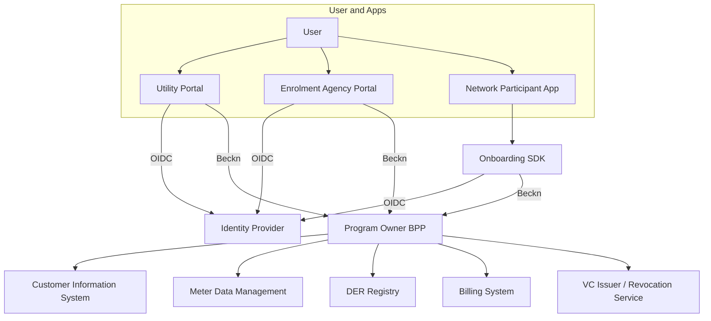
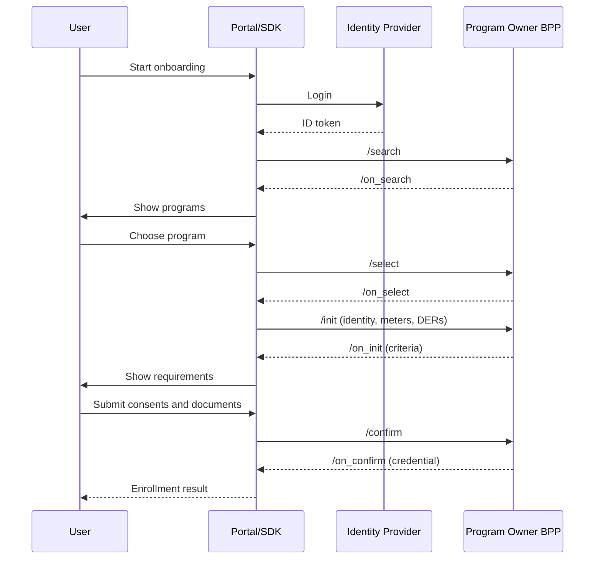
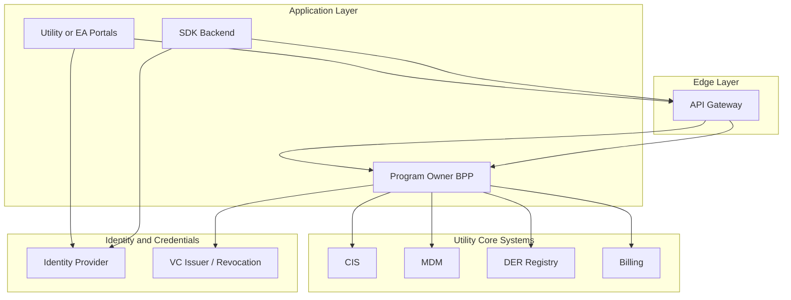
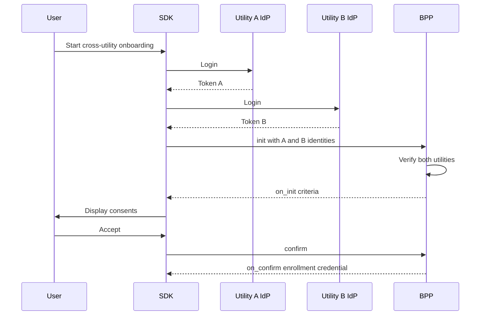

# Implementation Guide: Multi-Channel Onboarding of Users into Digital Energy Programs

Version 0.1 (Non-Normative)

---

## 1. Introduction

This Implementation Guide explains how to build and operate a multi-channel onboarding system for Digital Energy Programs such as:

* Peer-to-Peer (P2P) energy trading
* Demand flexibility or demand response
* Virtual Power Plants (VPPs)
* Community solar and other tariff or incentive programs

A successful onboarding process must confirm:

* The identity of the user
* The user’s relationship to one or more utilities
* The meters and sites associated with the user
* Any Behind-the-Meter (BTM) devices or Distributed Energy Resources (DERs)
* The user’s eligibility for a given program
* The necessary consents for data use, telemetry, or control rights

This guide provides engineering and operational recommendations to implement the multi-channel model defined in the Technical Specification.

---

## 2. Scope

This document covers:

* Engineering patterns for multi-channel onboarding
* Identity and login integration
* Meter and DER mapping
* How to use Beckn flows for onboarding
* Guidance for utility portals, Enrolment Agency portals, and SDK-based flows
* Persona-specific onboarding patterns
* Governance requirements for utilities and EAs
* Data, security, and compliance recommendations

This guide does not redefine schemas or protocol rules; those remain in the Technical Specification.

---

## 3. Terminology

Below is a consolidated terminology set used throughout this guide.

Here is the **terminology section regenerated cleanly as a table**, with no special formatting beyond what you asked for.

---

## Terminology

| Term                                   | Definition                                                                                                            |
| -------------------------------------- | --------------------------------------------------------------------------------------------------------------------- |
| User / End User                        | A person or organization participating in a digital energy program (consumer, prosumer, EV owner, business).          |
| Utility                                | An electricity provider responsible for metering, billing, and grid operations.                                       |
| Program Owner                          | The entity offering a digital energy program (P2P, Flex, VPP). Acts as the BPP in Beckn flows.                        |
| Enrolment Agency (EA)                  | A utility-certified entity authorized to onboard users, either via self-service or assisted flows.                    |
| Network Participant                    | Any Beckn-enabled application (BAP, BPP, NFO, EV app, DER app) that can trigger onboarding but is not a certified EA. |
| Network Facilitator Organization (NFO) | A neutral governance or orchestration entity in a digital energy network. Does not make eligibility decisions.        |
| National Identity                      | A government-backed identity (e.g., Social Security Number, Aadhaar, BankID, SingPass) used via federated IdPs.       |
| Utility Customer Identifier            | A unique customer or account number issued by a utility.                                                              |
| Program-Level Meter Identifier (UMID)  | A universal, utility-agnostic meter identity used across programs.                                                    |
| DER Identifier (DER-ID)                | Unique program-level identifier for a distributed energy resource.                                                    |
| Subject Identifier (subject_id)        | The unified identifier for a user across utilities, apps, and programs (often a DID or OIDC `sub`).                   |
| Meter                                  | A physical electricity meter tracking consumption, generation, or net flow.                                           |
| Behind-the-Meter (BTM) Appliance       | A device consuming or producing energy behind a user’s meter (e.g., EV charging at home).                             |
| Distributed Energy Resource (DER)      | Any distributed asset such as solar PV, EV, home batteries, V2G, or smart loads.                                      |
| EVSE                                   | Electric Vehicle Supply Equipment (charging station).                                                                 |
| Digital Energy Program                 | Any structured offering such as P2P trading, Flex, VPP, Community Solar, or special tariffs.                          |
| Program Enrollment                     | Approval for a user to join a program, issued as a Verifiable Credential.                                             |
| Eligibility Criteria                   | Conditions needed for joining a program, returned dynamically via Beckn select/init flows.                            |
| Consent                                | Authorization for data sharing, telemetry, control rights, or cross-utility interactions.                             |
| BAP (Beckn Application Platform)       | A consumer-facing Beckn application.                                                                                  |
| BPP (Beckn Provider Platform)          | A provider system responding to Beckn calls. The Program Owner serves as a BPP for onboarding.                        |
| Search / Select / Init / Confirm       | The four core Beckn workflow steps used for onboarding.                                                               |
| Context Object                         | Beckn metadata (transaction ID, timestamp, domain, signature info).                                                   |
| Utility Portal                         | User-facing portal run by a utility for onboarding.                                                                   |
| Enrolment Agency Portal                | A certified EA’s portal for onboarding users.                                                                         |
| Onboarding SDK                         | A software kit embedded inside apps to execute standardized onboarding flows.                                         |
| Network Participant Application        | Any application embedding the onboarding SDK (EV, DER, aggregator, smart home apps).                                  |
| Program Enrollment Credential          | A Verifiable Credential proving program participation.                                                                |
| Revocation List                        | Mechanism for invalidating credentials.                                                                               |
| DER Certification                      | Proof that a DER asset (solar, EVSE, etc.) is compliant and safely installed.                                         |
| Audit Trail                            | Signed, immutable record of onboarding-related actions.                                                               |
| Authorization                          | Permission to onboard users or to control DER assets.                                                                 |
| Capability                             | Functional characteristics an entity or device supports (e.g., V2G capability).                                       |


---

## 4. Implementation Principles

1. All onboarding channels must route to the same Program Owner backend.
2. Onboarding follows a consistent order:
   identity → meters → DERs → program evaluation → enrollment.
3. Eligibility criteria must be fetched dynamically from the Program Owner.
4. All telemetry, cross-utility, and DER control actions require explicit consent.
5. Beckn search/select/init/confirm flows should be reused without deviation.
6. User inputs should be minimized through auto-discovery where possible.

---

## 5. System Architecture Overview

A typical implementation includes:

* An Identity Provider (IdP)
* An Onboarding Orchestration Layer (portal or SDK backend)
* A Program Owner BPP (eligibility logic and enrollment credential issuer)
* Utility Core Systems (CIS, MDM, DER registry, billing)
* A credential issuance and verification subsystem

Architecture Diagram (Mermaid):



---

## 6. Identity and Authentication Implementation

* Use a central OIDC Identity Provider.
* Support multiple login types: national ID, utility ID, meter-based ID.
* Return consistent identity tokens with subject_id.
* Use federation when multiple utilities have separate IdPs.
* Avoid storing national identity numbers unless required by law.
* Use short-lived access tokens and HTTPS exclusively.

---

## 7. Asset Mapping and Data Integration

### Meter Discovery

Utility Portal: call CIS/MDM.
EA Portal: call a protected utility Meter API with user token.
SDK: rely on BPP’s Beckn init to resolve meter associations.

### DER Discovery

Sources include:

* Utility DER registries
* EV or OEM backends
* Inverter, battery, or smart home systems
* User declarations (with certification uploads)

### Data Integration

Typical integrations:

* CIS/CRM for customer accounts
* MDM for meter–subject relationships
* DER registry or asset database
* EV charging platforms if relevant

---

## 8. Beckn-Based Enrollment Implementation

### 8.1 Standard Beckn Flow

1. search
2. on_search
3. select
4. on_select
5. init
6. on_init
7. confirm
8. on_confirm

### 8.2 Enrollment Flow Diagram



---

## 9. Channel-Specific Implementation Guides

### 9.1 Utility Portal

* Handles authentication and orchestrates meter/DER discovery.
* Responsible for direct integration with utility’s CIS, MDM, DER registry.
* Must call BPP endpoints exactly as specified by Beckn.
* Must display eligibility criteria dynamically based on BPP responses.

### 9.2 Enrolment Agency Portal

* Redirects user to IdP; does not authenticate users directly.
* Calls BPP endpoints with EA identifier.
* Must log all actions for audit.
* Supports assisted onboarding for complex personas.

### 9.3 Network Participant App using SDK

SDK responsibilities:

* Handle login redirection
* Run Beckn flows
* Manage session and state
* Collect consent
* Relay enrollment outcome to host app

App responsibilities:

* Trigger onboarding from appropriate context
* Store only non-sensitive results
* Never bypass BPP decisions

---

## 10. Persona-Specific Implementation Guidance

### Consumer – Single Household, Single Meter

Straightforward auto-discovery; minimal input required.

### Consumer – Multiple Households, Multiple Meters

Portal must display meter–program matrix.

### Consumer – BTM Appliances via Home Meter

SDK initiated from EV or smart home app.

### Consumer – BTM Appliances via Same Utility (e.g., neighbor’s meter)

Requires two-party consent.

### Consumer/Prosumer – BTM Appliances via Different Utility

Requires cross-utility identity linking and consent.

### Prosumer – Single Rooftop Solar Meter

Requires DER certification.

### Prosumer – Multiple Meters with Solar

Multiple program enrollments required.

### Prosumer – EV with V2G

Requires control rights, telemetry consent, and device capability checks.

---

## 11. Governance and Operational Guidance

Utilities must:

* Operate or federate IdP
* Maintain accurate meter and DER registries
* Expose BPP endpoints
* Certify and monitor EAs

EAs must:

* Maintain trained staff
* Keep audit trails
* Adhere to data retention and privacy policies

Network participants must:

* Use the onboarding SDK
* Not store identity information beyond what is allowed
* Present correct program information

---

## 12. Data Models and Storage Considerations

Recommended tables:

* subjects
* subject_utility_links
* meters and meter_subject_links
* ders and der_subject_links
* program_enrollments (VC references)
* consents and consent_events
* audit_logs

Use encryption, tokenization, and strict retention schedules.

---

## 13. Security and Privacy Implementation

* Enforce mutual TLS for all service-to-service calls.
* Sign Beckn messages.
* Rotate signing keys.
* Avoid collecting identity attributes beyond what is required.
* Provide consent revocation and logging.

---

## 14. Testing, Certification and Compliance

Test categories include:

* Identity login flows
* Multi-meter and multi-site flows
* DER discovery and certification
* Cross-utility onboarding
* Beckn compliance
* VC issuance

Compliance levels range from basic consumer onboarding to V2G-capable advanced programs.

---

## 15. Deployment Topology Recommendations

Recommend:

* Separate identity, BPP, and data layers
* Use API gateway for Beckn traffic
* Deploy BPP close to CIS/MDM for low latency
* Maintain separate environments
* Use centralized logging and monitoring

Topology diagram:



---

## 16. Developer Tooling and SDK Recommendations

* SDK available for JavaScript/TypeScript, Kotlin/Java, Swift, Flutter.
* Include UI modules for consent screens.
* Provide reference apps and API collections.
* Offer sandbox environments for testing.

---

## 17. Appendix A – Sample Payloads

Example init request (shortened):

```json
{
  "context": {
    "domain": "energy.onboarding",
    "action": "init",
    "transaction_id": "txn-123"
  },
  "message": {
    "order": {
      "provider": { "id": "program-owner.example" },
      "items": [{ "id": "program-p2p-001" }],
      "fulfillments": [{
        "customer": { "id": "did:example:user-123" },
        "instrument": {
          "meters": ["umid-001"],
          "ders": ["der-ev-111"]
        }
      }]
    }
  }
}
```

---

## 18. Appendix B – Multi-Utility Interaction Patterns



---

## 19. Appendix C – Error Handling Patterns

Examples:

* METER_NOT_FOUND
* DER_NOT_CERTIFIED
* CROSS_UTILITY_CONSENT_REQUIRED
* PROGRAM_NOT_AVAILABLE
* EA_NOT_CERTIFIED

Each error must follow Beckn’s standard error object with code and message.
