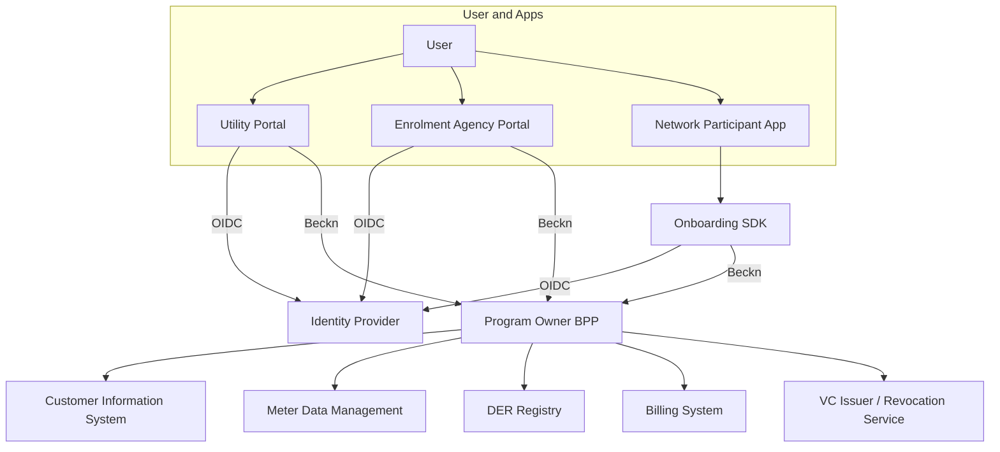
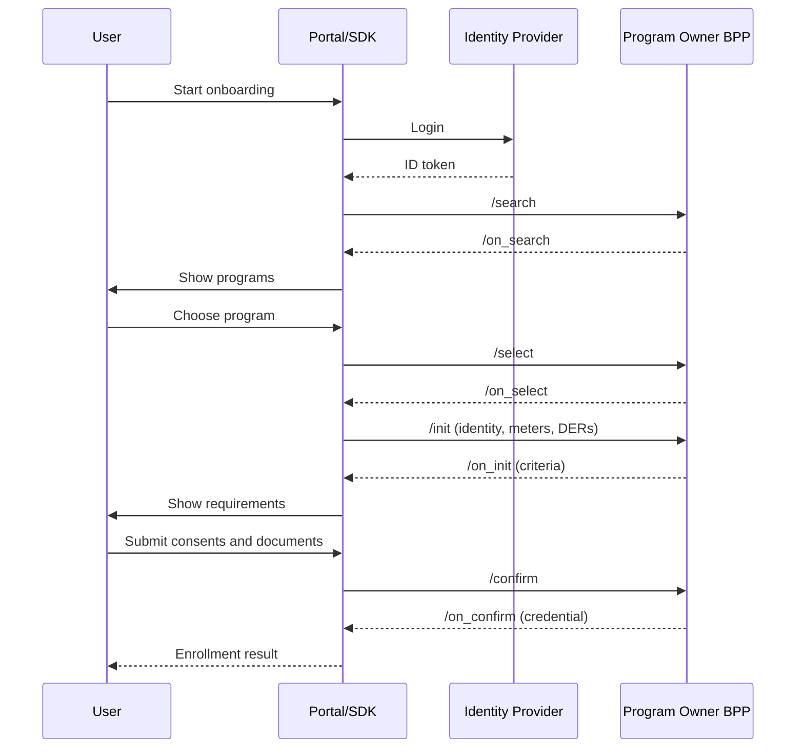
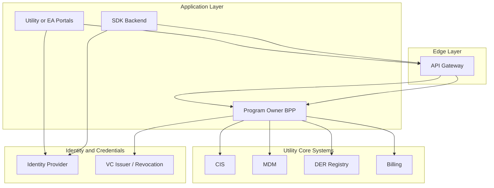
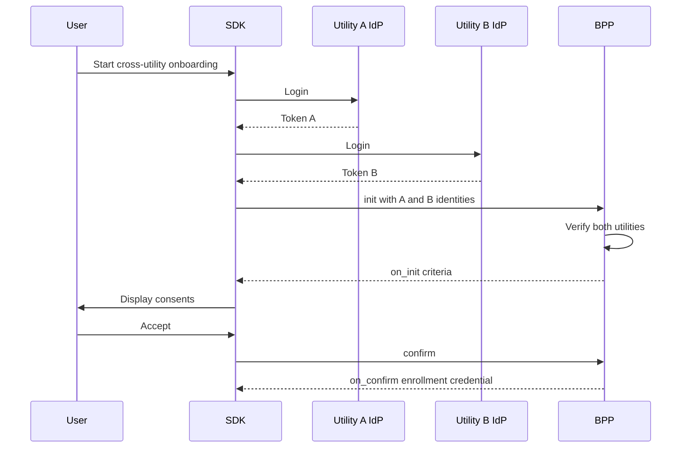

# Implementation Guide: Multi-Channel Onboarding of Users into Digital Energy Programs

Version 0.1 (Non-Normative)

---

## 1. Introduction

This Implementation Guide explains how to build and operate a multi-channel onboarding system for Digital Energy Programs such as:

* Peer-to-Peer (P2P) energy trading
* Demand flexibility or demand response
* Virtual Power Plants (VPPs)
* Community solar and other tariff or incentive programs

A successful onboarding process must confirm:

* The identity of the user
* The user’s relationship to one or more utilities
* The meters and sites associated with the user
* Any Behind-the-Meter (BTM) devices or Distributed Energy Resources (DERs)
* The user’s eligibility for a given program
* The necessary consents for data use, telemetry, or control rights

This guide provides engineering and operational recommendations to implement the multi-channel model defined in the Technical Specification.

---

## 2. Scope

This document covers:

* Engineering patterns for multi-channel onboarding
* Identity and login integration
* Meter and DER mapping
* How to use Beckn flows for onboarding
* Guidance for utility portals, Enrolment Agency portals, and SDK-based flows
* Persona-specific onboarding patterns
* Governance requirements for utilities and EAs
* Data, security, and compliance recommendations

This guide does not redefine schemas or protocol rules; those remain in the Technical Specification.

---

## 3. Terminology

Below is a consolidated terminology set used throughout this guide.

Here is the **terminology section regenerated cleanly as a table**, with no special formatting beyond what you asked for.

---

## Terminology

| Term                                   | Definition                                                                                                            |
| -------------------------------------- | --------------------------------------------------------------------------------------------------------------------- |
| User / End User                        | A person or organization participating in a digital energy program (consumer, prosumer, EV owner, business).          |
| Utility                                | An electricity provider responsible for metering, billing, and grid operations.                                       |
| Program Owner                          | The entity offering a digital energy program (P2P, Flex, VPP). Acts as the BPP in Beckn flows.                        |
| Enrolment Agency (EA)                  | A utility-certified entity authorized to onboard users, either via self-service or assisted flows.                    |
| Network Participant                    | Any Beckn-enabled application (BAP, BPP, NFO, EV app, DER app) that can trigger onboarding but is not a certified EA. |
| Network Facilitator Organization (NFO) | A neutral governance or orchestration entity in a digital energy network. Does not make eligibility decisions.        |
| National Identity                      | A government-backed identity (e.g., Social Security Number, Aadhaar, BankID, SingPass) used via federated IdPs.       |
| Utility Customer Identifier            | A unique customer or account number issued by a utility.                                                              |
| Program-Level Meter Identifier (UMID)  | A universal, utility-agnostic meter identity used across programs.                                                    |
| DER Identifier (DER-ID)                | Unique program-level identifier for a distributed energy resource.                                                    |
| Subject Identifier (subject_id)        | The unified identifier for a user across utilities, apps, and programs (often a DID or OIDC `sub`).                   |
| Meter                                  | A physical electricity meter tracking consumption, generation, or net flow.                                           |
| Behind-the-Meter (BTM) Appliance       | A device consuming or producing energy behind a user’s meter (e.g., EV charging at home).                             |
| Distributed Energy Resource (DER)      | Any distributed asset such as solar PV, EV, home batteries, V2G, or smart loads.                                      |
| EVSE                                   | Electric Vehicle Supply Equipment (charging station).                                                                 |
| Digital Energy Program                 | Any structured offering such as P2P trading, Flex, VPP, Community Solar, or special tariffs.                          |
| Program Enrollment                     | Approval for a user to join a program, issued as a Verifiable Credential.                                             |
| Eligibility Criteria                   | Conditions needed for joining a program, returned dynamically via Beckn select/init flows.                            |
| Consent                                | Authorization for data sharing, telemetry, control rights, or cross-utility interactions.                             |
| BAP (Beckn Application Platform)       | A consumer-facing Beckn application.                                                                                  |
| BPP (Beckn Provider Platform)          | A provider system responding to Beckn calls. The Program Owner serves as a BPP for onboarding.                        |
| Search / Select / Init / Confirm       | The four core Beckn workflow steps used for onboarding.                                                               |
| Context Object                         | Beckn metadata (transaction ID, timestamp, domain, signature info).                                                   |
| Utility Portal                         | User-facing portal run by a utility for onboarding.                                                                   |
| Enrolment Agency Portal                | A certified EA’s portal for onboarding users.                                                                         |
| Onboarding SDK                         | A software kit embedded inside apps to execute standardized onboarding flows.                                         |
| Network Participant Application        | Any application embedding the onboarding SDK (EV, DER, aggregator, smart home apps).                                  |
| Program Enrollment Credential          | A Verifiable Credential proving program participation.                                                                |
| Revocation List                        | Mechanism for invalidating credentials.                                                                               |
| DER Certification                      | Proof that a DER asset (solar, EVSE, etc.) is compliant and safely installed.                                         |
| Audit Trail                            | Signed, immutable record of onboarding-related actions.                                                               |
| Authorization                          | Permission to onboard users or to control DER assets.                                                                 |
| Capability                             | Functional characteristics an entity or device supports (e.g., V2G capability).                                       |


---

## 4. Implementation Principles

1. All onboarding channels must route to the same Program Owner backend.
2. Onboarding follows a consistent order:
   identity → meters → DERs → program evaluation → enrollment.
3. Eligibility criteria must be fetched dynamically from the Program Owner.
4. All telemetry, cross-utility, and DER control actions require explicit consent.
5. Beckn search/select/init/confirm flows should be reused without deviation.
6. User inputs should be minimized through auto-discovery where possible.

---

## 5. System Architecture Overview

A typical implementation includes:

* An Identity Provider (IdP)
* An Onboarding Orchestration Layer (portal or SDK backend)
* A Program Owner BPP (eligibility logic and enrollment credential issuer)
* Utility Core Systems (CIS, MDM, DER registry, billing)
* A credential issuance and verification subsystem

Architecture Diagram (Mermaid):



---

## 6. Identity and Authentication Implementation

* Use a central OIDC Identity Provider.
* Support multiple login types: national ID, utility ID, meter-based ID.
* Return consistent identity tokens with subject_id.
* Use federation when multiple utilities have separate IdPs.
* Avoid storing national identity numbers unless required by law.
* Use short-lived access tokens and HTTPS exclusively.

---

## 7. Asset Mapping and Data Integration

### Meter Discovery

Utility Portal: call CIS/MDM.
EA Portal: call a protected utility Meter API with user token.
SDK: rely on BPP’s Beckn init to resolve meter associations.

### DER Discovery

Sources include:

* Utility DER registries
* EV or OEM backends
* Inverter, battery, or smart home systems
* User declarations (with certification uploads)

### Data Integration

Typical integrations:

* CIS/CRM for customer accounts
* MDM for meter–subject relationships
* DER registry or asset database
* EV charging platforms if relevant

---

## 8. Beckn-Based Enrollment Implementation

### 8.1 Standard Beckn Flow

1. search
2. on_search
3. select
4. on_select
5. init
6. on_init
7. confirm
8. on_confirm

### 8.2 Enrollment Flow Diagram



---

## 9. Channel-Specific Implementation Guides

### 9.1 Utility Portal

* Handles authentication and orchestrates meter/DER discovery.
* Responsible for direct integration with utility’s CIS, MDM, DER registry.
* Must call BPP endpoints exactly as specified by Beckn.
* Must display eligibility criteria dynamically based on BPP responses.

### 9.2 Enrolment Agency Portal

* Redirects user to IdP; does not authenticate users directly.
* Calls BPP endpoints with EA identifier.
* Must log all actions for audit.
* Supports assisted onboarding for complex personas.

### 9.3 Network Participant App using SDK

SDK responsibilities:

* Handle login redirection
* Run Beckn flows
* Manage session and state
* Collect consent
* Relay enrollment outcome to host app

App responsibilities:

* Trigger onboarding from appropriate context
* Store only non-sensitive results
* Never bypass BPP decisions

---

## 10. Persona-Specific Implementation Guidance

### Consumer – Single Household, Single Meter

Straightforward auto-discovery; minimal input required.

### Consumer – Multiple Households, Multiple Meters

Portal must display meter–program matrix.

### Consumer – BTM Appliances via Home Meter

SDK initiated from EV or smart home app.

### Consumer – BTM Appliances via Same Utility (e.g., neighbor’s meter)

Requires two-party consent.

### Consumer/Prosumer – BTM Appliances via Different Utility

Requires cross-utility identity linking and consent.

### Prosumer – Single Rooftop Solar Meter

Requires DER certification.

### Prosumer – Multiple Meters with Solar

Multiple program enrollments required.

### Prosumer – EV with V2G

Requires control rights, telemetry consent, and device capability checks.

---

## 11. Governance and Operational Guidance

Utilities must:

* Operate or federate IdP
* Maintain accurate meter and DER registries
* Expose BPP endpoints
* Certify and monitor EAs

EAs must:

* Maintain trained staff
* Keep audit trails
* Adhere to data retention and privacy policies

Network participants must:

* Use the onboarding SDK
* Not store identity information beyond what is allowed
* Present correct program information

---

## 12. Data Models and Storage Considerations

Recommended tables:

* subjects
* subject_utility_links
* meters and meter_subject_links
* ders and der_subject_links
* program_enrollments (VC references)
* consents and consent_events
* audit_logs

Use encryption, tokenization, and strict retention schedules.

---

## 13. Security and Privacy Implementation

* Enforce mutual TLS for all service-to-service calls.
* Sign Beckn messages.
* Rotate signing keys.
* Avoid collecting identity attributes beyond what is required.
* Provide consent revocation and logging.

---

## 14. Testing, Certification and Compliance

Test categories include:

* Identity login flows
* Multi-meter and multi-site flows
* DER discovery and certification
* Cross-utility onboarding
* Beckn compliance
* VC issuance

Compliance levels range from basic consumer onboarding to V2G-capable advanced programs.

---

## 15. Deployment Topology Recommendations

Recommend:

* Separate identity, BPP, and data layers
* Use API gateway for Beckn traffic
* Deploy BPP close to CIS/MDM for low latency
* Maintain separate environments
* Use centralized logging and monitoring

Topology diagram:



---

## 16. Developer Tooling and SDK Recommendations

* SDK available for JavaScript/TypeScript, Kotlin/Java, Swift, Flutter.
* Include UI modules for consent screens.
* Provide reference apps and API collections.
* Offer sandbox environments for testing.

---

## 17. Appendix A – Sample Payloads

### 17.1 Init Request

The init request includes Verifiable Credentials (VCs) provided by the calling entity (Portal/BAP) that prove meter ownership, program eligibility, and DER certifications. The BPP verifies these credentials and checks for conflicts with existing enrollments.

#### Example: Simple Consumer with Single Meter

<details>
<summary><a href="../../../../examples/v2/enrollment/init-request-simple-consumer.json">Example json :rocket:</a></summary>

```json
{
  "context": {
    "version": "2.0.0",
    "action": "init",
    "domain": "energy.enrollment",
    "timestamp": "2024-10-15T10:30:00Z",
    "message_id": "msg-init-consumer-001",
    "transaction_id": "txn-onboard-consumer-001",
    "bap_id": "utility-portal.example.com",
    "bap_uri": "https://utility-portal.example.com/beckn",
    "bpp_id": "vpp-program-owner.example.com",
    "bpp_uri": "https://vpp-program-owner.example.com/beckn",
    "ttl": "PT30S"
  },
  "message": {
    "order": {
      "@context": "https://raw.githubusercontent.com/beckn/protocol-specifications-new/refs/heads/p2p-trading/schema/EnergyEnrollment/v0.2/context.jsonld",
      "@type": "beckn:Order",
      "beckn:id": "order-onboard-consumer-001",
      "beckn:provider": {
        "beckn:id": "vpp-program-flex-001",
        "beckn:descriptor": {
          "schema:name": "Demand Flexibility Program"
        }
      },
      "beckn:items": [
        {
          "beckn:id": "program-flex-demand-response-001"
        }
      ],
      "beckn:fulfillments": [
        {
          "beckn:id": "fulfillment-onboard-001",
          "beckn:type": "PROGRAM_ENROLLMENT",
          "beckn:customer": {
            "beckn:id": "did:example:user-12345",
            "beckn:person": {
              "schema:name": "Rajesh Kumar",
              "schema:email": "rajesh.kumar@example.com"
            }
          },
          "beckn:instrument": {
            "meters": [
              {
                "beckn:id": "umid-001",
                "beckn:utilityId": "utility-example-001",
                "beckn:utilityCustomerId": "CUST-123456"
              }
            ],
            "ders": []
          },
          "beckn:fulfillmentAttributes": {
            "@context": "https://raw.githubusercontent.com/beckn/protocol-specifications-new/refs/heads/p2p-trading/schema/EnergyEnrollment/v0.2/context.jsonld",
            "@type": "EnergyEnrollment",
            "credentials": [
              {
                "credentialId": "vc-meter-ownership-001",
                "type": "MeterOwnershipCredential",
                "format": "VC-JWT",
                "credentialData": "eyJhbGciOiJSUzI1NiIsInR5cCI6IkpXVCJ9.eyJ2YyI6eyJAY29udGV4dCI6WyJodHRwczovL3d3dy53My5vcmcvMjAxOC9jcmVkZW50aWFscy92MSJdLCJ0eXBlIjpbIlZlcmlmaWFibGVDcmVkZW50aWFsIiwiTWV0ZXJPd25lcnNoaXBDcmVkZW50aWFsIl0sImNyZWRlbnRpYWxTdWJqZWN0Ijp7ImlkIjoiZGlkOmV4YW1wbGU6dXNlci0xMjM0NSIsIm1ldGVySWQiOiJ1bWlkLTAwMSIsInV0aWxpdHlJZCI6InV0aWxpdHktZXhhbXBsZS0wMDEiLCJvd25lcnNoaXBTdGF0dXMiOiJPV05FUiIsInZhbGlkRnJvbSI6IjIwMjQtMDEtMDFUMDA6MDA6MDBaIiwidmFsaWRVbnRpbCI6IjIwMjUtMTItMzFUMjM6NTk6NTlaIn19LCJpc3MiOiJkaWQ6ZXhhbXBsZTp1dGlsaXR5LWNyZWRlbnRpYWwtaXNzdWVyIiwiaWF0IjoxNzA0MDY3MjAwfQ.signature",
                "verificationUrl": "https://utility-example-001.com/verify/vc-meter-ownership-001"
              },
              {
                "credentialId": "vc-program-eligibility-001",
                "type": "ProgramEligibilityCredential",
                "format": "VC-JWT",
                "credentialData": "eyJhbGciOiJSUzI1NiIsInR5cCI6IkpXVCJ9.eyJ2YyI6eyJAY29udGV4dCI6WyJodHRwczovL3d3dy53My5vcmcvMjAxOC9jcmVkZW50aWFscy92MSJdLCJ0eXBlIjpbIlZlcmlmaWFibGVDcmVkZW50aWFsIiwiUHJvZ3JhbUVsaWdpYmlsaXR5Q3JlZGVudGlhbCJdLCJjcmVkZW50aWFsU3ViamVjdCI6eyJpZCI6ImRpZDpleGFtcGxlOnVzZXItMTIzNDUiLCJwcm9ncmFtSWQiOiJwcm9ncmFtLWZsZXgtZGVtYW5kLXJlc3BvbnNlLTAwMSIsImVsaWdpYmlsaXR5U3RhdHVzIjoiRUxJR0lCTEUiLCJjcml0ZXJpYU1ldCI6WyJBQ0NPVU5UX1NUQU5ESU5HIiwiR0VPR1JBUEhJQ19FTElHSUJJTElUWSIsIk1FVEVSX1RZUEUiXX19LCJpc3MiOiJkaWQ6ZXhhbXBsZTpwcm9ncmFtLWNyZWRlbnRpYWwtaXNzdWVyIiwiaWF0IjoxNzA0MDY3MjAwfQ.signature",
                "verificationUrl": "https://vpp-program-owner.example.com/verify/vc-program-eligibility-001"
              }
            ],
            "existingEnrollments": [
              {
                "credentialId": "vc:enrollment:existing-001",
                "type": "ProgramEnrollmentCredential",
                "format": "VC-JWT",
                "credentialData": "eyJhbGciOiJSUzI1NiIsInR5cCI6IkpXVCJ9.eyJ2YyI6eyJjcmVkZW50aWFsU3ViamVjdCI6eyJpZCI6ImRpZDpleGFtcGxlOnVzZXItMTIzNDUiLCJlbnJvbGxtZW50SWQiOiJlbnJvbGxtZW50LWV4aXN0aW5nLTAwMSIsInByb2dyYW1JZCI6InByb2dyYW0tZmxleC1vdGhlci0wMDEiLCJtZXRlcnMiOlsidW1pZC0wMDIiXSwic3RhdHVzIjoiQUNUSVZFIiwic3RhcnREYXRlIjoiMjAyNC0wOS0wMVQwMDowMDowMFoiLCJlbmREYXRlIjoiMjAyNS0wOS0wMVQwMDowMDowMFoifX19.signature"
              }
            ]
          }
        }
      ]
    }
  }
}

```
</details>

**Key Fields**:
- `fulfillment.fulfillmentAttributes.credentials[]`: Array of VCs proving meter ownership, program eligibility, etc.
- `fulfillment.fulfillmentAttributes.existingEnrollments[]`: Array of existing enrollment credentials for conflict checking
- BPP verifies these credentials and checks for conflicts

#### Example: Prosumer with Solar and Battery

<details>
<summary><a href="../../../../examples/v2/enrollment/init-request-prosumer-solar-battery.json">Example json :rocket:</a></summary>

```json
{
  "context": {
    "version": "2.0.0",
    "action": "init",
    "domain": "energy.enrollment",
    "timestamp": "2024-10-15T11:00:00Z",
    "message_id": "msg-init-prosumer-001",
    "transaction_id": "txn-onboard-prosumer-001",
    "bap_id": "ea-portal.example.com",
    "bap_uri": "https://ea-portal.example.com/beckn",
    "bpp_id": "vpp-program-owner.example.com",
    "bpp_uri": "https://vpp-program-owner.example.com/beckn",
    "ttl": "PT30S"
  },
  "message": {
    "order": {
      "@context": "https://raw.githubusercontent.com/beckn/protocol-specifications-new/refs/heads/p2p-trading/schema/EnergyEnrollment/v0.2/context.jsonld",
      "@type": "beckn:Order",
      "beckn:id": "order-onboard-prosumer-001",
      "beckn:provider": {
        "beckn:id": "vpp-program-p2p-001"
      },
      "beckn:items": [
        {
          "beckn:id": "program-vpp-p2p-001"
        }
      ],
      "beckn:fulfillments": [
        {
          "beckn:id": "fulfillment-onboard-prosumer-001",
          "beckn:type": "PROGRAM_ENROLLMENT",
          "beckn:customer": {
            "beckn:id": "did:example:prosumer-789"
          },
          "beckn:instrument": {
            "meters": [
              {
                "beckn:id": "umid-002",
                "beckn:utilityId": "utility-example-001"
              }
            ],
            "ders": [
              {
                "beckn:id": "der-solar-001",
                "beckn:type": "SOLAR_PV",
                "beckn:capacity": {
                  "value": 10.0,
                  "unit": "kW"
                }
              },
              {
                "beckn:id": "der-battery-001",
                "beckn:type": "BATTERY_STORAGE",
                "beckn:capacity": {
                  "value": 15.0,
                  "unit": "kWh"
                }
              }
            ]
          },
          "beckn:fulfillmentAttributes": {
            "@context": "https://raw.githubusercontent.com/beckn/protocol-specifications-new/refs/heads/p2p-trading/schema/EnergyEnrollment/v0.2/context.jsonld",
            "@type": "EnergyEnrollment",
            "credentials": [
              {
                "credentialId": "vc-meter-ownership-002",
                "type": "MeterOwnershipCredential",
                "format": "VC-JWT",
                "credentialData": "eyJhbGciOiJSUzI1NiIsInR5cCI6IkpXVCJ9..."
              },
              {
                "credentialId": "vc-program-eligibility-002",
                "type": "ProgramEligibilityCredential",
                "format": "VC-JWT",
                "credentialData": "eyJhbGciOiJSUzI1NiIsInR5cCI6IkpXVCJ9..."
              },
              {
                "credentialId": "vc-der-cert-solar-001",
                "type": "DERCertificationCredential",
                "format": "VC-JWT",
                "credentialData": "eyJhbGciOiJSUzI1NiIsInR5cCI6IkpXVCJ9...",
                "derId": "der-solar-001"
              },
              {
                "credentialId": "vc-der-cert-battery-001",
                "type": "DERCertificationCredential",
                "format": "VC-JWT",
                "credentialData": "eyJhbGciOiJSUzI1NiIsInR5cCI6IkpXVCJ9...",
                "derId": "der-battery-001"
              }
            ],
            "existingEnrollments": []
          }
        }
      ]
    }
  }
}

```
</details>

### 17.2 On_Init Response

The BPP verifies the provided credentials and checks for conflicts with existing enrollments. It returns either a rejection (with error) or proceeds to confirm.

#### Example: Successful Verification, No Conflicts

<details>
<summary><a href="../../../../examples/v2/enrollment/on-init-response-success.json">Example json :rocket:</a></summary>

```json
{
  "context": {
    "version": "2.0.0",
    "action": "on_init",
    "domain": "energy.enrollment",
    "timestamp": "2024-10-15T10:30:05Z",
    "message_id": "msg-on-init-consumer-001",
    "transaction_id": "txn-onboard-consumer-001",
    "bap_id": "utility-portal.example.com",
    "bap_uri": "https://utility-portal.example.com/beckn",
    "bpp_id": "vpp-program-owner.example.com",
    "bpp_uri": "https://vpp-program-owner.example.com/beckn",
    "ttl": "PT30S"
  },
  "message": {
    "order": {
      "@context": "https://raw.githubusercontent.com/beckn/protocol-specifications-new/refs/heads/p2p-trading/schema/EnergyEnrollment/v0.2/context.jsonld",
      "@type": "beckn:Order",
      "beckn:id": "order-onboard-consumer-001",
      "beckn:status": "PENDING",
      "beckn:provider": {
        "beckn:id": "vpp-program-flex-001"
      },
      "beckn:items": [
        {
          "beckn:id": "program-flex-demand-response-001"
        }
      ],
      "beckn:fulfillments": [
        {
          "beckn:id": "fulfillment-onboard-001",
          "beckn:type": "PROGRAM_ENROLLMENT",
          "beckn:state": {
            "beckn:descriptor": {
              "schema:name": "PENDING_CONFIRM"
            }
          },
          "beckn:customer": {
            "beckn:id": "did:example:user-12345"
          },
          "beckn:instrument": {
            "meters": [
              {
                "beckn:id": "umid-001",
                "beckn:credentialVerified": true
              }
            ],
            "ders": []
          }
        }
      ],
      "beckn:orderAttributes": {
        "@context": "https://raw.githubusercontent.com/beckn/protocol-specifications-new/refs/heads/p2p-trading/schema/EnergyEnrollment/v0.2/context.jsonld",
        "@type": "EnergyEnrollment",
        "credentialVerification": {
          "status": "VERIFIED",
          "verifiedCredentials": [
            {
              "credentialId": "vc-meter-ownership-001",
              "status": "VERIFIED",
              "verifiedAt": "2024-10-15T10:30:05Z"
            },
            {
              "credentialId": "vc-program-eligibility-001",
              "status": "VERIFIED",
              "verifiedAt": "2024-10-15T10:30:05Z"
            }
          ]
        },
        "conflictCheck": {
          "hasConflict": false,
          "checkedAt": "2024-10-15T10:30:05Z",
          "message": "No conflicts found with existing enrollments"
        }
      }
    }
  }
}

```
</details>

#### Example: Enrollment Conflict Detected

<details>
<summary><a href="../../../../examples/v2/enrollment/on-init-response-conflict.json">Example json :rocket:</a></summary>

```json
{
  "context": {
    "version": "2.0.0",
    "action": "on_init",
    "domain": "energy.enrollment",
    "timestamp": "2024-10-15T10:30:05Z",
    "message_id": "msg-on-init-conflict-001",
    "transaction_id": "txn-onboard-conflict-001",
    "bap_id": "utility-portal.example.com",
    "bap_uri": "https://utility-portal.example.com/beckn",
    "bpp_id": "vpp-program-owner.example.com",
    "bpp_uri": "https://vpp-program-owner.example.com/beckn",
    "ttl": "PT30S"
  },
  "message": {
    "order": {
      "@context": "https://raw.githubusercontent.com/beckn/protocol-specifications-new/refs/heads/p2p-trading/schema/EnergyEnrollment/v0.2/context.jsonld",
      "@type": "beckn:Order",
      "beckn:id": "order-onboard-conflict-001",
      "beckn:status": "REJECTED",
      "beckn:provider": {
        "beckn:id": "vpp-program-flex-001"
      },
      "beckn:items": [
        {
          "beckn:id": "program-flex-demand-response-001"
        }
      ],
      "beckn:fulfillments": [
        {
          "beckn:id": "fulfillment-onboard-conflict-001",
          "beckn:type": "PROGRAM_ENROLLMENT",
          "beckn:state": {
            "beckn:descriptor": {
              "schema:name": "REJECTED"
            }
          }
        }
      ],
      "beckn:orderAttributes": {
        "@context": "https://raw.githubusercontent.com/beckn/protocol-specifications-new/refs/heads/p2p-trading/schema/EnergyEnrollment/v0.2/context.jsonld",
        "@type": "EnergyEnrollment",
        "credentialVerification": {
          "status": "VERIFIED"
        },
        "conflictCheck": {
          "hasConflict": true,
          "conflictingEnrollments": [
            {
              "enrollmentId": "enrollment-existing-001",
              "programId": "program-flex-other-001",
              "conflictReason": "Meter umid-001 is already enrolled in program-flex-other-001 from 2024-09-01 to 2025-09-01",
              "conflictType": "METER_ALREADY_ENROLLED"
            }
          ],
          "checkedAt": "2024-10-15T10:30:05Z"
        }
      },
      "error": {
        "type": "ENROLLMENT_ERROR",
        "code": "ENROLLMENT_CONFLICT",
        "message": "Enrollment conflicts with existing enrollment. Meter umid-001 is already enrolled in another program.",
        "path": "message.order.orderAttributes.conflictCheck",
        "details": {
          "conflictingEnrollmentId": "enrollment-existing-001",
          "conflictEndDate": "2025-09-01T00:00:00Z"
        }
      }
    }
  }
}

```
</details>

### 17.3 Confirm Request

The confirm request includes the desired enrollment start and end dates, along with any required consents.

#### Example: Confirm with Enrollment Dates

<details>
<summary><a href="../../../../examples/v2/enrollment/confirm-request.json">Example json :rocket:</a></summary>

```json
{
  "context": {
    "version": "2.0.0",
    "action": "confirm",
    "domain": "energy.enrollment",
    "timestamp": "2024-10-15T10:35:00Z",
    "message_id": "msg-confirm-consumer-001",
    "transaction_id": "txn-onboard-consumer-001",
    "bap_id": "utility-portal.example.com",
    "bap_uri": "https://utility-portal.example.com/beckn",
    "bpp_id": "vpp-program-owner.example.com",
    "bpp_uri": "https://vpp-program-owner.example.com/beckn",
    "ttl": "PT30S"
  },
  "message": {
    "order": {
      "@context": "https://raw.githubusercontent.com/beckn/protocol-specifications-new/refs/heads/p2p-trading/schema/EnergyEnrollment/v0.2/context.jsonld",
      "@type": "beckn:Order",
      "beckn:id": "order-onboard-consumer-001",
      "beckn:provider": {
        "beckn:id": "vpp-program-flex-001"
      },
      "beckn:items": [
        {
          "beckn:id": "program-flex-demand-response-001"
        }
      ],
      "beckn:fulfillments": [
        {
          "beckn:id": "fulfillment-onboard-001",
          "beckn:type": "PROGRAM_ENROLLMENT",
          "beckn:customer": {
            "beckn:id": "did:example:user-12345"
          },
          "beckn:instrument": {
            "meters": [
              {
                "beckn:id": "umid-001"
              }
            ],
            "ders": []
          }
        }
      ],
      "beckn:orderAttributes": {
        "@context": "https://raw.githubusercontent.com/beckn/protocol-specifications-new/refs/heads/p2p-trading/schema/EnergyEnrollment/v0.2/context.jsonld",
        "@type": "EnergyEnrollment",
        "startDate": "2024-11-01T00:00:00Z",
        "endDate": "2025-10-31T23:59:59Z"
      }
    }
  }
}

```
</details>

### 17.4 On_Confirm Response

The BPP returns a signed enrollment credential with start and end dates, and logs the enrollment.

#### Example: Successful Enrollment with Credential

<details>
<summary><a href="../../../../examples/v2/enrollment/on-confirm-response-success.json">Example json :rocket:</a></summary>

```json
{
  "context": {
    "version": "2.0.0",
    "action": "on_confirm",
    "domain": "energy.enrollment",
    "timestamp": "2024-10-15T10:35:05Z",
    "message_id": "msg-on-confirm-consumer-001",
    "transaction_id": "txn-onboard-consumer-001",
    "bap_id": "utility-portal.example.com",
    "bap_uri": "https://utility-portal.example.com/beckn",
    "bpp_id": "vpp-program-owner.example.com",
    "bpp_uri": "https://vpp-program-owner.example.com/beckn",
    "ttl": "PT30S"
  },
  "message": {
    "order": {
      "@context": "https://raw.githubusercontent.com/beckn/protocol-specifications-new/refs/heads/p2p-trading/schema/EnergyEnrollment/v0.2/context.jsonld",
      "@type": "beckn:Order",
      "beckn:id": "order-onboard-consumer-001",
      "beckn:status": "CONFIRMED",
      "beckn:orderNumber": "ENR-2024-001234",
      "beckn:provider": {
        "beckn:id": "vpp-program-flex-001"
      },
      "beckn:items": [
        {
          "beckn:id": "program-flex-demand-response-001"
        }
      ],
      "beckn:fulfillments": [
        {
          "beckn:id": "fulfillment-onboard-001",
          "beckn:type": "PROGRAM_ENROLLMENT",
          "beckn:state": {
            "beckn:descriptor": {
              "schema:name": "ENROLLED"
            }
          },
          "beckn:customer": {
            "beckn:id": "did:example:user-12345"
          },
          "beckn:instrument": {
            "meters": [
              {
                "beckn:id": "umid-001",
                "beckn:enrollmentStatus": "ENROLLED"
              }
            ],
            "ders": []
          }
        }
      ],
      "beckn:orderAttributes": {
        "@context": "https://raw.githubusercontent.com/beckn/protocol-specifications-new/refs/heads/p2p-trading/schema/EnergyEnrollment/v0.2/context.jsonld",
        "@type": "EnergyEnrollment",
        "enrollmentId": "enrollment-consumer-001",
        "status": "ACTIVE",
        "programId": "program-flex-demand-response-001",
        "startDate": "2024-11-01T00:00:00Z",
        "endDate": "2025-10-31T23:59:59Z",
        "enrolledAt": "2024-10-15T10:35:05Z",
        "credential": {
          "credentialId": "vc:enrollment:consumer-001",
          "type": "ProgramEnrollmentCredential",
          "format": "VC-JWT",
          "credentialUrl": "https://vpp-program-owner.example.com/credentials/vc:enrollment:consumer-001",
          "verificationUrl": "https://vpp-program-owner.example.com/verify/vc:enrollment:consumer-001",
          "issuedAt": "2024-10-15T10:35:05Z",
          "credentialData": "eyJhbGciOiJSUzI1NiIsInR5cCI6IkpXVCJ9.eyJ2YyI6eyJAY29udGV4dCI6WyJodHRwczovL3d3dy53My5vcmcvMjAxOC9jcmVkZW50aWFscy92MSJdLCJ0eXBlIjpbIlZlcmlmaWFibGVDcmVkZW50aWFsIiwiUHJvZ3JhbUVucm9sbG1lbnRDcmVkZW50aWFsIl0sImNyZWRlbnRpYWxTdWJqZWN0Ijp7ImlkIjoiZGlkOmV4YW1wbGU6dXNlci0xMjM0NSIsImVucm9sbG1lbnRJZCI6ImVucm9sbG1lbnQtY29uc3VtZXItMDAxIiwicHJvZ3JhbUlkIjoicHJvZ3JhbS1mbGV4LWRlbWFuZC1yZXNwb25zZS0wMDEiLCJtZXRlcnMiOlsidW1pZC0wMDEiXSwic3RhdHVzIjoiQUNUSVZFIiwic3RhcnREYXRlIjoiMjAyNC0xMS0wMVQwMDowMDowMFoiLCJlbmREYXRlIjoiMjAyNS0xMC0zMVQyMzo1OTo1OVoifSwiaXNzdWFuY2VEYXRlIjoiMjAyNC0xMC0xNVQxMDozNTowNVoiLCJleHBpcmF0aW9uRGF0ZSI6IjIwMjUtMTAtMzFUMjM6NTk6NTlaIn0sImlzcyI6ImRpZDpleGFtcGxlOnZwcC1wcm9ncmFtLW93bmVyIiwiaWF0IjoxNzI5MDk3NzA1fQ.signature"
        },
        "loggedAt": "2024-10-15T10:35:05Z",
        "logReference": "log-enrollment-consumer-001"
      }
    }
  }
}

```
</details>

**Key Fields**:
- `orderAttributes.startDate`: When enrollment becomes active
- `orderAttributes.endDate`: When enrollment expires
- `orderAttributes.credential`: Signed Verifiable Credential proving enrollment
- `orderAttributes.loggedAt`: Timestamp when enrollment was logged
- `orderAttributes.logReference`: Reference to enrollment log entry

### 17.5 Error Response Example

#### Example: Credential Verification Failed

<details>
<summary><a href="../../../../examples/v2/enrollment/on-init-response-error.json">Example json :rocket:</a></summary>

```json
{
  "context": {
    "version": "2.0.0",
    "action": "on_init",
    "domain": "energy.enrollment",
    "timestamp": "2024-10-15T10:30:05Z",
    "message_id": "msg-on-init-error-001",
    "transaction_id": "txn-onboard-error-001",
    "bap_id": "utility-portal.example.com",
    "bap_uri": "https://utility-portal.example.com/beckn",
    "bpp_id": "vpp-program-owner.example.com",
    "bpp_uri": "https://vpp-program-owner.example.com/beckn",
    "ttl": "PT30S"
  },
  "message": {
    "order": {
      "@context": "https://raw.githubusercontent.com/beckn/protocol-specifications-new/refs/heads/p2p-trading/schema/EnergyEnrollment/v0.2/context.jsonld",
      "@type": "beckn:Order",
      "beckn:id": "order-onboard-error-001",
      "beckn:status": "REJECTED",
      "error": {
        "type": "CREDENTIAL_ERROR",
        "code": "CREDENTIAL_VERIFICATION_FAILED",
        "message": "Meter ownership credential could not be verified",
        "path": "message.order.fulfillments[0].fulfillmentAttributes.credentials[0]",
        "details": {
          "credentialId": "vc-meter-ownership-001",
          "reason": "Invalid signature or expired credential"
        }
      }
    }
  }
}

```
</details>

**Note**: For vocabulary definitions of new terms and slotted attributes, see `outputs_onboarding_guide/Vocabulary_Definitions.md`.

### 17.6 Consent Revocation

Users can revoke consent at any time after enrollment. The revocation uses the Beckn `update` action and updates the W3C VC status list to mark the consent credential as revoked.

#### Example: Consent Revocation Request

<details>
<summary><a href="../../../../examples/v2/enrollment/update-request-consent-revocation.json">Example json :rocket:</a></summary>

```json
{
  "context": {
    "version": "2.0.0",
    "action": "update",
    "domain": "energy.enrollment",
    "timestamp": "2024-11-20T14:30:00Z",
    "message_id": "msg-update-consent-revoke-001",
    "transaction_id": "txn-revoke-consent-001",
    "bap_id": "utility-portal.example.com",
    "bap_uri": "https://utility-portal.example.com/beckn",
    "bpp_id": "vpp-program-owner.example.com",
    "bpp_uri": "https://vpp-program-owner.example.com/beckn",
    "ttl": "PT30S"
  },
  "message": {
    "order": {
      "@context": "https://raw.githubusercontent.com/beckn/protocol-specifications-new/refs/heads/p2p-trading/schema/EnergyEnrollment/v0.2/context.jsonld",
      "@type": "beckn:Order",
      "beckn:id": "order-onboard-consumer-001",
      "beckn:provider": {
        "beckn:id": "vpp-program-flex-001"
      },
      "beckn:items": [
        {
          "beckn:id": "program-flex-demand-response-001"
        }
      ],
      "beckn:orderAttributes": {
        "@context": "https://raw.githubusercontent.com/beckn/protocol-specifications-new/refs/heads/p2p-trading/schema/EnergyEnrollment/v0.2/context.jsonld",
        "@type": "EnergyEnrollment",
        "updateType": "CONSENT_REVOCATION",
        "consentRevocation": {
          "consentCredentialId": "https://vpp-program-owner.example.com/credentials/vc:consent:consumer-001",
          "consentType": "DATA_COLLECTION",
          "reason": "USER_REQUESTED",
          "revokedAt": "2024-11-20T14:30:00Z",
          "effectiveDate": "2024-11-20T14:30:00Z"
        }
      }
    }
  }
}

```
</details>

**Key Fields**:
- `orderAttributes.updateType`: Set to `CONSENT_REVOCATION`
- `orderAttributes.consentRevocation.consentCredentialId`: ID of the consent VC to revoke
- `orderAttributes.consentRevocation.consentType`: Type of consent being revoked
- `orderAttributes.consentRevocation.reason`: Reason for revocation

#### Example: Consent Revocation Response

<details>
<summary><a href="../../../../examples/v2/enrollment/on-update-response-consent-revocation.json">Example json :rocket:</a></summary>

```json
{
  "context": {
    "version": "2.0.0",
    "action": "on_update",
    "domain": "energy.enrollment",
    "timestamp": "2024-11-20T14:30:05Z",
    "message_id": "msg-on-update-consent-revoke-001",
    "transaction_id": "txn-revoke-consent-001",
    "bap_id": "utility-portal.example.com",
    "bap_uri": "https://utility-portal.example.com/beckn",
    "bpp_id": "vpp-program-owner.example.com",
    "bpp_uri": "https://vpp-program-owner.example.com/beckn",
    "ttl": "PT30S"
  },
  "message": {
    "order": {
      "@context": "https://raw.githubusercontent.com/beckn/protocol-specifications-new/refs/heads/p2p-trading/schema/EnergyEnrollment/v0.2/context.jsonld",
      "@type": "beckn:Order",
      "beckn:id": "order-onboard-consumer-001",
      "beckn:status": "ACTIVE",
      "beckn:provider": {
        "beckn:id": "vpp-program-flex-001"
      },
      "beckn:items": [
        {
          "beckn:id": "program-flex-demand-response-001"
        }
      ],
      "beckn:orderAttributes": {
        "@context": "https://raw.githubusercontent.com/beckn/protocol-specifications-new/refs/heads/p2p-trading/schema/EnergyEnrollment/v0.2/context.jsonld",
        "@type": "EnergyEnrollment",
        "enrollmentId": "enrollment-consumer-001",
        "status": "ACTIVE",
        "updateType": "CONSENT_REVOCATION",
        "consentRevocation": {
          "consentCredentialId": "https://vpp-program-owner.example.com/credentials/vc:consent:consumer-001",
          "status": "REVOKED",
          "revokedAt": "2024-11-20T14:30:05Z",
          "statusListUrl": "https://vpp-program-owner.example.com/status/consent-list",
          "statusListIndex": "94567",
          "message": "Consent has been revoked and added to revocation status list. Future verifications will fail."
        }
      }
    }
  }
}

```
</details>

**Key Fields**:
- `orderAttributes.consentRevocation.status`: `REVOKED` when processed
- `orderAttributes.consentRevocation.statusListUrl`: URL of the W3C VC status list
- `orderAttributes.consentRevocation.statusListIndex`: Index in the status list
- Verifiers check this status list to verify if consent is still valid

### 17.7 Unenrollment

Users can unenroll from a program at any time. Unenrollment revokes the enrollment credential and optionally all associated consent credentials.

#### Example: Unenrollment Request

<details>
<summary><a href="../../../../examples/v2/enrollment/update-request-unenrollment.json">Example json :rocket:</a></summary>

```json
{
  "context": {
    "version": "2.0.0",
    "action": "update",
    "domain": "energy.enrollment",
    "timestamp": "2024-11-20T15:00:00Z",
    "message_id": "msg-update-unenroll-001",
    "transaction_id": "txn-unenroll-001",
    "bap_id": "utility-portal.example.com",
    "bap_uri": "https://utility-portal.example.com/beckn",
    "bpp_id": "vpp-program-owner.example.com",
    "bpp_uri": "https://vpp-program-owner.example.com/beckn",
    "ttl": "PT30S"
  },
  "message": {
    "order": {
      "@context": "https://raw.githubusercontent.com/beckn/protocol-specifications-new/refs/heads/p2p-trading/schema/EnergyEnrollment/v0.2/context.jsonld",
      "@type": "beckn:Order",
      "beckn:id": "order-onboard-consumer-001",
      "beckn:provider": {
        "beckn:id": "vpp-program-flex-001"
      },
      "beckn:items": [
        {
          "beckn:id": "program-flex-demand-response-001"
        }
      ],
      "beckn:orderAttributes": {
        "@context": "https://raw.githubusercontent.com/beckn/protocol-specifications-new/refs/heads/p2p-trading/schema/EnergyEnrollment/v0.2/context.jsonld",
        "@type": "EnergyEnrollment",
        "updateType": "UNENROLLMENT",
        "unenrollment": {
          "enrollmentId": "enrollment-consumer-001",
          "reason": "USER_REQUESTED",
          "effectiveDate": "2024-11-20T15:00:00Z",
          "revokeAllConsents": true
        }
      }
    }
  }
}

```
</details>

**Key Fields**:
- `orderAttributes.updateType`: Set to `UNENROLLMENT`
- `orderAttributes.unenrollment.enrollmentId`: ID of the enrollment to cancel
- `orderAttributes.unenrollment.revokeAllConsents`: Whether to revoke all associated consents
- `orderAttributes.unenrollment.effectiveDate`: When the unenrollment becomes effective

#### Example: Unenrollment Response

<details>
<summary><a href="../../../../examples/v2/enrollment/on-update-response-unenrollment.json">Example json :rocket:</a></summary>

```json
{
  "context": {
    "version": "2.0.0",
    "action": "on_update",
    "domain": "energy.enrollment",
    "timestamp": "2024-11-20T15:00:05Z",
    "message_id": "msg-on-update-unenroll-001",
    "transaction_id": "txn-unenroll-001",
    "bap_id": "utility-portal.example.com",
    "bap_uri": "https://utility-portal.example.com/beckn",
    "bpp_id": "vpp-program-owner.example.com",
    "bpp_uri": "https://vpp-program-owner.example.com/beckn",
    "ttl": "PT30S"
  },
  "message": {
    "order": {
      "@context": "https://raw.githubusercontent.com/beckn/protocol-specifications-new/refs/heads/p2p-trading/schema/EnergyEnrollment/v0.2/context.jsonld",
      "@type": "beckn:Order",
      "beckn:id": "order-onboard-consumer-001",
      "beckn:status": "CANCELLED",
      "beckn:provider": {
        "beckn:id": "vpp-program-flex-001"
      },
      "beckn:items": [
        {
          "beckn:id": "program-flex-demand-response-001"
        }
      ],
      "beckn:fulfillments": [
        {
          "beckn:id": "fulfillment-onboard-001",
          "beckn:type": "PROGRAM_ENROLLMENT",
          "beckn:state": {
            "beckn:descriptor": {
              "schema:name": "CANCELLED"
            }
          },
          "beckn:instrument": {
            "meters": [
              {
                "beckn:id": "umid-001",
                "beckn:enrollmentStatus": "CANCELLED"
              }
            ]
          }
        }
      ],
      "beckn:orderAttributes": {
        "@context": "https://raw.githubusercontent.com/beckn/protocol-specifications-new/refs/heads/p2p-trading/schema/EnergyEnrollment/v0.2/context.jsonld",
        "@type": "EnergyEnrollment",
        "enrollmentId": "enrollment-consumer-001",
        "status": "CANCELLED",
        "updateType": "UNENROLLMENT",
        "unenrollment": {
          "enrollmentId": "enrollment-consumer-001",
          "status": "CANCELLED",
          "cancelledAt": "2024-11-20T15:00:05Z",
          "enrollmentCredentialStatus": {
            "statusListUrl": "https://vpp-program-owner.example.com/status/enrollment-list",
            "statusListIndex": "12345",
            "revoked": true
          },
          "consentsRevoked": [
            {
              "consentCredentialId": "https://vpp-program-owner.example.com/credentials/vc:consent:consumer-001",
              "statusListUrl": "https://vpp-program-owner.example.com/status/consent-list",
              "statusListIndex": "94567",
              "revoked": true
            }
          ],
          "message": "Enrollment and all associated consents have been revoked. Enrollment credential and consent credentials have been added to revocation status lists."
        },
        "loggedAt": "2024-11-20T15:00:05Z",
        "logReference": "log-unenrollment-consumer-001"
      }
    }
  }
}

```
</details>

**Key Fields**:
- `order.status`: Set to `CANCELLED`
- `orderAttributes.status`: Set to `CANCELLED`
- `orderAttributes.unenrollment.enrollmentCredentialStatus`: Status list details for enrollment VC revocation
- `orderAttributes.unenrollment.consentsRevoked[]`: Array of revoked consent credentials with their status list details
- All credentials are added to W3C VC status lists for verification

**Revocation Mechanism**:
- BPP updates W3C VC status lists (BitstringStatusList) to mark credentials as revoked
- Verifiers check status lists before accepting credentials
- Status lists use bitstrings for efficient and privacy-preserving revocation checks

---

## 18. Appendix B – Multi-Utility Interaction Patterns



---

## 19. Appendix C – Error Handling Patterns

Examples:

* METER_NOT_FOUND
* DER_NOT_CERTIFIED
* CROSS_UTILITY_CONSENT_REQUIRED
* PROGRAM_NOT_AVAILABLE
* EA_NOT_CERTIFIED

Each error must follow Beckn’s standard error object with code and message.
