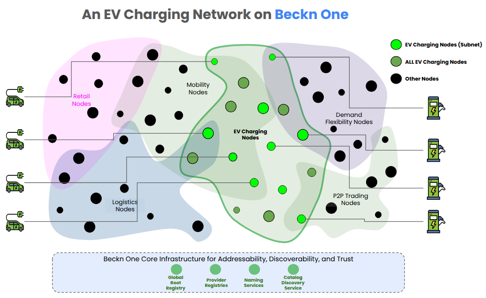

# P2P Energy Trading Implementation Guide <!-- omit from toc -->

## Overview <!-- omit from toc -->

This implementation guide provides comprehensive instructions for implementing Peer-to-Peer (P2P) Energy Trading using Beckn Protocol v2 with composable schemas. This guide covers all transaction flows, field mappings, best practices, and migration from v1.

## Table of Contents  <!-- omit from toc -->

- [1. Introduction](#1-introduction)
- [2. Scope](#2-scope)
- [3. Intended Audience](#3-intended-audience)
- [4. Conventions and Terminology](#4-conventions-and-terminology)
- [5. Terminology](#5-terminology)
- [6. User Journey](#6-user-journey)
  - [6.1. Sequence diagram of a P2P transaction](#61-sequence-diagram-of-a-p2p-transaction)
- [7. Reference Architecture](#7-reference-architecture)
  - [7.1. Architecture Diagram](#71-architecture-diagram)
  - [7.2. Actors](#72-actors)
- [8. Creating an Open Network for Peer to Peer Energy Trading](#8-creating-an-open-network-for-peer-to-peer-energy-trading)
  - [8.1. Setting up a Registry](#81-setting-up-a-registry)
    - [8.1.1. For a Network Participant](#811-for-a-network-participant)
      - [8.1.1.1. Step 1 :  Claiming a Namespace](#8111-step-1---claiming-a-namespace)
      - [8.1.1.2. Step 2 :  Setting up a Registry](#8112-step-2---setting-up-a-registry)
      - [8.1.1.3. Step 3 :  Publishing subscriber details](#8113-step-3---publishing-subscriber-details)
    - [8.1.2. Step 4 :  Share details of the registry created with the Beckn One team](#812-step-4---share-details-of-the-registry-created-with-the-beckn-one-team)
    - [8.1.3. For a Network facilitator organization](#813-for-a-network-facilitator-organization)
      - [8.1.3.1. Step 1 :  Claiming a Namespace](#8131-step-1---claiming-a-namespace)
      - [8.1.3.2. Step 2 :  Setting up a Registry](#8132-step-2---setting-up-a-registry)
      - [8.1.3.3. Step 3 :  Publishing subscriber details](#8133-step-3---publishing-subscriber-details)
      - [8.1.3.4. Step 4 :  Share details of the registry created with the Beckn One team](#8134-step-4---share-details-of-the-registry-created-with-the-beckn-one-team)
  - [8.2. Setting up the Protocol Endpoints](#82-setting-up-the-protocol-endpoints)
    - [8.2.1. Installing Beckn ONIX](#821-installing-beckn-onix)
    - [8.2.2. Configuring Beckn ONIX for Peer to Peer Energy Trading](#822-configuring-beckn-onix-for-peer-to-peer-energy-trading)
    - [8.2.3. 10.2.3 Performing a test transaction](#823-1023-performing-a-test-transaction)
- [9. Schema overview](#9-schema-overview)
  - [9.1. v2 Composable Schema Architecture](#91-v2-composable-schema-architecture)
  - [9.2. Schema Composition Points](#92-schema-composition-points)
  - [9.3. EnergyResource (Item.itemAttributes)](#93-energyresource-itemitemattributes)
  - [9.4. EnergyTradeOffer (Offer.offerAttributes)](#94-energytradeoffer-offerofferattributes)
  - [9.5. EnergyTradeContract (Order.orderAttributes)](#95-energytradecontract-orderorderattributes)
  - [9.6. EnergyTradeDelivery (Fulfillment.attributes)](#96-energytradedelivery-fulfillmentattributes)
- [10. API Reference \& examples](#10-api-reference--examples)
  - [10.1. Discover flow](#101-discover-flow)
  - [10.2. Select Flow](#102-select-flow)
  - [10.3. Init Flow](#103-init-flow)
  - [10.4. Confirm Flow](#104-confirm-flow)
    - [10.4.1. Cascaded Init Example (Utility Registration)](#1041-cascaded-init-example-utility-registration)
  - [10.5. Confirm Flow](#105-confirm-flow)
  - [10.6. Status Flow](#106-status-flow)
- [11. Additional Resources](#11-additional-resources)
    - [11.0.1. **Integrating with your software**](#1101-integrating-with-your-software)
      - [11.0.1.1. **Integrating the BAP**](#11011-integrating-the-bap)
      - [11.0.1.2. **Integrating the BPP**](#11012-integrating-the-bpp)
  - [11.1. FAQs](#111-faqs)
  - [11.2. References](#112-references)

Table of contents and section auto-numbering was done using [Markdown-All-In-One](https://marketplace.visualstudio.com/items?itemName=yzhang.markdown-all-in-one) vscode extension. Specifically `Markdown All in One: Create Table of Contents` and `Markdown All in One: Add/Update section numbers` commands accessible via vs code command pallete.

Example jsons were imported directly from source of truth elsewhere in this repo inline by inserting the pattern below within all json expand blocks, and running this [script](/scripts/embed_example_json.py), e.g. `python3 scripts/embed_example_json.py path_to_markdown_file.md`.

```
<details><summary><a href="/path_to_file_from_root">txt_with_json_keyword</a></summary>

</details>
``` 

---

# 1. Introduction

This document provides an implementation guidance for deploying peer to peer (P2P) energy trading
services using the Beckn Protocol ecosystem. Peer to peer energy trading enables energy producers 
(prosumers) to directly sell excess energy to consumers. 

Peer-to-peer (P2P) energy trading enables decentralized energy exchange that benefits all participants while strengthening the grid. For consumers, P2P markets offer lower prices during periods of abundant renewable supply (such as mid-day solar or nightly wind), creating demand that might otherwise be curtailed. For producers, these markets can provide higher prices than utility export rates, incentivizing renewable energy generation. Grid operators benefit through reduced transmission losses, local supply-demand balancing, and new revenue streams from wheeling charges on P2P transactions. Additionally, prosumers with accumulated net-metering credits can monetize them through P2P trades, converting credits into cash. These benefits extend beyond direct participants, as reduced grid congestion and improved efficiency ultimately lower costs for all ratepayers.

P2P trades are executed virtually before the delivery hour based on estimated load and generation, with actual energy flows potentially deviating from contracts. However, the economic incentives, namely better revenue for adhering to contracts and penalties for deviations, naturally align producer and consumer behavior toward delivering contracted energy. Each trade contract references a real or virtual meter for post-delivery deviation measurement, with utilities maintaining visibility and control through network policies that limit trade volumes based on sanctioned load or generation at each meter. Virtual meters enable aggregators to balance supply and demand across multiple participants, as any net deviation from zero flow through these virtual meters incurs penalties, creating a self-regulating mechanism for grid stability.

---

# 2. Scope

* Architecture patterns for peer-to-peer energy marketplace implementation using Beckn Protocol  
* Discovery of energy trading partners.
* Some recommendations for BAPs, BPPs and NFOs on how to map protocol API calls to 
  internal systems (or vice-versa).  
* Session management and billing coordination between BAP, BPP and the utility BPP.

This document does NOT cover:

* Processes for customer onboarding, meter validation and settlement.
* Fraud prevention: e.g. if a producer strikes a deal with two consumers, 
  settlement mechanics should be aware of total commited trade flows at a meter
  and apportion the shortfall against it.
* Cyber-security and best practices to ensure privacy of market participants by 
  guarding of personally identifiable information data.
* Escrow services to cover the cost trade participant reneging or defaulting on payment.

# 3. Intended Audience

* Consumer Application Developers (BAPs, BPPs).
* Technology Integrators: Building bridges between existing beckn v1 P2P trading infrastructure and new Beckn v2 based marketplaces  
* Business Stakeholders: Understanding technical capabilities and implementation requirements for peer to pee trading strategies  
* Standards Organizations: Evaluating interoperability approaches for future energy trading standards development

# 4. Conventions and Terminology

The key words "MUST", "MUST NOT", "REQUIRED", "SHALL", "SHALL NOT", "SHOULD", "SHOULD NOT", "RECOMMENDED", "MAY", and "OPTIONAL" in this document are to be interpreted as described [here](https://github.com/beckn/protocol-specifications/blob/draft/docs/BECKN-010-Keyword-Definitions-for-Technical-Specifications.md).

# 5. Terminology

| Acronym | Full Form/Description            | Description                                                                                                           |
| ------- | -------------------------------- | --------------------------------------------------------------------------------------------------------------------- |
| BAP     | Beckn Application Platform       | Consumer-facing application that initiates transactions.                                                              |
| BPP     | Beckn Provider Platform          | Service provider platform that responds to BAP requests.                                                              |
| NFO     | Network Facilitator Organization | Organization responsible for the adoption and growth of the network. Usually the custodian of the network’s registry. |
| CDS     | Catalog Discovery Service        | Enables discovery of energy services from BPPs in the network by providing a cache service for catalogs.                                                        |


# 6. User Journey

This walkthrough demonstrates a complete P2P energy trading transaction: Swati runs a flour mill business and has a sanctioned load of 20kw. As the festival season is approaching, anticipating large demand, she is looking to purchase cheaper energy than the utility import price of of 10 INR/kwh between 10am to 6pm for next week. 
A nearby solar farm is hoping to get better returns than 3 INR/kwh for its exports, and has published an offer
to sell energy at 7 INR/kwh.

Swati is already enrolled on a peer to peer energy trading app (BAP), and searches with above price and time of day filters. To her delight, she **discovers** a local solar farm is offering renewable energy at 6 INR/kwh between 12am to 4pm on all days in that week. With wheeling charges of 1 INR/kwh, the total 8 INR/kwh is still 20% cheaper than importing from utility. 

She **initiates** in an order of 20kw. The (BAP) app knows and shares her meter number with the seller's app (BPP), which in turn shares both with the utility BPP which knows the sanctioned import & export for each meter and existing trades. Utility BPP applies a 50% cap policy and replies back saying that upto 10kw of trade is allowed and adds wheeling charges to the quote. It also adds terms & conditions that specify that any underconsumption by Swati will be treated as a spot export by her reimbursed at 3 INR/kwh and any underproduction by solar farm by the farm is treated as a spot import at 10$/kwh. After this Swati **confirms** the 8 INR/kwh final order with her BAP, solar farm BPP in turn cascaded it to utility BPP and utility BPP acknowledges, logs the trade and deducts it from the further trading allowance in those hours for both Swati & the solar farm. 

On the delivery day, the floor mill is busy and consumes 400 kwh from the solar farm and saves a `400 *2=800` INR 
in energy costs. The solar farm gains additional 400*(7-3) = 1600 INR revenue, and utility gets `400*1 = 400` INR of revenue for the upkeep of transmission & to cover the administration cost. Utility BPP sends the final settlement including the wheeling and deviation charges to Swati & the solar farm. Swati pays the solar farm BPP 
for the trade itself via her BAP.

## 6.1. Sequence diagram of a P2P transaction

**Scenario**: Consumer (BAP: `bap.energy-consumer.com`) buys 10 kWh from Producer (BPP: `bpp.energy-provider.com`) on Oct 4, 2025, 10:00 AM - 6:00 PM. Source meter: `100200300`, Target meter: `98765456`. Transaction ID: `txn-energy-001`.


**1. Discover** - Consumer searches for solar energy with JSONPath filters (`sourceType == 'SOLAR'`, `deliveryMode == 'GRID_INJECTION'`, `availableQuantity >= 10.0`).  
Request: [discover-request.json](../../../../examples/v2/P2P_Trading/discover-request.json) | Response: [discover-response.json](../../../../examples/v2/P2P_Trading/discover-response.json)  
*Result: Found `energy-resource-solar-001` at $0.15/kWh, 30.5 kWh available*

**2. Select** - Consumer selects item and receives quote breakdown.  
Request: [select-request.json](../../../../examples/v2/P2P_Trading/select-request.json) | Response: [select-response.json](../../../../examples/v2/P2P_Trading/select-response.json)  
*Result: Quote $4.00 ($1.50 energy + $2.50 wheeling)*

**3. Init** - Consumer provides meter IDs (`100200300` → `98765456`), time window, and payment details. BPP may cascade to Utility for load verification and wheeling charges.  
Request: [init-request.json](../../../../examples/v2/P2P_Trading/init-request.json) | Response: [init-response.json](../../../../examples/v2/P2P_Trading/init-response.json)  
Cascaded Flow: [cascaded-init-request.json](../../../../examples/v2/P2P_Trading/cascaded-init-request.json) | [cascaded-on-init-response.json](../../../../examples/v2/P2P_Trading/cascaded-on-init-response.json)  
*Result: Order initialized, contract PENDING*

**4. Confirm** - Consumer confirms order to activate contract.  
Request: [confirm-request.json](../../../../examples/v2/P2P_Trading/confirm-request.json) | Response: [confirm-response.json](../../../../examples/v2/P2P_Trading/confirm-response.json)  
*Result: Contract ACTIVE, settlement cycle `settle-2024-10-04-001` created*

**5. Status (In Progress)** - Consumer monitors delivery progress. BPP updates meter readings and telemetry every 15-30 minutes.  
Request: [status-request.json](../../../../examples/v2/P2P_Trading/status-request.json) | Response: [status-response.json](../../../../examples/v2/P2P_Trading/status-response.json)  
*Result: Delivery IN_PROGRESS, 9.8 kWh delivered (98%), real-time telemetry*

**6. Status (Completed)** - Consumer checks final status after delivery completion.  
Response: [status-response-completed.json](../../../../examples/v2/P2P_Trading/status-response-completed.json)  
*Result: Delivery COMPLETED, 10.0 kWh delivered, settlement SETTLED ($4.00)*

**Summary**: Transaction completed in ~8.5 hours. 10.0 kWh delivered. Total cost $4.00. Daily settlement cycle processed.


# 7. Reference Architecture

The section defines the reference ecosystem architecture that is used for building this implementation guide. 

## 7.1. Architecture Diagram



## 7.2. Actors

1. Prosumers and consumers with smart meters.
2. Beckn One Global Root Registry  
3. Beckn One Catalog Discovery Service  
4. Beckn Application Platforms  
5. Beckn Provider Platforms  
6. Peer to Peer trading Registry


# 8. Creating an Open Network for Peer to Peer Energy Trading

To create an open network for energy trading requires all the producers, prosumers and consumers BAPs, BPPs, to be able to discover each other and become part of a common club. This club is manifested in the form of a Registry maintained by an NFO. 

## 8.1. Setting up a Registry

The NP Registry serves as the root of addressability and trust for all network participants. It maintains comprehensive details such as the participant’s globally unique identifier (ID), network address (Beckn API URL), public key, operational domains, and assigned role (e.g., BAP, BPP, CDS). In addition to managing participant registration, authentication, authorization, and permission control, the Registry oversees participant verification, activation, and overall lifecycle management, ensuring that only validated and authorized entities can operate within the network.


You can publish your registries at [DeDi.global](https://publish.dedi.global/).

### 8.1.1. For a Network Participant

#### 8.1.1.1. Step 1 :  Claiming a Namespace

To get started, any platform that has implemented Beckn Protocol MUST create a globally unique namespace for themselves.   
All NPs (BAPs, BPPs, CDS’es) **MUST** register as a user on dedi.global and claim a unique namespace against their FQDN to become globally addressable. As part of the claiming process, the user must prove ownership of the namespace by verifying the ownership of their domain. Namespace would be at an organisation level. You can put your organisation name as the name of the namespace.

#### 8.1.1.2. Step 2 :  Setting up a Registry

Once the namespace is claimed, each NP **MUST** create a Beckn NP registry in the namespace to list their subscriber details. While creating the registry, the user **MUST** configure it with the [subscriber schema](https://gist.githubusercontent.com/nirmalnr/a6e5b17522169ecea4f3ccdd831af7e4/raw/7744f2542034db9675901b61b41c8228ea239074/beckn-subscriber-no-refs.schema.json). Example of a registry name can be `subscription-details`.

#### 8.1.1.3. Step 3 :  Publishing subscriber details

In the registry that is created, NPs **MUST** publish their subscription details including their ID, network endpoints, public keys, operational domains and assigned roles (BAP, BPP) as records.

*Detailed steps to create namespaces and registries in dedi.global can be found [here](https://github.com/dedi-global/docs/blob/0976607aabc6641d330a3d41a3bd89ab8790ea09/user-guides/namespace%20and%20registry%20creation.md).*

### 8.1.2. Step 4 :  Share details of the registry created with the Beckn One team

Once the registry is created and details are published, the namespace and the registry name of the newly created registry should be shared with the beckn one team.

### 8.1.3. For a Network facilitator organization

#### 8.1.3.1. Step 1 :  Claiming a Namespace

An NFO **MAY** register as a user on dedi.global and claim a unique namespace against their FQDN. As part of the claiming process, the user must prove ownership of that namespace by verifying the ownership of that domain. The NFO name can be set as the name of the namespace. 
*Note: A calibrated roll out of this infrastructure is planned and hence before it is open to the general public NFOs are advised to share their own domain and the domains of their NPs to the Beckn One team so that they can be whitelisted which will allow the NPs to verify the same using TXT records in their DNS.*

#### 8.1.3.2. Step 2 :  Setting up a Registry

Network facilitators **MAY** create registries under their own namespace using the [subscriber reference schema](https://gist.githubusercontent.com/nirmalnr/a6e5b17522169ecea4f3ccdd831af7e4/raw/b7cf8a47e6531ef22744b43e6305b8d8cc106e7b/beckn-subscriber-reference.schema.json) to point to either whole registries or records created by the NPs in their own namespaces.  Example of a registry name can be `subscription-details`.

#### 8.1.3.3. Step 3 :  Publishing subscriber details

In the registry that is created, NFOs **MAY** publish records which act as pointers to either whole registries or records created by the NPs records. The URL field in the record would be the lookup URL for a registry or a record as per DeDi protocol.

Example: For referencing another registry created by an NP, the record details created would be:

```json
{
  "url": "https://.dedi.global/dedi/lookup/example-company/subscription-details",
  "type": "Registry",
  "subscriber_id": "example-company.com"
}
```

Here `example-company` is the namespace of the NP, and all records added in the registry is referenced here. 

If only one record in the registry needs to be referenced, then the record details created would be:

```json
{
  "url": "https://.dedi.global/dedi/lookup/example-company/subscription-details/energy-bap",
  "type": "Record",
  "subscriber_id": "example-company.com"
}
```

Here `energy-bap` is the name of the record created by the NP in this registry. Only that record is referenced here.

*Detailed steps to create namespaces and registries in dedi.global can be found [here](https://github.com/dedi-global/docs/blob/0976607aabc6641d330a3d41a3bd89ab8790ea09/user-guides/namespace%20and%20registry%20creation.md).*

#### 8.1.3.4. Step 4 :  Share details of the registry created with the Beckn One team

Once the registry is created and details are published, the namespace and the registry name of the newly created registry should be shared with the beckn one team.

## 8.2. Setting up the Protocol Endpoints

This section contains instructions to set up and test the protocol stack for transactions. 

### 8.2.1. Installing Beckn ONIX

All NPs SHOULD install the Beckn ONIX adapter to quickly get set up and become Beckn Protocol compliant. Click [here](https://github.com/Beckn-One/beckn-onix?tab=readme-ov-file#automated-setup-recommended)) to learn how to set up Beckn ONIX.

### 8.2.2. Configuring Beckn ONIX for Peer to Peer Energy Trading

A detailed Configuration Guide is available [here](https://github.com/Beckn-One/beckn-onix/blob/main/CONFIG.md). A quick read of key concepts from the link is recommended.

Specifically, please use the following configuration:
1. Configure dediregistry plugin instead of registry plugin. Read more [here](https://github.com/Beckn-One/beckn-onix/tree/main/pkg/plugin/implementation/dediregistry).
2. Start with using Simplekeymanager plugin during development, read more [here](https://github.com/Beckn-One/beckn-onix/tree/main/pkg/plugin/implementation/simplekeymanager). For production deployment, you may setup vault.
3. For routing calls to Catalog Discovery Service, refer to routing configuration [here](https://github.com/Beckn-One/beckn-onix/blob/main/config/local-simple-routing-BAPCaller.yaml).

### 8.2.3. 10.2.3 Performing a test transaction

Step 1 : Download the postman collection, from [here](/testnet/postman-collections/v2/P2P_Trading).

Step 2 : Run API calls

If you are a BAP

1. Configure the collection/environment variables to the newly installed Beckn ONIX adapter URL and other variables in the collection.
2. Select the discover example and hit send
3. You should see the service catalog response

If you are a BPP

1. Configure the collection/environment variables to the newly installed Beckn ONIX adapter URL and other variables in the collection.
2. Select the on_status example and hit send
3. You should see the response in your console


# 9. Schema overview

Beckn Protocol v2 provides a composable schema architecture that enables:
- **Modular Attribute Bundles**: Energy-specific attributes attached to core Beckn objects
- **JSON-LD Semantics**: Full semantic interoperability
- **Standards Alignment**: Integration with IEEE 2030.5 (mRID), OCPP, OCPI
- **Flexible Discovery**: Meter-based discovery and filtering

## 9.1. v2 Composable Schema Architecture

```
┌─────────────────────────────────────────────────────────┐
│                    Core Beckn Objects                    │
│  Item | Offer | Order | Fulfillment | Provider          │
└─────────────────────────────────────────────────────────┘
                        │
                        │ Attach Attributes
                        ▼
┌─────────────────────────────────────────────────────────┐
│              Energy* Attribute Bundles                    │
│  EnergyResource | EnergyTradeOffer | EnergyTradeContract │
│  EnergyTradeDelivery                                     │
└─────────────────────────────────────────────────────────┘
```

## 9.2. Schema Composition Points

| Attribute Bundle        | Attach To                | Purpose                                                                            |
| ----------------------- | ------------------------ | ---------------------------------------------------------------------------------- |
| **EnergyResource**      | `Item.itemAttributes`    | Energy source characteristics (source type, delivery mode, meter ID, availability) |
| **EnergyTradeOffer**    | `Offer.offerAttributes`  | Pricing models, settlement types, wheeling charges, validity windows               |
| **EnergyTradeContract** | `Order.orderAttributes`  | Contract status, meter IDs, settlement cycles, billing cycles                      |
| **EnergyTradeDelivery** | `Fulfillment.attributes` | Delivery status, meter readings, telemetry, settlement linkage                     |


## 9.3. EnergyResource (Item.itemAttributes)

**Purpose**: Describes tradable energy resources

**Key Attributes**:
- `sourceType`: SOLAR, BATTERY, GRID, HYBRID, RENEWABLE
- `deliveryMode`: EV_CHARGING, BATTERY_SWAP, V2G, GRID_INJECTION
- `meterId`: IEEE 2030.5 mRID (e.g., `"100200300"`)
- `availableQuantity`: Available energy in kWh
- `productionWindow`: Time window when energy is available
- `sourceVerification`: Verification status and certificates

**Example**:
```json
{
  "@context": "https://raw.githubusercontent.com/beckn/protocol-specifications-new/refs/heads/draft/schema/EnergyResource/v0.2/context.jsonld",
  "@type": "EnergyResource",
  "sourceType": "SOLAR",
  "deliveryMode": "GRID_INJECTION",
  "meterId": "100200300",
  "availableQuantity": 30.5,
  "productionWindow": {
    "start": "2024-10-04T10:00:00Z",
    "end": "2024-10-04T18:00:00Z"
  }
}
```

## 9.4. EnergyTradeOffer (Offer.offerAttributes)

**Purpose**: Defines pricing and settlement terms for energy trades

**Key Attributes**:
- `pricingModel`: PER_KWH, TIME_OF_DAY, SUBSCRIPTION, FIXED
- `settlementType`: REAL_TIME, HOURLY, DAILY, WEEKLY, MONTHLY
- `wheelingCharges`: Utility transmission charges
- `minimumQuantity` / `maximumQuantity`: Tradable quantity limits
- `validityWindow`: Offer validity period
- `timeOfDayRates`: Time-based pricing (for TIME_OF_DAY model)

**Example**:
```json
{
  "@context": "https://raw.githubusercontent.com/beckn/protocol-specifications-new/refs/heads/draft/schema/EnergyTradeOffer/v0.2/context.jsonld",
  "@type": "EnergyTradeOffer",
  "pricingModel": "PER_KWH",
  "settlementType": "DAILY",
  "wheelingCharges": {
    "amount": 2.5,
    "currency": "USD",
    "description": "PG&E Grid Services wheeling charge"
  },
  "minimumQuantity": 1.0,
  "maximumQuantity": 100.0
}
```

## 9.5. EnergyTradeContract (Order.orderAttributes)

**Purpose**: Tracks commercial agreements and contract lifecycle

**Key Attributes**:
- `contractStatus`: PENDING, ACTIVE, COMPLETED, TERMINATED
- `sourceMeterId` / `targetMeterId`: IEEE 2030.5 mRID
- `contractedQuantity`: Contracted energy in kWh
- `tradeStartTime` / `tradeEndTime`: Contract time window
- `settlementCycles`: Array of settlement periods
- `billingCycles`: Array of billing periods
- `wheelingCharges`: Utility charges breakdown

**Example**:
```json
{
  "@context": "https://raw.githubusercontent.com/beckn/protocol-specifications-new/refs/heads/draft/schema/EnergyTradeContract/v0.2/context.jsonld",
  "@type": "EnergyTradeContract",
  "contractStatus": "ACTIVE",
  "sourceMeterId": "100200300",
  "targetMeterId": "98765456",
  "contractedQuantity": 10.0,
  "settlementCycles": [...],
  "billingCycles": [...]
}
```

## 9.6. EnergyTradeDelivery (Fulfillment.attributes)

**Purpose**: Tracks physical energy transfer and delivery status

**Key Attributes**:
- `deliveryStatus`: PENDING, IN_PROGRESS, COMPLETED, FAILED
- `deliveryMode`: EV_CHARGING, BATTERY_SWAP, V2G, GRID_INJECTION
- `deliveredQuantity`: Quantity delivered in kWh
- `meterReadings`: Array of meter readings (source, target, energy flow)
- `telemetry`: Energy flow telemetry (ENERGY, POWER, VOLTAGE, etc.)
- `settlementCycleId`: Link to settlement cycle

**Example**:
```json
{
  "@context": "https://raw.githubusercontent.com/beckn/protocol-specifications-new/refs/heads/draft/schema/EnergyTradeDelivery/v0.2/context.jsonld",
  "@type": "EnergyTradeDelivery",
  "deliveryStatus": "IN_PROGRESS",
  "deliveryMode": "GRID_INJECTION",
  "deliveredQuantity": 9.8,
  "meterReadings": [
    {
      "timestamp": "2024-10-04T12:00:00Z",
      "sourceReading": 1000.5,
      "targetReading": 990.3,
      "energyFlow": 10.2
    }
  ],
  "telemetry": [...]
}
```


# 10. API Reference & examples

## 10.1. Discover flow

**Purpose**: Search for available energy resources

**Endpoint**: `POST /discover`

**v1 to v2 Mapping**:
- v1 `message.intent.item.quantity.selected.measure` → v2 `message.filters.expression` (JSONPath filter on `availableQuantity`)
- v1 `message.intent.fulfillment.stops[].time.range.start` → v2 `message.filters.expression` (JSONPath filter on `productionWindow.start`)
- v1 `message.intent.fulfillment.stops[].time.range.end` → v2 `message.filters.expression` (JSONPath filter on `productionWindow.end`)
- **Note**: v2 does not support `intent` object. All search parameters are expressed via JSONPath filters.

<details>
<summary><a href="../../../../examples/v2/P2P_Trading/discover-request.json">Request Example</a></summary>

```json
{
  "context": {
    "version": "2.0.0",
    "action": "discover",
    "timestamp": "2024-10-04T10:00:00Z",
    "message_id": "msg-discover-001",
    "transaction_id": "txn-energy-001",
    "bap_id": "bap.energy-consumer.com",
    "bap_uri": "https://bap.energy-consumer.com",
    "bpp_id": "bpp.energy-provider.com",
    "bpp_uri": "https://bpp.energy-provider.com",
    "ttl": "PT30S",
    "domain": "energy-trade",
    "location": {
      "city": {
        "code": "BLR",
        "name": "Bangalore"
      },
      "country": {
        "code": "IND",
        "name": "India"
      }
    }
  },
  "message": {
    "text_search": "solar energy grid injection",
    "filters": {
      "type": "jsonpath",
      "expression": "$[?(@.itemAttributes.sourceType == 'SOLAR' && @.itemAttributes.deliveryMode == 'GRID_INJECTION' && @.itemAttributes.availableQuantity >= 10.0 && @.itemAttributes.productionWindow.start <= '2024-10-04T10:00:00Z' && @.itemAttributes.productionWindow.end >= '2024-10-04T18:00:00Z')]"
    }
  }
}


```
</details>

<details><summary>Immediate successful Response</summary>

```json
{
  "ack_status": "ACK",
  "timestamp": "2025-10-14T07:31:05Z"
}
```
</details>


<details>
<summary><a href="../../../../examples/v2/P2P_Trading/discover-response.json">Async Response Example: `on_discover`</a></summary>

```json
{
  "context": {
    "version": "2.0.0",
    "action": "on_discover",
    "timestamp": "2024-10-04T10:00:05Z",
    "message_id": "msg-on-discover-001",
    "transaction_id": "txn-energy-001",
    "bap_id": "bap.energy-consumer.com",
    "bap_uri": "https://bap.energy-consumer.com",
    "bpp_id": "bpp.energy-provider.com",
    "bpp_uri": "https://bpp.energy-provider.com",
    "ttl": "PT30S",
    "domain": "energy-trade"
  },
  "message": {
    "catalogs": [
      {
        "@context": "https://raw.githubusercontent.com/beckn/protocol-specifications-new/refs/heads/draft/schema/core/v2/context.jsonld",
        "@type": "beckn:Catalog",
        "beckn:id": "catalog-energy-001",
        "beckn:descriptor": {
          "@type": "beckn:Descriptor",
          "schema:name": "Solar Energy Trading Catalog"
        },
        "beckn:items": [
          {
            "@context": "https://raw.githubusercontent.com/beckn/protocol-specifications-new/refs/heads/draft/schema/core/v2/context.jsonld",
            "@type": "beckn:Item",
            "beckn:id": "energy-resource-solar-001",
            "beckn:descriptor": {
              "@type": "beckn:Descriptor",
              "schema:name": "Solar Energy - 30.5 kWh",
              "beckn:shortDesc": "Carbon Offset Certified Solar Energy",
              "beckn:longDesc": "High-quality solar energy from verified source with carbon offset certification"
            },
            "beckn:provider": {
              "@type": "beckn:Provider",
              "beckn:id": "provider-solar-farm-001"
            },
            "beckn:itemAttributes": {
              "@context": "https://raw.githubusercontent.com/beckn/protocol-specifications-new/refs/heads/draft/schema/EnergyResource/v0.2/context.jsonld",
              "@type": "EnergyResource",
              "sourceType": "SOLAR",
              "deliveryMode": "GRID_INJECTION",
              "certificationStatus": "Carbon Offset Certified",
              "meterId": "100200300",
              "inverterId": "inv-12345",
              "availableQuantity": 30.5,
              "productionWindow": {
                "start": "2024-10-04T10:00:00Z",
                "end": "2024-10-04T18:00:00Z"
              },
              "sourceVerification": {
                "verified": true,
                "verificationDate": "2024-09-01T00:00:00Z",
                "certificates": [
                  "https://example.com/certs/solar-panel-cert.pdf"
                ]
              },
              "productionAsynchronous": true
            }
          }
        ],
        "beckn:offers": [
          {
            "@context": "https://raw.githubusercontent.com/beckn/protocol-specifications-new/refs/heads/draft/schema/core/v2/context.jsonld",
            "@type": "beckn:Offer",
            "beckn:id": "offer-energy-001",
            "beckn:descriptor": {
              "@type": "beckn:Descriptor",
              "schema:name": "Daily Settlement Solar Energy Offer"
            },
            "beckn:provider": "provider-solar-farm-001",
            "beckn:items": ["energy-resource-solar-001"],
            "beckn:price": {
              "@type": "schema:PriceSpecification",
              "schema:price": 0.15,
              "schema:priceCurrency": "USD",
              "schema:unitText": "kWh"
            },
            "beckn:offerAttributes": {
              "@context": "https://raw.githubusercontent.com/beckn/protocol-specifications-new/refs/heads/draft/schema/EnergyTradeOffer/v0.2/context.jsonld",
              "@type": "EnergyTradeOffer",
              "pricingModel": "PER_KWH",
              "settlementType": "DAILY",
              "wheelingCharges": {
                "amount": 2.5,
                "currency": "USD",
                "description": "PG&E Grid Services wheeling charge"
              },
              "minimumQuantity": 1.0,
              "maximumQuantity": 100.0,
              "validityWindow": {
                "start": "2024-10-04T00:00:00Z",
                "end": "2024-10-04T23:59:59Z"
              }
            }
          }
        ]
      }
    ]
  }
}


```
</details>

**Key Points**:
- **No Intent Object**: v2 does not support `intent` object in discover requests. All search parameters are expressed via JSONPath filters.
- **Quantity Filter**: Filter by `itemAttributes.availableQuantity >= 10.0` in JSONPath expression
- **Time Range Filter**: Filter by `productionWindow.start` and `productionWindow.end` to match desired trade time window
  - `productionWindow.start <= '2024-10-04T10:00:00Z'` - Energy available from start time or earlier
  - `productionWindow.end >= '2024-10-04T18:00:00Z'` - Energy available until end time or later
- **JSONPath Filters**: Use JSONPath filters to search by `itemAttributes.sourceType`, `itemAttributes.deliveryMode`, `itemAttributes.availableQuantity`, and `itemAttributes.productionWindow`
- **Response**: Includes full Item with EnergyResource attributes and Offer with EnergyTradeOffer attributes

## 10.2. Select Flow

**Purpose**: Select items and offers to build an order

**Endpoint**: `POST /select`

<details>
<summary><a href="../../../../examples/v2/P2P_Trading/select-request.json">Request Example</a></summary>

```json
{
  "context": {
    "version": "2.0.0",
    "action": "select",
    "timestamp": "2024-10-04T10:15:00Z",
    "message_id": "msg-select-001",
    "transaction_id": "txn-energy-001",
    "bap_id": "bap.energy-consumer.com",
    "bap_uri": "https://bap.energy-consumer.com",
    "bpp_id": "bpp.energy-provider.com",
    "bpp_uri": "https://bpp.energy-provider.com",
    "ttl": "PT30S",
    "domain": "energy-trade"
  },
  "message": {
    "order": {
      "@context": "https://raw.githubusercontent.com/beckn/protocol-specifications-new/refs/heads/draft/schema/core/v2/context.jsonld",
      "@type": "beckn:Order",
      "beckn:id": "order-energy-001",
      "beckn:items": [
        {
          "beckn:id": "energy-resource-solar-001",
          "quantity": {
            "count": 10.0,
            "unit": "kWh"
          }
        }
      ],
      "beckn:offers": [
        {
          "beckn:id": "offer-energy-001"
        }
      ],
      "beckn:provider": {
        "beckn:id": "provider-solar-farm-001"
      }
    }
  }
}


```
</details>

<details><summary>Immediate successful Response</summary>

```json
{
  "ack_status": "ACK",
  "timestamp": "2025-10-14T07:31:05Z"
}
```
</details>

<details>
<summary><a href="../../../../examples/v2/P2P_Trading/select-response.json">Asynchronous Response Example: `on_select`</a></summary>

```json
{
  "context": {
    "version": "2.0.0",
    "action": "on_select",
    "timestamp": "2024-10-04T10:15:05Z",
    "message_id": "msg-on-select-001",
    "transaction_id": "txn-energy-001",
    "bap_id": "bap.energy-consumer.com",
    "bap_uri": "https://bap.energy-consumer.com",
    "bpp_id": "bpp.energy-provider.com",
    "bpp_uri": "https://bpp.energy-provider.com",
    "ttl": "PT30S",
    "domain": "energy-trade"
  },
  "message": {
    "order": {
      "@context": "https://raw.githubusercontent.com/beckn/protocol-specifications-new/refs/heads/draft/schema/core/v2/context.jsonld",
      "@type": "beckn:Order",
      "beckn:id": "order-energy-001",
      "beckn:items": [
        {
          "beckn:id": "energy-resource-solar-001",
          "quantity": {
            "count": 10.0,
            "unit": "kWh"
          }
        }
      ],
      "beckn:offers": [
        {
          "beckn:id": "offer-energy-001"
        }
      ],
      "beckn:provider": {
        "beckn:id": "provider-solar-farm-001"
      },
      "beckn:quote": {
        "@type": "beckn:Quotation",
        "beckn:price": {
          "@type": "schema:PriceSpecification",
          "schema:price": 1.5,
          "schema:priceCurrency": "USD",
          "schema:unitText": "kWh"
        },
        "beckn:breakup": [
          {
            "@type": "beckn:Breakup",
            "beckn:title": "Energy Cost (10 kWh @ $0.15/kWh)",
            "beckn:price": {
              "@type": "schema:PriceSpecification",
              "schema:price": 1.5,
              "schema:priceCurrency": "USD"
            }
          },
          {
            "@type": "beckn:Breakup",
            "beckn:title": "Wheeling Charges",
            "beckn:price": {
              "@type": "schema:PriceSpecification",
              "schema:price": 2.5,
              "schema:priceCurrency": "USD"
            }
          }
        ]
      }
    }
  }
}


```
</details>

**Key Points**:
- Select items by `beckn:id` and specify quantity
- Select offers by `beckn:id`
- Response includes priced quote with breakup

## 10.3. Init Flow

**Purpose**: Initialize order with fulfillment and payment details

**Endpoint**: `POST /init`

**v1 to v2 Mapping**:
- v1 `Order.fulfillments[].stops[].time.range` → v2 `Order.fulfillments[].stops[].time.range` (same structure)
- v1 `Order.fulfillments[].stops[].location.address` (der:// format) → v2 `Order.fulfillments[].stops[].location.address` (IEEE mRID format)
- v1 `Order.attributes.*` → v2 `Order.orderAttributes.*` (path change)

<details>
<summary><a href="../../../../examples/v2/P2P_Trading/init-request.json">Request Example</a></summary>

```json
{
  "context": {
    "version": "2.0.0",
    "action": "init",
    "timestamp": "2024-10-04T10:20:00Z",
    "message_id": "msg-init-001",
    "transaction_id": "txn-energy-001",
    "bap_id": "bap.energy-consumer.com",
    "bap_uri": "https://bap.energy-consumer.com",
    "bpp_id": "bpp.energy-provider.com",
    "bpp_uri": "https://bpp.energy-provider.com",
    "ttl": "PT30S",
    "domain": "energy-trade"
  },
  "message": {
    "order": {
      "@context": "https://raw.githubusercontent.com/beckn/protocol-specifications-new/refs/heads/draft/schema/core/v2/context.jsonld",
      "@type": "beckn:Order",
      "beckn:id": "order-energy-001",
      "beckn:items": [
        {
          "beckn:id": "energy-resource-solar-001",
          "quantity": {
            "count": 10.0,
            "unit": "kWh"
          }
        }
      ],
      "beckn:offers": [
        {
          "beckn:id": "offer-energy-001"
        }
      ],
      "beckn:provider": {
        "beckn:id": "provider-solar-farm-001"
      },
      "beckn:fulfillments": [
        {
          "@type": "beckn:Fulfillment",
          "beckn:id": "fulfillment-energy-001",
          "beckn:type": "ENERGY_DELIVERY",
          "beckn:stops": [
            {
              "@type": "beckn:Stop",
              "beckn:id": "stop-start-001",
              "beckn:type": "START",
              "beckn:location": {
                "@type": "beckn:Location",
                "beckn:address": "100200300"
              },
              "beckn:time": {
                "@type": "beckn:Time",
                "beckn:range": {
                  "start": "2024-10-04T10:00:00Z",
                  "end": "2024-10-04T18:00:00Z"
                }
              }
            },
            {
              "@type": "beckn:Stop",
              "beckn:id": "stop-end-001",
              "beckn:type": "END",
              "beckn:location": {
                "@type": "beckn:Location",
                "beckn:address": "98765456"
              },
              "beckn:time": {
                "@type": "beckn:Time",
                "beckn:range": {
                  "start": "2024-10-04T10:00:00Z",
                  "end": "2024-10-04T18:00:00Z"
                }
              }
            }
          ]
        }
      ],
      "beckn:payments": [
        {
          "@type": "beckn:Payment",
          "beckn:id": "payment-energy-001",
          "beckn:type": "ON-FULFILLMENT",
          "beckn:status": "NOT-PAID",
          "beckn:collected_by": "BPP"
        }
      ],
      "beckn:billing": {
        "@type": "beckn:Billing",
        "beckn:name": "Energy Consumer",
        "beckn:email": "consumer@example.com",
        "beckn:phone": "+1-555-0100"
      }
    }
  }
}


```
</details>

<details><summary>Immediate successful Response</summary>

```json
{
  "ack_status": "ACK",
  "timestamp": "2025-10-14T07:31:05Z"
}
```
</details>

<details>
<summary><a href="../../../../examples/v2/P2P_Trading/init-response.json">Asynchronous Response Example: `on_init`</a></summary>

```json
{
  "context": {
    "version": "2.0.0",
    "action": "on_init",
    "timestamp": "2024-10-04T10:20:05Z",
    "message_id": "msg-on-init-001",
    "transaction_id": "txn-energy-001",
    "bap_id": "bap.energy-consumer.com",
    "bap_uri": "https://bap.energy-consumer.com",
    "bpp_id": "bpp.energy-provider.com",
    "bpp_uri": "https://bpp.energy-provider.com",
    "ttl": "PT30S",
    "domain": "energy-trade"
  },
  "message": {
    "order": {
      "@context": "https://raw.githubusercontent.com/beckn/protocol-specifications-new/refs/heads/draft/schema/core/v2/context.jsonld",
      "@type": "beckn:Order",
      "beckn:id": "order-energy-001",
      "beckn:items": [
        {
          "beckn:id": "energy-resource-solar-001",
          "quantity": {
            "count": 10.0,
            "unit": "kWh"
          }
        }
      ],
      "beckn:offers": [
        {
          "beckn:id": "offer-energy-001"
        }
      ],
      "beckn:provider": {
        "beckn:id": "provider-solar-farm-001"
      },
      "beckn:fulfillments": [
        {
          "@type": "beckn:Fulfillment",
          "beckn:id": "fulfillment-energy-001",
          "beckn:type": "ENERGY_DELIVERY",
          "beckn:stops": [
            {
              "@type": "beckn:Stop",
              "beckn:id": "stop-start-001",
              "beckn:type": "START",
              "beckn:location": {
                "@type": "beckn:Location",
                "beckn:address": "100200300"
              }
            },
            {
              "@type": "beckn:Stop",
              "beckn:id": "stop-end-001",
              "beckn:type": "END",
              "beckn:location": {
                "@type": "beckn:Location",
                "beckn:address": "98765456"
              }
            }
          ]
        }
      ],
      "beckn:payments": [
        {
          "@type": "beckn:Payment",
          "beckn:id": "payment-energy-001",
          "beckn:type": "ON-FULFILLMENT",
          "beckn:status": "NOT-PAID",
          "beckn:collected_by": "BPP"
        }
      ],
      "beckn:orderAttributes": {
        "@context": "https://raw.githubusercontent.com/beckn/protocol-specifications-new/refs/heads/draft/schema/EnergyTradeContract/v0.2/context.jsonld",
        "@type": "EnergyTradeContract",
        "contractStatus": "PENDING",
        "sourceMeterId": "100200300",
        "targetMeterId": "98765456",
        "inverterId": "inv-12345",
        "contractedQuantity": 10.0,
        "tradeStartTime": "2024-10-04T10:00:00Z",
        "tradeEndTime": "2024-10-04T18:00:00Z",
        "sourceType": "SOLAR",
        "certification": {
          "status": "Carbon Offset Certified",
          "certificates": [
            "https://example.com/certs/solar-panel-cert.pdf"
          ]
        }
      }
    }
  }
}


```
</details>

**Key Points**:
- **Fulfillment Stops**: Must include START and END stops (same as v1)
- **Time Range**: Include `beckn:time.range` in stops to specify delivery time window (same as v1)
- **Meter IDs**: Use IEEE mRID format (`"100200300"`) instead of v1's `der://` format (`"der://pge.meter/100200300"`)
- **Response**: Includes EnergyTradeContract attributes with PENDING status

## 10.4. Confirm Flow

**Purpose**: Confirm and activate the order

**Endpoint**: `POST /confirm`

### 10.4.1. Cascaded Init Example (Utility Registration)

This flow demonstrates the cascaded `/init` call from the P2P Trading BPP to the Utility Company (Transmission BPP) to register the trade and calculate wheeling charges.

<details>
<summary><a href="../../../../examples/v2/P2P_Trading/cascaded-init-request.json">Cascaded Request Example</a></summary>

```json
{
    "context": {
        "domain": "energy",
        "action": "init",
        "location": {
            "country": {
                "name": "India",
                "code": "IND"
            },
            "city": {
                "name": "Lucknow",
                "code": "std:522"
            }
        },
        "version": "1.1.0",
        "bap_id": "p2pTrading-bpp.com",
        "bap_uri": "https://api.p2pTrading-bpp.com/pilot/bap/energy/v1",
        "bpp_id": "example-transmission-bpp.com",
        "bpp_uri": "https://api.example-transmission-bpp.com/pilot/bpp/",
        "transaction_id": "6743e9e2-4fb5-487c-92b7-13ba8018f176",
        "message_id": "6743e9e2-4fb5-487c-92b7-13ba8018f176",
        "timestamp": "2023-07-16T04:41:16Z"
    },
    "message": {
        "order": {
            "provider": {
                "descriptor": {
                    "name": "UPPCL"
                }
            },
            "fulfillments": [
                {
                    "customer": {
                        "person": {
                            "name": "Raj"
                        },
                        "contact": {
                            "phone": "+91-1276522222"
                        }
                    },
                    "stops": [
                        {
                            "type": "start",
                            "location": {
                                "address": "der://uppcl.meter/92982739"
                            },
                            "time": {
                                "range": {
                                    "start": "2024-10-04T10:00:00",
                                    "end": "2024-10-04T18:00:00"
                                }
                            }
                        },
                        {
                            "type": "end",
                            "location": {
                                "address": "der://uppcl.meter/98765456"
                            },
                            "time": {
                                "range": {
                                    "start": "2024-10-04T10:00:00",
                                    "end": "2024-10-04T18:00:00"
                                }
                            }
                        }
                    ],
                    "tags": [
                        {
                            "descriptor": {
                                "name": "P2P-Trade-Draft-Contract"
                            },
                            "list": [
                                {
                                    "Value": "https://https://dhiway.com/vc/energy/3894434.json"
                                }
                            ]
                        }
                    ]
                }
            ],
            "billing": {
                "name": "p2p-Trading-BPP",
                "email": "p2tbpp@example.com",
                "phone": "+91-1276522222"
            }
        }
    }
}
```
</details>

<details><summary>Immediate successful Response</summary>

```json
{
  "ack_status": "ACK",
  "timestamp": "2025-10-14T07:31:05Z"
}
```
</details>

<details>
<summary><a href="../../../../examples/v2/P2P_Trading/cascaded-on-init-response.json">Cascaded asynchronous Response Example: `on_init`</a></summary>

```json
{
    "context": {
        "domain": "energy",
        "action": "on_init",
        "location": {
            "country": {
                "name": "India",
                "code": "IND"
            },
            "city": {
                "name": "Lucknow",
                "code": "std:522"
            }
        },
        "version": "1.1.0",
        "bap_id": "p2pTrading-bpp.com",
        "bap_uri": "https://api.p2pTrading-bpp.com/pilot/bap/energy/v1",
        "bpp_id": "example-transmission-bpp.com",
        "bpp_uri": "https://api.example-transmission-bpp.com/pilot/bpp/",
        "transaction_id": "6743e9e2-4fb5-487c-92b7-13ba8018f176",
        "message_id": "6743e9e2-4fb5-487c-92b7-13ba8018f176",
        "timestamp": "2023-07-16T04:41:16Z"
    },
    "message": {
        "order": {
            "provider": {
                "descriptor": {
                    "name": "UPPCL"
                }
            },
            "fulfillments": [
                {
                    "customer": {
                        "person": {
                            "name": "Raj"
                        },
                        "contact": {
                            "phone": "+91-1276522222"
                        }
                    },
                    "stops": [
                        {
                            "type": "start",
                            "location": {
                                "address": "der://uppcl.meter/92982739"
                            },
                            "time": {
                                "range": {
                                    "start": "2024-10-04T10:00:00",
                                    "end": "2024-10-04T18:00:00"
                                }
                            }
                        },
                        {
                            "type": "end",
                            "location": {
                                "address": "der://uppcl.meter/98765456"
                            },
                            "time": {
                                "range": {
                                    "start": "2024-10-04T10:00:00",
                                    "end": "2024-10-04T18:00:00"
                                }
                            }
                        }
                    ],
                    "tags": [
                        {
                            "descriptor": {
                                "name": "P2P-Trade-Draft-Contract"
                            },
                            "list": [
                                {
                                    "Value": "https://https://dhiway.com/vc/energy/3894434.json"
                                }
                            ]
                        }
                    ]
                }
            ],
            "quote": {
                "price": {
                    "value": "2.5",
                    "currency": "INR"
                },
                "breakup": [
                    {
                        "title": "wheeling charge",
                        "price": {
                            "value": "2.5",
                            "currency": "INR"
                        }
                    }
                ]
            },
            "billing": {
                "name": "p2p-Trading-BPP",
                "email": "p2ptbpp@example.com",
                "phone": "+91-1276522222"
            },
            "cancellation_terms": [
                {
                    "external_ref": {
                        "mimetype": "text/html",
                        "url": "https://mvvnl.in/cancellation_terms.html"
                    }
                }
            ]
        }
    }
}
```
</details>

## 10.5. Confirm Flow

**Purpose**: Confirm and activate the order

**Endpoint**: `POST /confirm`

<details>
<summary><a href="../../../../examples/v2/P2P_Trading/confirm-request.json">Request Example</a></summary>

```json
{
  "context": {
    "version": "2.0.0",
    "action": "confirm",
    "timestamp": "2024-10-04T10:25:00Z",
    "message_id": "msg-confirm-001",
    "transaction_id": "txn-energy-001",
    "bap_id": "bap.energy-consumer.com",
    "bap_uri": "https://bap.energy-consumer.com",
    "bpp_id": "bpp.energy-provider.com",
    "bpp_uri": "https://bpp.energy-provider.com",
    "ttl": "PT30S",
    "domain": "energy-trade"
  },
  "message": {
    "order": {
      "@context": "https://raw.githubusercontent.com/beckn/protocol-specifications-new/refs/heads/draft/schema/core/v2/context.jsonld",
      "@type": "beckn:Order",
      "beckn:id": "order-energy-001",
      "beckn:items": [
        {
          "beckn:id": "energy-resource-solar-001",
          "quantity": {
            "count": 10.0,
            "unit": "kWh"
          }
        }
      ],
      "beckn:offers": [
        {
          "beckn:id": "offer-energy-001"
        }
      ],
      "beckn:provider": {
        "beckn:id": "provider-solar-farm-001"
      },
      "beckn:fulfillments": [
        {
          "@type": "beckn:Fulfillment",
          "beckn:id": "fulfillment-energy-001",
          "beckn:type": "ENERGY_DELIVERY"
        }
      ],
      "beckn:payments": [
        {
          "@type": "beckn:Payment",
          "beckn:id": "payment-energy-001",
          "beckn:type": "ON-FULFILLMENT",
          "beckn:status": "NOT-PAID",
          "beckn:collected_by": "BPP"
        }
      ]
    }
  }
}


```
</details>

<details><summary>Immediate successful Response</summary>

```json
{
  "ack_status": "ACK",
  "timestamp": "2025-10-14T07:31:05Z"
}
```
</details>

<details>
<summary><a href="../../../../examples/v2/P2P_Trading/confirm-response.json">Asynchronous Response Example: `on_confirm`</a></summary>

```json
{
  "context": {
    "version": "2.0.0",
    "action": "on_confirm",
    "timestamp": "2024-10-04T10:25:05Z",
    "message_id": "msg-on-confirm-001",
    "transaction_id": "txn-energy-001",
    "bap_id": "bap.energy-consumer.com",
    "bap_uri": "https://bap.energy-consumer.com",
    "bpp_id": "bpp.energy-provider.com",
    "bpp_uri": "https://bpp.energy-provider.com",
    "ttl": "PT30S",
    "domain": "energy-trade"
  },
  "message": {
    "order": {
      "@context": "https://raw.githubusercontent.com/beckn/protocol-specifications-new/refs/heads/draft/schema/core/v2/context.jsonld",
      "@type": "beckn:Order",
      "beckn:id": "order-energy-001",
      "beckn:items": [
        {
          "beckn:id": "energy-resource-solar-001",
          "quantity": {
            "count": 10.0,
            "unit": "kWh"
          }
        }
      ],
      "beckn:offers": [
        {
          "beckn:id": "offer-energy-001"
        }
      ],
      "beckn:provider": {
        "beckn:id": "provider-solar-farm-001"
      },
      "beckn:fulfillments": [
        {
          "@type": "beckn:Fulfillment",
          "beckn:id": "fulfillment-energy-001",
          "beckn:type": "ENERGY_DELIVERY",
          "beckn:state": {
            "@type": "beckn:State",
            "beckn:descriptor": {
              "@type": "beckn:Descriptor",
              "schema:name": "PENDING"
            }
          }
        }
      ],
      "beckn:payments": [
        {
          "@type": "beckn:Payment",
          "beckn:id": "payment-energy-001",
          "beckn:type": "ON-FULFILLMENT",
          "beckn:status": "NOT-PAID",
          "beckn:collected_by": "BPP"
        }
      ],
      "beckn:orderAttributes": {
        "@context": "https://raw.githubusercontent.com/beckn/protocol-specifications-new/refs/heads/draft/schema/EnergyTradeContract/v0.2/context.jsonld",
        "@type": "EnergyTradeContract",
        "contractStatus": "ACTIVE",
        "sourceMeterId": "100200300",
        "targetMeterId": "98765456",
        "inverterId": "inv-12345",
        "contractedQuantity": 10.0,
        "tradeStartTime": "2024-10-04T10:00:00Z",
        "tradeEndTime": "2024-10-04T18:00:00Z",
        "sourceType": "SOLAR",
        "certification": {
          "status": "Carbon Offset Certified",
          "certificates": [
            "https://example.com/certs/solar-panel-cert.pdf"
          ]
        },
        "settlementCycles": [
          {
            "cycleId": "settle-2024-10-04-001",
            "startTime": "2024-10-04T00:00:00Z",
            "endTime": "2024-10-04T23:59:59Z",
            "status": "PENDING",
            "amount": 0.0,
            "currency": "USD"
          }
        ]
      }
    }
  }
}


```
</details>

**Key Points**:
- Contract status changes from PENDING to ACTIVE
- Settlement cycle is initialized
- Order is now active and ready for fulfillment

## 10.6. Status Flow

**Purpose**: Query order and delivery status

**Endpoint**: `POST /status`

<details>
<summary><a href="../../../../examples/v2/P2P_Trading/status-request.json">Request Example</a></summary>

```json
{
  "context": {
    "version": "2.0.0",
    "action": "status",
    "timestamp": "2024-10-04T15:00:00Z",
    "message_id": "msg-status-001",
    "transaction_id": "txn-energy-001",
    "bap_id": "bap.energy-consumer.com",
    "bap_uri": "https://bap.energy-consumer.com",
    "bpp_id": "bpp.energy-provider.com",
    "bpp_uri": "https://bpp.energy-provider.com",
    "ttl": "PT30S",
    "domain": "energy-trade"
  },
  "message": {
    "order": {
      "@context": "https://raw.githubusercontent.com/beckn/protocol-specifications-new/refs/heads/draft/schema/core/v2/context.jsonld",
      "@type": "beckn:Order",
      "beckn:id": "order-energy-001"
    }
  }
}


```
</details>

<details><summary>Immediate successful Response</summary>

```json
{
  "ack_status": "ACK",
  "timestamp": "2025-10-14T07:31:05Z"
}
```
</details>

<details>
<summary><a href="../../../../examples/v2/P2P_Trading/status-response.json">Asynchronous Response Example: `on_status`</a></summary>

```json
{
  "context": {
    "version": "2.0.0",
    "action": "on_status",
    "timestamp": "2024-10-04T15:00:05Z",
    "message_id": "msg-on-status-001",
    "transaction_id": "txn-energy-001",
    "bap_id": "bap.energy-consumer.com",
    "bap_uri": "https://bap.energy-consumer.com",
    "bpp_id": "bpp.energy-provider.com",
    "bpp_uri": "https://bpp.energy-provider.com",
    "ttl": "PT30S",
    "domain": "energy-trade"
  },
  "message": {
    "order": {
      "@context": "https://raw.githubusercontent.com/beckn/protocol-specifications-new/refs/heads/draft/schema/core/v2/context.jsonld",
      "@type": "beckn:Order",
      "beckn:id": "order-energy-001",
      "beckn:items": [
        {
          "beckn:id": "energy-resource-solar-001",
          "quantity": {
            "count": 10.0,
            "unit": "kWh"
          }
        }
      ],
      "beckn:offers": [
        {
          "beckn:id": "offer-energy-001"
        }
      ],
      "beckn:provider": {
        "beckn:id": "provider-solar-farm-001"
      },
      "beckn:fulfillments": [
        {
          "@type": "beckn:Fulfillment",
          "beckn:id": "fulfillment-energy-001",
          "beckn:type": "ENERGY_DELIVERY",
          "beckn:state": {
            "@type": "beckn:State",
            "beckn:descriptor": {
              "@type": "beckn:Descriptor",
              "schema:name": "IN_PROGRESS"
            }
          },
          "beckn:attributes": {
            "@context": "https://raw.githubusercontent.com/beckn/protocol-specifications-new/refs/heads/draft/schema/EnergyTradeDelivery/v0.2/context.jsonld",
            "@type": "EnergyTradeDelivery",
            "deliveryStatus": "IN_PROGRESS",
            "deliveryMode": "GRID_INJECTION",
            "deliveredQuantity": 9.8,
            "deliveryStartTime": "2024-10-04T10:00:00Z",
            "deliveryEndTime": null,
            "meterReadings": [
              {
                "timestamp": "2024-10-04T10:00:00Z",
                "sourceReading": 1000.0,
                "targetReading": 990.0,
                "energyFlow": 10.0
              },
              {
                "timestamp": "2024-10-04T12:00:00Z",
                "sourceReading": 1000.5,
                "targetReading": 990.3,
                "energyFlow": 10.2
              },
              {
                "timestamp": "2024-10-04T14:00:00Z",
                "sourceReading": 1001.0,
                "targetReading": 990.8,
                "energyFlow": 10.2
              }
            ],
            "telemetry": [
              {
                "eventTime": "2024-10-04T12:00:00Z",
                "metrics": [
                  {
                    "name": "ENERGY",
                    "value": 5.8,
                    "unitCode": "KWH"
                  },
                  {
                    "name": "POWER",
                    "value": 2.5,
                    "unitCode": "KW"
                  },
                  {
                    "name": "VOLTAGE",
                    "value": 240.0,
                    "unitCode": "VLT"
                  }
                ]
              }
            ],
            "settlementCycleId": "settle-2024-10-04-001",
            "lastUpdated": "2024-10-04T15:30:00Z"
          }
        }
      ],
      "beckn:payments": [
        {
          "@type": "beckn:Payment",
          "beckn:id": "payment-energy-001",
          "beckn:type": "ON-FULFILLMENT",
          "beckn:status": "NOT-PAID",
          "beckn:collected_by": "BPP"
        }
      ],
      "beckn:orderAttributes": {
        "@context": "https://raw.githubusercontent.com/beckn/protocol-specifications-new/refs/heads/draft/schema/EnergyTradeContract/v0.2/context.jsonld",
        "@type": "EnergyTradeContract",
        "contractStatus": "ACTIVE",
        "sourceMeterId": "100200300",
        "targetMeterId": "98765456",
        "inverterId": "inv-12345",
        "contractedQuantity": 10.0,
        "tradeStartTime": "2024-10-04T10:00:00Z",
        "tradeEndTime": "2024-10-04T18:00:00Z",
        "sourceType": "SOLAR",
        "certification": {
          "status": "Carbon Offset Certified",
          "certificates": [
            "https://example.com/certs/solar-panel-cert.pdf"
          ]
        },
        "settlementCycles": [
          {
            "cycleId": "settle-2024-10-04-001",
            "startTime": "2024-10-04T00:00:00Z",
            "endTime": "2024-10-04T23:59:59Z",
            "status": "PENDING",
            "amount": 0.0,
            "currency": "USD"
          }
        ],
        "lastUpdated": "2024-10-04T15:30:00Z"
      }
    }
  }
}


```
</details>

**Key Points**:
- Response includes EnergyTradeContract attributes (contract status)
- Response includes EnergyTradeDelivery attributes (delivery status, meter readings, telemetry)
- Meter readings show energy flow from source to target
- Telemetry provides real-time energy metrics


# 11. Additional Resources

- **Beckn 1.0 to 2.0 field mapping**: See `./v1_to_v2_field_mapping.md`
- **Taxonomy Reference**: See `./taxonomy.md`
- **Schema Definitions**: See `schema/Energy*/v0.2/attributes.yaml`
- **Context Files**: See `schema/Energy*/v0.2/context.jsonld`
- **Profile Configuration**: See `schema/EnergyResource/v0.2/profile.json`

### 11.0.1. **Integrating with your software**

This section gives a general walkthrough of how you would integrate your software with the Beckn network (say the sandbox environment). Refer to the starter kit for details on how to register with the sandbox and get credentials.

Beckn-ONIX is an initiative to promote easy installation and maintenance of a Beckn Network. Apart from the Registry and Gateway components that are required for a network facilitator, Beckn-ONIX provides a Beckn Adapter. A reference implementation of the Beckn-ONIX specification is available at [Beckn-ONIX repository](https://github.com/beckn/beckn-onix). The reference implementation of the Beckn Adapter is called the Protocol Server. Based on whether we are writing the seeker platform or the provider platform, we will be installing the BAP Protocol Server or the BPP Protocol Server respectively.

#### 11.0.1.1. **Integrating the BAP**

If you are writing the seeker platform software, the following are the steps you can follow to build and integrate your application.

1. **Discovery**: Use JSONPath filters to search by energy attributes (sourceType, deliveryMode, availableQuantity, productionWindow)
2. **Order Management**: Track order state through PENDING → ACTIVE → COMPLETED
3. **Status Polling**: Poll status endpoint every 15-30 minutes during active delivery
4. **Error Handling**: Handle cases where delivery fails or quantities don't match
5. **Settlement**: Monitor settlement cycle status for payment processing

TODO

#### 11.0.1.2. **Integrating the BPP**

If you are writing the provider platform software, the following are the steps you can follow to build and integrate your application.

6. **Catalog Management**: Keep catalog updated with available energy and accurate production windows
7. **Meter Readings**: Update meter readings regularly during delivery (every 15-30 minutes)
8. **Telemetry**: Provide real-time telemetry data for monitoring
9. **Settlement**: Calculate settlement amounts based on delivered quantity and pricing model
10. **State Management**: Properly transition contract and delivery statuses

TODO

## 11.1. FAQs

## 11.2. References

* [Postman collection for EV Charging](/testnet/postman-collections/v2/EV_Charging/)  
* [Beckn 1.0 (legacy) Layer2 config for peer to peer trading](https://github.com/beckn/missions/blob/main/DEG2.0/layer2/P2P/trade_1.1.0.yaml)


