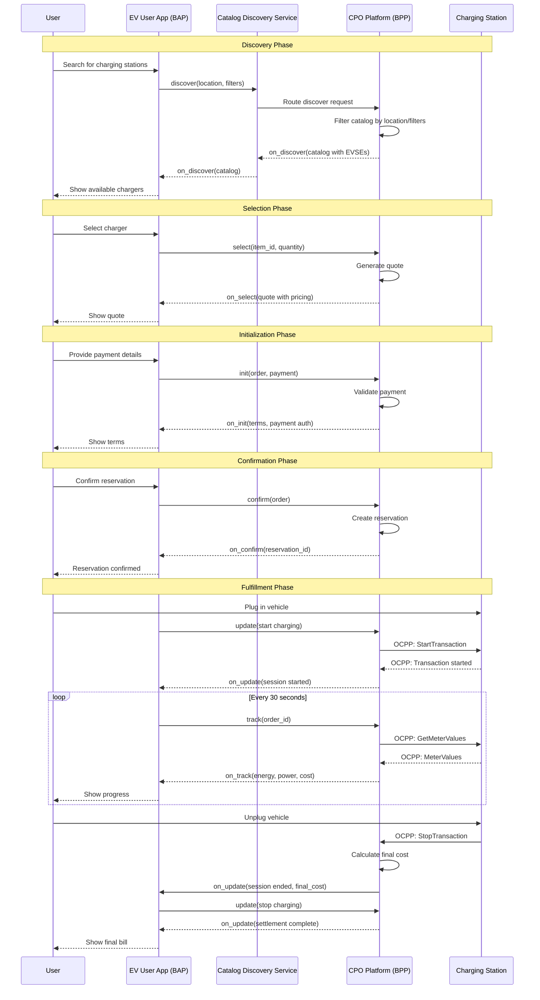
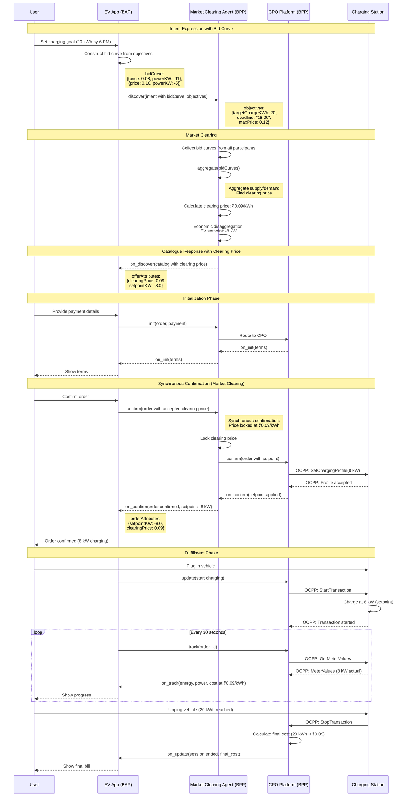
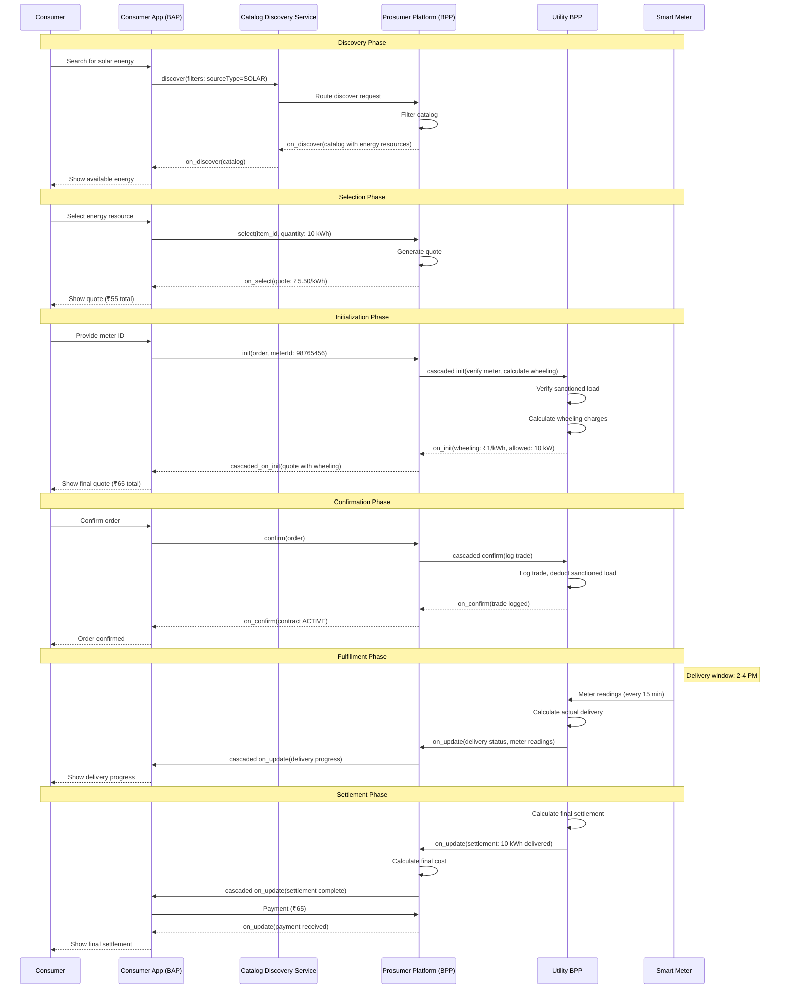
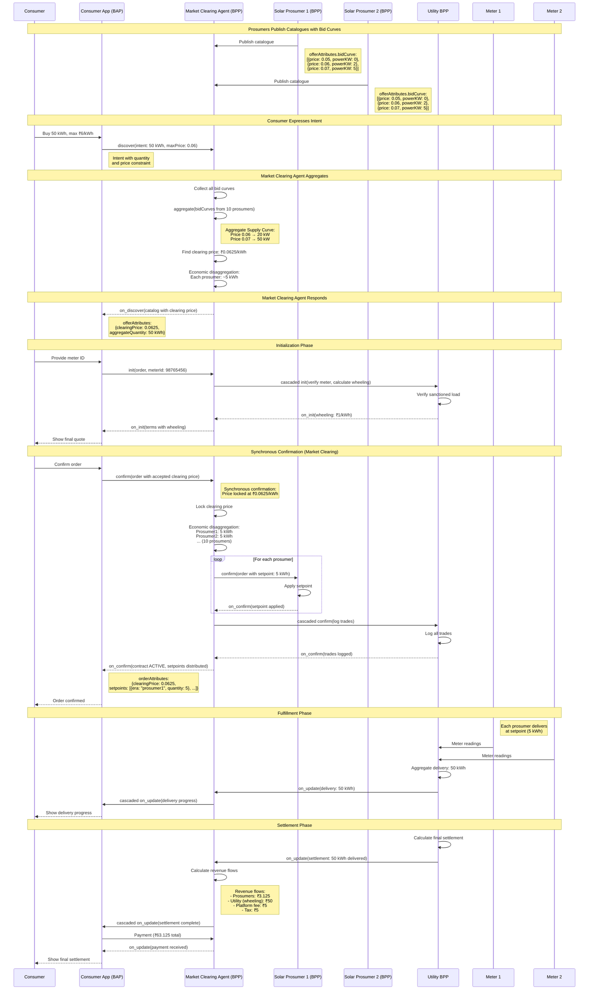
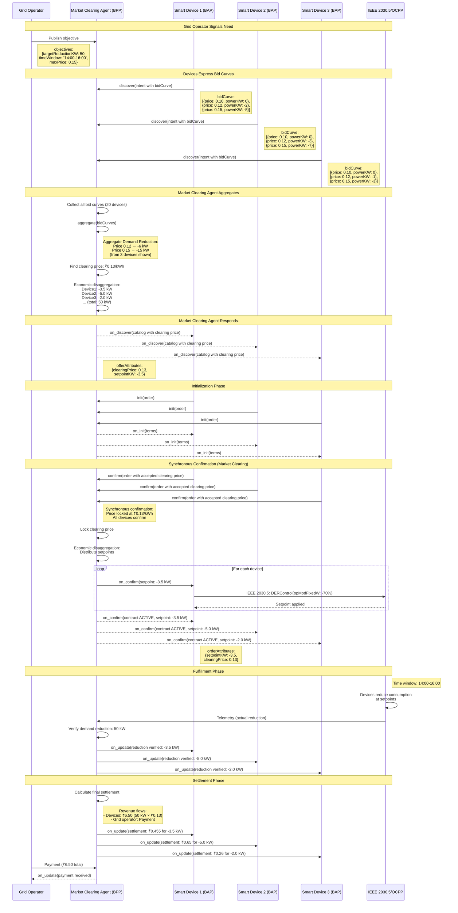
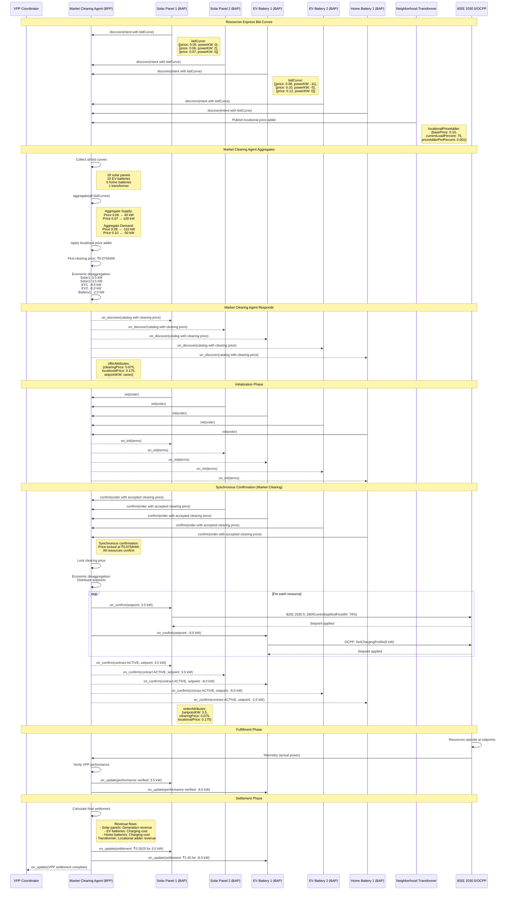

# Use Case Sequence Diagrams
## Mermaid Sequence Diagrams for Energy Exchange Use Cases

**Version:** 1.0  
**Date:** December 2024

---

## Overview

This document contains Mermaid sequence diagrams for all energy exchange use cases, showing how Beckn Protocol building blocks (including proposed extensions) enable each use case. Each diagram shows:

- Beckn actions and responses
- Attribute slot usage
- Protocol integration points
- Bid curve flows (where applicable)
- Market clearing patterns (where applicable)

> **Pay-as-clear note**: For market-based flows (Sections 2, 4, 5, 6, 7) `select/on_select` is intentionally skipped. Participants confirm “pay-as-clear” bids, and `on_confirm` returns the binding clearing outcome once the market clears.

---

## Table of Contents

- [Use Case Sequence Diagrams](#use-case-sequence-diagrams)
  - [Mermaid Sequence Diagrams for Energy Exchange Use Cases](#mermaid-sequence-diagrams-for-energy-exchange-use-cases)
  - [Overview](#overview)
  - [Table of Contents](#table-of-contents)
  - [1. EV Charging (Basic)](#1-ev-charging-basic)
  - [2. EV Charging (Demand Flexibility)](#2-ev-charging-demand-flexibility)
  - [3. P2P Trading (Basic)](#3-p2p-trading-basic)
  - [4. P2P Trading (Market-Based)](#4-p2p-trading-market-based)
  - [5. Demand Flexibility](#5-demand-flexibility)
  - [6. VPP Coordination](#6-vpp-coordination)
  - [7. Grid Services](#7-grid-services)
  - [Summary](#summary)

---

## 1. EV Charging (Basic)

**Use Case**: User discovers and reserves a charging slot at a fixed price

**Key Features**:
- Standard Beckn flow
- Fixed pricing
- Reservation-based

**Attribute Slots Used**:
- `itemAttributes`: EVSE specifications (connectorType, maxPowerKW, etc.)
- `offerAttributes`: Fixed pricing (per-kWh rate)
- `fulfillmentAttributes`: Session management (reservation, charging status)

---

## 2. EV Charging (Demand Flexibility)

**Use Case**: EV expresses bid curve, market clears at confirmation time, EV receives optimal setpoint

**Key Features**:
- Bid curve expression
- Market clearing at confirmation
- Dynamic setpoint assignment

**Attribute Slots Used**:
- `itemAttributes.bidCurve`: EV's price/power preferences
- `itemAttributes.objectives`: Charging goals and constraints
- `offerAttributes.clearingPrice`: Market-cleared price
- `offerAttributes.setpointKW`: Optimal charging rate
- `orderAttributes.setpointKW`: Confirmed setpoint
- `orderAttributes.clearingPrice`: Locked clearing price

**Key Innovation**: Prices discovered at confirmation time, not at offer time.

---

## 3. P2P Trading (Basic)

**Use Case**: Consumer buys energy from prosumer at fixed price

**Key Features**:
- Standard Beckn flow
- Fixed pricing
- Meter-based settlement

**Attribute Slots Used**:
- `itemAttributes`: Energy resource specs (sourceType, deliveryMode, meterId)
- `offerAttributes`: Trading terms (pricingModel, settlementType, wheelingCharges)
- `orderAttributes`: Contract details (EnergyTradeContract)
- `fulfillmentAttributes`: Delivery tracking (EnergyTradeDelivery)

---

## 4. P2P Trading (Market-Based)

**Use Case**: Multiple prosumers express bid curves, market clears, economic disaggregation distributes setpoints

**Key Features**:
- Bid curve aggregation
- Market clearing at confirmation
- Economic disaggregation

**Attribute Slots Used**:
- `offerAttributes.bidCurve`: Prosumer price/power preferences
- `offerAttributes.clearingPrice`: Market-cleared price
- `orderAttributes.clearingPrice`: Locked clearing price
- `orderAttributes.setpoints`: Distributed setpoints to prosumers
- `orderAttributes.settlement.revenueFlows`: Multi-party revenue distribution

**Key Innovation**: Market clearing at confirmation time, economic disaggregation distributes setpoints.

---

## 5. Demand Flexibility

**Use Case**: Grid operator signals need, devices express bid curves, market clears, setpoints distributed

**Key Features**:
- Objective-driven coordination
- Bid curve aggregation
- Demand reduction setpoints

**Attribute Slots Used**:
- `itemAttributes.bidCurve`: Device price/power preferences for demand reduction
- `itemAttributes.objectives`: Grid operator objectives (target reduction, time window)
- `offerAttributes.clearingPrice`: Market-cleared price
- `offerAttributes.setpointKW`: Optimal demand reduction setpoint
- `orderAttributes.setpointKW`: Confirmed setpoint
- `orderAttributes.clearingPrice`: Locked clearing price

**Key Innovation**: Objective-driven coordination, devices autonomously respond to grid signals.

---

## 6. VPP Coordination

**Use Case**: Neighborhood VPP aggregates bid curves, market clears, economic disaggregation distributes setpoints

**Key Features**:
- Multi-resource aggregation
- Market clearing
- Economic disaggregation
- Protocol translation

**Attribute Slots Used**:
- `itemAttributes.bidCurve`: Resource price/power preferences
- `itemAttributes.locationalPriceAdder`: Transformer congestion pricing
- `offerAttributes.clearingPrice`: Market-cleared price
- `offerAttributes.locationalPrice`: Final price with locational adder
- `offerAttributes.setpointKW`: Optimal setpoint
- `orderAttributes.setpointKW`: Confirmed setpoint
- `orderAttributes.clearingPrice`: Locked clearing price
- `orderAttributes.locationalPrice`: Final price with locational adder

**Key Innovation**: VPP coordination emerges from individual resource bid curves, no central controller needed.

---

## 7. Grid Services

**Use Case**: Grid node signals congestion, resources respond with bid curves, market clears, setpoints distributed

**Key Features**:
- Grid nodes as resources
- Locational pricing
- Offset commands for flat plateaus

```mermaid
sequenceDiagram
    participant GridOp as Grid Operator
    participant Transformer as Transformer (Grid Node)
    participant MCA as Market Clearing Agent (BPP)
    participant Battery1 as Battery 1 (BAP)
    participant Battery2 as Battery 2 (BAP)
    participant Inverter1 as Inverter 1 (BAP)
    participant Protocol as IEEE 2030.5

    Note over GridOp,Protocol: Grid Node Signals Congestion
    GridOp->>Transformer: Update load status
    Transformer->>Transformer: Calculate congestion
    Note right of Transformer: currentLoadPercent: 85%<br/>locationalPriceAdder:<br/>{basePrice: 0.10,<br/>congestionMultiplier: 1.0,<br/>priceAdderPerPercent: 0.001}
    Transformer->>Transformer: Calculate current price: ₹0.185/kWh
    Transformer->>MCA: Publish catalogue with locational price adder
    Note right of Transformer: itemAttributes:<br/>{locationalPriceAdder: {...},<br/>gridConstraints: {<br/>maxReverseFlowKW: 50,<br/>currentLoadKW: 170}}

    Note over GridOp,Protocol: Resources Express Bid Curves
    Battery1->>MCA: discover(intent with bidCurve)
    Note right of Battery1: bidCurve:<br/>[{price: 0.12, powerKW: 0},<br/>{price: 0.15, powerKW: 7},<br/>{price: 0.18, powerKW: 10}]
    Battery2->>MCA: discover(intent with bidCurve)
    Inverter1->>MCA: discover(intent with bidCurve)
    Note right of Inverter1: bidCurve:<br/>[{price: 0.12, powerKW: 0},<br/>{price: 0.15, powerKW: 5},<br/>{price: 0.18, powerKW: 8}]

    Note over GridOp,Protocol: Market Clearing Agent Aggregates
    MCA->>MCA: Collect all bid curves
    MCA->>MCA: Apply locational price adder
    Note right of MCA: Base price: ₹0.10<br/>Locational adder: ₹0.085<br/>Final price: ₹0.185
    MCA->>MCA: aggregate(bidCurves with locational pricing)
    MCA->>MCA: Find clearing price: ₹0.17/kWh (with adder)
    MCA->>MCA: Economic disaggregation:<br/>Battery1: 8.5 kW<br/>Battery2: 8.5 kW<br/>Inverter1: 6.0 kW

    Note over GridOp,Protocol: Market Clearing Agent Responds
    MCA-->>Battery1: on_discover(catalog with clearing price)
    MCA-->>Battery2: on_discover(catalog with clearing price)
    MCA-->>Inverter1: on_discover(catalog with clearing price)
    Note right of MCA: offerAttributes:<br/>{clearingPrice: 0.085,<br/>locationalPrice: 0.17,<br/>setpointKW: varies}

    Note over GridOp,Protocol: Initialization Phase
    Battery1->>MCA: init(order)
    Battery2->>MCA: init(order)
    Inverter1->>MCA: init(order)
    MCA-->>Battery1: on_init(terms)
    MCA-->>Battery2: on_init(terms)
    MCA-->>Inverter1: on_init(terms)

    Note over GridOp,Protocol: Synchronous Confirmation (Market Clearing)
    Battery1->>MCA: confirm(order with accepted clearing price)
    Battery2->>MCA: confirm(order with accepted clearing price)
    Inverter1->>MCA: confirm(order with accepted clearing price)
    Note right of MCA: Synchronous confirmation:<br/>Price locked at ₹0.17/kWh<br/>All resources confirm
    MCA->>MCA: Lock clearing price
    MCA->>MCA: Economic disaggregation:<br/>Distribute setpoints
    
    Note over GridOp,Protocol: Check for Flat Plateau
    MCA->>Transformer: Check bid curve for flat plateau
    Transformer->>Transformer: Detect flat plateau at ₹0.15-0.18
    Transformer->>MCA: offsetCommand: {enabled: true, offsetKW: -2.0}
    Note right of Transformer: Command offset to<br/>break flat plateau
    
    MCA->>MCA: Apply offset command
    MCA->>Battery1: on_confirm(setpoint: 8.5 kW, offset: -2.0 kW)
    Battery1->>Protocol: IEEE 2030.5: DERControl(opModFixedW: 65%)
    Protocol-->>Battery1: Setpoint applied (6.5 kW after offset)
    
    MCA->>Battery2: on_confirm(setpoint: 8.5 kW, offset: -2.0 kW)
    Battery2->>Protocol: IEEE 2030.5: DERControl(opModFixedW: 65%)
    Protocol-->>Battery2: Setpoint applied (6.5 kW after offset)
    
    MCA->>Inverter1: on_confirm(setpoint: 6.0 kW, offset: 0.0 kW)
    Inverter1->>Protocol: IEEE 2030.5: DERControl(opModFixedW: 75%)
    Protocol-->>Inverter1: Setpoint applied (6.0 kW)
    
    MCA-->>Battery1: on_confirm(contract ACTIVE, setpoint: 6.5 kW)
    MCA-->>Battery2: on_confirm(contract ACTIVE, setpoint: 6.5 kW)
    MCA-->>Inverter1: on_confirm(contract ACTIVE, setpoint: 6.0 kW)
    Note right of Battery1: orderAttributes:<br/>{setpointKW: 6.5,<br/>clearingPrice: 0.085,<br/>locationalPrice: 0.17,<br/>offsetCommand: {offsetKW: -2.0}}

    Note over GridOp,Protocol: Fulfillment Phase
    Protocol->>Protocol: Resources provide grid services<br/>at setpoints (with offset)
    Protocol->>Transformer: Monitor grid stability
    Transformer->>Transformer: Verify congestion reduction
    Transformer->>MCA: on_update(congestion reduced: 75% load)
    MCA->>Battery1: on_update(performance verified: 6.5 kW)
    MCA->>Battery2: on_update(performance verified: 6.5 kW)
    MCA->>Inverter1: on_update(performance verified: 6.0 kW)

    Note over GridOp,Protocol: Settlement Phase
    MCA->>MCA: Calculate final settlement
    Note right of MCA: Revenue flows:<br/>- Batteries: Grid services revenue<br/>- Inverter: Grid services revenue<br/>- Grid operator: Congestion management benefit
    MCA->>Battery1: on_update(settlement: ₹1.105 for 6.5 kW)
    MCA->>Battery2: on_update(settlement: ₹1.105 for 6.5 kW)
    MCA->>Inverter1: on_update(settlement: ₹1.02 for 6.0 kW)
    GridOp->>MCA: Payment (₹3.23 total)
    MCA-->>GridOp: on_update(payment received)
```

**Attribute Slots Used**:
- `itemAttributes.locationalPriceAdder`: Transformer congestion pricing
- `itemAttributes.gridConstraints`: Grid node constraints (reverse flow limits)
- `itemAttributes.bidCurve`: Resource price/power preferences
- `offerAttributes.clearingPrice`: Market-cleared base price
- `offerAttributes.locationalPrice`: Final price with locational adder
- `orderAttributes.setpointKW`: Confirmed setpoint
- `orderAttributes.offsetCommand`: Grid operator offset command
- `fulfillmentAttributes.offsetCommand`: Applied offset during fulfillment

**Key Innovation**: Grid nodes participate as resources, can command offsets for flat plateaus.

---

## Summary

All use cases leverage the same building blocks:
- ✅ **Bid curves**: Price/power preferences
- ✅ **Bid curve aggregation**: `aggregate` action
- ✅ **Market clearing**: Contract-based pattern with synchronous confirmation
- ✅ **Economic disaggregation**: Part of `aggregate` response
- ✅ **Locational pricing**: Grid nodes as resources
- ✅ **Settlement**: Multi-party revenue flows

**Key Pattern**: Market clearing emerges from contracts, prices discovered at confirmation time, not at offer time.

---

**Status**: Complete  
**Next Action**: Document protocol integration patterns (04_Protocol_Integration_Patterns.md)

