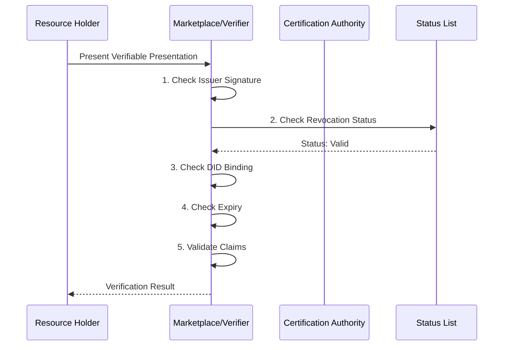
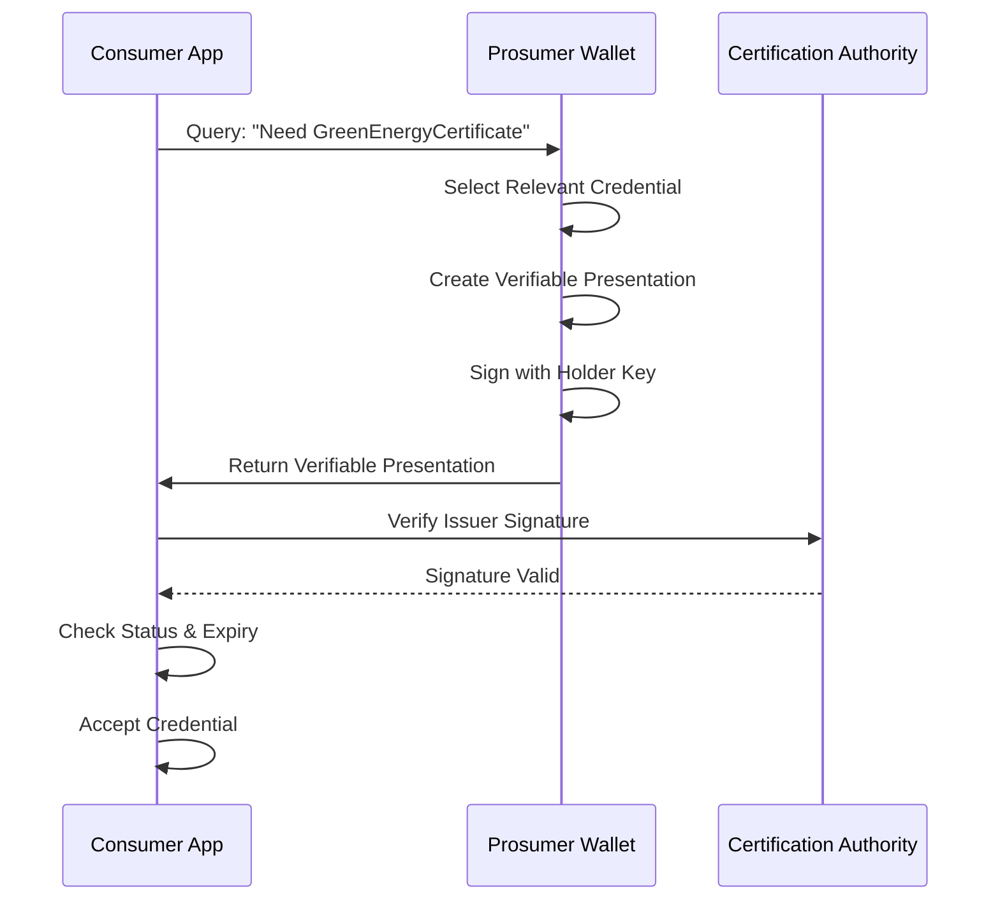

# W3C Verifiable Credentials Guide
## How W3C VCs Work and Support Energy Domain Verification

**Version:** 1.0  
**Date:** December 2024

---

## Overview

W3C Verifiable Credentials (VCs) provide a standardized way to create, issue, present, and verify cryptographically secure digital credentials. In the energy domain, VCs enable trust at scale by allowing millions of distributed energy resources to prove claims about their capabilities, certifications, and authorization without relying on centralized authorities.

---

## Table of Contents

1. [Core Concepts](#1-core-concepts)
2. [How W3C VCs Work](#2-how-w3c-vcs-work)
3. [Verification Types and Status](#3-verification-types-and-status)
4. [Credential Querying](#4-credential-querying)
5. [Energy Domain Integration](#5-energy-domain-integration)
6. [Implementation Examples](#6-implementation-examples)
7. [Benefits for Energy Domain](#7-benefits-for-energy-domain)
8. [Real-World Implementations in Energy Sector](#8-real-world-implementations-in-energy-sector)
9. [Summary](#9-summary)

---

## 1. Core Concepts

### 1.1 Three-Party Model

W3C VCs involve three parties:

1. **Issuer**: Creates and signs credentials (e.g., certification authority, utility, government)
2. **Holder**: Receives and stores credentials (e.g., prosumer, CPO, resource owner)
3. **Verifier**: Checks credential validity (e.g., marketplace, consumer app, grid operator)

### 1.2 Key Components

- **Credential**: Set of claims about a subject (energy resource)
- **Verifiable Presentation**: Holder's way of presenting credentials to verifiers
- **Proof**: Cryptographic signature proving authenticity
- **Decentralized Identifier (DID)**: Decentralized identity for issuers, holders, and subjects
- **Status List**: Mechanism for checking revocation

---

## 2. How W3C VCs Work

### 2.1 Credential Structure

A W3C Verifiable Credential has this structure:

```json
{
  "@context": [
    "https://www.w3.org/2018/credentials/v1",
    "https://deg.energy/credentials/v1"
  ],
  "id": "https://certification.example.com/credentials/solar-cert-123",
  "type": ["VerifiableCredential", "GreenEnergyCertificate"],
  "issuer": {
    "id": "did:example:renewable-certification-authority",
    "name": "Renewable Energy Certification Authority"
  },
  "issuanceDate": "2024-01-15T00:00:00Z",
  "expirationDate": "2029-01-15T23:59:59Z",
  "credentialSubject": {
    "id": "did:deg:household-solar-battery-001",
    "era": "household-solar-battery-001.greenenergy.example.com",
    "energySource": "solar",
    "renewableEnergyType": "photovoltaic",
    "carbonIntensity": "0gCO2/kWh",
    "certificationStandard": "ISO 50001:2018"
  },
  "credentialStatus": {
    "id": "https://issuer.example.com/status/1#94567",
    "type": "StatusList2021Entry",
    "statusPurpose": "revocation",
    "statusListIndex": "94567",
    "statusListCredential": "https://issuer.example.com/status/1"
  },
  "proof": {
    "type": "Ed25519Signature2020",
    "created": "2024-01-15T00:00:00Z",
    "proofPurpose": "assertionMethod",
    "verificationMethod": "did:example:renewable-certification-authority#key-1",
    "proofValue": "z3FXQjecWh...signature...kKJh6vW3"
  }
}
```

### 2.2 Credential Lifecycle

#### A. Issuance

1. **Request**: Holder requests credential from issuer
2. **Verification**: Issuer verifies claims (inspection, audit, document check)
3. **Creation**: Issuer creates VC with claims and signs with private key
4. **Delivery**: VC delivered to holder's digital wallet
5. **Storage**: Holder stores VC securely

#### B. Presentation

1. **Select**: Holder selects relevant credentials
2. **Create Presentation**: Holder creates Verifiable Presentation
3. **Sign**: Holder signs presentation with their private key
4. **Present**: Holder presents to verifier (via API, QR code, etc.)

#### C. Verification

1. **Receive**: Verifier receives presentation
2. **Check Signature**: Verify issuer's signature on credential
3. **Check Status**: Check if credential is revoked
4. **Check Binding**: Verify holder controls the DID
5. **Check Expiry**: Verify credential hasn't expired
6. **Accept/Reject**: Accept if all checks pass

---

## 3. Verification Types and Status

### 3.1 Verification Types

The `verificationType` field indicates what type of verification was performed:

| Type | Description | What It Checks |
|------|-------------|----------------|
| **CRYPTOGRAPHIC** | Signature verification | Issuer's signature is valid, credential hasn't been tampered with |
| **STATUS_CHECK** | Revocation check | Credential is not revoked in status list |
| **BINDING_CHECK** | DID control check | Holder controls the DID in credential subject |
| **ALL** | All checks passed | All verification types passed |

### 3.2 Verification Status Structure

```json
{
  "verified": true,
  "verificationType": "ALL",
  "lastVerified": "2024-12-15T10:00:00Z",
  "verificationDetails": [
    {
      "checkType": "SIGNATURE",
      "passed": true,
      "timestamp": "2024-12-15T10:00:00Z",
      "details": "Ed25519 signature verified against issuer public key"
    },
    {
      "checkType": "STATUS",
      "passed": true,
      "timestamp": "2024-12-15T10:00:01Z",
      "details": "Credential not revoked in status list"
    },
    {
      "checkType": "BINDING",
      "passed": true,
      "timestamp": "2024-12-15T10:00:02Z",
      "details": "Holder controls DID did:deg:household-solar-battery-001"
    },
    {
      "checkType": "EXPIRY",
      "passed": true,
      "timestamp": "2024-12-15T10:00:03Z",
      "details": "Credential expires 2029-01-15, still valid"
    }
  ],
  "errors": []
}
```

### 3.3 Status Checking Mechanisms

#### Status List 2021 (Recommended)

**How it works**:
1. Issuer maintains a **status list credential** (bitstring)
2. Each credential has a `statusListIndex` (position in bitstring)
3. Bit = 0 means credential is valid, bit = 1 means revoked
4. Verifier checks the bit at `statusListIndex` to see if revoked

**Example**:
```json
{
  "credentialStatus": {
    "id": "https://issuer.example.com/status/1#94567",
    "type": "StatusList2021Entry",
    "statusPurpose": "revocation",
    "statusListIndex": "94567",
    "statusListCredential": "https://issuer.example.com/status/1"
  }
}
```

**Status List Credential**:
```json
{
  "@context": ["https://www.w3.org/2018/credentials/v1"],
  "type": ["VerifiableCredential", "StatusList2021Credential"],
  "issuer": "did:example:renewable-certification-authority",
  "credentialSubject": {
    "id": "https://issuer.example.com/status/1",
    "type": "StatusList2021",
    "statusPurpose": "revocation",
    "encodedList": "H4sIAAAAAAAAA-3BMQEAAADCoPVPbQwfoAAAAACgaQAAAQAAAAAA"
  }
}
```

#### Revocation Registry (Alternative)

Some implementations use a revocation registry (blockchain-based or centralized) where:
- Issuer publishes revocation events
- Verifier queries registry to check status
- More real-time but requires registry access

### 3.4 Last Verified Status

The `lastVerified` timestamp tracks when verification was last performed:

- **Real-time verification**: Verify on every transaction
- **Cached verification**: Verify once, cache result with timestamp
- **Periodic verification**: Verify on schedule (e.g., daily)

**Use Cases**:
- **Discovery**: Cache verification for 24 hours to reduce load
- **Contract Formation**: Verify immediately before contract
- **Fulfillment**: Re-verify if credential is time-sensitive

---

## 4. Credential Querying

### 4.1 Query Methods

Credential querying allows verifiers to request specific credentials from holders:

| Method | Description | Use Case |
|--------|-------------|----------|
| **HTTP_GET** | Simple HTTP GET request | Public credentials, no auth needed |
| **HTTP_POST** | HTTP POST with query parameters | Private credentials, requires auth |
| **DID_COMM** | DIDComm protocol | Secure, encrypted credential exchange |
| **WALLET_PROTOCOL** | Wallet-specific protocol | Integration with digital wallets |

### 4.2 Query Structure

```json
{
  "credentialQuery": {
    "queryEndpoint": "https://wallet.example.com/query-credentials",
    "queryMethod": "HTTP_POST",
    "supportedCredentialTypes": [
      "GreenEnergyCertificate",
      "SafetyCertificate",
      "GridInterconnectionApproval"
    ],
    "authenticationRequired": true
  }
}
```

### 4.3 Query Request Example

**Verifier requests credential**:
```http
POST https://wallet.example.com/query-credentials
Authorization: Bearer <token>
Content-Type: application/json

{
  "credentialType": ["VerifiableCredential", "GreenEnergyCertificate"],
  "requiredClaims": {
    "energySource": "SOLAR"
  },
  "challenge": "transaction-challenge-xyz"
}
```

**Holder responds with presentation**:
```json
{
  "@context": ["https://www.w3.org/2018/credentials/v1"],
  "type": "VerifiablePresentation",
  "verifiableCredential": [
    {
      // ... GreenEnergyCertificate VC ...
    }
  ],
  "proof": {
    "type": "Ed25519Signature2020",
    "created": "2024-12-15T10:00:00Z",
    "proofPurpose": "authentication",
    "verificationMethod": "did:deg:household-solar-battery-001#key-1",
    "challenge": "transaction-challenge-xyz",
    "proofValue": "z3Abc...holder signature...xyz"
  }
}
```

### 4.4 Selective Disclosure

VCs support privacy-preserving credential presentation:

**Zero-Knowledge Proofs**: Prove eligibility without revealing sensitive data
```
Claim: "User is eligible for low-income subsidy"
VC Presented: Proof of eligibility (YES/NO)
VC NOT Presented: Actual income amount
```

**Minimal Disclosure**: Present only required claims
```
Catalogue requires: Green energy source
VC Presented: { "energySource": "solar" }
VC NOT Presented: Capacity, location, owner details
```

---

## 5. Energy Domain Integration

### 5.1 Integration with Beckn Attribute Slots

Energy Credentials can be attached to Beckn attribute slots:

#### Item.itemAttributes (Resource Credentials)

```json
{
  "beckn:itemAttributes": {
    "@context": "https://raw.githubusercontent.com/beckn/protocol-specifications-new/refs/heads/draft/schema/EnergyResource/v0.2/context.jsonld",
    "@type": "EnergyResource",
    "sourceType": "SOLAR",
    "meterId": "100200300",
    "credentials": {
      "@context": "https://raw.githubusercontent.com/beckn/protocol-specifications-new/refs/heads/draft/schema/EnergyCredentials/v1/context.jsonld",
      "@type": "EnergyCredentials",
      "presentedCredentials": [
        {
          "@context": ["https://www.w3.org/2018/credentials/v1"],
          "type": ["VerifiableCredential", "GreenEnergyCertificate"],
          "credentialSubject": {
            "energySource": "solar",
            "carbonIntensity": "0gCO2/kWh"
          },
          "proof": { /* ... */ }
        }
      ],
      "verificationStatus": {
        "verified": true,
        "verificationType": "ALL",
        "lastVerified": "2024-12-15T10:00:00Z"
      }
    }
  }
}
```

#### Order.orderAttributes (Contract Credentials)

```json
{
  "beckn:orderAttributes": {
    "@context": "https://raw.githubusercontent.com/beckn/protocol-specifications-new/refs/heads/draft/schema/EnergyTradeContract/v0.2/context.jsonld",
    "@type": "EnergyTradeContract",
    "contractStatus": "ACTIVE",
    "credentials": {
      "@context": "https://raw.githubusercontent.com/beckn/protocol-specifications-new/refs/heads/draft/schema/EnergyCredentials/v1/context.jsonld",
      "@type": "EnergyCredentials",
      "presentedCredentials": [
        {
          "@context": ["https://www.w3.org/2018/credentials/v1"],
          "type": ["VerifiableCredential", "GridInterconnectionApproval"],
          "credentialSubject": {
            "approvalId": "IC-APPROVAL-789",
            "exportLimit": "5kW"
          },
          "proof": { /* ... */ }
        }
      ],
      "verificationStatus": {
        "verified": true,
        "verificationType": "ALL",
        "lastVerified": "2024-12-15T10:00:00Z"
      }
    }
  }
}
```

### 5.2 Credential Requirements in Discovery

Resources can specify credential requirements:

```json
{
  "beckn:itemAttributes": {
    "@type": "EnergyResource",
    "sourceType": "SOLAR",
    "credentials": {
      "@type": "EnergyCredentials",
      "requiredCredentials": [
        {
          "credentialType": ["VerifiableCredential", "GridInterconnectionApproval"],
          "requiredClaims": {
            "exportLimit": ">=5kW"
          },
          "issuerRestriction": ["did:utility:bangalore-electricity"],
          "description": "Must have grid interconnection approval from BESCOM"
        }
      ]
    }
  }
}
```

### 5.3 Types of Energy Credentials

#### Green Energy Certification

```json
{
  "type": ["VerifiableCredential", "GreenEnergyCertificate"],
  "credentialSubject": {
    "energySource": "solar",
    "renewableEnergyType": "photovoltaic",
    "carbonIntensity": "0gCO2/kWh",
    "recLink": "REC-2024-XYZ"
  }
}
```

#### Safety and Standards Compliance

```json
{
  "type": ["VerifiableCredential", "SafetyCertificate"],
  "credentialSubject": {
    "standard": "IEC 62196",
    "connectorType": "CCS2",
    "safetyRating": "UL Listed",
    "lastInspection": "2024-06-01"
  }
}
```

#### Grid Interconnection Approval

```json
{
  "type": ["VerifiableCredential", "GridInterconnectionApproval"],
  "issuer": {
    "id": "did:utility:bangalore-electricity",
    "name": "Bangalore Electricity Supply Company"
  },
  "credentialSubject": {
    "approvalId": "IC-APPROVAL-789",
    "exportLimit": "5kW",
    "bidirectionalMeter": true,
    "netMeteringEnabled": true
  }
}
```

#### Ownership Proof

```json
{
  "type": ["VerifiableCredential", "AssetOwnership"],
  "issuer": {
    "id": "did:gov:land-registry",
    "name": "Land Registry Department"
  },
  "credentialSubject": {
    "propertyId": "DEED-123456",
    "ownerName": "Jane Smith",
    "ownerDID": "did:deg:jane-smith-001",
    "assetType": "residential-solar-installation"
  }
}
```

---

## 6. Implementation Examples

### 6.1 Verification Flow



### 6.2 Credential Query Flow



### 6.3 Real-World Example: P2P Energy Trading

**Scenario**: Prosumer wants to sell solar energy, consumer wants green energy

1. **Discovery**: Consumer searches for solar energy
2. **Credential Requirement**: Catalogue specifies "Must present GreenEnergyCertificate"
3. **Query**: Consumer app queries prosumer's wallet for credential
4. **Presentation**: Prosumer presents GreenEnergyCertificate VC
5. **Verification**: Consumer app verifies:
   - Issuer signature (from Renewable Energy Authority)
   - Status (not revoked)
   - Expiry (still valid)
   - Claims (energySource = "solar")
6. **Acceptance**: Consumer accepts offer, contract formed
7. **Contract**: Contract references presented credential

---

## 7. Benefits for Energy Domain

### 7.1 Trust at Scale

- **Millions of DERs**: VCs enable trust without centralized audit
- **Cryptographic Security**: Tamper-proof credentials
- **Machine-Verifiable**: Automated verification without manual processes

### 7.2 Privacy-Preserving

- **Selective Disclosure**: Present only required claims
- **Zero-Knowledge Proofs**: Prove eligibility without revealing sensitive data
- **Pseudonymous**: Bind to DIDs, not real identities

### 7.3 Interoperability

- **Standard Format**: W3C standard works across platforms
- **Decentralized**: No single point of control
- **Revocable**: Credentials can be invalidated if circumstances change

---

## 8. Real-World Implementations in Energy Sector

### 8.1 Energy Web Foundation

**Organization**: Energy Web (nonprofit, open-source)

**Implementation**: Energy Web has integrated W3C Verifiable Credentials into its Identity and Access Management (IAM) stack for the energy sector.

**Key Features**:
- **Credential Lifecycle Management**: VCs authorize users and assets within energy applications and organizations
- **DID Anchoring**: Each credential is linked to a Decentralized Identifier (DID) anchored on the Energy Web Chain
- **Verifiable Credential API**: Provides VC-API implementation for easy issuance, verification, and management
- **Switchboard Application**: User interface for creating, requesting, issuing, and revoking role-based credentials
- **Asset Authorization**: VCs used to authorize distributed energy resources (DERs) and grid assets

**Use Cases**:
- Renewable energy asset certification
- Grid interconnection approvals
- DER registration and authorization
- Energy trading participant verification

**References**:
- [Energy Web IAM Documentation](https://docs.energyweb.org/legacy-documentation/ew-dos-technology-components-2023/identity-and-access-management-iam/)
- [Energy Web VC-API](https://docs.energyweb.org/legacy-documentation/ew-dos-technology-components-2023/identity-and-access-management-iam/iam-guides/verifiable-credential-api)

---

### 8.2 European Blockchain Services Infrastructure (EBSI)

**Organization**: European Commission

**Implementation**: EBSI has developed a Verifiable Credentials Framework for trusted, decentralized information exchange across European Union member states.

**Key Features**:
- **Cross-Border Trust**: Enables verification of credentials across EU member states
- **Open Standards**: Built on W3C Verifiable Credentials Data Model
- **Blockchain Infrastructure**: Combines VCs with blockchain technology for trust layer
- **Digital Wallets**: Supports wallet-based credential storage and presentation

**Energy Sector Applications**:
- Verification of renewable energy source authenticity
- Energy consumption data authenticity
- Compliance with environmental standards
- Cross-border energy trading participant verification

**References**:
- [EBSI Verifiable Credentials Framework](https://ec.europa.eu/digital-building-blocks/sites/spaces/EBSI/pages/600343491/EBSI%2BVerifiable%2BCredentials)
- [EBSI VC Introduction](https://ec.europa.eu/digital-building-blocks/sites/download/attachments/600343491/Chapter%200%20-%20Verifiable%20Credentials%20An%20introduction.pdf)

---

### 8.3 Oil & Gas Sector: Sellafield Ltd Pilot

**Organization**: Sellafield Ltd (Nuclear Decommissioning Authority), Condatis, Digital Catapult

**Implementation**: Verifiable Credential Staff Passport platform for optimizing staff onboarding and movement across nuclear decommissioning sites.

**Key Features**:
- **Staff Onboarding**: Reduced onboarding time from 3 days to 30 minutes (80% reduction)
- **Biometric-Secured Wallets**: Mobile digital wallets with biometric security
- **Multi-Site Integration**: Credentials work across multiple Nuclear Decommissioning Authority sites
- **End-User Control**: Staff control their own personal data and credentials
- **Operational Efficiency**: Significant cost savings and operational improvements

**Results**:
- 80% reduction in onboarding/offboarding time
- Enhanced security beyond traditional methods
- Reduced cyber-attack risks
- Improved privacy and data control

**References**:
- [Condatis Case Study](https://condatis.com/news/enhancing-operational-efficiency-with-verifiable-credentials-a-summary/)

---

### 8.4 Renewable Energy Certificates (RECs)

**Context**: While traditional REC systems (I-REC, G-REC, etc.) may not yet fully implement W3C VCs, the infrastructure is being developed to support digital, verifiable renewable energy certificates.

**Emerging Applications**:
- **Digital REC Issuance**: Moving from paper-based to digital certificate systems
- **Blockchain-Based RECs**: Some platforms are exploring blockchain for REC tracking
- **VC-Enabled RECs**: Future direction toward W3C VC-based RECs for:
  - Tamper-proof renewable energy claims
  - Automated verification in energy trading
  - Cross-border REC trading
  - Integration with carbon accounting systems

**Potential Benefits**:
- Eliminate double-counting of renewable energy
- Enable real-time verification in P2P energy trading
- Support automated compliance reporting
- Enhance transparency in green energy markets

---

### 8.5 Distributed Energy Resources (DER) Certification

**Use Case**: Certification and authorization of distributed energy resources (solar panels, batteries, EV chargers, etc.)

**Implementation Pattern**:
1. **Grid Interconnection Approval**: Utility issues VC for grid connection
2. **Safety Certification**: Certification body issues safety VC
3. **Performance Attestation**: Manufacturer or installer issues capacity/efficiency VC
4. **Green Energy Certification**: Renewable energy authority issues green energy VC

**Benefits**:
- Automated verification in energy trading platforms
- Reduced manual inspection requirements
- Real-time authorization for grid participation
- Trust at scale for millions of DERs

---

### 8.6 Energy Trading and Marketplace Platforms

**Use Case**: Participant verification in energy trading platforms

**Implementation**:
- **Seller Credentials**: Prosumers present green energy certification VCs
- **Buyer Credentials**: Consumers present grid connection approval VCs
- **Platform Credentials**: Trading platforms issue participant authorization VCs
- **Utility Credentials**: Utilities issue wheeling/transmission authorization VCs

**Benefits**:
- Automated participant verification
- Reduced KYC/AML overhead
- Enhanced trust in P2P energy trading
- Compliance with regulatory requirements

---

### 8.7 Summary of Real-World Adoption

| Organization/Initiative | Sector | Status | Key Use Case |
|------------------------|--------|--------|--------------|
| **Energy Web** | Energy (General) | ✅ Production | DER authorization, asset certification, IAM |
| **EBSI** | European Energy | ✅ Pilot/Production | Cross-border verification, compliance |
| **Sellafield Ltd** | Nuclear/Oil & Gas | ✅ Pilot | Staff onboarding, access control |
| **REC Systems** | Renewable Energy | 🔄 Emerging | Digital renewable energy certificates |
| **DER Platforms** | Distributed Energy | 🔄 Emerging | Grid interconnection, safety certification |

**Status Legend**:
- ✅ **Production**: Actively deployed in production systems
- ✅ **Pilot**: Successful pilot projects, scaling to production
- 🔄 **Emerging**: Early development, proof-of-concept stage

---

## 9. Summary

W3C Verifiable Credentials provide a robust foundation for trust in decentralized energy markets:

- **Verification Types**: Cryptographic, status, binding, and expiry checks
- **Last Verified Status**: Track when verification was performed
- **Credential Querying**: Request specific credentials from holders
- **Integration**: Composes with Beckn attribute slots
- **Privacy**: Supports selective disclosure and zero-knowledge proofs

By combining VCs with Energy Resource Addresses and the Beckn Protocol, the Digital Energy Grid creates a trust framework that scales to millions of distributed participants while maintaining privacy and security.

---

**Status**: Complete  
**Last Updated**: December 2024

**See Also**: 
- `outputs/schema/EnergyCredentials/v1/attributes.yaml` - Schema definition
- `architecture/Energy credentials.md` - Architecture overview
- [W3C Verifiable Credentials Data Model](https://www.w3.org/TR/vc-data-model/) - Standard specification

**External References**:
- [Energy Web IAM Documentation](https://docs.energyweb.org/legacy-documentation/ew-dos-technology-components-2023/identity-and-access-management-iam/)
- [EBSI Verifiable Credentials](https://ec.europa.eu/digital-building-blocks/sites/spaces/EBSI/pages/600343491/EBSI%2BVerifiable%2BCredentials)
- [Condatis Energy Sector Case Study](https://condatis.com/news/enhancing-operational-efficiency-with-verifiable-credentials-a-summary/)

